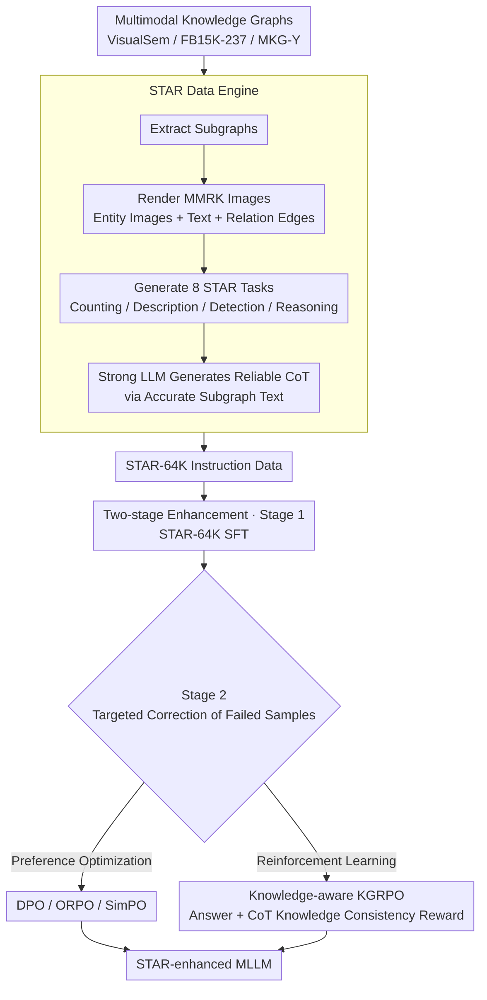

# Structured and Abstractive Reasoning on Multi-modal Relational Knowledge Images

**Conference**: ACL2026 Findings  
**arXiv**: [2510.21828](https://arxiv.org/abs/2510.21828)  
**Code**: https://github.com/zjukg/STAR  
**Area**: Multimodal VLM / Knowledge Graphs / Structured Reasoning  
**Keywords**: MMRK images, STAR task, Multimodal Knowledge Graph, KGRPO, Synthetic instruction data  

## TL;DR
This paper proposes the STAR data engine and a two-stage training framework for multi-modal relational knowledge images. By utilizing STAR-64K synthetic data, Chain-of-Thought (CoT) annotations, and knowledge-aware KGRPO, it significantly enhances the capability of Multimodal Large Language Models (MLLMs) to understand and reason over abstract structured knowledge images.

## Background & Motivation
**Background**: Multimodal large models are capable of processing natural images, charts, OCR, and visual math problems. Many benchmarks also test the understanding of "abstract visual information," such as charts, diagrams, mathematical figures, and structured documents.

**Limitations of Prior Work**: Multi-modal Relational Knowledge (MMRK) images remain systematically under-researched. These images are not ordinary photographs; they organize entities, text descriptions, images, and relational edges into node-edge structures. This requires models to simultaneously identify entities, understand edge types, track graph structures, and perform reasoning based on these elements.

**Key Challenge**: While the visual understanding capabilities of MLLMs are improving, they are often trained on natural scenes and general charts. The key semantics of MMRK images derive from human-defined high-order relations. If a model only "sees nodes" without treating the relations between them as a knowledge structure, it fails in tasks like counting, error detection, entity completion, and relational reasoning.

**Goal**: The authors aim to fill two gaps: the lack of large-scale high-quality MMRK instruction data and the absence of training and evaluation protocols specifically designed for STAR (Structured and Abstractive Reasoning) capabilities.

**Key Insight**: The paper converts existing multimodal knowledge graphs into visual subgraphs and generates eight types of tasks along with reliable CoT annotations from these subgraphs. This avoids manual labeling costs while binding the ground-truth answers, reasoning paths, and visual presentations of the graph structure.

**Core Idea**: Automatically synthesize STAR-64K using multimodal knowledge graphs, and then train MLLMs using SFT followed by preference/RL optimization. Specifically, Knowledge-informed KGRPO is introduced to reward the correctness of knowledge within the CoT, thereby reducing hallucinations during structural reasoning.

## Method
The actual contribution of this paper is a full stack: a data engine, training protocol, evaluation tasks, reinforcement learning strategy, and systemic experiments.

Focusing solely on model training might underestimate its value; the real significance lies in how the authors transform "abstract structured visual knowledge" into a family of tasks that can be scaled, trained, and evaluated.

### Overall Architecture
Input data is derived from three public multimodal knowledge graphs: VisualSem, FB15K-237, and MKG-Y.

Each knowledge graph can be represented as a combination of entity sets, relation sets, triplet sets, entity image sets, and entity text description sets.

The data engine extracts subgraphs from the graphs, visualizing entity images and text along with relational edges to form MMRK images.

Subsequently, the engine generates eight types of STAR tasks around the same MMRK image: entity counting, relation counting, image entity counting, triplet counting, subgraph description, error detection, entity reasoning, and relation reasoning.

For tasks requiring reasoning paths, instead of making weak MLLMs generate CoT directly from images, the engine leverages the accurate subgraph text (available before visualization) as prompts for strong LLMs to generate more reliable thought processes and answers.

Training is conducted in two stages: Stage 1 performs Supervised Fine-Tuning (SFT) using STAR-64K to establish basic STAR capabilities; Stage 2 targets samples where the model failed by constructing preference data or using RL for further optimization.

Evaluation considers not only the final answer but also the CoT quality; Task 5 (description) uses similarity scores, while other tasks use accuracy and CoT judge evaluations.

### Key Designs

**1. STAR Data Engine: Massively converting MMKG entities, relations, images, and text into trainable instruction data**

Direct manual labeling of MMRK images is slow and difficult for ensuring structural correctness. The key semantics of MMRK images come from high-order relations; any labeling error leads the model to learn incorrect structural knowledge. The engine treats existing multimodal knowledge graphs as the source of truth: it extracts subgraphs from VisualSem, FB15K-237, and MKG-Y, renders entity images, text, and relations into MMRK images, and generates questions and answers for eight categories of STAR tasks.

The generation of CoT is the highlight of this step: rather than forcing a weak MLLM to hallucinate a reasoning chain from an image, the authors feed the accurate subgraph structure text to a strong LLM to produce the thought process. This aligns images, structures, answers, and reasoning logic, ensuring the reasoning trace is consistent with the actual triplets and suppressing hallucinations at the source.

**2. Two-stage STAR Capability Enhancement: Learning task formats first, then performing targeted correction on failed samples**

SFT is crucial for capability injection, but it only fits data in an average sense and struggles with hallucinations, incorrect CoT, and hard samples in complex graph reasoning. Therefore, Stage 1 uses STAR-64K for supervised fine-tuning to maximize the probability of generating the correct answer given an image and question. Stage 2 then optimizes specifically for samples where the model still fails after Stage 1.

Stage 2 offers two paths: one is preference optimization (e.g., DPO/ORPO/SimPO), using ground truth as preferred and the model's own incorrect output as unpreferred; the other is GRPO/KGRPO, using group-based diverse sampling combined with reward functions to optimize reasoning behavior. Both paths upgrade training signals from "average fitting" to "error correction," which is the missing link in structured graph reasoning.

**3. Knowledge-aware KGRPO: Explicitly rewarding factual knowledge correctness in CoT beyond the final answer**

Failure in MMRK reasoning often isn't just "calculating a number wrong" but fabricating a non-existent relation or misreading a node in the CoT. Standard GRPO only monitors the final result and cannot suppress such procedural hallucinations. KGRPO adds a knowledge-informed reward to the standard answer reward, using gold knowledge and a CoT judge to check if the entities, relations, and triplets involved in the reasoning chain are consistent with the graph structure.

In other words, the model must not only provide the correct answer but also follow a correct knowledge path. By embedding structural knowledge consistency as a hard constraint in the training objective, relational hallucinations in the CoT are penalized. This explains why KGRPO significantly outperformed DPO and standard GRPO in subsequent experiments.

### Loss & Training
The SFT stage utilizes next-token prediction to train the MLLM to generate answers and CoTs conditioned on images and questions.

Stage 1 is trained for 3 epochs using LoRA, with a maximum sequence length of 8192, BF16 precision, AdamW optimizer, and a cosine scheduler.

Preference data for Stage 2 is derived from training instances where the model failed after Stage 1: the ground truth answer serves as the positive sample, and the incorrect generation as the negative sample.

KGRPO inherits the group-based relative advantage concept from GRPO, but the reward function includes both final answer quality and the consistency of knowledge facts within the CoT.

The evaluation stage uses Qwen2.5-VL-72B as a judge to score CoT or unstructured outputs.

This strategy links "visual image understanding," "knowledge structure consistency," and "reasoning path quality," avoiding the optimization of only a superficial answer metric.

## Key Experimental Results

### Main Results
The main table shows that two-stage training significantly improves the STAR performance of Qwen2.5-VL-3B/7B, with KGRPO being the strongest in Stage 2.

| Model / Setting | Task#1 ACC | Task#2 ACC | Task#3 ACC | Task#5 Score | Task#8 ACC | AVG |
|-------------|------------|------------|------------|--------------|------------|-----|
| GPT-4v | 37.75 | 41.25 | 14.00 | 59.25 | 39.13 | 33.11 |
| GPT-4o-mini | 67.50 | 72.25 | 29.88 | 69.13 | 23.00 | 40.72 |
| Qwen2.5-VL-3B Zero-shot | 18.25 | 20.13 | 3.50 | 57.71 | 38.25 | 25.56 |
| Qwen2.5-VL-3B S1 Full | 42.75 | 67.00 | 57.13 | 59.94 | 56.00 | 53.24 |
| Qwen2.5-VL-3B S2 KGRPO | 75.00 | 85.38 | 68.63 | 71.51 | 68.57 | 63.64 |
| Qwen2.5-VL-7B Zero-shot | 6.13 | 12.25 | 0.13 | 68.62 | 42.88 | 21.24 |
| Qwen2.5-VL-7B S1 Full | 64.88 | 92.75 | 71.37 | 75.71 | 71.52 | 66.98 |
| Qwen2.5-VL-7B S2 KGRPO | 79.88 | 94.88 | 79.50 | 77.19 | 74.48 | 73.06 |

The most interesting phenomenon in this table is that 3B/7B models, after specialized training, can surpass stronger closed-source models in zero-shot STAR performance. This indicates that the capability gap primarily stems from data and training protocols rather than just model scale.

### Ablation Study
The authors validated the modal contributions, confirming that both entity images and text in MMRK images are important, with text information generally having a larger impact.

| Backbone / Configuration | Task#1 | Task#2 | Task#3 | Task#4 | Task#5 | Task#6 | Task#7 | Task#8 |
|-----------------|--------|--------|--------|--------|--------|--------|--------|--------|
| Qwen2.5-VL-7B w/o ent. images | 55.50 | 75.88 | 48.62 | 26.63 | 67.99 | 32.00 | 52.63 | 65.75 |
| Qwen2.5-VL-7B w/o ent. texts | 59.13 | 74.62 | 47.88 | 25.37 | 67.90 | 34.87 | 41.50 | 68.12 |
| Qwen2.5-VL-7B full dataset | 64.88 | 92.75 | 71.37 | 27.62 | 75.71 | 55.87 | 67.50 | 80.13 |
| Qwen2.5-VL-32B w/o ent. images | 49.75 | 83.25 | 42.25 | 29.88 | 66.05 | 29.63 | 42.50 | 68.00 |
| Qwen2.5-VL-32B w/o ent. texts | 58.25 | 82.25 | 41.00 | 25.88 | 65.61 | 28.63 | 46.25 | 66.88 |
| Qwen2.5-VL-32B full dataset | 67.75 | 93.63 | 63.13 | 27.50 | 75.07 | 54.00 | 73.50 | 81.75 |

Another key analysis comes from the comparison of training settings: mixed multi-task training is generally superior to single-task training. Performance drops across five backbones when CoT prompts are removed, indicating that STAR is not just a visual recognition task but requires explicit structured thinking.

| Configuration | Key Metrics | Description |
|------|----------|------|
| S1 Single-task | Qwen2.5-VL-7B AVG 66.06 | Single-task improves target tasks but lacks cross-task transfer |
| S1 Full STAR-64K | Qwen2.5-VL-7B AVG 66.98 | Mixed tasks provide more stable structured capabilities |
| S2 DPO | Qwen2.5-VL-7B AVG 68.84 | Preference optimization improves performance on hard samples |
| S2 GRPO | Qwen2.5-VL-7B AVG 69.91 | RL further enhances reasoning performance |
| S2 KGRPO | Qwen2.5-VL-7B AVG 73.06 | Knowledge rewards yield the strongest average performance |

### Key Findings
- Existing MLLMs are significantly deficient in zero-shot processing of MMRK images; many models can recognize visual elements but cannot perform relation-level reasoning stably.
- SFT is the primary source of gain, showing that the STAR-64K data itself is critical; Stage 2 KGRPO further reduces CoT hallucinations and errors in difficult samples.
- Multi-task mixed training is more transferable than training on a single STAR task, especially for complex reasoning tasks.
- The contribution of entity text is generally greater than that of entity images, but removing either modality weakens performance, confirming that the semantics of MMRK images are truly multimodal.
- The scaling patterns for Task #1 and Task #4 are unique: the former relates to basic entity recognition, while the latter is hindered by complex counting and graph structure, showing non-linear improvement with data volume.

## Highlights & Insights
- The paper transforms multimodal knowledge graphs from "KG completion sources" to "abstract visual reasoning benchmarks." This perspective is valuable as it moves MLLMs beyond natural images toward understanding human-organized structured knowledge.
- The strength of the STAR data engine lies in verifiable answers and CoTs generated from real subgraphs. This approach controls the source of hallucination better than having LLMs "guess" reasoning from images.
- The KGRPO approach is worth adapting: if task answers derive from structured knowledge, the RL reward should not only look at the final label but also check if the entities and relations in the reasoning process are factual.
- Small models surpassing GPT-4o zero-shot performance after specialized training suggests that many "abstract visual reasoning capabilities" are not mysterious emergences but results of insufficient training distribution coverage.

## Limitations & Future Work
- Data sources are mainly general encyclopedic MMKGs; specialized domains like scientific or medical knowledge graphs are not fully covered.
- While the eight task types are systematic, they are still fixed templates; real-world knowledge image needs may be more open-ended, such as path explanation, counterfactual editing, or cross-graph alignment.
- KGRPO experiments were limited by compute and mainly conducted on models below 8B; the training efficiency and stability for larger models still need verification.
- The CoT judge uses a strong MLLM for automatic scoring. While scalable, it may still miss fine-grained knowledge errors.
- The image rendering process itself may affect results; node layout, text density, and edge occlusion change the difficulty level. Future work could include layout robustness in the evaluation.

## Related Work & Insights
- **vs M3STR**: M3STR focuses more on evaluating MLLM understanding of multimodal structured knowledge. This paper goes further by providing a data engine and training framework aimed at "enhancing capabilities."
- **vs MM-Instruct**: MM-Instruct also performs abstract image synthesis, but this work focuses on relational knowledge images with stronger task structure and answer verifiability.
- **vs ChartQA / MathVista / MMMU**: These benchmarks test charts, math diagrams, and multidisciplinary visual knowledge. This paper tests structured abstract reasoning in entity-relation graphs, where errors are closer to KG reasoning than visual perception.
- **vs Standard GRPO**: Standard GRPO is effective for result optimization, but it tends to overlook relational hallucinations in STAR CoTs. The insight from KGRPO is that internal knowledge consistency should be part of the reward for reasoning tasks.

## Rating
- Novelty: ⭐⭐⭐⭐⭐ The combination of the STAR data engine and KGRPO on MMRK images is highly innovative, with clear task definitions.
- Experimental Thoroughness: ⭐⭐⭐⭐☆ The main experiments cover 8 open-source MLLMs and multiple training strategies, though RL verification on large-scale models was somewhat limited.
- Writing Quality: ⭐⭐⭐⭐☆ The structure is complete and the tables are solid, though the task numbering and numerous metrics (ACC/CoT) require effort to digest.
- Value: ⭐⭐⭐⭐⭐ Highly relevant for multimodal knowledge graphs, VLM evaluation, and structured reasoning training.

<!-- RELATED:START -->

## Related Papers

- [\[ACL 2026\] OMHBench: Benchmarking Balanced and Grounded Omni-Modal Multi-Hop Reasoning](omhbench_benchmarking_balanced_and_grounded_omni-modal_multi-hop_reasoning.md)
- [\[CVPR 2026\] StaR-KVQA: Structured Reasoning Traces for Implicit-Knowledge Visual Question Answering](../../CVPR2026/vlm_reasoning/star-kvqa_structured_reasoning_traces_for_implicit-knowledge_visual_question_ans.md)
- [\[ICML 2026\] Vision-aligned Latent Reasoning for Multi-modal Large Language Model](../../ICML2026/vlm_reasoning/vision-aligned_latent_reasoning_for_multi-modal_large_language_model.md)
- [\[ACL 2026\] Decoding Scientific Experimental Images: The SPUR Benchmark for Perception, Understanding, and Reasoning](decoding_scientific_experimental_images_the_spur_benchmark_for_perception_unders.md)
- [\[ICCV 2025\] ReasonVQA: A Multi-hop Reasoning Benchmark with Structural Knowledge for Visual Question Answering](../../ICCV2025/vlm_reasoning/reasonvqa_a_multi-hop_reasoning_benchmark_with_structural_knowledge_for_visual_q.md)

<!-- RELATED:END -->
