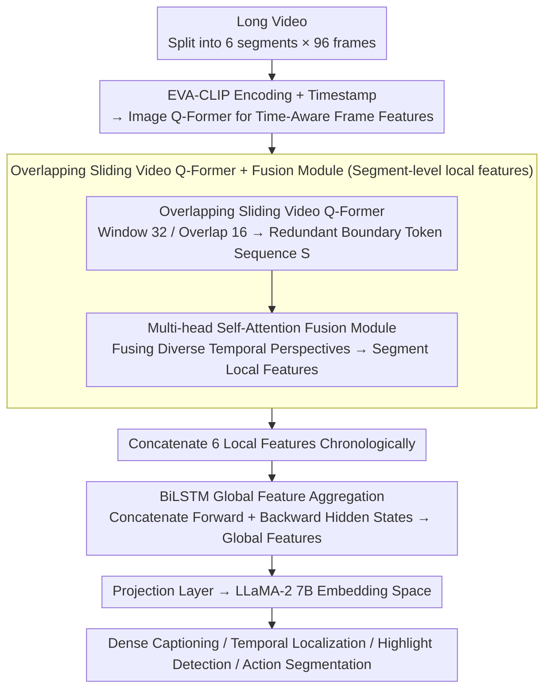

# TemporalVLM: Video LLMs for Temporal Reasoning in Long Videos

**Conference**: ACL 2026  
**arXiv**: [2412.02930](https://arxiv.org/abs/2412.02930)  
**Code**: None  
**Area**: Image Segmentation  
**Keywords**: Video Large Language Models, Time-Aware Encoding, BiLSTM, Long Video Understanding, Industrial Assembly Dataset

## TL;DR

This paper proposes TemporalVLM, which extracts local fine-grained temporal features through a time-aware segment encoder (overlapping sliding Video Q-Former + fusion module) and aggregates global long-range dependencies using a BiLSTM. This marks the first introduction of LSTM into Video LLMs, outperforming previous methods across four tasks: dense video captioning, temporal localization, highlight detection, and action segmentation.

## Background & Motivation

**Background**: Video LLMs achieve video understanding by combining video encoders with LLMs. Existing methods typically map videos to a fixed number of tokens, which leads to performance degradation in long videos and poor temporal reasoning due to decoupled encoding of frames and timestamps.

**Limitations of Prior Work**: (1) Treating the entire video as a single segment with a fixed token count results in the loss of fine-grained information in long videos; (2) Using pooling or query aggregation to obtain global features fails to capture long-range temporal dependencies; (3) Separate encoding of frames and timestamps makes the models time-insensitive.

**Key Challenge**: Temporal reasoning in long videos requires both local fine-grained understanding (precise localization of individual events) and global semantic understanding (temporal relationships between events), but existing architectures struggle to balance both.

**Goal**: Design a "coarse-to-fine" video encoder that simultaneously extracts time-aware local and global features.

**Key Insight**: Divide long videos into multiple short segments, use a time-aware encoder to extract local features at the segment level, and then use a BiLSTM to aggregate global features across segments—combining segment-level granularity with sequence-level long-range modeling.

**Core Idea**: Overlapping sliding windows + a fusion module for time-aware local encoding, and BiLSTM for bidirectional long-range aggregation—introducing LSTM to Video LLMs for the first time.

## Method

### Overall Architecture

The input video is divided into $C=6$ segments, with 96 frames sampled per segment. Time-aware segment encoder: Frames are encoded by EVA-CLIP and passed through an Image Q-Former along with timestamps to obtain time-aware frame features, followed by an overlapping sliding Video Q-Former and a fusion module to obtain local features. BiLSTM module: Local features from all segments are concatenated chronologically and passed through a bidirectional LSTM to aggregate global features. Finally, features are mapped to the embedding space of LLaMA-2 7B via a projection layer.

### Key Designs

**1. Overlapping Sliding Video Q-Former + Fusion Module: Extracting Time-Aware Local Features within Segments**

Existing methods (e.g., TimeChat) process frame features using non-overlapping windows, where window boundaries do not overlap, resulting in a single temporal perspective. To address the "loss of local fine-grained information," this work uses a sliding Video Q-Former with window size $q=32$ and overlap $o=16$ to scan frame features. Adjacent windows share half their content, generating a feature sequence $\mathbf{S}$ with redundant boundary tokens—which are spatially redundant but temporally complementary.

A multi-head self-attention fusion module is then applied to $\mathbf{S}$ to fuse diverse temporal perspectives of the same period from different windows into context-aware segment embeddings. Consequently, the overlapping redundancy, previously viewed as a "flaw," becomes a source of diversity for the fusion module, producing segment-level features that are richer and more fine-grained than those from non-overlapping windows.

**2. BiLSTM Global Feature Aggregation: Capturing Bidirectional Long-Range Dependencies across Segments via Recurrent Structure**

Pooling or query aggregation tends to flatten the temporal order between segments, and position embeddings in Transformers with fixed contexts are less suited for temporal structures than recurrent architectures. This is why existing methods fail to capture long-range temporal dependencies. This work concatenates the local features of all segments into a sequence and feeds them into forward and backward LSTMs, respectively, concatenating the hidden states from both directions $\mathbf{h}_t = [\mathbf{h}_t^f, \mathbf{h}_t^b]$ as global features.

This is the first introduction of LSTM into Video LLMs—the inductive bias of recurrence is naturally suited for modeling "event-following-event" temporal structures. Ablation studies confirm that BiLSTM consistently outperforms average pooling, linear layers, unidirectional LSTM, and Transformers, indicating that the advantages of recurrent structures are not replaced by attention in this scenario.

**3. IndustryASM Dataset: Filling the Benchmark Gap for Temporal Segmentation in Industrial Manufacturing**

Existing temporal segmentation datasets favor cooking activities or multi-shot web edits, which differ significantly from continuous single-shot recordings in real industrial assembly lines. The authors constructed IndustryASM, containing 4,851 videos with an average duration of 105 seconds, covering 47 industrial assembly tasks. These were annotated at the frame level for action segmentation by industrial engineers, achieving a 92% inter-annotator agreement rate.

This dataset is both close to practical manufacturing applications and provides continuous single-shot long videos, making it ideal for testing TemporalVLM's capability in real long-range temporal reasoning and filling the gap in Video LLM evaluation for industrial scenarios.

### A Complete Example: Encoding an Industrial Assembly Video

Consider a 105-second assembly video: it is first uniformly cut into $C=6$ segments, with 96 frames sampled per segment. Each frame is encoded by EVA-CLIP and sent to the Image Q-Former along with timestamps to obtain time-aware frame features. Next, an overlapping sliding Video Q-Former (window 32, overlap 16) scans these 96 frames, with adjacent windows covering half of each other, outputting a sequence $\mathbf{S}$ with redundant boundary tokens. The fusion module compresses these complementary perspectives into the local features of that segment. After this process is completed for all 6 segments, the 6 local features are concatenated chronologically and passed through both forward and backward BiLSTMs to produce global features spanning the entire video. Finally, these features are mapped into the LLaMA-2 7B embedding space via a projection layer, where the LLM performs downstream reasoning such as dense captioning and temporal localization—local granularity and global long-range dependencies are thus completed layer by layer.

### Loss & Training

Standard autoregressive cross-entropy loss is used (Eq. 8). The LLM and image encoder are frozen, with only the BiLSTM, projection layer, and LoRA being fine-tuned. Training is conducted on 8×A100.

## Key Experimental Results

### Main Results

**Zero-shot comparison on Dense Video Captioning (YouCook2) + Temporal Localization (Charades-STA)**

| Method | SODA_c | CIDEr | R@1(IoU=0.5) |
|------|--------|-------|-------------|
| VideoChat-Embed | 0.2 | 0.6 | 3.2 |
| TimeChat | — | — | — |
| LongVLM | 0.8 | 2.5 | 13.9 |
| **Ours (TemporalVLM)** | **Best** | **Best** | **Best** |

### Ablation Study

**Comparison of Global Aggregation Methods**

| Aggregation Method | Description |
|---------|------|
| Average Pooling | Loses temporal information |
| Linear Layer | No sequence modeling |
| Unidirectional LSTM | Only forward information |
| Transformer | Fixed position encoding inferior to recurrence |
| **BiLSTM** | **Bidirectional long-range dependency, Best** |

### Key Findings

- TemporalVLM outperforms previous methods across all four temporal reasoning tasks.
- BiLSTM as a global aggregation module consistently outperforms all alternatives.
- Overlapping windows + fusion module show significant improvements over non-overlapping windows.
- Effectiveness on the IndustryASM industrial dataset demonstrates practical application value.
- First to prove that LSTM has unique advantages in Video LLMs and should not be entirely replaced by Transformers.

## Highlights & Insights

- The choice to "return to LSTM" is counter-intuitive but effective—the inductive bias of recurrent structures is superior to general attention in temporal modeling.
- Redundant information from overlapping windows serves as a source of diversity for the fusion module—turning a flaw into an advantage.
- The IndustryASM dataset fills a critical gap in industrial scenarios.

## Limitations & Future Work

- Fixed partitioning into 6 segments might not suit all video lengths; adaptive partitioning strategies are worth exploring.
- The sequential processing of BiLSTM limits parallelism; SSM/Mamba might be more efficient.
- Only LLaMA-2 7B was used; larger or newer LLMs have not been evaluated.
- Generalizability of IndustryASM—whether 47 assembly tasks cover the full diversity of industrial scenarios.

## Related Work & Insights

- **vs TimeChat**: The latter uses non-overlapping Video Q-Formers without global aggregation; TemporalVLM's overlap + fusion + BiLSTM comprehensively outperforms it.
- **vs LongVLM**: The latter also partitions segments but uses pooling for global aggregation and does not utilize timestamps; TemporalVLM's time-aware encoding and BiLSTM aggregation are more effective.

## Rating

- Novelty: ⭐⭐⭐⭐ First introduction of BiLSTM to Video LLMs; novel overlapping fusion design.
- Experimental Thoroughness: ⭐⭐⭐⭐ 4 tasks + detailed ablations + new dataset.
- Writing Quality: ⭐⭐⭐⭐ Clear architecture diagrams; intuitive comparison with prior methods.
- Value: ⭐⭐⭐⭐ IndustryASM dataset and BiLSTM findings are valuable to the community.

<!-- RELATED:START -->

## Related Papers

- [\[ICLR 2026\] VideoZoomer: Reinforcement-Learned Temporal Focusing for Long Video Reasoning](../../ICLR2026/vlm_reasoning/videozoomer_reinforcement-learned_temporal_focusing_for_long_video_reasoning.md)
- [\[CVPR 2026\] Thinking with Drafts: Speculative Temporal Reasoning for Efficient Long Video Understanding](../../CVPR2026/vlm_reasoning/thinking_with_drafts_speculative_temporal_reasoning_for_efficient_long_video_und.md)
- [\[CVPR 2026\] Learning Transferable Temporal Primitives for Video Reasoning via Synthetic Videos](../../CVPR2026/vlm_reasoning/learning_transferable_temporal_primitives_for_video_reasoning_via_synthetic_vide.md)
- [\[ICLR 2026\] TimeSearch-R: Adaptive Temporal Search for Long-Form Video Understanding via Self-Verification Reinforcement Learning](../../ICLR2026/vlm_reasoning/timesearch-r_adaptive_temporal_search_for_long-form_video_understanding_via_self.md)
- [\[CVPR 2026\] Thinking With Videos: Multimodal Tool-Augmented Reinforcement Learning for Long Video Reasoning](../../CVPR2026/vlm_reasoning/thinking_with_videos_multimodal_tool-augmented_reinforcement_learning_for_long_v.md)

<!-- RELATED:END -->
