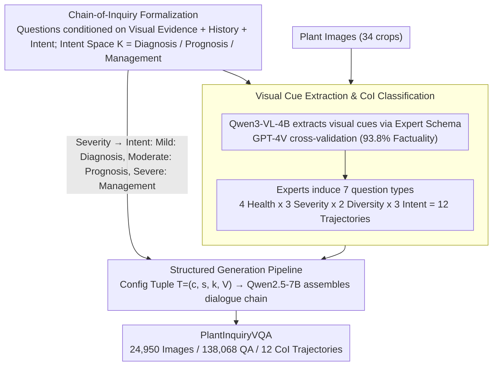

# Thinking Like a Botanist: Challenging Multimodal Language Models with Intent-Driven Chain-of-Inquiry

**Conference**: ACL 2026 Findings  
**arXiv**: [2604.20983](https://arxiv.org/abs/2604.20983)  
**Code**: [github.com/syed-nazmus-sakib/PlantInquiryVQA](https://github.com/syed-nazmus-sakib/PlantInquiryVQA)  
**Area**: Medical Imaging / Plant Pathological Diagnosis  
**Keywords**: Plant Pathological VQA, Chain-of-Inquiry, Multi-step Visual Reasoning, Diagnostic Reasoning, Multimodal Evaluation

## TL;DR
This paper introduces the PlantInquiryVQA benchmark and the Chain-of-Inquiry (CoI) framework, comprising 24,950 plant images and 138,068 QA pairs. It simulates the adaptive diagnostic questioning strategies of botanists to evaluate the multi-step visual reasoning capabilities of 18 MLLMs in plant pathology. Findings show that structured questioning significantly improves diagnostic accuracy and reduces hallucinations, though even the strongest models achieve a clinical utility score of only 0.188.

## Background & Motivation

**Background**: VQA datasets are core paradigms for evaluating multimodal reasoning, expanding into fields like medical imaging and scientific image analysis. Advanced VQA benchmarks now focus on multi-panel, multiple-choice, and vision-language grounding QA pairs. Agricultural vision datasets (e.g., PlantVillage, PlantDoc) primarily target classification and segmentation, lacking support for interactive QA reasoning.

**Limitations of Prior Work**: Current VQA benchmarks are fundamentally "question-centric," treating each image as an input for an independent query rather than the starting point for goal-oriented adaptive inquiry. In specialized fields like plant pathology, effective visual reasoning emerges from a series of interdependent inquiries—where each question builds on prior observations following a serialized narrative. Expert botanists conduct holistic assessments through hierarchical, evidence-driven questioning strategies transitioning from species identification to disease diagnosis and prognosis.

**Key Challenge**: While LLMs have made significant progress in Chain-of-Thought (CoT) reasoning, similar multi-step exploration remains under-explored in VQA dataset design. CoT is often viewed as a prompting strategy or an implicit model capability rather than an explicit structural requirement of the dataset itself.

**Goal**: Construct a dataset-level Chain-of-Inquiry framework where the question sequences themselves reflect the adaptive, decision-driven workflows of domain experts.

**Key Insight**: In plant pathology, each sample receives unique diagnostic consideration based on its visual appearance. For ambiguous symptoms, experts prioritize differential diagnosis and comparative analysis; for severe symptoms, they shift toward disease management and prevention. The sequence and intent of questioning are as critical as the answers.

**Core Idea**: Formalize the Chain-of-Inquiry framework by modeling diagnostic trajectories as ordered QA sequences conditioned on visual cues and cognitive intent. The strategy automatically adjusts from diagnosis to prognosis and management based on disease severity.

## Method

### Overall Architecture

This paper addresses the following: existing VQA benchmarks treat each image as an independent query with isolated questions, failing to measure the "linked" adaptive reasoning of expert diagnosis. PlantInquiryVQA structures the dataset itself as a diagnostic chain—recreating the botanist's workflow from species identification to disease judgment and prognosis management. The construction pipeline follows three steps: first, a VLM extracts fine-grained visual cues from images using an expert-defined schema; second, plant pathology knowledge is structured to map disease severity to different diagnostic intents; finally, an LLM dynamically assembles dialogue trajectories based on intent and visual evidence. The final dataset covers 34 crops, 7 question categories, and 12 unique CoI trajectories.

### Key Designs

**1. Chain-of-Inquiry Formalization: Diagnostic Reasoning as Intent-Conditioned Dialogue Chains**

The fundamental flaw of old benchmarks is being "question-centric," where each question remains unaware of prior observations. CoI formalizes the diagnostic trajectory as an ordered sequence of $T$ dialogue rounds $C(x, v_x) = \langle (q_1, a_1), \ldots, (q_T, a_T) \rangle$, where each question $q_t$ is conditioned on visual evidence $v_x$, previous context $H_{t-1}$, and a latent diagnostic intent $k \in \mathcal{K}$. The intent space is divided into: Diagnosis ($k_D$: health state and differential diagnosis), Prognosis ($k_P$: trajectory and etiology), and Management ($k_M$: prescription and counterfactual prevention).

Critically, intent shifts with severity—mild symptoms trigger diagnostic intent, moderate trigger prognosis, and severe trigger management. This reflects the reality that for mild cases, differential diagnosis (distinguishing similar diseases) is hardest, while for severe cases, the focus shifts to remediation. Encoding intent into the dataset tests if models can adaptively switch reasoning paths based on evidence.

**2. Visual Cue Extraction & CoI Classification: Grounding Vision in Expert Schemas**

To ensure question validity, reliable structured visual evidence is required. Six botanists defined a "Visual Parsing Schema" covering symptomatology, distribution patterns, and severity quantification. Qwen3-VL-4B automatically extracted cues (73.6% accuracy), followed by GPT-4V cross-validation and expert factuality checks on 5,000 samples (93.8% factuality score).

Classification fills another gap: classical phytopathology describes biological stages but lacks a standard taxonomy for "visual dialogue." Experts recorded trajectories for 600 samples, inducing 7 standard inquiry types (Visual Perception, Diagnostic Reasoning, Causal Reasoning, Risk Assessment, Prognostic Prediction, Prescriptive Reasoning, Counterfactual Reasoning). These cross with 4 health states, 3 severities, 2 diversities, and 3 intents to yield 12 unique CoI trajectories.

**3. Structured Generation Pipeline: Decoupling via Configuration Tuples**

Dialogue assembly is driven by a configuration tuple $T = (c, s, k_s, V_{cues})$—representing biological condition, severity, intent, and visual cues. Cognitive goal $k$ regulates information density based on severity $s$. Qwen2.5-7B-Instruct then assembles trajectories from templates, injecting modules like `temporal_evolution` or `remediation_strategy` to increase complexity. This mechanism allows "same image, multiple chains"—different severities generate different reasoning paths for the same leaf image.

### Evaluation Metrics & Benchmark Setup

PlantInquiryVQA is an evaluation-only benchmark. It uses standard vocabulary metrics (F1, BLEU-4, ROUGE-L) alongside seven domain-specific scores: Disease Identification ($S_{dis}$), Safety ($S_{safe}$), Clinical Utility ($S_{clin}$), Visual Grounding ($S_{vg}$), Feature Extraction Efficiency (E), Popularity Bias (B), and Cross-class Fairness (F). Safety and clinical utility specifically penalize high-risk errors like misclassifying disease as healthy.

## Key Experimental Results

### Main Results (18 MLLMs Performance)

| Model | F1 | Disease ID | Clinical Utility | Safety | Visual Grounding |
|------|-----|---------|-----------|--------|---------|
| Gemini-3-Flash | **0.255** | **0.444** | **0.188** | **0.147** | 0.259 |
| Seed-1.6-Flash | 0.226 | 0.344 | 0.120 | 0.075 | 0.394 |
| Grok-4.1-Fast | 0.203 | 0.224 | 0.067 | 0.009 | **0.498** |
| Ministral-3B | 0.166 | 0.189 | 0.059 | 0.020 | 0.372 |

### Ablation Study (Impact of Structured Questioning: Guided vs. Scaffolded)

| Model | Scaffolded Efficiency | Guided Efficiency | Efficiency Gain |
|------|---------------|-----------|---------|
| Gemini-2.5-Flash | 2.60 | 3.67 | +41.15% |
| Qwen2.5-VL-32B | 1.60 | 2.94 | +83.75% |
| Gemma-3-27B | 1.88 | 2.38 | +26.60% |

### Key Findings
- **Significant Domain Gap**: Even the strongest model, Gemini-3-Flash, achieves only 0.188 in clinical utility and 0.147 in safety, far from autonomous deployment standards.
- **"Seeing" is not "Diagnosing"**: Grok-4.1-Fast has the highest visual grounding (0.498) but low disease ID (0.224), suggesting that accurate symptom description does not equate to correct diagnosis.
- **Structured Questioning Reduces Hallucination**: Guided diagnosis is significantly more accurate than direct diagnosis across all severities. Specific questions force models to focus on fine-grained features (e.g., lesion margins, presence of halos), constraining the search space.
- **CoI Structure is the Main Driver**: Cascading modes (using models' own prior answers) retain 96.3% of the efficiency and 81.7% of the accuracy of Guided modes, proving that the structured inquiry itself drives improvement.

## Highlights & Insights
- **Chain-of-Inquiry as Dataset Structural Constraint**: Elevates CoT from a prompting strategy to an explicit dataset design requirement. This approach is generalizable to any field requiring multi-step reasoning evaluation (e.g., medical imaging, engineering failure analysis).
- **Intent-Driven Adaptive Inquiry**: Automatically adjusting questioning strategies (Diagnosis → Prognosis → Management) based on severity. This intent-visual coupling provides a blueprint for dialogue strategies in Agent systems.
- **Decoupling Visual Grounding and Diagnostic Reasoning**: Reveals that "describing symptoms" and "making diagnoses" are separable capabilities, highlighting specific directions for model improvement.

## Limitations & Future Work
- Phytopathology often requires multi-sensory information (tactile, environmental); single-frame images cannot fully replicate expert diagnosis.
- Top models still exhibit "false safety" errors (misidentifying diseased samples as healthy); currently, they serve as decision-support tools rather than replacements.
- The benchmark is English-only, limiting accessibility for small-scale farmers in non-English speaking regions.
- Visual cue extraction relies on automation (Qwen3-VL-4B), which may lack precision in certain contexts.

## Related Work & Insights
- **vs. PlantVillage/PlantDoc**: Those support only classification/segmentation; PlantInquiryVQA provides multi-step structured QA.
- **vs. Medical VQA (PMC-VQA, VQA-RAD)**: Those focus on human medicine and single-turn QA; PlantInquiryVQA targets plant pathology with multi-step chain reasoning.
- **vs. BloomVQA**: While BloomVQA organizes questions via Bloom’s Taxonomy, it relies on static classification. PlantInquiryVQA conditions question sequences on visual evidence and diagnostic intent.

## Rating
- Novelty: ⭐⭐⭐⭐ The shift from CoT as a prompt to a dataset structure is a novel contribution.
- Experimental Thoroughness: ⭐⭐⭐⭐ 18 models and comprehensive ablations, though construction is partially automated.
- Writing Quality: ⭐⭐⭐⭐ Clear framework design and deep analysis, though some tables are dense.
- Value: ⭐⭐⭐⭐ Provides a critical benchmark for agricultural AI; the CoI concept has cross-domain transfer value.
- Overall: ⭐⭐⭐⭐ Innovative perspective revealing the real gaps in MLLM professional reasoning.

<!-- RELATED:START -->

## Related Papers

- [\[ICLR 2026\] MIMIC-Bench: Exploring the User-Like Thinking and Mimicking Capabilities of Multimodal Large Language Models](../../ICLR2026/vlm_reasoning/mimic-bench_exploring_the_user-like_thinking_and_mimicking_capabilities_of_multi.md)
- [\[CVPR 2026\] Grounded Chain-of-Thought for Multimodal Large Language Models](../../CVPR2026/vlm_reasoning/grounded_chain-of-thought_for_multimodal_large_language_models.md)
- [\[ICLR 2026\] Reasoning-Driven Multimodal LLM for Domain Generalization](../../ICLR2026/vlm_reasoning/reasoning-driven_multimodal_llm_for_domain_generalization.md)
- [\[ACL 2026\] Position: Multimodal Large Language Models Can Significantly Advance Scientific Reasoning](position_multimodal_large_language_models_can_significantly_advance_scientific_r.md)
- [\[ICML 2026\] Active Exploring like a Pigeon: Reinforcing Spatial Reasoning via Agentic Vision-Language Models](../../ICML2026/vlm_reasoning/active_exploring_like_a_pigeon_reinforcing_spatial_reasoning_via_agentic_vision-.md)

<!-- RELATED:END -->
