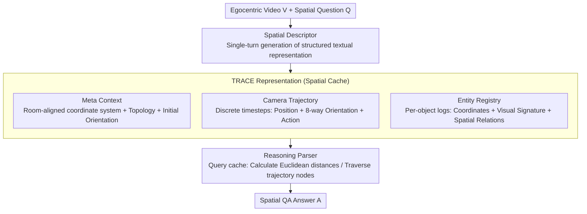

# TRACE: Unleashing Spatial Reasoning in Multimodal Large Language Models via Textual Representation Guided Reasoning

**Conference**: ACL 2026  
**arXiv**: [2603.23404](https://arxiv.org/abs/2603.23404)  
**Code**: [https://trace-reasoning.github.io](https://trace-reasoning.github.io)  
**Area**: Multimodal VLM / Spatial Reasoning  
**Keywords**: Spatial Reasoning, Multimodal Large Language Models, Textual Representation, Egocentric Video, Prompt Engineering

## TL;DR

This paper proposes TRACE (Textual Representation of Allocentric Context from Egocentric Video), a prompting method that guides Multimodal Large Language Models (MLLMs) to generate structured textual allocentric 3D environment representations—including meta-context, camera trajectories, and entity registries—from egocentric videos. These serve as intermediate reasoning steps to enhance spatial question-answering capabilities, consistently outperforming existing prompting strategies on VSI-Bench and OST-Bench.

## Background & Motivation

**Background**: Existing MLLMs have made significant progress in tasks like video understanding and image captioning, but perform poorly in 3D spatial reasoning. Cognitive science research indicates that humans perform 3D reasoning by constructing allocentric (environment-centered) spatial representations rather than operating directly at the pixel level.

**Limitations of Prior Work**: Current MLLMs rely excessively on 2D visual signals and learn spurious shortcut correlations from implicit spatial cues, failing to establish hierarchical abstractions of 3D scenes. Existing works either fine-tune on large-scale spatial reasoning data (poor scalability) or introduce additional geometric/stereo modalities (high system complexity), which are unsuitable for off-the-shelf MLLMs.

**Key Challenge**: Standard reasoning methods like Chain-of-Thought (CoT) are effective for arithmetic and symbolic tasks but are often ineffective or even harmful for complex spatial reasoning. This is because the reasoning traces generated by these methods fail to capture spatial geometric structures. Models need to reason explicitly based on global 3D representations.

**Goal**: To design a pure textual spatial representation method as an intermediate reasoning step for MLLMs to enhance spatial reasoning capabilities without modifying model architecture or adding extra modalities.

**Key Insight**: Inspired by allocentric spatial reasoning in human cognition, where humans mentally place themselves in an environment and construct a global scene layout. The authors observe that such allocentric representations can be entirely described via text.

**Core Idea**: Lead MLLMs to first generate a structured textual 3D representation (containing meta-context, camera trajectory, and entity registry) to be loaded into the context window as a "spatial cache," then perform reasoning based on this cache—transforming spatial reasoning into queries over structured text.

## Method

### Overall Architecture

TRACE utilizes a single-turn generation approach: given an egocentric video $V$ and a natural language question $Q$, the model first acts as a "Spatial Descriptor" to generate a TRACE representation $G$, then serves as a "Reasoning Parser" to generate the final answer $A$ based on $G$ and $V$. The reasoning process is formalized as $\hat{A}, \hat{G} = \arg\max P(A|G,V,Q) \cdot P(G|V,Q)$. The entire process is completed in a single forward pass, where TRACE functions as a structured CoT.

### Key Designs

**1. Meta Context: Anchoring the global coordinate system and room layout to prevent loss of reference frames.**

The most common failure in spatial reasoning occurs when a model loses track of its "initial position and heading" while moving, causing all relative positions to lose their baseline. Meta Context addresses this by proposing a "room-aligned coordinate system." While the observer's starting position is set as the origin $[0,0]$, the $y$-axis is not determined by the initial camera heading (which would cause chaos upon rotation) but by detecting the most prominent straight lines determined by large static objects (e.g., walls, long tables). It also records room topology (e.g., "rectangular bedroom"), grid direction, and initial orientation, serving as a unified framework for all subsequent spatial calculations. Using static structures rather than volatile camera headings to anchor coordinate axes is the fundamental reason it is more stable than naive CoT.

**2. Camera Trajectory: Reconstructing the movement path into a traversable sequence of nodes.**

A static map cannot explain "how a person moved," yet navigation and path-planning questions requires this dynamic process. Trajectory design segments the video into discrete timesteps, each recording a timestamp, estimated position $[x, y]$, and camera orientation, using large static objects from the Meta Context as reference points for localization. Orientations are restricted to 8 cardinal directions to avoid noise from imprecise angle estimation. Each step includes an "action" attribute to encode movement context. With this node sequence, the model can "walk" through the trajectory to answer navigation questions rather than relying on blurry memories of the visual frames.

**3. Entity Registry: Building structured profiles for every object to force the model to ground spatial relations into calculable constraints.**

Models often fail to count chairs or locate them accurately because they only have a vague impression of objects. The registry records for each entity: a timestamp (first appearance), a visual signature (appearance description for disambiguation), metric estimates (2D coordinates $[x,y]$ relative to the origin in meters), and spatial relations (natural language relative relations with neighbors). A key constraint is that entities must be listed individually (e.g., chair_01, chair_02) rather than grouped, ensuring precise counting and localization. Unlike methods that predict loose grid cells, these detailed profiles translate spatial relationships into geometric constraints. The timestamps and signatures provide deduplication and cross-temporal disambiguation. Ablations show this module causes the largest performance drop when removed, identifying it as the core of spatial reasoning.

### Loss & Training

TRACE is a pure prompting method and does not involve any training or fine-tuning. Inference is completed in a single forward pass: the model first generates a schema-compliant TRACE representation, loads it into the context window as a "spatial cache," and then derives the final answer by calculating Euclidean distances between entity coordinates or traversing trajectory nodes.

## Key Experimental Results

### Main Results

**Average performance of different prompting methods on VSI-Bench**

| Method | Gemini 3 Pro | Qwen2.5-VL-72B | MiMo-VL-7B |
|------|-------------|----------------|------------|
| Direct | 52.61 | 36.28 | 39.79 |
| CoT | 53.65 | 29.78 | 37.49 |
| ToT | 58.88 | 38.06 | 39.14 |
| LtM | 59.52 | 38.01 | 38.34 |
| CM (Cognitive Map) | 59.72 | 35.47 | 36.85 |
| **TRACE (Ours)** | **60.15** | **39.38** | **40.50** |

**Overall accuracy of different prompting methods on OST-Bench**

| Method | Gemini 3 Pro | Qwen2.5-VL-72B |
|------|-------------|----------------|
| Direct | 69.73 | 61.53 |
| CoT | 69.76 | 60.33 |
| CM | 68.47 | 57.45 |
| **TRACE (Ours)** | **70.36** | **62.68** |

### Ablation Study

| Configuration | VSI-Bench Avg | Description |
|------|--------------|------|
| Full TRACE | 60.15 | Complete model |
| w/o Meta Context | 58.27 | Drop of 1.88 |
| w/o Trajectory | 58.92 | Drop of 1.23 |
| w/o Entity Registry | 57.43 | Drop of 2.72 |
| Grid only (no structure) | 56.81 | Significant drop using only grid coordinates |

### Key Findings

- CoT actually performs 6.5 points worse than Direct on Qwen2.5-VL-72B, confirming that standard reasoning prompts can be harmful to spatial tasks.
- TRACE achieves the best or near-best performance across all 3 base models, demonstrating cross-model consistency.
- The Entity Registry contributes the most; its removal causes the largest performance drop, indicating that fine-grained object attributes and coordinate estimation are key to spatial reasoning.
- TRACE is equally effective in the multi-turn dialogue setting of OST-Bench, showing it is not limited to single-turn QA.
- Object counting and absolute distance estimation are the most difficult task types, where TRACE's improvements are particularly significant.

## Highlights & Insights

- Introducing allocentric spatial cognition theory from cognitive science into MLLM prompt design to simulate human mental representations is an elegant interdisciplinary approach.
- As a pure prompting method, TRACE requires no training data or model modifications and can be directly applied to any off-the-shelf MLLM, offering high practicality.
- The "spatial cache" concept is clever—transforming 3D spatial reasoning into queries over structured text leverages the LLM's strongest capability (textual reasoning) to compensate for its weakest (3D perception).

## Limitations & Future Work

- The quality of TRACE generation is entirely dependent on the MLLM's visual understanding; if the model fails to perceive object locations accurately, subsequent reasoning will fail.
- Coordinate estimates are inherently approximate and may not be accurate enough for tasks requiring precision (e.g., absolute distance estimation).
- Verification was limited to indoor scenes (VSI-Bench and OST-Bench); applicability to outdoor open scenes is unknown.
- Future work could consider iterative correction mechanisms to allow the model to self-verify and fix the TRACE representation after generation.

## Related Work & Insights

- **vs Cognitive Map (CM)**: CM uses loose grid cell predictions, whereas TRACE uses an Entity Registry with detailed attributes, providing finer spatial information.
- **vs Thinking in Space**: The latter shows the benefits of externalizing spatial representations but requires specific training; TRACE achieves similar effects via pure prompting.
- **vs VideoTree/VideoAgent**: These methods optimize evidence retrieval for long videos, whereas TRACE focuses on enabling the model to explicitly reason about 3D geometric cues.

## Rating

- Novelty: ⭐⭐⭐⭐ The idea of translating allocentric cognitive theory into structured prompts is novel, though the core remains a carefully designed CoT variant.
- Experimental Thoroughness: ⭐⭐⭐⭐ Good coverage with two benchmarks, three models, and comprehensive ablations.
- Writing Quality: ⭐⭐⭐⭐⭐ Clear motivation, intuitive method, and high-quality illustrations.
- Value: ⭐⭐⭐⭐ Provides a practical and general prompting strategy for spatial reasoning that is plug-and-play.

<!-- RELATED:START -->

## Related Papers

- [\[NeurIPS 2025\] Struct2D: A Perception-Guided Framework for Spatial Reasoning in MLLMs](../../NeurIPS2025/vlm_reasoning/struct2d_a_perception-guided_framework_for_spatial_reasoning_in_mllms.md)
- [\[ECCV 2024\] NavGPT-2: Unleashing Navigational Reasoning Capability for Large Vision-Language Models](../../ECCV2024/vlm_reasoning/navgpt-2_unleashing_navigational_reasoning_capability_for_large_vision-language_.md)
- [\[ACL 2026\] Addressing Overthinking in Large Vision-Language Models via Gated Perception-Reasoning Optimization](addressing_overthinking_in_large_vision-language_models_via_gated_perception-rea.md)
- [\[ACL 2026\] GeoArena: Evaluating Open-World Geographic Reasoning in Large Vision-Language Models](geoarena_evaluating_open-world_geographic_reasoning_in_large_vision-language_mod.md)
- [\[ACL 2026\] Position: Multimodal Large Language Models Can Significantly Advance Scientific Reasoning](position_multimodal_large_language_models_can_significantly_advance_scientific_r.md)

<!-- RELATED:END -->
