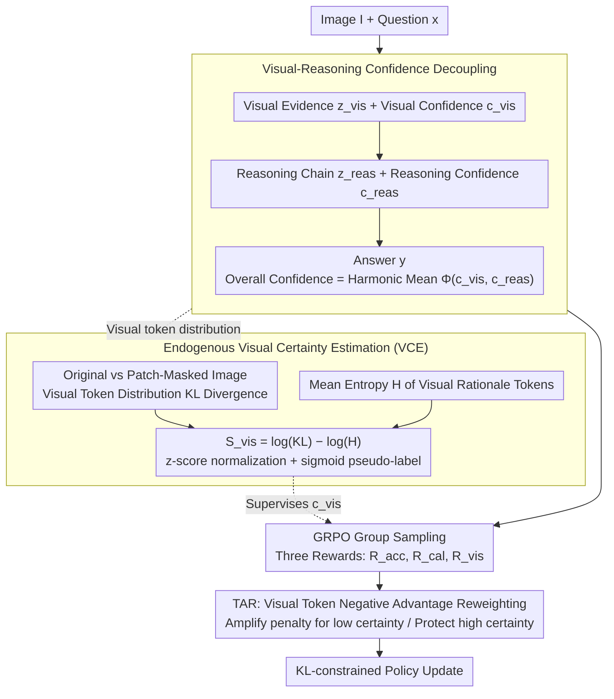

# VL-Calibration: Decoupled Confidence Calibration for Large Vision-Language Models Reasoning

**Conference**: ACL2026  
**arXiv**: [2604.09529](https://arxiv.org/abs/2604.09529)  
**Code**: https://github.com/Mr-Loevan/VL-Calibration  
**Area**: Multimodal VLM  
**Keywords**: Multimodal Calibration, Confidence Decoupling, Visual Uncertainty, Reinforcement Learning, Hallucination Suppression

## TL;DR
VL-Calibration decouples the verbalized confidence of LVLMs into visual confidence and reasoning confidence. By utilizing image-perturbation KL divergence, token entropy, and token-level advantage reweighting for training, the model simultaneously reduces ECE and improves accuracy across 13 visual reasoning benchmarks.

## Background & Motivation
**Background**: Large Vision-Language Models (LVLMs) can handle mathematical charts, geometric problems, common sense Q&A, and multi-disciplinary reasoning. However, they often lack reliable uncertainty expression when providing answers. In text-only LLMs, verbalized confidence calibration methods exist that prompt the model to output "how confident I am" and use SFT, PPO, DPO, or GRPO to align this confidence with answer accuracy.

**Limitations of Prior Work**: Directly applying these methods to LVLMs leads to structural mismatch. LVLM errors can stem from either "misseeing the image" or "seeing correctly but reasoning incorrectly." If only an overall confidence is trained, the model can only state "I am uncertain" without specifying whether the uncertainty arises from vision or logic. Furthermore, multimodal models are often dominated by language priors, giving high-confidence answers based on common text patterns even when image evidence is insufficient.

**Key Challenge**: The calibration objective requires judging whether an answer is correct, but LVLM answer correctness is a joint effect of visual perception and subsequent reasoning. A single Brier-style confidence mixes these two error sources, leading to coarse optimization signals. Moreover, visual confidence—which requires supervision—lacks human-annotated labels for visual rationale correctness.

**Goal**: The authors aim to solve three sub-problems: enabling the model to explicitly distinguish between visual and reasoning stage confidence; constructing a trainable visual certainty signal without ground-truth labels; and providing finer-grained penalties for hallucinations caused by visual uncertainty during RL training.

**Key Insight**: The paper starts from a simple yet effective observation: if a model's visual description truly depends on the image, the output distribution should change significantly when the image is occluded; if the model is internally certain about its visual description, the token distribution should be sharper. Combining "image sensitivity" and "internal low entropy" provides an endogenous proxy for visual certainty without human labeling.

**Core Idea**: Replace single confidence with decoupled visual and reasoning confidence, and align visual confidence to actual perceptual reliability using endogenous visual certainty rewards.

## Method

### Overall Architecture
The input to VL-Calibration is an image $I$ and a text question $x$. The output is not just an answer $y$, but a structured trajectory: first generating a visual rationale $z_{vis}$ with a visual confidence $c_{vis}$, then generating a reasoning chain $z_{reas}$ with a reasoning confidence $c_{reas}$, and finally providing the answer. The overall answer confidence is not a separate scalar but synthesizes $c_{vis}$ and $c_{reas}$.

The training process is based on GRPO. For the same vision-language problem, a group of outputs is sampled. Intra-group advantages are calculated based on three reward terms: answer accuracy, overall confidence calibration, and visual confidence calibration. The policy is then updated with KL constraints. Compared to standard RLCR, this method does not stop at "high confidence for correct answers, low for incorrect ones" but specifically pulls out the visual stage for supervision.

The method consists of three layers: first, modifying the output format to expose two uncertainty sources; second, constructing visual certainty pseudo-labels for $c_{vis}$; third, adjusting negative advantages at the token level to penalize incorrect tokens caused by low visual certainty more severely.

### Key Designs

**1. Visual-Reasoning Confidence Decoupling: Splitting monolithic verbalized confidence into "perceptual accuracy" and "logical correctness"**

LVLM errors can arise from misperceiving the image or failing the reasoning logic despite correct perception. Training only one overall confidence prevents the model from localizing whether uncertainty comes from perception or logic. This paper explicitly writes the trajectory as $\tau=(z_{vis}, c_{vis}, z_{reas}, c_{reas}, y)$. The total confidence for answer $y$ is synthesized using the harmonic mean:

$$\Phi(c_{vis},c_{reas})=\frac{2c_{vis}c_{reas}}{c_{vis}+c_{reas}}.$$

The harmonic mean is chosen over the arithmetic mean because it is more conservative—if either visual or reasoning confidence is very low, the overall confidence is pulled down significantly. This aligns with the risk structure of multimodal reasoning: "unclear perception but smooth logic" and "clear perception but shaky reasoning" should both result in low total confidence.

**2. Endogenous Visual Certainty Estimation (VCE): Creating trainable pseudo-supervision for $c_{vis}$ without visual ground truth**

While visual confidence needs supervision, human-labeled visual rationale correctness is expensive and rare. VCE extracts two complementary signals from the model itself as pseudo-labels. First is visual grounding: the KL divergence $D_{KL}$ between visual rationale token distributions generated from the original image vs. a randomly patch-masked image. A larger $D_{KL}$ indicates the output depends on the image rather than being hallucinated. Second is internal certainty: the average entropy $H$ of visual description tokens. Lower entropy indicates the model is more certain about its description. The final visual certainty is:

$$S_{vis}=\log(D_{KL}+\epsilon)-\log(H+\epsilon),$$

which is then z-score normalized and mapped to $[0,1]$ via a sigmoid. Subtracting the signals is key: entropy alone might reward language-prior-driven confident hallucinations, while KL alone might reward image-sensitive but internally chaotic outputs. The combination requires both image constraints and internal stability.

**3. Visual Certainty-Aware Token-level Advantage Reweighting (TAR): Precision penalties on ungrounded visual tokens**

Standard GRPO applies the same advantage to all tokens in a sample, but multimodal errors are not homogeneous. In an incorrect sample, tokens with low visual certainty that still generate specific visual content are likely ungrounded guesses. TAR multiplies negative advantages of visual rationale tokens by a weight related to that token's visual certainty: the negative advantage of low-certainty tokens is amplified (stronger penalty), while high-certainty tokens are protected. This suppresses hallucinations caused by visual uncertainty without damaging the model's general visual capabilities.

### Loss & Training
The training objective consists of three rewards: answer accuracy reward $R_{acc}$, overall confidence calibration reward $R_{cal}$, and visual confidence reward $R_{vis}$. $R_{cal}$ uses the synthesized confidence $\Phi(c_{vis},c_{reas})$ to align with answer correctness via a Brier-style penalty, while $R_{vis}$ penalizes the squared error between $c_{vis}$ and the stop-gradient $\tilde{S}_{vis}$. The authors sampled 12K instances from ViRL-39K to form VL-Calibration-12K, primarily training Qwen3-VL-4B/8B and verifying generalization on Qwen3-VL-30B and InternVL3.5-4B-MPO.

## Key Experimental Results

### Main Results
The paper evaluates Accuracy, AUROC, and Expected Calibration Error (ECE) across 13 visual reasoning and multi-disciplinary benchmarks. The primary conclusion is that VL-Calibration not only helps the model "report confidence better" but also improves visual reasoning accuracy.

| Model / Scenario | Metric | Prev. SOTA / Baseline | Ours | Gain |
|--------|------|------|------|------|
| Qwen3-VL-4B Avg. | ECE ↓ | 0.421 | 0.098 | ~4.3x reduction |
| Qwen3-VL-8B Avg. | ECE ↓ | 0.204 | 0.071 | ~65.2% reduction |
| Qwen3-VL-4B Avg. | Accuracy ↑ | Strong Baseline | **0.727** | +2.3% |
| Qwen3-VL-8B Avg. | Accuracy ↑ | Strong Baseline | **0.758** | +3.0% |
| MMMU-Pro | Accuracy ↑ | Strong Baseline | **0.542** | +2.2% |
| A-OKVQA | ECE ↓ | 0.112 | 0.017 | Significant ECE drop |
| Qwen3-VL-30B | Acc / AUROC / ECE | 0.652 / - / High | 0.803 / 0.767 / 0.082 | Effective on large scale |
| InternVL3.5-4B-MPO | Accuracy / ECE | RLCR Baseline | 0.689 / 0.103 | Cross-architecture effectiveness |

### Ablation Study
Ablations on Qwen3-VL-4B verify the contributions of "decoupling," "visual certainty estimation," and "token advantage reweighting."

| Configuration | ACC ↑ | AUROC ↑ | ECE ↓ | Explanation |
|------|------|------|------|------|
| Qwen3-VL-4B Base | 0.516 | 0.763 | 0.421 | Original model is overconfident and less accurate |
| RLCR | 0.704 | 0.694 | 0.167 | Standard RL calibration helps ECE but AUROC drops |
| RLCR + Decoupled | 0.701 | 0.682 | 0.164 | Just changing format provides no gain |
| + VCE Entropy only | 0.688 | 0.723 | 0.119 | Entropy improves calibration but hurts accuracy |
| + VCE KL only | 0.709 | 0.721 | 0.124 | Perturbation signal is effective but unstable |
| + VCE Entropy + KL | 0.715 | 0.751 | 0.121 | Dual signals are more balanced than single ones |
| **Ours + TAR** | **0.727** | **0.763** | **0.098** | Full method is best; TAR boosts ACC and ECE |

### Key Findings
- Decoupled confidence only becomes effective with paired visual supervision. Simply outputting $c_{vis}$ and $c_{reas}$ while optimizing for overall correctness yields performance similar to standard RLCR.
- The two components of VCE are complementary. Using only entropy can lead to "entropy collapse," while using only KL can lead to "entropy explosion"; the combination reduces calibration error while maintaining training stability.
- Reliability diagrams show the Base model severely overestimates itself in high-confidence intervals (ECE 0.421); VL-Calibration brings ECE to 0.098 with bins closely following the ideal diagonal.
- In the "visual unanswerable" setting of DynaMath (images removed), the method reduces the average confidence of unanswerable samples to 0.218 while maintaining 0.834 for answerable ones. The confidence gap of 0.616 is much higher than Base (0.228) and RLCR (0.405).
- VCE correlates strongly with visual judgment from Gemini-3-pro-preview (AUROC=0.746, SRCC=0.496), demonstrating pseudo-labels are not merely fitting noise.

## Highlights & Insights
- The biggest highlight is advancing the calibration problem from "answer confidence" to "error source confidence." This makes LVLM uncertainty diagnostic and suitable for safety scenarios requiring rejection or human intervention.
- The construction of VCE is practical: it avoids expensive manual visual rationale labeling by extracting supervision from image perturbations and token entropy. This approach can be ported to video, 3D, or document VLMs by designing appropriate perturbations.
- TAR moves calibration from the sample level to the token level, a crucial detail. Multimodal hallucinations are often triggered by a few specific visual description tokens; token-level advantages shape the output more precisely than sample-level rewards.
- The harmonic mean serves as a simple yet appropriate inductive bias. It treats "vision" and "reasoning" as a serial system where unreliability in either component degrades the final trustworthiness.

## Limitations & Future Work
- Computational overhead remains non-trivial. VCE requires additional forward passes and distribution statistics under image perturbations. While more direct than sampling-based uncertainty, it still needs optimization for large-scale online serving.
- Experiments cover Qwen3-VL (4B-30B) and InternVL3.5, but behavior on 70B+ models, different vision encoders, or long video inputs has not been systematically verified.
- The visual certainty pseudo-label relies on the assumption that "distribution change after perturbation represents grounding." This might not always hold for extremely robust encoders or tasks requiring fine-grained local evidence.
- The evaluation focused on benchmark level calibration and accuracy. Future work could explore human-AI collaboration: whether visual confidence can trigger more reasonable follow-up questions, refusal, or tool calls.
- Current methods require RL training. Future work could investigate lightweight LoRA, test-time calibration heads, or prompt-only decoupled outputs to reduce deployment costs.

## Related Work & Insights
- **vs RLCR**: RLCR uses GRPO to reward accuracy and Brier calibration. Ours inherits this RL framework but adds interpretability by splitting confidence into two dimensions and introducing visual pseudo-supervision. The advantage is clearer error localization at the cost of implementation complexity.
- **vs SaySelf / PPO-C**: Such methods primarily target verbalized confidence in text LLMs. VL-Calibration's core difference is the explicit modeling of multimodal perceptual errors, preventing visual issues from being collapsed into linguistic uncertainty.
- **vs VL-Uncertainty / Self-Consistency**: Sampling-based methods estimate uncertainty via answer divergence. Ours uses endogenous cues (KL/entropy) to construct signals, making it more direct and aligning better with visual confidence tokens.
- **vs Traditional ECE Calibration**: Calibration often happens at the probability or post-processing level. This method trains the model to generate interpretable confidence, making calibration results human-readable and usable for downstream strategy decisions.

## Rating
- Novelty: ⭐⭐⭐⭐☆ Decoupling visual and reasoning confidence with pseudo-supervision is a very directed problem formulation.
- Experimental Thoroughness: ⭐⭐⭐⭐☆ 13 benchmarks, ablations, cross-model, and "unanswerable" analyses are solid, though ultra-large models and real deployment scenarios remain open.
- Writing Quality: ⭐⭐⭐⭐☆ Theoretical chains are clear, formulas and analyses are complete, though some tables are information-dense.
- Value: ⭐⭐⭐⭐⭐ Highly valuable for high-stakes multimodal applications by answering "did the model see it wrong" or "did it think it wrong."

<!-- RELATED:START -->

## Related Papers

- [\[ACL 2025\] MMBoundary: Advancing MLLM Knowledge Boundary Awareness through Reasoning Step Confidence Calibration](../../ACL2025/vlm_reasoning/mmboundary_reasoning_step_confidence.md)
- [\[ACL 2026\] PROGRESSLM: Towards Progress Reasoning in Vision-Language Models](progresslm_towards_progress_reasoning_in_vision-language_models.md)
- [\[CVPR 2026\] PDCR: Perception-Decomposed Confidence Reward for Vision-Language Reasoning](../../CVPR2026/vlm_reasoning/pdcr_perception-decomposed_confidence_reward_for_vision-language_reasoning.md)
- [\[CVPR 2026\] Unified Generation and Self-Verification for Vision-Language Models via Advantage Decoupled Preference Optimization](../../CVPR2026/vlm_reasoning/unified_generation_and_self-verification_for_vision-language_models_via_advantag.md)
- [\[ACL 2026\] Addressing Overthinking in Large Vision-Language Models via Gated Perception-Reasoning Optimization](addressing_overthinking_in_large_vision-language_models_via_gated_perception-rea.md)

<!-- RELATED:END -->
