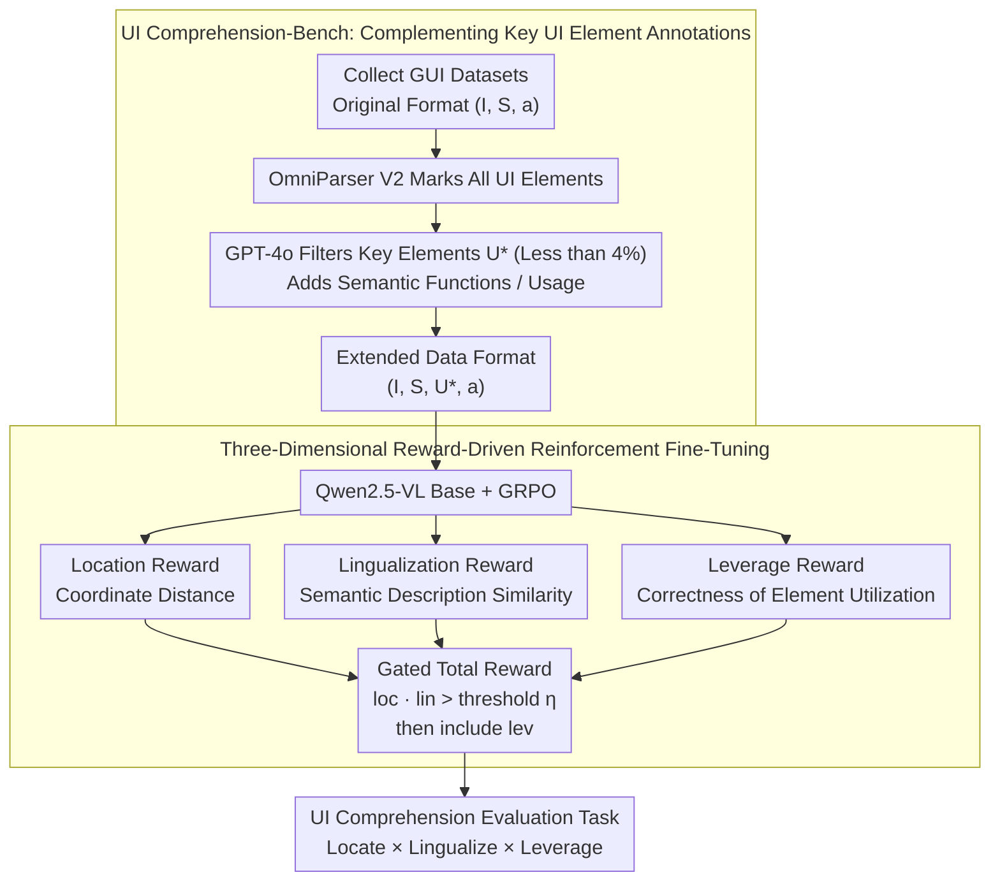

# What's Missing in Screen-to-Action? Towards a UI-in-the-Loop Paradigm for Multimodal GUI Reasoning

**Conference**: ACL 2026 Findings  
**arXiv**: [2604.06995](https://arxiv.org/abs/2604.06995)  
**Code**: None  
**Area**: Multimodal VLM / LLM Agent  
**Keywords**: GUI Reasoning, UI Understanding, Reinforcement Learning Fine-tuning, Multimodal Agent, UI Element Localization

## TL;DR

This paper proposes the UILoop (UI-in-the-Loop) paradigm, reframing GUI reasoning from the traditional "Screen → Action" into a "Screen → UI Element → Action" cyclic process. Through UI element-driven reinforcement fine-tuning, the model is taught to explicitly locate, understand, and utilize key UI elements, achieving SOTA performance on GUI reasoning tasks.

## Background & Motivation

**Background**: GUI automation utilizes AI to simulate user interaction with device screens. Current methods leverage advanced MLLMs such as GPT-4o and Qwen-VL to interpret user instructions and perform reasoning, but generally follow the "Screen-to-Action" paradigm—generating actions (e.g., click coordinates, input text, scrolling) directly from screen input, which is a black-box decision process.

**Limitations of Prior Work**: Existing GUI Agents have severe deficiencies in UI element understanding. Experiments show that advanced models score below 0.1 on average across three key dimensions (UI element localization, semantic functional description, and actual usage). When correct UI descriptions are provided, reasoning performance improves significantly in all scenarios; when incorrect descriptions are provided, the failure rate increases markedly. This indicates that UI element understanding is crucial for GUI reasoning but is overlooked by the current paradigm.

**Key Challenge**: The Screen-to-Action paradigm implicitly embeds UI understanding into action prediction, lacking explicit focus on UI elements. Models often fail to accurately locate key elements or understand element semantics and functions (e.g., misidentifying a scroll bar as a clickable button), leading to interaction errors and task failures.

**Goal**: To enable models to explicitly learn the localization, semantic functions, and actual usage of UI elements, establishing an interpretable bridge between screen understanding and action execution.

**Key Insight**: UI elements are crucial intermediate representations from screen to action. By having the model first identify and understand key UI elements before making decisions based on them, both reasoning accuracy and interpretability can be improved.

**Core Idea**: Reconstruct GUI reasoning into a cyclic "Screen–UI Element–Action" process, empowering the model with three capabilities for UI elements: Locate, Lingualize (semantic understanding), and Leverage (utilization) through reinforcement learning.

## Method

### Overall Architecture

UILoop consists of two main stages: (1) Data construction phase—designing a synthetic pipeline to build UI Comprehension-Bench (26K samples), enhancing existing GUI datasets to include localization, semantic descriptions, and usage information of key UI elements; (2) Training phase—proposing UI element-driven Reinforcement Fine-Tuning (RFT), training the model to master UI elements via three specialized reward functions. Based on this, the UI Comprehension evaluation task turns intermediate reasoning steps into scorable diagnostic metrics.

### Key Designs

**1. UI Comprehension-Bench: Filling the missing "Key UI Element" annotations**

Existing GUI datasets only provide screens and final actions; models learn a black-box mapping that jumps directly from pixels to coordinates without intermediate UI element-level supervision. The authors fill this gap with a synthetic pipeline: first collecting datasets like Android Control, OmniAct, and GUI-Act, using the Set-of-Marks model (OmniParser V2) to label all identifiable UI elements on the screen, and then using GPT-4o to filter out the key elements truly useful for completing the current instruction, while adding their semantic functional descriptions and actual usage. The data format is thus extended from $(I, S, a)$ to $(I, S, U^*, a)$, where $U^*$ represents the key UI elements and their descriptions. The difficulty lies in the numbers: out of 1,576,068 UI elements labeled across the 26K benchmark, only 57,332 (less than 4%) are key elements—picking those few useful controls out of dozens or hundreds on a single screen is a high-difficulty localization task in itself.

**2. Three-dimensional Reward-driven Reinforcement Fine-Tuning: Decomposing "Locate-Understand-Leverage" into three progressively unlockable rewards**

Traditional action prediction losses only focus on whether the final action is correct, failing to explicitly optimize UI understanding. UILoop designs three rewards in GRPO corresponding to the three capabilities: Location Reward uses normalized Euclidean distance between predicted and GT coordinates; Lingualization Reward calculates text similarity between predicted semantic descriptions and GT; Leverage Reward evaluates whether elements are correctly used based on action type (coordinate matching for clicks, text matching for input/scroll). These are combined into a total gated reward:

$$r = r^{format} + \alpha_1 \cdot r^{loc} \cdot r^{lin} + \alpha_2 \cdot \mathbb{1}_U(r^{loc} \cdot r^{lin}) \cdot r^{lev}$$

The key is the indicator function $\mathbb{1}_U$: the leverage reward $r^{lev}$ is only included when the product of localization and understanding $r^{loc} \cdot r^{lin}$ exceeds a threshold $\eta$. This forces the model to solidify "finding" and "perceiving" elements before optimizing "using" them, replicating the human sequence of "see → understand → act" and preventing the model from gaming the leverage reward by guessing actions before correctly identifying elements.

**3. UI Comprehension Evaluation Task: Making intermediate GUI reasoning steps scorable**

Current evaluations only look at final action accuracy, which is a black box—if a model fails, it's unknown whether it was a localization, understanding, or utilization error. The authors make the intermediate process measurable: Locate measures localization accuracy, Lingualize measures semantic functional understanding, and Leverage measures utilization accuracy. The Overall score is calculated as Overall $=$ Locate $\times$ Lingualize $\times$ Leverage. Using multiplication rather than addition means if any stage fails, the whole fails, aligning with the intuition that "all three capabilities are indispensable" and allowing diagnostics to pinpoint exactly where the model failed.

### Training Strategy

Using Qwen2.5-VL-3B and 7B as base models, RFT is performed using GRPO on the UI Comprehension-Bench training set, with 5 rollouts, trained for 3-6 epochs until rewards converge. $\alpha_1 = 4$, $\alpha_2 = 5$, UI indicator threshold $\eta = 0.5$, trained on 8 A100 80G GPUs.

## Key Experimental Results

### Main Results

| Method | ScreenSpot-Pro GR | AndroidControl-High SR |
|------|------------------|----------------------|
| GPT-4o (zero-shot) | 0.8% | 21.2% |
| Qwen2.5-VL-7B (zero-shot) | 17.4% | 47.1% |
| SeeClick | 1.1% | 59.1% |
| OS-Atlas-7B | 18.9% | 29.8% |
| GUI-Owl-7B | 21.3% | 37.5% |
| Qwen2.5-VL-7B* (SFT) | 18.5% | - |
| **UILoop-3B** | - | **63.3%** |
| **UILoop-7B** | **23.6%** | **67.8%** |

| UI Comprehension Metrics | Locate | Lingualize | Leverage | Overall |
|---------------------|--------|-----------|---------|---------|
| GPT-4o | Low | Low | Low | <0.1 |
| Qwen2.5-VL-7B | Low | Low | Low | <0.1 |
| **UILoop-7B** | **Significant Gain** | **Significant Gain** | **Significant Gain** | **SOTA** |

### Ablation Study

| Configuration | AndroidControl-High SR | Description |
|------|----------------------|------|
| UILoop (Full) | 67.8% | Full Model |
| w/o Location Reward | Decrease | Inaccurate localization leads to subsequent errors |
| w/o Lingualization Reward | Decrease | Lack of semantic understanding causes misoperation |
| w/o Leverage Reward | Decrease | Degradation of element utilization capability |
| Provide Correct UI Description | Large Gain | Validates importance of UI understanding |
| Provide Incorrect UI Description | Large Decrease | Validates criticality of UI understanding |

### Key Findings

- **UI element understanding is the key bottleneck in GUI reasoning**: All models (including GPT-4o) score extremely low (<0.1) on the three dimensions of UI understanding, but providing correct UI information leads to significant reasoning gains, proving the fundamental deficiency of the "Screen-to-Action" paradigm.
- **UILoop surpasses larger zero-shot models and specialized GUI Agents at both 3B and 7B scales.**
- **Reinforcement learning is more suitable than supervised fine-tuning for learning UI understanding**: GRPO's group-based relative advantage estimation can better handle complex sequential decision-making in GUI reasoning.
- **Key UI elements account for less than 4% of all elements on screen**: Identifying key elements among a large number of irrelevant UI elements is a highly challenging localization task in itself.

## Highlights & Insights

- **Compelling paradigm shift**: "Screen → UI → Action" aligns better with human cognitive processes of using interfaces; humans also identify key buttons/input boxes and understand their functions before interacting.
- **Ingenious hierarchical design of three-dimensional rewards**: $1_U(r^{loc} \cdot r^{lin}) \cdot r^{lev}$ ensures the model must master localization and understanding before optimizing utilization, simulating the human learning sequence of "see → understand → act."
- **Long-term value of UI Comprehension-Bench as infrastructure**: 26K samples with complete GT UI elements and interpretable reasoning chains can support systematic evaluation and improvement of future GUI Agents.
- The approach is transferable to other domains: any task involving complex interface interaction (e.g., IDE automation, medical system operation) can benefit from explicit intermediate element understanding.

## Limitations & Future Work

- Dependence on GPT-4o and OmniParser V2 for constructing GT UI elements; data quality is limited by the capabilities of these tools.
- Only validated on 3B and 7B scale models; whether larger models still require explicit UI understanding remains to be verified.
- The current framework handles static screenshots and does not consider dynamic UI (animation, video stream) scenarios.
- Evaluation primarily focused on Android and desktop applications; the complexity of Web interactions (e.g., dynamic loading, iframe nesting) may present new challenges.

## Related Work & Insights

- **vs Screen-to-Action methods (SeeClick, OS-Atlas)**: These methods focus on improving localization but ignore semantic functions and actual usage; UILoop’s three-dimensional UI understanding is more comprehensive.
- **vs RL methods like GUI-R1, UI-R1**: They use RL for action prediction in the "Screen-to-Action" paradigm; UILoop applies RL to the intermediate UI understanding phase, addressing a more fundamental issue.
- **vs UI-Vision, ScreenSpot-Pro**: These are benchmarks but focus only on localization; UILoop’s UI Comprehension-Bench covers localization + semantics + utilization.

## Rating

- Novelty: ⭐⭐⭐⭐ The paradigm shift from "Screen → Action" to "Screen → UI → Action" is creative, though the basic idea is intuitive.
- Experimental Thoroughness: ⭐⭐⭐⭐ Complete multi-benchmark and ablation studies, though verification across more scales and domains is needed.
- Writing Quality: ⭐⭐⭐⭐ Clear motivation, rich figures, and standardized formal definitions.
- Value: ⭐⭐⭐⭐ The 26K benchmark and the three-dimensional evaluation system provide practical momentum for the GUI Agent community.

<!-- RELATED:START -->

## Related Papers

- [\[CVPR 2026\] Prototypical Action Reasoning Facilitated by Vision-Language Alignment for Egocentric Action Anticipation](../../CVPR2026/vlm_reasoning/prototypical_action_reasoning_facilitated_by_vision-language_alignment_for_egoce.md)
- [\[NeurIPS 2025\] GUI-Rise: Structured Reasoning and History Summarization for GUI Navigation](../../NeurIPS2025/vlm_reasoning/gui-rise_structured_reasoning_and_history_summarization_for_gui_navigation.md)
- [\[CVPR 2026\] Reinforce to Learn, Elect to Reason: A Dual Paradigm for Video Reasoning](../../CVPR2026/vlm_reasoning/reinforce_to_learn_elect_to_reason_a_dual_paradigm_for_video_reasoning.md)
- [\[CVPR 2026\] CARE What Fails: Contrastive Anchored-REflection for Verifiable Multimodal Reasoning](../../CVPR2026/vlm_reasoning/care_what_fails_contrastive_anchored-reflection_for_verifiable_multimodal_reason.md)
- [\[ICLR 2026\] MMR-V: What's Left Unsaid? A Benchmark for Multimodal Deep Reasoning in Videos](../../ICLR2026/vlm_reasoning/mmr-v_whats_left_unsaid_a_benchmark_for_multimodal_deep_reasoning_in_videos.md)

<!-- RELATED:END -->
