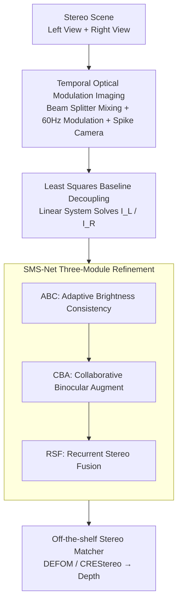

# 240FPS Stereo Vision from Monocular Mixed Spikes

**Conference**: CVPR 2026  
**Paper**: [CVF Open Access](https://openaccess.thecvf.com/content/CVPR2026/html/Xiaokaiti_240FPS_Stereo_Vision_from_Monocular_Mixed_Spikes_CVPR_2026_paper.html)  
**Code**: https://github.com/yongqiye00/MonoSpikeStereo  
**Area**: 3D Vision  
**Keywords**: Spike camera, Stereo vision, Temporal optical modulation, Binocular decoupling, High frame rate depth

## TL;DR
A single monocular spike camera is used to optically mix left and right views onto the same sensor, with one view subjected to periodic 60 Hz modulation. Through a two-stage process—"Least Squares Baseline Decoupling + SMS-Net Depth Refinement"—a 240 FPS binocular video is reconstructed from the mixed spike stream. This approach maintains the compact hardware and data efficiency of a monocular setup while achieving depth estimation accuracy close to the "theoretical upper bound."

## Background & Motivation

**Background**: Stereo vision systems are generally categorized into monocular (relying on data priors for depth, simplest hardware) and binocular/multi-view (deploying two or more cameras, high accuracy). To balance hardware compactness, accuracy, and data efficiency, one approach uses planar mirrors to project multiple perspectives onto different sub-regions of a single sensor (catadioptric stereo).

**Limitations of Prior Work**: 1) Monocular methods rely heavily on data-driven search/priors and fail in out-of-distribution scenes. 2) Binocular/multi-view systems have high accuracy but complex hardware; increasing the number of cameras spikes data throughput, which compromises data efficiency in high-speed scenarios like sports, autonomous driving, or aerospace. 3) Planar mirror partitioning requires epipolar rectification based on a "scene-is-approximately-planar" assumption, which introduces geometric distortion and loses accuracy in non-planar scenes. 4) Another path "aliases" two views onto the same sensor (avoiding distortion), but decoupling them relies only on global constraints for limited disparity, providing insufficient information.

**Key Challenge**: Although aliased imaging avoids geometric distortion, the mixed signal $I^L+I^R$ is inherently ill-posed. Without additional cues, the two views cannot be separated from a single frame. Decoupling requires injecting an observable, time-varying "tag" into one of the views, which demands a camera frame rate high enough to capture these temporal changes—a feat impossible for conventional digital cameras.

**Key Insight**: The authors leverage a new type of spike camera with a readout frequency of 40,000 Hz and 1-bit output, which is naturally suited for capturing high-speed temporal changes efficiently. By adding a 60 Hz periodic attenuation LCD modulator to one view, the two views become "distinguishable" in the temporal dimension. The modulation-induced temporal variance provides a strong cue for binocular decoupling.

**Core Idea**: Encode binocular geometry into a mixed spike stream using "temporal optical modulation + a monocular spike camera." Then, use a system of linear equations (Least Squares) for rapid baseline decoupling and a deep network to refine residuals, achieving 240 FPS binocular video from monocular hardware.

## Method

### Overall Architecture
The core problem is **how to extract clean left and right video streams from the mixed spike stream captured by one camera**. The pipeline consists of two stages: first, an analytical linear system performs "fast and coarse" baseline decoupling (Sec 3.1). Subsequently, a learning-based network, SMS-Net, removes artifacts from the baseline result and restores lost textures (Sec 3.2). Finally, the reconstructed binocular pairs are fed into off-the-shelf stereo matchers (DEFOM-Stereo / CREStereo) for depth estimation quality verification.

At the imaging end, light from one view is reflected by a planar mirror and mixed with the direct light from the other view via a beam splitter onto the spike camera. An LCD modulator is placed in the reflected path to apply 60 Hz periodic transmittance attenuation, while the other path remains unmodulated. The spike camera records this mixed scene as an extremely dense temporal sequence of spikes. Given the high spike density, motion between adjacent frames is assumed negligible. This allows for several linearly independent observation equations to be formulated within each modulation period to solve for 4 pairs of binocular frames—4 pairs × 60 Hz = 240 FPS.

### Key Designs

**1. Temporal Optical Modulation + Spike Camera: Encoding Binocular Geometry into a Single-Sensor Mixed Spike Stream**

The primary issue with aliased imaging is that $I^L$ and $I^R$ are overlapping. The authors introduce a temporal "fingerprint": keeping the left view unmodulated while applying a 60 Hz periodic attenuation $f(t)$ to the right view via an LCD, captured by a 40 kHz spike camera. Each pixel in the spike camera asynchronously integrates photoelectrons and triggers a pulse when a threshold $Q$ is reached. The electrons accumulated in a time window $T_w$ satisfy the model $Q+\Delta Q=\int_{t_{i-1}}^{t_i}\alpha[I^L(t)+I^R(t)f(t)]\,dt$, where $\alpha$ is the photoelectric conversion coefficient. Since $f(t)$ varies over time, observations across different time intervals become linearly independent, transforming "an ill-posed mixture" into "a solvable system of equations." Compared to dual-spike-camera stereo solutions, this uses only one camera to obtain binocular cues, reducing hardware size and data volume.

**2. Least Squares Baseline Decoupling: Linearizing Decoupling via Temporal Density**

Utilizing the "extremely dense" temporal nature of spikes, the authors assume motion is negligible between adjacent windows, approximating light intensity as constant: $I^L(t)\approx I^L$ and $I^R(t)\approx I^R$. Substituting this into the imaging model yields linear equations for each pixel and window: $Q+\eta_i=\alpha\big(I^L\Delta t_i+I^R F_i\big),\ i=1,\dots,n$, where $\Delta t_i=t_i-t_{i-1}$ and $F_i=\int_{t_{i-1}}^{t_i}f(t)\,dt$ is the integrated modulation function. Since $Q$, $f(t)$, $\alpha$, and trigger times $\{t_i\}$ are known, only $I^L$ and $I^R$ remain as unknowns, solved via Least Squares:

$$\min_{I^L,I^R}\sum_{i=1}^{n}\Big(Q-\alpha\big[I^L\Delta t_i+I^R F_i\big]\Big)^2 + \lambda\big[(I^L)^2+(I^R)^2\big]$$

The term $\lambda=1\times10^{-3}$ is an $\ell_2$ regularizer for stability. This solver is lightweight: building the system takes 0.093 s and solving takes 0.0151 s on an i9-13900KF, supporting real-time use. However, the "negligible motion" assumption fails under rapid movement, causing three types of artifacts: inconsistent brightness, cross-view ghosting, and texture loss in the modulated view. These are addressed by the second-stage network.

**3. SMS-Net: Three Modules Refining Specific Artifacts for High-Quality Binocular Video**

SMS-Net employs three functionally orthogonal modules to treat baseline artifacts in an end-to-end manner.

*ABC (Adaptive Brightness Consistency)* addresses "brightness inconsistency." Modulation-induced flickering is periodic; if the reconstruction window spans integer multiples of the modulation period $T_f$, these fluctuations cancel out. A brightness consistency guidance map $M_t=\frac{Q}{T_f}\sum_{k:t_k\in(t-T_f,t]}1$ is constructed. The module extracts multi-scale features $F^L_t, F^R_t, F^M_t$, and uses $F^M_t$ as a reference to perform affine alignment $\bar F^L_t=\gamma^L_t\cdot F^L_t+\beta^L_t$ based on global channel statistics, equalizing the brightness level.

*CBA (Collaborative Binocular Augment)* addresses "cross-view ghosting." Ghosting appears at opposite locations in the two views (e.g., a ghosting fence on the right of a pedestrian in the left image, but on the left in the right image). CBA uses a Stereo Cross-Attention Module (SCAM) along corresponding epipolar lines, allowing views to "borrow" clean information from each other to cancel ghosting.

*RSF (Recurrent Stereo Fusion)* addresses "texture loss" (the most impactful module in ablation). The modulated view loses texture during low-transmittance phases, which cannot be recovered from the current frame alone. RSF maintains a state queue, learning spatial offsets $\Delta$ and masks $m$ to align historical states via deformable convolution: $\tilde S^L_{t-i}=\mathrm{DeformConv}(S^L_{t-i},\Delta,m)$. Guided Temporal Attention (GTA) is then used to fuse these with current features, followed by ECA channel attention and SCAM cross-view fusion to output refined pairs $\hat I^L_t, \hat I^R_t$.

### Loss & Training
SMS-Net is trained end-to-end using an $\ell_1$ reconstruction loss: $L=\|\hat I^L_t-I^L_{gt}\|_1+\|\hat I^R_t-I^R_{gt}\|_1$. The AdamW optimizer is used with a $1\times10^{-4}$ initial learning rate and cosine annealing. Due to the lack of datasets, training uses synthetic data from TartanAir: left/right views are mixed $I_{mix}(t)=I^L_{gt}(t)+I^R_{gt}(t)f(t)$ and passed through a spike camera simulator. A custom hardware platform with a 60 Hz LCD modulator and a spike camera was built for real-world testing.

## Key Experimental Results

### Main Results: Downstream Depth Estimation (TartanAir / KITTI)
Reconstructed binocular pairs are fed into stereo matchers (DEFOM, CREStereo). The GT-* row represents the performance "upper bound" using ground truth grayscale images.

| Method | TartanAir AbsRel↓ | TartanAir RMSE↓ | TartanAir δ1↑ | KITTI AbsRel↓ |
|------|------|------|------|------|
| Base-DEFOM (Baseline Decoupling) | 0.1695 | 2.5187 | 0.8795 | 0.4477 |
| **Refine-DEFOM (Ours)** | **0.0940** | **1.7852** | **0.9202** | **0.4288** |
| GT-DEFOM (Upper Bound) | 0.0498 | 1.5839 | 0.9438 | 0.4219 |
| Spike-T (Spike Monocular) | 0.9675 | 8.2092 | 0.2731 | 0.8000 |
| STIR-DepthPro (Frame Monocular) | 0.1085 | 2.2625 | 0.8573 | 0.4409 |

Refine-DEFOM significantly improves over the baseline and outperforms monocular methods like Spike-T and DepthPro, approaching the performance of the theoretical upper bound.

### Ablation Study: ABC / CBA / RSF Modules (TartanAir, PSNR-L / SSIM-L / EPE)

| Configuration | PSNR↑(L) | SSIM↑(L) | EPE↓ | Description |
|------|------|------|------|------|
| Baseline | 26.53 | 0.857 | 13.71 | Least Squares only |
| +ABC | 32.13 | 0.953 | 11.44 | Brightness Consistency only |
| +CBA | 28.90 | 0.958 | 11.40 | Cross-view de-ghosting only |
| +RSF | 32.00 | 0.975 | 10.25 | Temporal Fusion only (strongest single module) |
| +ABC+RSF | 36.20 | 0.977 | 10.07 | Strongest dual-module combo |
| **Ours (ABC+CBA+RSF)** | **36.97** | **0.978** | **10.08** | Full model |

### Key Findings
- **RSF is a major contributor**: Adding RSF alone drops EPE from 13.71 to 10.25, highlighting the necessity of historical context for modulated textures.
- **Complementary modules**: All three modules together yield the best PSNR/SSIM. While EPE for +ABC+RSF is slightly lower, the full model provides superior visual quality and robustness.
- **Baseline viability**: The analytical least squares decoupling already produces usable depth maps, allowing for a lightweight fallback in compute-constrained scenarios.
- **Opposite ghosting**: CBA exploits the fact that ghosting positions are spatially inconsistent across views to clean signals.

## Highlights & Insights
- **Unified Pipeline**: The integration of hardware, physical modeling, and deep learning resolves an ill-posed problem via physical measurements rather than purely relying on data priors.
- **Two-Stage Paradigm**: The combination of a fast, interpretable analytical baseline and a refinement network provides a robust framework for signal demultiplexing tasks.
- **Artifact-Driven Design**: Mapping specific physical flaws to orthogonal modules (ABC/CBA/RSF) makes the architecture explainable and engineering-friendly.

## Limitations & Future Work
- **Hardware Bottleneck**: The 240 FPS limit is dictated by the 60 Hz LCD modulator; decoupling to higher speeds requires faster modulation technology.
- **Asymmetric Comparison**: Due to a lack of existing video decoupling baselines, monocular methods are compared as substitutes.
- **Motion Assumption**: Despite RSF, the "negligible motion" assumption may still break under extreme speeds, requiring more explicit motion modeling.
- **Real-World Quantitative Gap**: While qualitative real-world results are shown, quantitative metrics are primarily synthetic.

## Related Work & Insights
- **vs. Catadioptric Stereo**: Unlike partitioning methods that assume planarity to avoid distortion, this mixed-view approach avoids geometric distortion and uses temporal coding to resolve ambiguity.
- **vs. Aliased Projection**: Unlike prior aliasing methods that lack cues to separate views, temporal modulation provides a strong, solvable signal.
- **vs. Multi-Spike Systems**: This monocular setup matches the accuracy of multi-camera systems while significantly reducing hardware complexity and bandwidth overhead.
- **vs. Monocular Spike Depth**: This method overcomes the fundamental ambiguity of depth in low-texture regions by restoring true binocular geometry.

## Rating
- Novelty: ⭐⭐⭐⭐⭐ Integration of temporal modulation with spike cameras is a unique and effective cross-disciplinary approach.
- Experimental Thoroughness: ⭐⭐⭐⭐ Strong synthetic validation and hardware demonstration, though real-world quantitative data is limited.
- Writing Quality: ⭐⭐⭐⭐⭐ Clear derivation and logical progression from physical flaws to architectural solutions.
- Value: ⭐⭐⭐⭐ High potential for high-speed perception, though currently dependent on specific hardware setups.

<!-- RELATED:START -->

## Related Papers

- [\[CVPR 2026\] MonoVLM: Monocular 3D Visual Grounding with Vision Language Models](monovlm_monocular_3d_visual_grounding_with_vision_language_models.md)
- [\[CVPR 2026\] GaussianFluent: Gaussian Simulation for Dynamic Scenes with Mixed Materials](gaussianfluent_gaussian_simulation_for_dynamic_scenes_with_mixed_materials.md)
- [\[CVPR 2026\] SPE-MVS: Spatial Position Encoding Enhanced Multi-View Stereo with Monocular Depth Priors](spe-mvs_spatial_position_encoding_enhanced_multi-view_stereo_with_monocular_dept.md)
- [\[CVPR 2026\] Lite Any Stereo: Efficient Zero-Shot Stereo Matching](lite_any_stereo_efficient_zero-shot_stereo_matching.md)
- [\[CVPR 2026\] PIP-Stereo: Progressive Iterations Pruner for Iterative Optimization based Stereo Matching](pip-stereo_progressive_iterations_pruner_for_iterative_optimization_based_stereo.md)

<!-- RELATED:END -->
