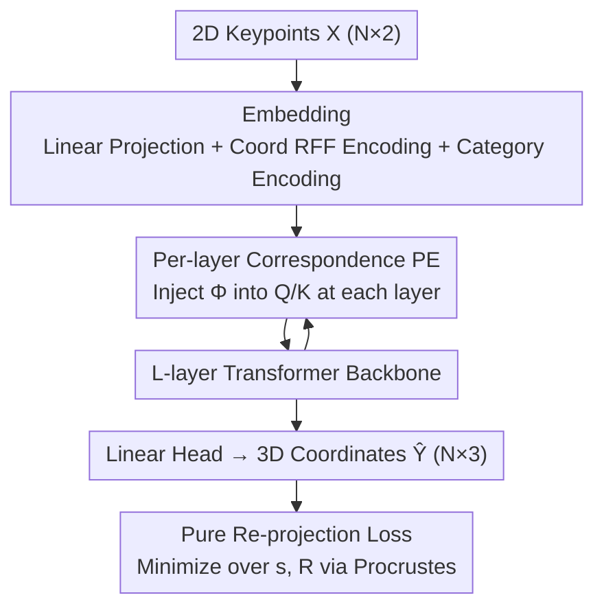

# 2D-LFM: Lifting Foundation Model without 3D Supervision

**Conference**: CVPR 2026  
**Paper**: [CVF Open Access](https://openaccess.thecvf.com/content/CVPR2026/html/Dabhi_2D-LFM_Lifting_Foundation_Model_without_3D_Supervision_CVPR_2026_paper.html)  
**Code**: [2dlfm.github.io](https://2dlfm.github.io)  
**Area**: 3D Vision  
**Keywords**: 2D-to-3D lifting, non-rigid structure recovery, positional encoding, foundation model, 3D-unsupervised

## TL;DR
By injecting "correspondence positional encodings" into **every layer** of a Transformer, this work trains the first cross-category 2D→3D lifting foundation model using only 2D keypoints (without any 3D ground truth). It outperforms large models like VGGT that rely on RGB depth in object-level geometry (Pascal3D+ 8.1mm vs. VGGT 89.4mm).

## Background & Motivation
**Background**: Visual foundation models such as VGGT, DUSt3R, and MASt3R, trained on internet-scale data, have achieved high accuracy in recovering dense depth and camera geometry from RGB images, suggesting that "RGB-based 3D reconstruction is largely solved."

**Limitations of Prior Work**: These models capture **scene-level** geometry (per-pixel depth) but fail to grasp **object-level** structure—fine-grained spatial relationships defined by an object's keypoints or skeleton. The paper demonstrates that while VGGT's predicted scene depth is accurate, back-projecting 2D keypoints along these depths results in flattened limbs and collapsed poses (MPJPE >100mm), failing to recover the true object structure (8.1mm).

**Key Challenge**: The issue is not resolution but **representation**—appearance-based features cannot disambiguate the depth relationships between different parts of an object. Furthermore, classical SfM/NRSfM proves that **correspondence (knowing identifying semantic parts across views) is a necessary condition** for 2D-to-3D lifting. Modern foundation models often discard this principle. To achieve cross-category scalability, Transformers typically use permutation-equivariant architectures, which **destroy token identity**. This creates a dilemma: MLP methods (PAUL, C3DPO) allow 2D-only learning but require category-specific networks and cannot scale, while Transformer methods (3D-LFM) scale across categories but require 3D supervision.

**Goal**: Train a lifting foundation model that requires only 2D supervision and is shared across 45+ categories.

**Core Idea**: Inject the inductive bias of "organizing observations by correspondence" from classical SfM into the Transformer **at every layer as positional encodings**, maintaining token identity while preserving permutation scalability.

## Method

### Overall Architecture
The input is a set of 2D keypoint observations $\mathbf{X}\in\mathbb{R}^{N\times2}$ ($N$ is typically 10–25 points), and the output is their 3D coordinates $\hat{\mathbf{Y}}\in\mathbb{R}^{N\times3}$. Training uses **no 3D ground truth**, treating it as a large-scale Non-Rigid Structure from Motion (NRSfM) problem. The workflow involves: projecting 2D points into tokens, adding coordinate positional encodings and category embeddings, and passing them through $L$ Transformer layers. The key difference from a standard Transformer is the injection of the "correspondence positional encoding" $\boldsymbol{\Phi}$ into the Query/Key of every layer. Finally, a linear projection outputs 3D coordinates, supervised by a pure re-projection loss (with Procrustes alignment).

### Key Designs

**1. Solving Unidentifiability from Permutation Equivariance via Per-layer Correspondence PE**

The paper presents a counter-intuitive negative conclusion (Proposition 1, Unidentifiability under Permutation Equivariance): If a model $f_\theta$ is permutation-equivariant and the data distribution and 2D loss are invariant to permutations of keypoint indices, then for any permutation $\boldsymbol{\Pi}$, there exists another parameter set $\tilde\theta$ such that $\mathcal{L}_{2D}(\tilde\theta)=\mathcal{L}_{2D}(\theta^\star)$ and $f_{\tilde\theta}(\mathbf{X})=\boldsymbol{\Pi}f_{\theta^\star}(\mathbf{X})$. Essentially, 2D supervision **cannot distinguish which token corresponds to which semantic part**, as all permutation solutions have identical loss. Consequently, standard Transformers produce degenerate 3D structures (>150mm).

Standard Transformers add positional encoding only at the input $\mathbf{Z}_0=\mathrm{Embed}(\mathbf{X})+\boldsymbol{\Phi}$, but layer-wise mixing quickly washes out positional information, restoring permutation symmetry. Ours injects $\boldsymbol{\Phi}$ into the Q and K of **every layer's** attention:

$$\mathbf{Q}_\ell=\mathbf{Z}_\ell\mathbf{W}_Q+\boldsymbol{\Phi},\quad \mathbf{K}_\ell=\mathbf{Z}_\ell\mathbf{W}_K+\boldsymbol{\Phi},\quad \mathbf{V}_\ell=\mathbf{Z}_\ell\mathbf{W}_V$$

This ensures every layer's attention remains spatially aware, maintaining token identity and bypassing the unidentifiability of Proposition 1. Ablations show this is critical: Input-only PE (ViT-style) → 100.3mm; first/last layer only → 92.1mm; every other layer → 26.1mm; **every layer → 8.1mm**.

**2. Analytical RFF Positional Encoding: Deterministic Frequency via CDF Inversion**

Since the number of keypoints is small ($N\in[10,25]$), standard ViT frequency layouts $\omega_k=10000^{-2k/D}$ lack the resolution to distinguish adjacent tokens. Inspired by Random Fourier Features (RFF), this work avoids random sampling and **deterministically inverts the CDF of a Gaussian spectral density** to cover the spectrum:

$$\omega_k=\sigma\cdot\mathrm{erf}^{-1}(2k/D)$$

This structured Fourier approach has significantly lower variance than Monte Carlo RFF sampling, providing richer encodings with fewer features ($\sigma=2.5$ is optimal). Notably, RFF without topological priors (11.2mm) performs nearly as well as Graph Laplacian encodings using the actual skeleton (9.3mm). The conclusion is that **"how to inject" is more important than "what to inject."**

**3. Pure Re-projection Loss + Masking for Unified Training**

Without 3D ground truth, supervision comes from 2D re-projection. The embedding stage projects 2D points to $D$ dimensions and adds coordinate-level RFF encodings (TPE) and learnable category encodings $\mathbf{e}_c$: $\mathrm{Embed}(\mathbf{X})=\mathbf{X}\mathbf{W}_{\mathrm{proj}}+\mathbf{b}_{\mathrm{proj}}+\mathrm{TPE}(\mathbf{X})+\mathbf{e}_c$. For multi-category training, categories are padded to $N_{\max}$, and a mask $\mathbf{M}_c$ is used. The loss minimizes over scale $s$ and rotation $\mathbf{R}$ (Procrustes alignment via SVD):

$$\mathcal{L}_{2D}=\min_{s,\mathbf{R}}\|\mathbf{M}_c\odot(\mathbf{X}-s\mathbf{P}\mathbf{R}\hat{\mathbf{Y}}^\top)\|_F^2$$

Since the Transformer weights are shared while the PE varies by category, low-data categories benefit from geometric priors learned from high-data categories, allowing cross-category knowledge transfer.

### Loss & Training
The model uses only the re-projection loss described above. Optimization uses Adam (lr=$10^{-4}$, wd=$10^{-4}$) with a batch size of 64 and category-balanced sampling. Single-category models converge in 50–100 epochs, while the 45+ category model takes 100–150 epochs. Backbones scale from 6–24 layers and 8–16 heads ($D=256\sim1024$). The full model has ~25M parameters, and per-layer PE injection adds <2% FLOPs and <3% training time.

## Key Experimental Results

### Main Results
Breaking the "Supervision vs. Scalability" dilemma (MPJPE↓ in mm, after Procrustes alignment):

| Method | 2D-only | Multi-cat | Pascal3D+ | Human3.6M |
|------|---------|--------|-----------|-----------|
| C3DPO (MLP, 2D-sup) | ✓ | ✗ | 15.0 | 95.6 |
| PAUL (MLP, 2D-sup) | ✓ | ✗ | 9.4 | 88.3 |
| 3D-LFM (Transformer, 3D-sup) | ✗ | ✓ | 5.2 | 46.3 |
| VGGT (VFM Back-projection) | ✓ | ✓ | 89.4 | 107.8 |
| ViT-style Input PE (2D-only) | ✓ | ✓ | 92.3 | 52.4 |
| **2D-LFM (Per-layer Fourier)** | ✓ | ✓ | **8.1** | **30.9** |

Highlights: Ours outperforms the 3D-supervised 3D-LFM on Human3.6M (30.9mm vs. 46.3mm) and is an order of magnitude better than scene-level models like VGGT for object geometry.

### Ablation Study

| Configuration | Pascal3D+ | Human3.6M | Description |
|------|-----------|-----------|------|
| Input PE (ViT-style) | 100.3 | 63.4 | Complete failure |
| First/Last layer only | 92.1 | 71.2 | Limited benefit |
| Every 2nd layer | 26.1 | 34.5 | Significantly worse than every layer |
| **Every layer (Ours)** | **8.1** | **33.1** | Constant correspondence reinforcement |
| RFF-type PE | 11.2 | 38.1 | No topological prior |
| Graph Laplacian PE | 9.3 | 35.8 | Using ground truth skeleton |

### Key Findings
- **Injection Location > Encoding Type**: The reduction from >100mm to 8.1mm is driven by per-layer injection. RFF and Graph Laplacian differ by only ~2mm.
- **Foundation Model Emergence**: Joint training of a unified model improves performance by 59.1% on average compared to per-category training. Low-data categories benefit most: bottle (1601 samples) improved by 92.8% (100mm to 7.2mm).
- **Depth Scalability**: Performance improves steadily with depth: 4 layers (15.3mm) → 12 layers (9.3mm) → 24 layers (8.1mm). Standard ViTs cannot leverage this depth due to correspondence fading.

## Highlights & Insights
- **Theoretical Grounding**: Proposition 1 transitions the failure of standard Transformers in 2D-only lifting from an empirical observation to a proof of unidentifiability, making "per-layer injection" a theoretically necessary condition rather than a heuristic.
- **Minimal Change, Maximal Gain**: Modifying only the Q/K addition with <2% FLOPs overhead to achieve an order of magnitude error reduction is an elegant design.
- **Challenging the VFM Narrative**: Sparse 2D keypoints with semantic correspondence outperform dense RGB depth models for object-level geometry, reminding the community that scene-level and object-level understandings are distinct.
- **Generalizable Strategy**: Re-affirming structural inductive biases at every layer to counter the symmetrizing effect of attention mixing could be applied to any set-based Transformer task requiring token identity (e.g., molecular graphs, point cloud registration).

## Limitations & Future Work
- **Dependence on Known 2D Correspondences**: The method assumes keypoints are detected and associated. The paper handles occlusions with masks but does not explore end-to-end propagation of detection errors.
- **Category Degradation**: Some categories show minor regression during 45+ category joint training; long-tail stability needs improvement.
- **Evaluation Metrics**: MPJPE is reported after Procrustes alignment, removing scale and rotation; performance in absolute metrics is less explored.

## Related Work & Insights
- **vs. 3D-LFM**: Both use Transformers for cross-category lifting, but 3D-LFM requires 3D supervision; Ours uses 2D-only supervision by filling the structural signal gap with per-layer PE.
- **vs. PAUL / C3DPO**: Both use 2D supervision, but MLP-based schemes require category-specific networks and manual bottleneck tuning, whereas Ours uses a unified Transformer.
- **vs. VGGT / DUSt3R**: These models are strong at scene-level geometry from RGB; Ours proves that for object-level structure, sparse keypoints + explicit correspondence are more reliable.

## Rating
- Novelty: ⭐⭐⭐⭐⭐ First 2D-only cross-category lifting foundation model with a theoretical basis.
- Experimental Thoroughness: ⭐⭐⭐⭐ Multiple benchmarks and systematic ablations, though absolute scale evaluation is limited.
- Writing Quality: ⭐⭐⭐⭐⭐ Clear logic chain from motivation to theory to validation.
- Value: ⭐⭐⭐⭐⭐ Revitalizes the "2D keypoint lifting" paradigm for object-level 3D understanding.

<!-- RELATED:START -->

## Related Papers

- [\[CVPR 2026\] EvObj: Learning Evolving Object-centric Representations for 3D Instance Segmentation without Scene Supervision](evobj_learning_evolving_object-centric_representations_for_3d_instance_segmentat.md)
- [\[CVPR 2026\] JRM: Joint Reconstruction Model for Multiple Objects without Alignment](jrm_joint_reconstruction_model_for_multiple_objects_without_alignment.md)
- [\[CVPR 2026\] Depth Any Panoramas: A Foundation Model for Panoramic Depth Estimation](depth_any_panoramas_a_foundation_model_for_panoramic_depth_estimation.md)
- [\[CVPR 2026\] iLRM: An Iterative Large 3D Reconstruction Model](ilrm_an_iterative_large_3d_reconstruction_model.md)
- [\[CVPR 2026\] Inferring Compositional 4D Scenes without Ever Seeing One](inferring_compositional_4d_scenes_without_ever_seeing_one.md)

<!-- RELATED:END -->
