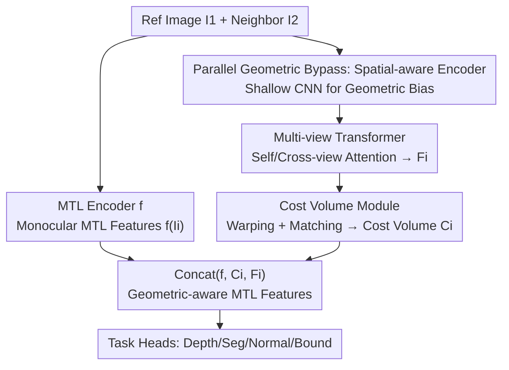

# 3D-Aware Multi-Task Learning with Cross-View Correlations for Dense Scene Understanding

**Conference**: CVPR 2026  
**Code**: https://github.com/WeiHongLee/CrossView3DMTL  
**Area**: 3D Vision / Multi-Task Learning  
**Keywords**: Multi-Task Learning, Cross-View Correlation, Cost Volume, Geometric Consistency, Dense Prediction

## TL;DR
Append a lightweight, task-agnostic "geometric bypass"—the Cross-View Module (CvM, consisting of a spatial-aware encoder + multi-view Transformer + cost volume)—to standard Multi-Task Learning (MTL) networks. By injecting geometric correspondences between adjacent views into shared features as geometric consistency, the single network develops a better "understanding of 3D" when simultaneously predicting depth, segmentation, surface normals, and boundaries. This yields plug-and-play performance gains on NYUv2 and PASCAL-Context (max $\Delta$MTL +3.09).

## Background & Motivation
**Background**: Multi-Task Learning aims to use a single shared encoder and multiple lightweight task heads to simultaneously perform dense tasks such as depth estimation, semantic segmentation, surface normal estimation, and boundary detection. This saves parameters and leverages inductive biases between tasks. Mainstream improvements focus on "how to better share/interact features in 2D image space"—using task-specific attention, cross-task attention, Mixture-of-Experts (MoE), prompts, or multi-teacher distillation.

**Limitations of Prior Work**: These methods are almost exclusively based on "mapping 2D images to high-dimensional features + pixel-wise supervision." The learned features are **unstructured** and lack explicit constraints on scene geometry. Consequently, predictions from different perspectives of the same scene are often contradictory (e.g., inconsistent curtain segmentation between left and right views), and task relationships become "noisy," hindering performance (Fig. 1(c), top row).

**Key Challenge**: Dense scene understanding inherently requires 3D geometric consistency, yet pure 2D pixel-wise supervision cannot provide the critical geometric clue that "the same scene should be consistent across views." Existing 3D-aware approaches have flaws: 3DMTL uses differentiable rendering for 3D regularization but **fails to directly extract and fuse multi-view geometric clues into shared representations**; MuvieNeRF reformulates multi-tasking as multi-view synthesis, but **still requires multi-view inputs and camera parameters during inference**, limiting its deployment.

**Goal**: To inject cross-view geometric consistency into MTL shared features without sacrificing the advantages of "single-image inference and architecture-agnosticism."

**Key Insight**: The authors draw on mature experiences from multi-view reconstruction (MVSplat, DepthSplat, VGGT)—**cost volumes** are effective means of establishing dense cross-view correspondences and encoding geometry. Can a cost volume be attached to an MTL encoder as a "geometric prior" shared by all tasks?

**Core Idea**: Use a lightweight geometric bypass, CvM, running **parallel** to the MTL backbone to reconstruct cross-view correlations (cost volumes). This is concatenated with the original monocular MTL features before being fed into task heads. Training can utilize single/multi-view data, while inference requires only a single image (copying itself as a neighbor view when others are missing).

## Method

### Overall Architecture
The method addresses the lack of 3D geometric consistency in features learned by standard MTL. The overall approach is to keep the original shared MTL encoder $f(\cdot)$ (with lightweight heads for depth/segmentation/normals/boundaries) and **parallelize** it with a geometric bypass—the Cross-View Module (CvM) $g(\cdot)$, specifically responsible for extracting geometry and establishing correlations from image pairs.

Given a reference image $I_1$ and a neighboring view $I_2$ (default $V=2$), both paths are executed: the backbone $f$ extracts monocular MTL features $f(I_1)$ and $f(I_2)$; the bypass $g$ sequentially performs three steps—(i) a spatial-aware encoder $s(\cdot)$ extracts geometric bias features, (ii) a multi-view Transformer $m(\cdot)$ uses self/cross-view attention to exchange information and produce cross-view enhanced features $F_i$, and (iii) a cost volume module $e(\cdot)$ warps and matches $F_i$ along depth hypotheses to construct a cost volume $C_i$. Finally, $f(I_i)$, $C_i$, and $F_i$ are concatenated into "geometric-aware MTL features" $\tilde{F}_{I_i}=\mathrm{concat}(f(I_i),C_i,F_i)$, which are then fed into task heads. The entire $g$ is shared across all tasks, adding only about 5M parameters (approx. 1.5% of the total MTL encoder).

### Key Designs

**1. Parallel Spatial-aware Encoder: Decoupling "Geometry-capturing" from "Task-performing"**

The most direct approach would be using MTL encoder features for cross-view matching, but the authors argue this causes interference between "monocular MTL" and "cross-view matching" objectives, making training harder and hindering generalization (validated in Ablation Tab. 5). The issue is that MTL encoder features are optimized for task predictions, dilating geometric information with semantics. Thus, this design uses a **completely independent** spatial-aware encoder $s(\cdot)$—implemented as a shallow ResNet-style CNN (similar to MVSplat)—to extract 1/8 resolution, 128-dimensional features $\{s(I_i)\}$. A CNN is chosen over the MTL backbone because it has stronger inductive biases for local spatial structures, producing "cleaner" geometric features; moreover, this bypass does not modify the MTL encoder, making it **architecture-agnostic**. In ablations, it outperforms alternatives like "using MTL features directly," "MTL+LoRA," or "MTL+Adapter."

**2. Multi-view Transformer: Establishing Correspondences and Disambiguating Occlusions/Textureless Regions**

Single-view spatial features are insufficient; "which pixel corresponds to which" across views must be explicitly established. This design follows $s(\cdot)$ with a multi-view Swin Transformer $m(\cdot)$, stacking layers of self-attention (intra-view) and cross-attention (inter-view). It calculates attention between each view and its neighbors to aggregate complementary clues, disambiguating difficult regions like occlusions or textureless surfaces. To maintain computational efficiency for dense tasks at high resolutions, it follows Swin's **local window** design. The output is a set of cross-view enhanced features $\{F_i\}=m(\{s(I_i)\})$, which are geometry-aware and used for subsequent cost volume construction. When more than two neighbors exist ($V>3$), cross-attention is only performed on the top-2 closest neighbors to balance performance and overhead.

**3. Differentiable Cost Volume: Solidifying Learned Correspondences into Explicit 3D Representations**

The cross-view enhanced features $F_i$ represent "implicit" correspondences. This design converts them into a **depth-parameterized cost volume** to explicitly encode geometric consistency. Specifically, $L$ candidate depth planes $\{d_1,\dots,d_L\}$ are sampled uniformly in inverse depth space (default $L=128$, range 0.0001–10). For each candidate depth $d$, features from neighbor $I_j$ are warped to the reference view using intrinsic parameters and relative poses to obtain $\hat{F}^{(d)}_{j\to i}$. Pixel-wise dot-product similarity matching is performed between reference and warped features, averaged across all neighbors:

$$C_i^{(d)} = \frac{1}{V-1}\sum_{j\neq i}^{V} \frac{F_i \cdot \hat{F}^{(d)}_{j\to i}}{\sqrt{K}}$$

where $K$ is the channel dimension used for normalization. Each view thus obtains a cost volume $C_i\in\mathbb{R}^{H\times W\times L}$ shared across tasks. The advantage of a cost volume is that it transforms "cross-view geometric consistency" from abstract attention into an explicit matching volume—a geometric prior proven effective in Multi-View Stereo (MVS) that is fully differentiable and end-to-end trainable. Finally, concatenated with $F_i$ and $f(I_i)$, geometric clues explicitly enter each task's prediction.

**4. Single-view Replication Strategy: Enabling Single-image Inference for the Dual-view Bypass**

CvM requires at least two views, but many MTL datasets and inference scenarios provide only a single image. This design uses a simple trick—**replicating the single image as its own neighbor**—allowing the bypass to function normally. The same is done during training on single-view datasets, which experimental results (Tab. 2/3) show remains effective. The authors explain that training CvM on identical views prevents it from capturing "spurious correlations within the same view," thereby improving robustness. This design is key to fulfilling the promise of "architecture-agnosticism + single-image inference."

### Loss & Training
The objective is to minimize pixel-wise losses for all tasks (Cross-Entropy for segmentation, L1 for depth, etc.) after feeding geometric-aware features $\tilde{F}_{I_i}$ into task heads, jointly optimizing $f$, task heads $\{h_t\}$, and the entire bypass $g=e\circ m\circ s$:

$$\min_{f,\{h_t\},g}\ \frac{1}{NV}\sum_{\{(I_i,\mathcal{Y}_i)\}\in\mathcal{D}}\ \sum_{y_t\in\mathcal{Y}_i}\ell_t\big(h_t(\tilde{F}_{I_i}),y_t\big)$$

In the multi-view setting on NYUv2, RGB-D video frames are additionally used (depth labels only), with relative poses estimated via COLMAP. The backbones are unified as ViT-L, and the multi-view Transformer in CvM uses 6 layers of self/cross-attention.

## Key Experimental Results

### Main Results
NYUv2 multi-view setting (training uses single-view + video frames, testing uses single-view only). $\Delta$MTL represents the average task gain relative to baselines:

| Method | Seg.(mIoU)↑ | Depth(RMSE)↓ | Normal(mErr)↓ | Boundary(odsF)↑ | $\Delta$MTL↑ |
|------|------|------|------|------|------|
| DINOv3 w/o video | 63.68 | 0.4113 | 15.53 | 80.10 | 0.00 |
| DINOv3 (+video) | 64.03 | 0.3954 | 15.35 | 80.52 | 1.52 |
| 3DMTL\* (DINOv3 Reproduction) | 64.25 | 0.3952 | 15.24 | 80.15 | 1.68 |
| **Ours** (DINOv3+CvM) | **65.27** | **0.3836** | **15.35** | **81.69** | **3.09** |

\*3DMTL has no open-source code; authors reproduced it using DINOv3. Compared to the single-image DINOv3 baseline, the proposed method gains +3.09; compared to multi-view DINOv3, it gains +1.57. Against 3DMTL, segmentation increases by +1.0, boundary by +1.5, and depth RMSE improves from 0.3952 to 0.3836.

SOTA comparison in single-view setting (NYUv2, $\Delta$MTL relative to single-task STL baseline); the method improves all three backbones:

| Method | Seg.↑ | Depth↓ | Normal↓ | Boundary↑ | $\Delta$MTL↑ |
|------|------|------|------|------|------|
| RADIO | 59.32 | 0.4698 | 17.46 | 79.41 | 8.95 |
| RADIO+**Ours** | 60.26 | 0.4619 | 17.34 | 80.36 | **10.20** |
| SAK | 63.18 | 0.4313 | 16.25 | 79.43 | 14.05 |
| SAK+**Ours** | 63.12 | 0.4044 | 16.22 | 80.56 | **15.63** |
| DINOv3 | 63.68 | 0.4113 | 15.53 | 80.10 | 16.33 |
| DINOv3+**Ours** | 64.98 | 0.3909 | 15.27 | 81.58 | **18.66** |

Consistent gains across all tasks are observed on PASCAL-Context for RADIO/SAK/DINOv3 (DINOv3+Ours $\Delta$MTL 2.52 $\to$ 3.71, boundary 76.30 $\to$ 79.29). Geometry-intensive tasks show the most significant benefits, with depth improving by ~4.29% and boundary F-score by +1.2.

### Ablation Study
Breakdown of Cost Volume $C$ and Cross-View Enhanced Features $F$ (NYUv2, $\Delta$MTL relative to STL):

| Config | Seg.↑ | Depth↓ | Boundary↑ | $\Delta$MTL↑ | Note |
|------|------|------|------|------|------|
| Ours w/o CV & CF | 64.03 | 0.3954 | 80.52 | 17.57 | Standard MTL baseline |
| Ours w/o CF | 64.86 | 0.3853 | 81.18 | 18.65 | Cost Volume only |
| Ours w/o CV | 64.69 | 0.3856 | 81.57 | 18.69 | Cross-view features only |
| **Ours (full)** | **65.27** | **0.3836** | **81.69** | **19.05** | CV + CF |

Comparison of spatial feature extraction methods ($\Delta$MTL): Direct MTL encoder (18.84) < +LoRA (18.87) < +Adapter (18.98) < **Independent CNN (Ours) (19.05)**. This confirms that an independent shallow CNN captures geometry better than modifying the MTL backbone.

### Key Findings
- **Cost Volume is primary, cross-view features are complementary**: Adding only the cost volume raises $\Delta$MTL from 17.57 to 18.65 (>+1%); adding cross-view features further increases it to 19.05. The two are complementary—cost volume provides explicit geometry, while features provide disambiguated context.
- **Decoupled geometric bypass is effective**: Using an independent CNN for spatial features outperforming LoRA/Adapter integration supports the core argument: "do not let geometric matching interfere with monocular task learning."
- **Inflection points for depth candidates $L$ and view count $V$**: Increasing $L$ from 128 to 512 gives marginal gains (19.05 $\to$ 19.25) but increases computation; 128 is chosen (consistent with MVSplat). View count $V=2$ (19.05) is sufficient; $V=3$ is slightly better (19.20), while $V=4$ drops (18.63). 
- **Extremely lightweight**: CvM adds only ~5M parameters (~1.5% of a 300–350M MTL encoder), yet provides stable gains, especially for geometry-heavy tasks like depth and boundary.

## Highlights & Insights
- **"Migrating" MVS Cost Volumes to MTL**: Instead of inventing new geometric modules, the authors identify that "cost volume = sharable geometric prior" and inject it non-intrusively via a parallel bypass. This architecture-agnostic approach of borrowing mature components to solve adjacent field problems is highly reusable.
- **Decoupling = No Interference**: By keeping the bypass separate, the CNN's spatial inductive bias captures geometry while the ViT backbone captures semantics, preventing the two from diluting each other in the same parameter space—confirmed by ablation data.
- **Single-image Replication as a Robustness Hack**: A seemingly simple engineering trick is interpreted as "preventing the learning of spurious intra-view correlations," enabling the practical promise of "multi-view training, single-view inference."
- **Transferability**: This paradigm—Backbone + Parallel Geometric Bypass + Explicit Cost Volume + Concat—can be extended to any dense prediction combination requiring geometric consistency (e.g., video segmentation + depth, SLAM multi-task heads).

## Limitations & Future Work
- The method targets **static scenes**; dynamic environments (moving objects/camera motion) present additional challenges for future motion-aware extensions.
- Multi-view training depends on COLMAP for pose estimation; pose quality affects warping/cost volumes. Metadata noise robustness is not fully discussed.
- Single-view inference relies on "self-replication," which lacks actual disparity; geometric clues come from training phase inductive biases. Performance boundaries in extremely low-texture or large-disparity scenes are not clearly defined.
- Future directions: Use multi-view generation/augmentation for richer "pseudo-neighbor views"; incorporate optical flow/motion compensation for dynamic regions before constructing cost volumes.

## Related Work & Insights
- **vs. 3DMTL**: 3DMTL uses differentiable rendering for 3D regularization but does not directly extract and fuse multi-view geometric clues into shared representations. The proposed method uses cost volumes to explicitly build correlations, outperforming it in segmentation, boundary, and depth.
- **vs. MuvieNeRF**: MuvieNeRF reformulates multi-tasking as view synthesis with NeRF-embedded attention. However, it requires multi-view inputs and camera parameters at inference, whereas the proposed method works with a single image and no camera parameters.
- **vs. MVSplat / DepthSplat / VGGT**: These are multi-view reconstruction methods aimed at scene building or view synthesis, not designed for single-input multi-task dense prediction. This paper adopts their cost volume concepts to inject geometric structure into MTL shared features.

## Rating
- Novelty: ⭐⭐⭐⭐ Parallel injection of MVS cost volumes as sharable geometric priors into MTL is novel and accurately targeted, though components themselves are established.
- Experimental Thoroughness: ⭐⭐⭐⭐ Extensive ablations across two datasets, three backbones, single/multi-view settings, and various hyperparameters ($L, V$); however, dynamic scenes and pose robustness are omitted.
- Writing Quality: ⭐⭐⭐⭐ Logical motivation, clear figure-text correspondence, and decoupling arguments supported by results.
- Value: ⭐⭐⭐⭐ Architecture-agnostic, single-view inference, and stable gains with only +1.5% parameters make it very deployment-friendly.

<!-- RELATED:START -->

## Related Papers

- [\[CVPR 2026\] Curvature-Aware Captioning: Leveraging Geodesic Attention for 3D Scene Understanding](curvature-aware_captioning_leveraging_geodesic_attention_for_3d_scene_understand.md)
- [\[CVPR 2026\] Deformation-based In-Context Learning for Point Cloud Understanding](deformation-based_in-context_learning_for_point_cloud_understanding.md)
- [\[CVPR 2026\] Cross-View Splatter: Feed-Forward View Synthesis with Georeferenced Images](cross-view_splatter_feed-forward_view_synthesis_with_georeferenced_images.md)
- [\[CVPR 2026\] Consistent Instance Field for Dynamic Scene Understanding](consistent_instance_field_for_dynamic_scene_understanding.md)
- [\[CVPR 2026\] Changes in Real Time: Online Scene Change Detection with Multi-View Fusion](changes_in_real_time_online_scene_change_detection_with_multi-view_fusion.md)

<!-- RELATED:END -->
