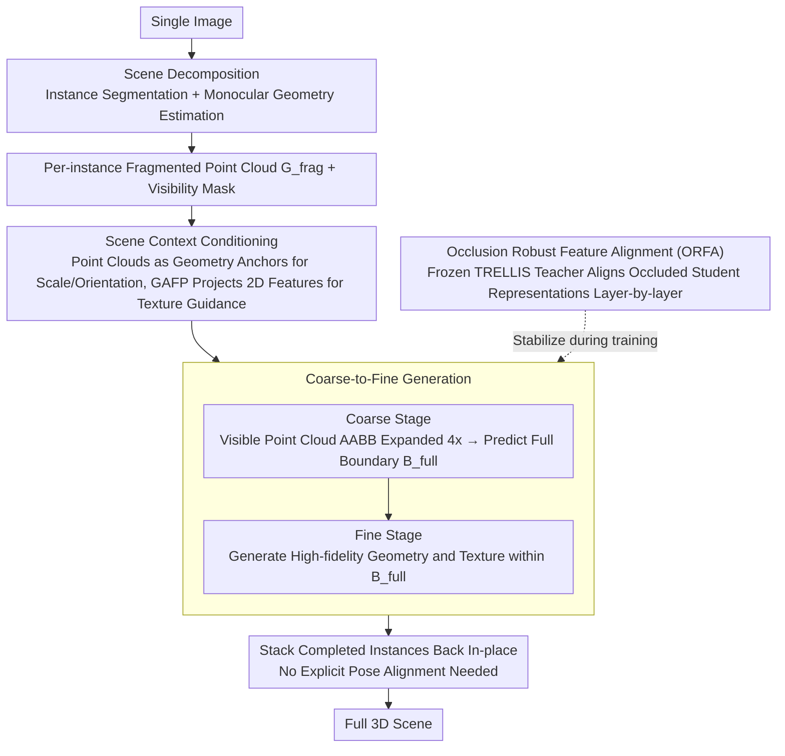

# 3D-Fixer: Coarse-to-Fine In-place Completion for 3D Scenes from a Single Image

**Conference**: CVPR 2026  
**arXiv**: [2604.04406](https://arxiv.org/abs/2604.04406)  
**Code**: [Project Page](https://zx-yin.github.io/3dfixer) (Coming soon)  
**Area**: 3D Vision  
**Keywords**: Single-image 3D scene generation, in-place completion, coarse-to-fine completion, occlusion robustness, large-scale scene dataset

## TL;DR
A new "in-place completion" paradigm is proposed, extending pre-trained object-level generative priors to the scene level. It directly completes fragmented geometry at its original location without explicit pose alignment. Simultaneously, a large-scale scene dataset ARSG-110K is constructed, significantly outperforming baselines like MIDI and Gen3DSR.

## Background & Motivation
**Background**: Generating compositional 3D scenes from a single image is a core task in fields such as robotics and AR/VR.

**Limitations of Prior Work** (Two main technical routes):
   - **Feed-forward Generation** (e.g., MIDI, SceneGen): Efficient end-to-end but poor generalization, and multi-instance attention complexity grows quadratically with the number of objects.
   - **Divide-and-Conquer** (e.g., Gen3DSR): Generates/retrieves individual objects then optimizes pose alignment—good generalization but the optimization process is time-consuming and prone to cumulative errors.

**Key Challenge**: How to maintain generalization while avoiding time-consuming pose alignment?

**Key Insight**: Geometry estimation models can accurately recover the 3D geometry of visible parts, which contains both spatial layout and the visible portions of various instances. Therefore, invisible parts can be completed directly "in-place" without needing to generate and then align.

**Core Idea**: Instead of "generation + alignment," perform "in-place completion"—using fragmented geometry as spatial anchors to complete full 3D assets in-place via object-level generative priors.

## Method

### Overall Architecture
The problem 3D-Fixer addresses is recovering a 3D scene composed of multiple complete objects from a single image without following the traditional path of "generating objects individually and then optimizing poses to assemble them." Its core observation is that existing geometry estimation models can accurately recover the visible parts from the image as 3D point clouds. Although incomplete (missing occluded parts), these point clouds naturally carry the correct spatial layout, scale, and orientation. Consequently, the pipeline follows these steps: scene decomposition of a single image (instance segmentation + monocular geometry estimation) yields fragmented point clouds for each instance; then per-instance "in-place completion" uses fragmented point clouds as spatial anchors to grow the missing parts via object-level generative priors. Completion proceeds in two steps (coarse-to-fine): first determining boundaries, then filling geometry and texture. Finally, completed instances are stacked back to their original positions to obtain the full scene, requiring no explicit pose alignment throughout the process.

### Key Designs

**1. Scene Context Conditioning: Using fragmented 3D observations directly as generation conditions to eliminate scale and orientation ambiguity inherent in 2D inputs.**

Object-level generative models originally only look at a 2D image and cannot determine how large an object is or which direction it faces in a scene, often leading to drifting results. 3D-Fixer feeds the fragmented point cloud $G_{\text{frag}}$ recovered by geometry estimation, along with its visibility mask, as 3D spatial anchors—the point clouds themselves encode true scale and orientation. To handle geometric distortions from varying levels of incompleteness, geometry conditions use self-attention with depth-ratio embeddings for local structures and cross-attention of global features for context. Textures use a dedicated path called GAFP (Geometry-Aligned Feature Projection): high-resolution 2D image features from MoGe v2 are projected back based on the 3D voxel coordinates of the visible point clouds, establishing precise correspondence between pixels and voxels, then injected into DiT blocks layer-by-layer to guide texture generation. This ensures geometry controls scale/orientation while texture controls appearance details.

**2. Coarse-to-Fine Generation: Predicting the full boundary within a conservative bounding box first, then filling high-fidelity geometry, decoupling "how big the object is" from "what the object looks like."**

Boundary ambiguity is most difficult in heavily occluded scenes—seeing only the back of a chair makes it impossible to know how far it extends, as the visible part might be tiny. 3D-Fixer splits this into two steps: the coarse stage calculates the Axis-Aligned Bounding Box (AABB) of the visible point cloud and expands it 4x to obtain a loose $B_{\text{exp}}$ that surely contains the full object, then predicts the true full boundary $B_{\text{full}}$ within it; the fine stage then generates high-resolution geometry and texture within this tightened boundary. Decoupling the range from the content ensures that even with heavy occlusion, the predicted size does not collapse.

**3. Occlusion Robust Feature Alignment (ORFA): Using an unoccluded teacher to pull occluded student representations back on track, mitigating the domain gap where "object-level priors have never seen occlusion."**

The object-level priors (based on TRELLIS) were trained on clean, unoccluded objects. When moved to scenes, the inputs are fragmented, causing significant training instability. ORFA builds a teacher-student pair: a frozen pre-trained TRELLIS acts as the teacher (fed clean full images), and a trainable scene branch acts as the student (fed real occluded inputs). Student representations are then aligned to the teacher layer-by-layer using cosine similarity as the alignment target:

$$\mathcal{L}_{\text{AL}} = -\mathbb{E}\Big[\frac{1}{N}\sum_{n=1}^{N} \text{sim}(\mathbf{h}_s, \mathbf{h})\Big]$$

where $\mathbf{h}_s$ and $\mathbf{h}$ are features from the student and teacher at the same layer. The teacher always sees what the object "should" look like, keeping the student's representation stable despite fragmented inputs.

### Mechanism: A Full Example

Suppose a scene contains a chair where only the back and half the seat are visible, while the lower part is blocked by a table. Scene decomposition extracts the chair, and geometry estimation provides its visible point cloud $G_{\text{frag}}$—only the top half, but with the correct scale and orientation. During completion, this fragment and mask act as geometric anchors; image features from MoGe v2 are projected as texture conditions. The coarse stage expands the AABB of the fragment 4x to $B_{\text{exp}}$, within which the model predicts the true full boundary $B_{\text{full}}$ (extending down to the legs). The fine stage grows the geometry of the legs and full seat within this boundary, while textures continue the wood/fabric patterns from visible parts. The chair stays in its original position/orientation throughout, settling in-place without needing manual alignment.

### Loss & Training
- Basic Loss: Flow Matching loss $L_{\text{FM}}$ to drive geometry and texture generation.
- Alignment Loss: $L_{\text{AL}}$, cosine similarity of intermediate teacher-student features (ORFA).
- Architecture: Dual-branch expansion based on TRELLIS—the frozen original branch retains object-level priors, while the trainable scene branch adapts to occluded inputs.

## Key Experimental Results

### Main Results

| Dataset | Metric | 3D-Fixer | MIDI | Gen3DSR | Gain (vs MIDI) |
|--------|------|------|------|---------|------|
| MIDI testset | CD_S ↓ | **0.069** | 0.080 | 0.123 | +13.8% |
| MIDI testset | FS_S ↑ | **78.67** | 50.19 | 40.07 | +56.8% |
| MIDI testset | CD_O ↓ | **0.032** | 0.103 | 0.157 | +68.9% |
| MIDI testset | FS_O ↑ | **94.39** | 53.58 | 38.11 | +76.2% |
| MIDI testset | Inference Time | **30s** | 40s | 9min | Faster |

### Ablation Study

| Configuration | Key Metrics | Description |
|------|---------|------|
| w/o ORFA | CD_O increases | Occlusion causes training instability |
| w/o Coarse-to-Fine | Boundary prediction failure | Difficulty handling heavy occlusion |
| w/o Geometry Cond. | Scale/Orientation ambiguity | Insufficient 2D conditions |
| w/o GAFP | Decreased texture quality | Lack of precise spatial correspondence |

### Key Findings
- Object-level CD dropped from 0.103 to 0.032 (69% reduction), showing "in-place completion" avoids cumulative alignment errors.
- F-Score rose from 53.58 to 94.39, achieving near-perfect geometric recovery.
- 30-second inference, 18x faster than Gen3DSR and faster than MIDI.
- Generalizable to complex scenes, real-world scenes, and outdoor environments.

## Highlights & Insights
- **Paradigm Innovation**: "In-place completion" cleverly uses visible parts from geometry estimation as spatial anchors, completely avoiding pose alignment as a source of error.
- **ARSG-110K**: 110K scenes, 180K+ assets, and 3 million annotated images, making it the largest scene-level dataset to date.
- **Coarse-to-Fine Decoupling**: Separating scale prediction and geometry generation is an elegant design for handling heavy occlusion.

## Limitations & Future Work
- Dependency on the quality of the geometry estimation model (MoGe v2); if estimation fails, the entire pipeline fails.
- Currently limited to rigid objects; deformable objects (e.g., clothes, humans) are not covered.
- ARSG-110K is synthetic, leaving a domain gap with real-world scenes.
- Occlusion relationship reasoning during multi-instance parallel completion may not be fine-grained enough.

## Related Work & Insights
- Compared to MIDI (multi-instance diffusion) and Gen3DSR (divide-and-conquer), 3D-Fixer finds a superior compromise.
- Progress in geometry foundation models (MoGe v2, UniDepth) makes the "in-place completion" paradigm feasible.
- The concept of "using partial observations to anchor generation" can be generalized to other generative tasks.

## Rating
- Novelty: ⭐⭐⭐⭐⭐ "In-place completion" paradigm is novel; ORFA strategy is ingenious.
- Experimental Thoroughness: ⭐⭐⭐⭐ Comprehensive comparisons across datasets plus full ablation.
- Writing Quality: ⭐⭐⭐⭐ Clear structure and precise problem definition.
- Value: ⭐⭐⭐⭐⭐ Dual contribution of paradigm and dataset with high practical utility.

<!-- RELATED:START -->

## Related Papers

- [\[CVPR 2026\] HumanNOVA: Photorealistic, Universal and Rapid 3D Human Avatar Modeling from a Single Image](humannova_photorealistic_universal_and_rapid_3d_human_avatar_modeling_from_a_sin.md)
- [\[CVPR 2026\] CrowdGaussian: Reconstructing High-Fidelity 3D Gaussians for Human Crowd from a Single Image](crowdgaussian_reconstructing_high-fidelity_3d_gaussians_for_human_crowd_from_a_s.md)
- [\[CVPR 2026\] Dehallu3D: Hallucination-Mitigated 3D Generation from a Single Image via Cyclic View Consistency Refinement](dehallu3d_hallucination-mitigated_3d_generation_from_a_single_image_via_cyclic_v.md)
- [\[CVPR 2026\] MatE: Material Extraction from Single-Image via Geometric Prior](mate_material_extraction_from_single-image_via_geometric_prior.md)
- [\[CVPR 2026\] FastEventDGS: Deformable Gaussian Splatting for Fast Dynamic Scenes from a Single Event Camera](fasteventdgs_deformable_gaussian_splatting_for_fast_dynamic_scenes_from_a_single.md)

<!-- RELATED:END -->
