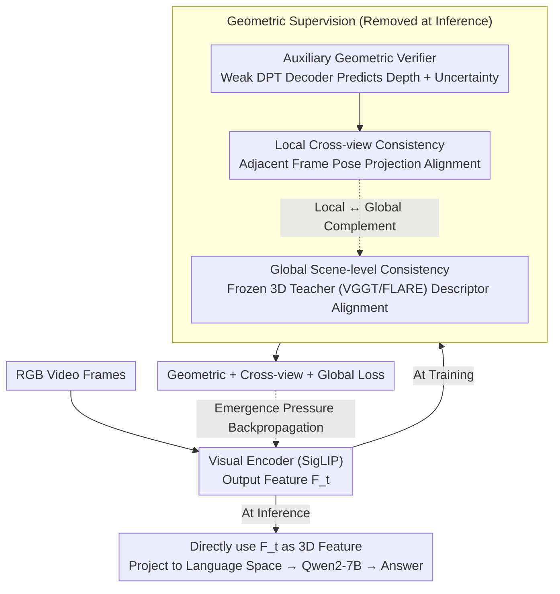

# 3D-IDE: 3D Implicit Depth Emergent

**Conference**: CVPR 2026  
**arXiv**: [2604.03296](https://arxiv.org/abs/2604.03296)  
**Code**: [GitHub](https://github.com/ChushanZhang/3D-IDE)  
**Area**: 3D Vision / Multimodal VLM  
**Keywords**: 3D Scene Understanding, Multimodal Large Language Model, Implicit Geometric Emergence, Depth Estimation, Zero Inference Latency

## TL;DR
The "Implicit Geometric Emergence Principle" (IGEP) is proposed. By utilizing a lightweight geometric verifier and a global 3D teacher for privileged supervision during training, the visual encoder develops 3D perception capabilities using only RGB video input. This achieves zero latency overhead during inference and outperforms comparable methods on several 3D scene understanding benchmarks.

## Background & Motivation
**Background**: Utilizing MLLMs for 3D scene understanding is a prominent research direction. Existing methods generally follow two technical routes to inject geometric awareness.

**Limitations of Prior Work (The Trilemma)**:
   - **Explicit 3D Coordinate Injection** (e.g., Video-3D LLM): Relies on 3D inputs such as depth maps and camera poses, requiring 3D sensors at inference time. Furthermore, coordinates undergo downsampling and voxelization, leading to "dual information loss."
   - **External 3D Encoders** (e.g., VID-LLM, VG-LLM): Introduce large-scale 3D foundation models (e.g., VGGT ~1B parameters), increasing inference latency and parameter counts. Additionally, the 2D and 3D encoders are trained under different objectives, causing feature space misalignment.

**Core Problem**: Can a sufficiently powerful 3D-aware representation be learned for inference using only RGB video?

**Key Insight**: Treat 3D perception as an "emergent property" of encoder features. By applying geometric supervision pressure during training, the encoder is forced to internalize 3D structures, eliminating the need for extra inputs during inference.

**Core Idea**: Weak Verifier + Strong Constraints = 3D Perception Emergent in a Shared Encoder.

## Method

### Overall Architecture
This paper addresses whether a visual encoder can "grow" 3D perception capabilities while observing only RGB video, thereby removing reliance on depth maps, camera poses, or external 3D encoders during inference. The approach treats 3D perception as an **emergent property** under training pressure. The inference path is extremely streamlined: RGB video frames are processed by a SigLIP visual encoder to obtain features $F_t$, which are directly used as 3D-aware features $F_t^{3D} \equiv F_t$ and projected into the language space for Qwen2-7B. All geometric supervision modules are attached only during training to impose constraints and are entirely removed during inference. The core challenge lies in how to "pressurize" the encoder during training, which is addressed by the following three designs.

### Key Designs

**1. Auxiliary Geometric Verifier: Forcing Internalization via a Deliberately Weak Decoder**

To enable the encoder to learn 3D, the direct approach would be attaching a powerful depth prediction head. However, this work does the opposite—it attaches a **lightweight, trained-from-scratch** DPT-style decoder to the visual tokens to predict pixel-wise depth maps $\hat{D}_t$ and uncertainty maps $\hat{\Sigma}_{D,t}$. The geometric loss constrains data fidelity, depth gradient consistency, and uncertainty regularization:

$$\ell_p = \|\hat{\Sigma}_{D,p} \odot (\hat{D}_p - D_p^{gt})\| + \|\hat{\Sigma}_{D,p} \odot (\nabla\hat{D}_p - \nabla D_p^{gt})\| - \alpha \log \hat{\Sigma}_{D,p}$$

The verifier is designed with low capacity based on the information bottleneck principle: if the verifier itself lacks the capacity to calculate accurate depth, the 3D information must be encoded into the shared features beforehand. Thus, the burden of "calculating depth" is pushed back onto the encoder, creating continuous emergence pressure. Experiments validate this counter-intuitive design—a weak verifier trained from scratch performs better than a pre-trained strong depth model because the latter handles the geometric tasks itself, allowing the encoder to bypass learning.

**2. Local Cross-view Consistency: Constraining Single-frame Depth via Neighboring Relationships**

Single-frame depth supervision only considers one image, which might result in geometric representations that fail across views. This method randomly samples adjacent frames $t'$ and uses known relative poses to project $\hat{D}_{t'}$ back to the viewpoint of frame $t$, requiring the projected depth to align with the current frame's prediction:

$$\mathcal{L}_{\text{cross-view}} = \frac{1}{|\Omega_{t' \to t}|} \sum_{p \in \Omega_{t' \to t}} \|\hat{D}_{t,p} - \hat{D}_{t' \to t, p}\|_1$$

This injects multi-view geometric constraints directly into the encoder features, forcing the learned depth to maintain viewpoint invariance rather than being frame-specific.

**3. Global Scene-level Consistency: Propagating Global Signals via a Frozen 3D Foundation Model**

Cross-view loss only covers sampled adjacent frame pairs, providing local and sparse constraints. To manage global geometric consistency across an entire video, a frozen 3D foundation model (VGGT/FLARE) is used as a teacher. The encoder's output descriptors are required to align with the teacher's global descriptors:

$$\mathcal{L}_{\text{global}} = 1 - \cos(f_a, f_b)$$

The teacher provides supervision only during training, diffusing scene-level consistency signals from local frame pairs to the entire sequence, complementing the local cross-view constraints.

### Loss & Training
$$\mathcal{L}_{\text{total}} = \mathcal{L}_{ce} + \mathcal{L}_{\text{geometry}} + \mathcal{L}_{\text{cross-view}} + \mathcal{L}_{\text{global}}$$
- Verifiers and 3D foundation models are removed during inference, resulting in zero extra latency.
- End-to-end fine-tuning of the SigLIP encoder with a Qwen2-7B language backbone.
- Training on 8× H100 GPUs with 32-frame sampling.

## Key Experimental Results

### Main Results

| Benchmark | Metric | 3D-IDE (RGB only) | Video-3D LLM* (RGB only) | Video-3D LLM (w/ 3D input) |
|------|------|------|----------|------|
| ScanRefer | Acc@0.25 | **60.9** | 53.7 | 58.1 |
| ScanRefer | Acc@0.5 | **54.5** | 47.8 | 51.7 |
| Multi3DRefer | F1@0.25 | **59.8** | 46.0 | 58.0 |
| Multi3DRefer | F1@0.5 | **54.9** | 42.4 | 52.7 |
| ScanQA | EM | 29.8 | 29.5 | 30.1 |
| SQA3D | EM | **59.2** | 58.6 | 58.6 |

*Note: 3D-IDE using only RGB for inference outperforms Video-3D LLM which uses explicit 3D inputs.*

### Ablation Study

| Configuration | ScanRefer Acc@0.25 | Multi3DRef F1@0.25 | Description |
|------|---------|---------|------|
| Baseline (No aux loss) | 53.7 | 46.0 | RGB-only floor |
| + Global Loss | 56.9 | 55.6 | +3.2/+9.6 Gain |
| + Global + Geo (Scratch) | 59.8 | 58.7 | Scratch verifier slightly beats pre-trained |
| + Global + Geo + Cross-view | **60.9** | **59.8** | All components are complementary |

### Key Findings
- RGB-only inference surpasses methods using GT 3D inputs: ScanRefer +2.8, Multi3DRef +1.8.
- Parameters reduced by 12.86%, and inference latency decreased by 55.28% (compared to VG-LLM-8B).
- Performance of Video-3D LLM collapses without 3D inputs (Scan2Cap drops from 83.8 to 31.5), proving that 3D inputs in existing methods act as "crutches."
- Weak Verifier (from scratch) $\approx$ Strong Verifier (pre-trained), validating the information bottleneck design.

## Highlights & Insights
- **Novel "Emergence" Perspective**: Treats 3D perception as an emergent property under training pressure rather than an explicit input, philosophically aligning with the "emergent abilities" of LLMs.
- **Sophisticated Information Bottleneck**: The weak verifier forces the encoder to undertake 3D reasoning rather than outsourcing it to specialized modules.
- **Zero Inference Overhead**: A significant practical advantage as deployment requires only a standard RGB video pipeline.
- **"Dual Information Loss" Analysis**: Deeply reveals the fundamental flaws of explicit coordinate injection.

## Limitations & Future Work
- Training still requires GT depth maps and camera poses, posing high data requirements.
- Loss weights for the verifier and global teacher require manual tuning.
- Performance on Scan2Cap is slightly lower than methods with explicit 3D input (-4.8 CIDEr).
- Currently validated only on indoor ScanNet scenes; outdoor generalization remains to be tested.

## Related Work & Insights
- Provides a clear comparison against explicit methods (Video-3D LLM, 3DRS) and dual-encoder methods (VID-LLM, VG-LLM).
- The "privileged information at training time" concept is generalizable: any costly but valuable signal can serve as a training constraint.
- The application of information bottleneck principles in 3D vision warrants further exploration.

## Rating
- Novelty: ⭐⭐⭐⭐⭐ The implicit emergence principle is a fundamental rethink.
- Experimental Thoroughness: ⭐⭐⭐⭐ Five benchmarks plus geometric analysis and complete ablations.
- Writing Quality: ⭐⭐⭐⭐⭐ Rigorous theoretical motivation and clear analysis of the trilemma.
- Value: ⭐⭐⭐⭐⭐ Zero-overhead 3D perception is highly significant for deployment.

<!-- RELATED:START -->

## Related Papers

- [\[CVPR 2026\] I-Scene: 3D Instance Models are Implicit Generalizable Spatial Learners](i-scene_3d_instance_models_are_implicit_generalizable_spatial_learners.md)
- [\[CVPR 2026\] IDESplat: Iterative Depth Probability Estimation for Generalizable 3D Gaussian Splatting](idesplat_iterative_depth_probability_estimation_for_generalizable_3d_gaussian_sp.md)
- [\[CVPR 2026\] Depth Any Panoramas: A Foundation Model for Panoramic Depth Estimation](depth_any_panoramas_a_foundation_model_for_panoramic_depth_estimation.md)
- [\[CVPR 2026\] MD2E: Modeling Depth-to-Edge Cues for Monocular Metric Depth Estimation](md2e_modeling_depth-to-edge_cues_for_monocular_metric_depth_estimation.md)
- [\[CVPR 2026\] Depth Hypothesis Guided Iterative Refinement for Event-Image Monocular Depth Estimation](depth_hypothesis_guided_iterative_refinement_for_event-image_monocular_depth_est.md)

<!-- RELATED:END -->
