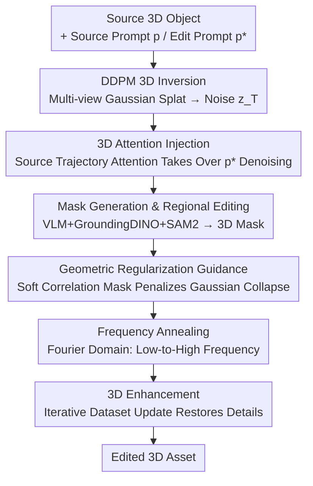

# 3D-LATTE: Latent Space 3D Editing from Textual Instructions

**Conference**: CVPR 2026  
**Paper**: [CVF Open Access](https://openaccess.thecvf.com/content/CVPR2026/html/Parelli_3D-LATTE_Latent_Space_3D_Editing_from_Textual_Instructions_CVPR_2026_paper.html)  
**Code**: Project Page https://mparelli.github.io/3d-latte (Open-source code not confirmed)  
**Area**: 3D Vision  
**Keywords**: Instruct-based 3D Editing, 3D Diffusion Models, Attention Injection, 3D Gaussian Splatting, Latent Space Editing

## TL;DR
3D-LATTE directly performs instruction-based 3D editing inside the **latent space of a native 3D diffusion model (DiffSplat)**. By inverting the source object to obtain noise and then denoising with the editing prompt, it **injects the 3D self/cross-attention maps** of the source object to preserve geometry and structure. Combined with geometric regularization, frequency annealing, and iterative refinement, it achieves substantial and precise geometry and appearance edits while maintaining multi-view consistency, outperforming prior SOTA baselines in quantitative benchmarks, GPTEval3D, and user studies.

## Background & Motivation

**Background**: Multi-view diffusion models can now generate high-quality 3D assets from text or images, but the quality of **instruct-based 3D editing** (given a 3D object and a natural language instruction, editing its geometry or appearance while preserving identity) lags significantly behind generation. Mainstream editing methods generally fall into three categories: ① distilling 2D diffusion priors (e.g., InstructPix2Pix) into 3D representations via SDS loss or iterative dataset updates (InstructNeRF2NeRF); ② editing multiple views synchronously using a multi-view diffusion prior, then consolidating them into 3D utilizing a feed-forward reconstruction model; ③ hybrid 2D-3D approaches, which fuse multi-view images into 3D representations at each denoising step.

**Limitations of Prior Work**: The common root cause for these methods is their **dependency on 2D supervision**. SDS-based methods utilizing 2D priors suffer from multi-view inconsistency, Janus (multi-face) artifacts, and mode-seeking, and are typically limited to appearance edits, failing to achieve large spatial or geometric deformations (e.g., turning a shovel into a flower). Feed-forward reconstruction or multi-view prior-based methods propagate minor inter-view inconsistencies into 3D, leading to blurriness and distortion. Hybrid 2D-3D methods still introduce Janus artifacts due to their reliance on 2D priors.

**Key Challenge**: Editing signals are inherently generated in 2D space, whereas the target is a globally consistent 3D object—there is a structural gap between 2D signals and 3D consistency. No matter how one manipulates the 2D space before lifting it to 3D, view inconsistency is inevitably introduced.

**Goal**: Without relying on any 2D/multi-view priors or SDS losses, perform semantically precise and geometrically consistent editing directly in 3D, capable of changing both appearance and large shapes while preserving the identity of regions unmentioned by the text instructions.

**Key Insight**: Since the gap stems from "adding noise in 2D and then lifting it to 3D", one should **directly inject noise into the 3D representation**, operating with a native 3D diffusion prior (DiffSplat, whose latent space consists of pixel-aligned 3D Gaussians). The authors further draw inspiration from the role of attention maps in 2D editing, observing that **3D self/cross-attention maps naturally encode the layout, composition of the 3D scene, and the correspondence between Gaussians and text tokens**—precisely the lever needed to "preserve structure and modify semantics".

**Core Idea**: Use the 3D attention maps generated by the source prompt to "take over" the denoising process of the editing prompt (attention injection), driving semantic editing while locking the 3D structure of the source object in the native 3D latent space.

## Method

### Overall Architecture
Given a 3D object, a source prompt $p$ describing its original appearance, and a target editing prompt $p^*$, the goal is to align the object semantically with $p^*$ while preserving unmentioned regions and the original 3D identity. The proposed method is a **zero-shot framework** that operates entirely within the latent space of DiffSplat, extending the concept of "attention control" from 2D editing to 3D Gaussian Splatting (3DGS).

The pipeline is as follows: The source 3D object is first represented as a multi-view Gaussian splat grid $G=\{G_i\}_{i=1}^V$. An "editing-friendly" noise trajectory $z_T$ is obtained via DDPM inversion. Starting from $z_T$, denoising is executed using the editing prompt $p^*$. **At each step, 3D attention maps computed from the source prompt $p$ denoising trajectory are injected** to preserve structure while modifying semantics. To perform local editing, a VLM + segmentation model generates multi-view consistent masks to restrict the edited regions. To enhance 3D quality, geometric regularization guidance, frequency annealing, and an iterative 3D enhancement module are stacked.

### Key Designs

**1. 3D Attention Injection: Locking Geometry and Layout with Source Attention Maps**

This is the core of the paper, directly addressing the pain point where "editing destroys the source structure". At each denoising step of DiffSplat, the noisy Gaussian splat latent variables $\phi(z_t)\in\mathbb{R}^{V\times D\times H\times W}$ are projected into queries $Q$, and keys $K$ and values $V$ are sourced from the text prompt embeddings. Each element $W_{i,j}$ of the cross-attention map $W_G^{\text{cross}}$ represents the influence of the $j$-th text token on the $i$-th Gaussian latent, forming a **token↔3D Gaussian correspondence field** that enables precise 3D localization. The self-attention map $W_G^{\text{self}}$ characterizes spatial/semantic relationships among all 3D Gaussian latents.

The authors run one denoising trajectory $z_{t-1}=D_\theta(z_t,t,p)$ for the source prompt $p$, and another $z^*_{t-1}=D_\theta(z^*_t,t,p^*)$ for the editing prompt $p^*$. Along the $p^*$ trajectory, **the attention maps of the source trajectory are used to overwrite the editing trajectory's own attention maps** ($W^{*}_{G_t}\leftarrow \hat{W}_{G_t}$). Cross-attention injection is applied only to tokens **shared between the two prompts** and lasts until timestep $\tau_{\text{cross}}$:

$$\hat{W}_{G_t}^{\text{cross}}=\begin{cases}((W^{*}_{G_t})^{\text{cross}})_{i,j}, & \text{若 } CT(j)=\varnothing \text{ 或 } t<\tau_{\text{cross}}\\ (W_{G_t}^{\text{cross}})_{i,CT(j)}, & \text{否则}\end{cases}$$

where $CT$ is an alignment function that maps token indices of $p^*$ back to their corresponding indices in $p$, returning an empty set if no match is found (allowing new concepts in the editing prompt to emerge freely). Self-attention maps are injected early in the denoising process ($t\geq\tau_{\text{self}}$) and released later:

$$\hat{W}_{G_t}^{\text{self}}=\begin{cases}(W^{*}_{G_t})^{\text{self}}, & t<\tau_{\text{self}}\\ W_{G_t}^{\text{self}}, & \text{否则}\end{cases}$$

This is effective because attention maps encode **structural information** such as layout, composition, and symmetry. Injecting source self-attention early on fixes the spatial arrangement of components before allowing semantic details to grow, thus enabling editing without structurally destabilizing the object. The authors also demonstrate spectral decomposition on the 3D self-attention maps (colored using the first three eigenvectors of the normalized Laplacian), which naturally groups Gaussians into semantic parts, verifying that self-attention indeed carries 3D scene composition.

**2. Mask Generation and Regional Editing: Lifting 2D Multi-view Masks to 3D Masks for Localized Editing**

To edit only the intended regions, the authors first prompt a VLM (GPT-4o) with the "source prompt + editing instruction + a rendered front view" to determine which part of the object is affected (e.g., "teddy bear's shirt"). Next, GroundingDINO is used on multi-view rendered images to produce bounding boxes for these parts, which are then tracked and refined into multi-view consistent 2D masks by SAM2. Since DiffSplat's latent space consists of **pixel-aligned** 3D Gaussians, these 2D masks naturally approximate a 3D segmentation of the corresponding Gaussians.

To allow for flexible geometric changes (as the edited region might grow structures that did not exist initially), an additional cross-attention map $W_{G_t}^{r^*}$, averaged over all timesteps, is computed for the "edit region token $r^*$" (such as "tutu" in the example). This is thresholded to obtain an attention-derived dilated mask. The final 3D editing region $M$ is the union of the SAM2 lifted mask and this attention-derived mask. During editing, $M$ is used to blend the source and editing latent variables:

$$\hat{z}_{t-1}=(1-M)\odot z_{t-1}+M\odot z^*_{t-1}$$

where $\odot$ denotes element-wise multiplication. In this way, unedited regions strictly follow the source trajectory, while editing regions follow the editing trajectory, ensuring localized control. This method also supports user-defined masks.

**3. Geometric Regularization Guidance: Preventing Gaussian Translucency and Collapse in Edited Regions via Soft Correlation Masks**

Attention injection introduces uncertainty in the editing region, which can cause artifacts such as translucent Gaussians and premature collapse. The authors introduce a **soft geometric classifier guidance**: for each Gaussian $i$, a soft mask $R^i_t\in[0,1]$ is computed to measure its relevance to the current editing. This relevance is derived from the L1 difference between the predicted noises under the editing and source prompts, $D_i=\lVert\epsilon_\theta(z_t,t,p^*)-\epsilon_\theta(z_t,t,p)\rVert_1$, which is then globally min-max normalized across all Gaussians. A larger difference indicates that the Gaussian is more correlated with the edit. Since the "existence" of Gaussians is determined by opacity $o$ and covariance $\Sigma$, the regularization loss is defined as:

$$L_{\text{geo}}=\lambda_o\sum_i R^i_t\cdot\exp(-\gamma_o\cdot o_i)+\lambda_\Sigma\sum_i R^i_t\cdot\exp(-\gamma_\Sigma\cdot\mathrm{Tr}(\Sigma_i))$$

This penalizes Gaussians with low opacity or insufficient spatial support, with larger penalties applied to more relevant Gaussians. This term is added to the denoising process as a guidance signal: $z_{t-1}=\hat{z}_{t-1}-s\cdot\nabla_{z_t}L_{\text{geo}}(z_t)$, where $s$ is the guidance scale. The intuition is to "prevent things that should appear from disappearing", preserving the geometric robustness of the edited region.

**4. Frequency Annealing + 3D Enhancement: Capturing Structure first, Enhancing Detail, and Iteratively Raising Resolution**

The injection of source attention can interfere with the model's denoising capability, sometimes causing it to excessively retain high-frequency textures of the source object (e.g., logos, prints), which degrades into surface noise. Drawing on the observation that "low frequencies govern structure while high frequencies govern details", the authors perform **frequency-domain spectral modulation** on the U-Net skip-connection feature maps at each denoising step:

$$F(h_{l,t})=\text{FFT}(h_{l,t}),\quad F'(h_{l,t})=F(h_{l,t})\odot\beta_{l,t},\quad h'_{l,t}=\text{IFFT}(F'(h_{l,t}))$$

The modulation mask $\beta_{l,t}(r)$ is segmented by radius $r$: in the early stages ($t>\tau$ and $r<r_{\text{thresh}}$), low frequencies are amplified using $s_l$; in the late stages ($t\le\tau$ and $r\ge r_{\text{thresh}}$), high frequencies are amplified using $s_h$, with remaining elements set to 1. This preserves the global structure of the source in the early phase and introduces fine details in the later phase, preventing over-retention of high frequencies that causes over-smoothing or noisy textures.

Finally, **3D Enhancement**: To tackle the degradation of details when rendering at high resolutions due to training on low-resolution data, the authors adapt the "Iterative Dataset Update" from instructing to enhancement purposes. The process iteratively runs: ① rendering high-resolution views from the edited 3DGS, ② feeding noisy views to a 2D diffusion backbone (ControlNet-Tile, specifically for super-resolution) for enhancement, and ③ re-optimizing the 3DGS using the enhanced images. The enhanced image is blended as $I_{\text{blend}}=M\odot I_e+(1-M)\odot I_{\text{src}}$, ensuring that it only affects the edited region and gradually converges to a globally consistent, high-fidelity 3D representation.

### Loss & Training
The proposed method is a **zero-shot, test-time** editing framework with no training required—all editing is performed using pre-trained DiffSplat (3D diffusion backbone) + ControlNet-Tile (2D enhancement backbone) + GPT-4o/GroundingDINO/SAM2 (mask generation). The only "loss" is the geometric regularization term $L_{\text{geo}}$ (Eq. 5–6) injected as classifier guidance during denoising, which is not used for training parameters but for guiding latent variable updates via its gradient. Key hyperparameters include attention injection cutoff timesteps $\tau_{\text{cross}}/\tau_{\text{self}}$, geometric regularization parameters $\lambda_o,\lambda_\Sigma,\gamma_o,\gamma_\Sigma,s$, and frequency annealing parameters $\tau,r_{\text{thresh}},s_l,s_h$.

## Key Experimental Results

### Benchmarks & Protocols
The authors built a custom benchmark containing 25 diverse 3D assets from Objaverse and Google Scanned Objects (GSO), each paired with various editing instructions, totaling 100 samples. The primary baselines include Vox-E (voxel + SDS), MVEdit (hybrid 2D-3D), GaussCTRL (depth-guided 2D updates), and Edit360 (dense view synthesis); InstructGS2GS and PDS are also compared. Metrics: CLIP-Dir (semantic alignment with the edit direction, higher is better), CLIP-Diff-No-Edit (preservation of unedited regions, lower is better), and CLIP-Dir-Con (cross-view consistency of the edit, higher is better), supplemented by GPTEval3D (GPT-4V evaluation) and a 57-subject user study.

### Main Results

| Method | CLIP-Dir ↑ | CLIP-Diff-No-Edit ↓ | CLIP-Dir-Con ↑ |
|------|-----------|---------------------|----------------|
| MVEdit | 0.121 | 0.077 | 0.67 |
| Vox-E | 0.129 | 0.054 | 0.68 |
| GaussCTRL | 0.076 | **0.035** | 0.61 |
| Edit360 | 0.149 | 0.045 | 0.59 |
| PDS | 0.051 | 0.094 | 0.55 |
| InstructGS2GS | 0.069 | 0.082 | 0.64 |
| **3D-LATTE (Ours)** | **0.178** | 0.039 | **0.77** |

Ours ranks first in both CLIP-Dir (semantic alignment) and CLIP-Dir-Con (cross-view consistency), achieving an optimal balance between editing strength and shape preservation. Although GaussCTRL exhibits a lower Diff-No-Edit (0.035), the authors point out that this is because it **often fails to make any edits to the object**—as reflected by its significantly lower CLIP-Dir (0.076), representing a false advantage of "no change, hence no edit." ⚠️ This caveat is subject to the original text.

### GPTEval3D Win Rates & User Study

| Baseline | Prompt Alignment ↑ | 3D Plausibility ↑ | Texture Detail ↑ |
|----------|--------------|-------------|-----------|
| vs MVEdit | 87% | 71% | 70% |
| vs Vox-E | 78% | 81% | 78% |
| vs GaussCTRL | 94% | 83% | 81% |
| vs Edit360 | 67% | 90% | 72% |

The numbers in the table represent the win rates of the proposed method against the respective baselines under GPT-4V evaluation, exceeding 50% across all three criteria for all baselines (and significantly so in most cases). In the user study (57 participants), the proposed method secured 83.2% of the votes for **instruction fidelity** (compared to GaussCtrl 4.1% / MVEdit 8.2% / Vox-E 4.5%) and 74.0% for **visual quality** (compared to GaussCtrl 17.7% / MVEdit 5.6% / Vox-E 2.6%), leading by a large margin.

### Ablation Study

| Configuration | Phenomenon | Explanation |
|------|------|------|
| Full model | High-fidelity, geometrically consistent, sharp details | Complete pipeline |
| w/o 3D Enhancement | Blurry details, soft textures | Enhancement module is responsible for restoring details and sharpening textures (e.g., architectural details become clearer) |
| w/o Geometric Regularization | Edited region becomes partially transparent or disappears, geometric degradation | Regularization prevents Gaussian collapse, preserving the geometry of the edited region |
| w/o Frequency Annealing | Excessive retention of source high-frequency features (e.g., logos/prints) -> noisy textures | Annealing suppresses over-retention of source high frequencies |

Ablations are qualitatively demonstrated (Fig. 8, Fig. 9). ⚠️ Since the original ablation study is primarily qualitative and does not provide numerical drops, no specific percentage degradation is listed here, in accordance with the original paper.

### Key Findings
- **Attention injection is the master switch for "structure preservation and semantic modification"**: It enables the method to drive editing while locking down the layout in the native 3D latent space, which is the root cause for high performance in both CLIP-Dir and CLIP-Dir-Con.
- **Geometric regularization addresses degradation unique to 3DGS**—namely, Gaussian translucency and collapse in the edited region. This failure mode does not exist in 2D editing and is specific to the 3D Gaussian representation.
- **GaussCTRL's low Diff-No-Edit is an illusion**: It frequently fails to execute edits, reminding readers that "preservation metrics" must be evaluated in tandem with "editing strength metrics", as looking at preservation alone can easily reward a model that simply does not edit.

## Highlights & Insights
- **Shifting the editing battlefield from 2D to native 3D latent space**: This bypasses all the chronic issues of 2D/multi-view priors and SDS (such as Janus, multi-view inconsistency, and inability to change geometry). This is the key "Aha!" moment of the paper—since the root cause is in 2D, the operation should not be done in 2D.
- **3D attention maps serve as both allocators and structural anchors**: Cross-attention maps provide a token↔Gaussian correspondence field for precise 3D localization, while spectral decomposition of self-attention maps automatically clusters Gaussians into semantic parts. A single set of attention maps simultaneously serves "where to edit" and "how to preserve structure".
- **Pixel-aligned latent space enables free 2D-to-3D mask lifting**: The pixel-aligned Gaussians in DiffSplat allow the 2D multi-view masks from SAM2 to naturally approximate 3D segmentations. This bypasses the difficult problem of explicit 3D segmentation and can be extended to other localized editing tasks with pixel-aligned 3D representations.
- **The frequency annealing trick is highly transferable**: Using frequency-domain segmented modulation to achieve "preserving structure early and adding detail late" is a valuable technique for any generation/editing task that suffers from over-retention of high-frequency source data.

## Limitations & Future Work
- **Heavy dependence on external large model pipelines**: Mask generation relies on GPT-4o + GroundingDINO + SAM2. VLM misjudging the edit region will directly pollute the localized edit; this pipeline also prevents the method from being fully "end-to-end 3D".
- **Capped by the capacity limits of the 3D diffusion backbone**: DiffSplat is trained on low-resolution/flat data, and fine geometry relies on the 2D iterative enhancement of ControlNet-Tile. This essentially introduces a 2D enhancement backbone, creating a subtle tension with the initial goal of "fully independent of 2D" (⚠️ this is the reviewer's interpretation; please refer to the original paper for their exact arguments).
- **Evaluation leans heavily on proxy metrics**: Quantitative evaluation relies primarily on CLIP variants, GPT-4V, and user preferences, lacking hard metrics for geometric accuracy. Ablations are entirely qualitative, making it hard to quantify the exact contribution of each component.
- **Limited benchmark scale**: With only 25 assets and 100 samples, there is room for improvement in coverage and statistical significance.

## Related Work & Insights
- **vs InstructNeRF2NeRF / Iterative Dataset Update family**: These methods edit by repeatedly updating rendered views via 2D InstructPix2Pix, leading to multi-view inconsistencies during large edits. The proposed method utilizes "iterative dataset update" solely for 3D enhancement, while the editing itself is performed in the 3D latent space, avoiding inconsistencies from 2D edits.
- **vs SDS / PDS family (Vox-E, PDS)**: They distill 2D prior gradients into 3D using score distillation, inheriting Janus and mode-seeking issues. This work does not use any SDS loss and directly performs noise injection and denoising within the 3D diffusion framework.
- **vs GaussCTRL / DGE (Multi-view consistent 2D updates)**: GaussCTRL relies on depth-guided 2D updates + cross-view alignment, where depth guidance restricts large shape changes. The proposed method operates in the 3D latent space, enabling drastic geometric changes such as transforming a shovel into a flower.
- **vs SHAP-Editor (Hybrid 2D-3D feed-forward editors)**: It learns a feed-forward editor in the Shap-E latent space, requiring retraining for each set of edits and being restricted by Shap-E's 2D priors. The proposed method is zero-shot, generalizable across categories, and offers faster inference with higher quality.
- **vs MVEdit / Edit360 (Hybrid 2D-3D / Trajectory Alignment)**: They fuse images or align camera trajectories in multi-view diffusion, which can still introduce multi-view inconsistencies. The proposed method is consistent in 3D throughout.

## Rating
- Novelty: ⭐⭐⭐⭐⭐ Transitioning instruct-based 3D editing entirely to the native 3D diffusion latent space combined with 3D attention injection represents a paradigm shift away from 2D prior dependency.
- Experimental Thoroughness: ⭐⭐⭐⭐ Quantitative results, GPTEval3D, and user studies are triple-checked and lead across the board. However, the ablations are mostly qualitative, the benchmark is relatively small, and hard geometric metrics are lacking.
- Writing Quality: ⭐⭐⭐⭐⭐ The derivation of motivations is clear, the "why" behind each method component is well-explained, and the formulations and illustrations complement each other well.
- Value: ⭐⭐⭐⭐ Provides a reliable pipeline for 3D editing independent of 2D priors, holding direct value for AR/VR and design applications, though limited by dependencies on external large models and 3D backbones.

<!-- RELATED:START -->

## Related Papers

- [\[CVPR 2026\] AnchorFlow: Training-Free 3D Editing via Latent Anchor-Aligned Flows](anchorflow_training-free_3d_editing_via_latent_anchor-aligned_flows.md)
- [\[CVPR 2026\] MatLat: Material Latent Space for PBR Texture Generation](matlat_material_latent_space_for_pbr_texture_generation.md)
- [\[CVPR 2026\] GOR-IS: 3D Gaussian Object Removal In the Intrinsic Space](gor-is_3d_gaussian_object_removal_in_the_intrinsic_space.md)
- [\[CVPR 2026\] ObjectMorpher: 3D-Aware Image Editing via Deformable 3DGS](objectmorpher_3d-aware_image_editing_via_deformable_3dgs.md)
- [\[CVPR 2026\] MLLMSplat: A 2D MLLM-Powered Framework for 3D Gaussian Splatting Understanding, Generation, and Editing](mllmsplat_a_2d_mllm-powered_framework_for_3d_gaussian_splatting_understanding_ge.md)

<!-- RELATED:END -->
