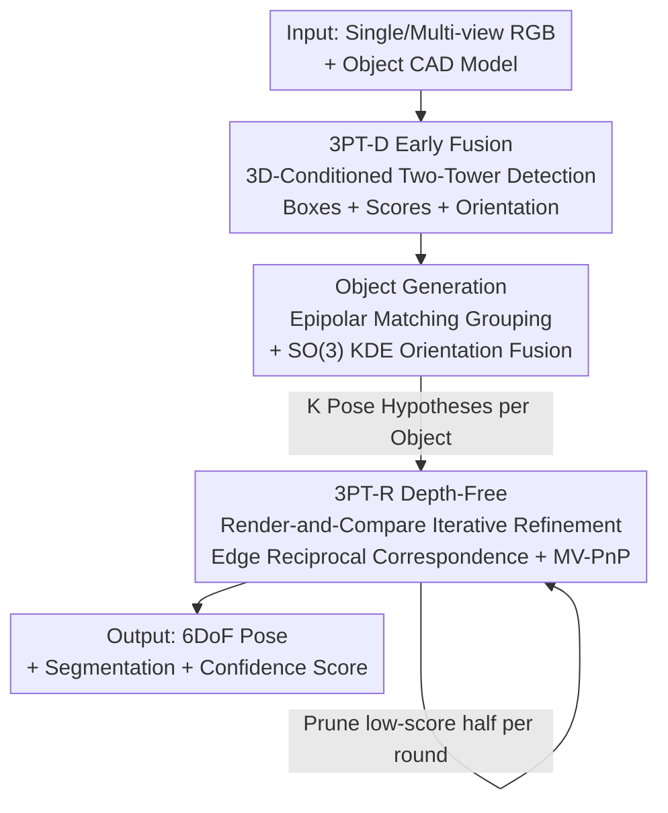

# 3D-Object Perception Transformer (3PT)

**Conference**: CVPR 2026  
**Paper**: [CVF Open Access](https://openaccess.thecvf.com/content/CVPR2026/html/Kalra_3D-Object_Perception_Transformer_3PT_CVPR_2026_paper.html)  
**Code**: None (Project page https://www.intrinsic.ai/publications/3pt-cvpr2026)  
**Area**: 3D Vision  
**Keywords**: Zero-shot 6DoF Pose Estimation, 3D Object Detection, Multi-view RGB, Early-fusion Detection, Industrial Robot Grasping  

## TL;DR
3PT replaces the existing zero-shot 3D object perception pipelines—often characterized by "assembled frozen foundation models + depth dependency"—with a unified, end-to-end trained Transformer framework (detection + object grouping + iterative refinement) directly conditioned on CAD models. Relying solely on multi-view RGB, it significantly outperforms SOTA in detection and 6DoF pose on BOP benchmarks (with a relative improvement of 56.5% in AP-mm for industrial datasets), securing 7 first-place rankings across 11 tracks in the BOP Challenge 2025.

## Background & Motivation
**Background**: Zero-shot 3D object perception (detecting, segmenting, and estimating the 6DoF pose of a previously unseen object given its 3D model) is a core capability for AR, logistics, and industrial automation. Current mainstream approaches utilize a "propose-and-match" two-stage pipeline: generic segmenters/detectors like FastSAM or GroundingDINO generate class-agnostic candidates, followed by matching DINOv2 features with object template renderings for classification. The pose estimation follows an Initialize→Refine→Score sequence and relies heavily on depth maps.

**Limitations of Prior Work**: This pipeline suffers from two fundamental issues. First, the detection stage relies entirely on **frozen foundation models trained for disparate tasks** (SAM, GroundingDINO, DINOv2). These models perform matching based on "appearance similarity" rather than true 3D geometric understanding, leading to unreliable predictions when test objects deviate from the training distribution (e.g., models pre-trained on web images encountering industrial metal parts). To suppress noise, SOTA methods stack **multi-model ensembles and multi-stage pipelines**, but these rigid interfaces and the lack of task-specific fine-tuning limit generalization—so much so that "per-object trained models" have long outperformed "zero-shot pipelines assembled from frozen models." Second, pose refinement **depends on depth data**, which is typically estimated from multi-view correspondences; occlusion, glare, and reflective surfaces introduce errors that propagate directly to the final pose.

**Key Challenge**: Current methods decouple "detection, matching, and pose refinement" into isolated modules using heuristics or frozen models, meaning no single component is specifically trained for "3D-model-conditioned object perception." Simultaneously, the reliance on depth—a "fragile processed evidence"—causes performance degradation in industrial scenarios.

**Goal**: To develop a unified framework specialized and **end-to-end trained for 3D object perception** that simultaneously addresses detection, segmentation, and 6DoF pose estimation **without requiring depth input**.

**Key Insight**: The authors propose an "early-fusion" hypothesis—rather than encoding the object and image separately for "late-fusion" similarity matching, it is more effective to inject 3D model conditioning into the image encoder during detection, allowing the model to **jointly learn object representation and localization**. Just as training text-conditioned detectors (like OwL-ViT) requires massive vocabulary exposure, training a 3D-model-conditioned detector requires similar scale—thus, the model is trained on approximately 1 billion image-rendering pairs with 110,000 unique CAD models.

**Core Idea**: Replace "CAD-conditioned detection / multi-view pose fusion / depth-free iterative refinement" with **natively large-scale trained Transformers**, using early-fusion instead of late-fusion matching and multi-view RGB instead of depth.

## Method

### Overall Architecture
3PT decomposes 3D object perception into three **serial stages**: ① **Detection Stage (3PT-D)**—a two-tower ViT that takes single/multi-view RGB images and object CAD models as input, outputting 2D boxes, detection scores, and coarse orientation distributions for each object hypothesis; ② **Object Generation Stage**—grouping cross-view boxes by object identity, filtering outliers with epipolar matching, and fusing orientation hypotheses using Kernel Density Estimation (KDE) on $SO(3)$ to produce $K$ $SE(3)$ pose candidates per object; ③ **Refinement Stage (3PT-R)**—iteratively refining each candidate through "render-and-compare." Each round involves mutual reciprocal edge correspondence and multi-view PnP updates, while outputting segmentation masks and confidence scores to prune half of the hypotheses until converging to the optimal 6DoF pose. The entire pipeline operates solely on calibrated multi-view RGB (or single-view) without depth.

### Key Designs

**1. 3PT-D Early Fusion: Injecting CAD conditions directly into the image encoder**

To address the limitation where frozen models rely on appearance and lack 3D geometric understanding, 3PT-D utilizes a two-tower ViT for native 3D-conditioned detection. The first tower (Object Encoder) renders the CAD model into two sets of embeddings: **Prior Embeddings (conditioning vectors)** from 12 predefined orientations and **Query Embeddings (orientation templates)** from $N_t=5140$ renderings densely covering the rotation space. The second tower (Image Encoder) **concatenates the image tokens with Prior Embeddings** before passing them through the ViT (early fusion), allowing the ViT to transform image patches into "object-specific hypothesis embeddings." A regression head then decodes 2D boxes and scores. Orientation is determined by the cosine distance between the hypothesis embedding and cached Query Embeddings, with the detection score being the maximum similarity across all templates.

This differs from the old paradigm of separate encoding and late-fusion: early fusion allows the model to **jointly** learn object representation and localization. The authors demonstrate that scale is critical—expanding the CAD vocabulary from 35k to 110k yielded a 5.1 AP improvement, eventually outperforming MUSE by 23.6 AP on BOP-Industrial.

**2. Object Generation: Robust candidates via epipolar matching and SO(3) KDE**

Orientation hypotheses from a single view can be noisy due to visual ambiguity. To aggregate multi-view hypotheses into reliable $SE(3)$ candidates, **epipolar matching** is used to transition from 2D detections to 3D hypotheses. Object positions are triangulated along rays passing through detection centers across views; objects are retained only if successfully matched in $v \ge 3$ views to filter outliers. For $vN_t$ orientation proposals of a single object, the authors model a continuous distribution on the rotation group $SO(3)$ using **Kernel Density Estimation (KDE)** with isotropic von Mises-Fisher kernels. This KDE distribution re-weights proposal scores, and the top $K$ scoring poses with minimum angular separation are selected as $SE(3)$ hypotheses.

**3. 3PT-R Depth-Free Iterative Refinement: Edge reciprocal correspondence and MV-PnP**

To circumvent depth dependency, 3PT-R frames refinement as an **RGB-only iterative render-and-compare loop**. Each round consists of: (1) Forward pass—generating "real-rendered" pairs for the current pose to obtain scores, masks, and feature maps $F$ (real) and $Z$ (rendered); (2) **Reciprocal Matching**—finding mutual nearest neighbors in feature space, **restricted to edges of the rendered image** to reduce computation; (3) **Pose Update**—obtaining sparse 2D-3D correspondences (as rendered pixel 3D positions are known) and solving via **Multi-view PnP (MV-PnP)**; (4) **Hypothesis Selection**—predicting a confidence score for each hypothesis and **pruning the bottom 50%** each round. 

Architecturally, every real view (query) performs cross-attention with $K$ rendered embeddings (key/value). A DPT decoder outputs per-pixel descriptors and masks, while DINOv2 register tokens predict the classification score for each hypothesis.

### Loss & Training
Both networks are trained on 900,000 Blender synthetic images (using 100k+ meshes, ~110 instances per image, ~1 billion unique instances).

- **3PT-D**: **Contrastive training** using sigmoid focal cross-entropy to align hypothesis embeddings with orientation templates. Box regression uses L1 + GIoU. A **Soft-Scaled Matching Loss** is introduced to scale down penalties for "near-miss" hypotheses based on box IoU, allowing the model to focus on true hard negatives. **Dynamic pan-and-scan** is used to provide scale priors by randomly cropping and scaling targets during training.
- **3PT-R**: Trained on synthetic data with GT poses. Three losses: **Matching loss** $L_m(\theta \mid P)$ (encouraging high similarity for GT correspondences), **Classification loss** (training the scorer via softmax cross-entropy on 5 jittered poses), and **Segmentation loss** (standard pixel-wise BCE).

## Key Experimental Results

Evaluations across 13 BOP datasets focus on **BOP-H3** (AR: no depth, fisheye, occlusion) and **BOP-Industrial** (Robotics: clutter, metallic reflections). Metrics used are **AP / AP-mm**.

### Main Results

2D Detection AP (Averages from three major BOP suites):

| Method | BOP-H3 Avg | BOP-Industrial Avg | BOP-Classic Avg |
|------|-----------|--------------------|-----------------|
| CNOS | 30.3 | 26.5 | 42.8 |
| SAM-6D | – | 33.6 | 47.1 |
| MUSE | 41.8 | 34.3 | 53.3 |
| **3PT-D** | **55.1** | **57.5 (IPD 63.4)** | **52.8** |
| ∆ vs. Next Best | **+13.3** | **+23.6** | +4.6 (YCB-V −1.2) |

6DoF Pose AP (Single-view RGB) and Industrial AP-mm:

| Task / Data | Prev. SOTA | Ours 3PT (D+R) | Gain |
|------------|-----------|----------------|------|
| Single-view RGB Pose BOP-H3 Avg | Co-Op 46.4 | **58.7** | **+12.3** |
| Single-view RGB Pose BOP-Classic Avg | Co-Op 60.6 | **66.0** | +5.4 |
| Industrial AP-mm Avg (Zero-shot) | FreeZeV2.2 51.5 (RGB-D) | **80.6 (MV-RGB only)** | **+29.1** |
| Industrial AP-mm vs. Non-zero-shot | FRTPose 68.3 (RGB-D) | **80.6** | +12.3 |

Highlights: 3PT using only RGB outperforms all zero-shot RGB-D methods and even non-zero-shot systems like FRTPose that use high-end depth sensors.

### Ablation Study

Component Attribution (Component added to baseline):

| Configuration | Key Metric | Note |
|------|---------|------|
| MUSE (Detection, HANDAL AP) | 35.7 | Baseline |
| + class id / + scoring / + regression | 40.1 / 42.3 / 43.7 | Individual gains |
| 3PT-D Full | **53.6** | End-to-end > Piecewise (+17.9) |
| FRTPose (Industrial AP-mm) | 68.3 | Non-zero-shot baseline |
| + Ours RGB MV-Refinement | 78.3 | **+10.0 from this step alone** |
| 3PT Full (D+R) | 80.6 | Total +12.3 |

Scale Ablation:

| Variable | Key Metric | Note |
|------|---------|------|
| CAD Vocab 35k → 110k | Mean AP 49.7 → 54.8 | **Scale is key (+5.1)** |
| Hypotheses K=1 → K=8 | AP-mm 71.1 → 80.9 | Multi-hypothesis + scoring adds +9.8 |
| Known class O | 80.9 vs 80.6 | Only 0.3 difference; tiny class dependence |

### Key Findings
- **Detection initialization is the primary driver for single-view pose**: Replacing Co-Op with 3PT-D (K=1) alone adds +8.7 AP, far exceeding the +1.4 from just adding the refinement module.
- **Multi-view RGB refinement can eliminate depth dependency**: The millimetric precision of multi-view RGB refinement exceeds that of methods using high-end depth sensors.
- **Scale is the bottleneck for 3D-conditioned detection**: Expanding the CAD vocabulary is as vital as expanding the text vocabulary for Open-Vocabulary detection.

## Highlights & Insights
- **Early Fusion vs. Late Fusion**: Transitioning from "hard-matching in borrowed feature spaces" to "native joint learning" by prepending CAD tokens to image tokens.
- **vMF-KDE for SO(3)**: Treating multi-view orientation as a density estimation problem on the rotation group is a robust trick for handling rotational ambiguity.
- **Edge-only correspondence**: Matching only on rendered edges significantly reduces the computational overhead of sparse 2D-3D correspondence without sacrificing accuracy.

## Limitations & Future Work
- **Runtime Bottleneck**: Average of 30.5s on BOP-Industrial (H100), largely due to per-object forward passes in the detection tower.
- **Calibration & Multi-view requirements**: Requires calibrated extrinsic parameters and $v \ge 3$ views for robust grouping.
- **Scale priors**: Dependence on pan-and-scan requires running several passes ($S=3$) if the depth range is unknown.

## Related Work & Insights
- **vs. CNOS / MUSE**: 3PT-D utilizes native early-fusion training rather than "assembled frozen models," leading to a +23.6 AP gain on Industrial.
- **vs. FoundationPose / MatchU**: These rely on depth (Point Clouds/ICP). 3PT-R demonstrates that multi-view RGB can effectively replace depth sensors for millimetric precision.
- **vs. FRTPose**: 3PT (zero-shot) outperforms FRTPose (per-object fine-tuning) by 12.3 AP-mm, showcasing the power of unified end-to-end architecture.

## Rating
- Novelty: ⭐⭐⭐⭐⭐ 
- Experimental Thoroughness: ⭐⭐⭐⭐⭐ 
- Writing Quality: ⭐⭐⭐⭐ 
- Value: ⭐⭐⭐⭐⭐ 

<!-- RELATED:START -->

## Related Papers

- [\[CVPR 2026\] H²A²: Homogeneity-Aware and Heterogeneity-Aware Feature Perception for Unified Indoor 3D Object Detection](h2a2_homogeneity-aware_and_heterogeneity-aware_feature_perception_for_unified_in.md)
- [\[CVPR 2026\] PE3R: Perception-Efficient 3D Reconstruction](pe3r_perception-efficient_3d_reconstruction.md)
- [\[CVPR 2026\] UniPR: Unified Object-level Real-to-Sim Perception and Reconstruction from a Single Stereo Pair](unipr_unified_object-level_real-to-sim_perception_and_reconstruction_from_a_sing.md)
- [\[CVPR 2026\] ESAM++: Efficient Online 3D Perception on the Edge](esam_efficient_online_3d_perception_on_the_edge.md)
- [\[CVPR 2025\] SphereUFormer: A U-Shaped Transformer for Spherical 360 Perception](../../CVPR2025/3d_vision/sphereuformer_a_u-shaped_transformer_for_spherical_360_perception.md)

<!-- RELATED:END -->
