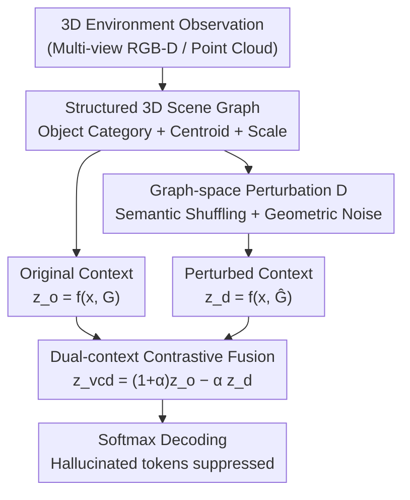

# 3D-VCD: Hallucination Mitigation in 3D-LLM Embodied Agents through Visual Contrastive Decoding

**Conference**: CVPR 2026  
**Paper**: [CVF Open Access](https://openaccess.thecvf.com/content/CVPR2026/html/Ogunleye_3D-VCD_Hallucination_Mitigation_in_3D-LLM_Embodied_Agents_through_Visual_Contrastive_CVPR_2026_paper.html)  
**Code**: https://plan-lab.github.io/3d-vcd (Project Page)  
**Area**: 3D Vision / Embodied AI / Hallucination Mitigation  
**Keywords**: 3D-LLM, Visual Contrastive Decoding, Scene Graph Perturbation, Object Hallucination, Inference-time Intervention

## TL;DR
3D-VCD is the first **inference-time** hallucination mitigation framework for 3D embodied agents. It applies semantic/geometric perturbations to object-centric 3D scene graphs to generate a "corrupted" negative sample context. By running the MLLM on both the original and perturbed graphs and using a contrastive decoding formula, it suppresses tokens that maintain "high probability even when the scene changes." This method requires no retraining, incurs nearly zero additional overhead, and significantly reduces over-affirmation and object hallucinations in 3D-POPE and HEAL.

## Background & Motivation
**Background**: MLLMs are increasingly utilized as the "reasoning kernels" for embodied agents. Combined with backbones such as 3D-LLM, 3D-VisTA, and LEO that inject scene graph, point cloud, or voxel features into language models, agents can answer spatial questions, perform planning, and act in indoor environments based on natural language instructions.

**Limitations of Prior Work**: These 3D-MLLMs still frequently generate **embodied grounding hallucinations**—producing answers that sound reasonable but contradict the actual 3D scene, such as affirming a non-existent object or misidentifying objects present. When visual evidence is weak, ambiguous, or occluded, the model degrades to "language priors," guessing answers based on training distributions. In embodied scenarios, this is particularly fatal: outputs directly drive downstream action selection and physical interaction, where a single hallucinated object can derail the entire task and propagate unsafe behaviors into the control loop.

**Key Challenge**: Existing inference-time hallucination mitigation methods (VCD and its variants) are almost exclusively designed for **2D vision-language** tasks. They treat hallucinations as "semantic inconsistencies between text and pixels," creating contrast through **pixel-space perturbations** like blurring, occlusion, or noise. However, the root of embodied agent hallucinations lies not in pixels but in 3D structural reasoning regarding **object presence, spatial layout, and geometric grounding**. Pixel perturbations cannot generate "contradictory 3D evidence" nor detect whether model predictions rely on spatial structures. Conversely, training-based mitigation is limited by generalization—real-world layouts are infinite, and no dataset can exhaustively cover the long-tail arrangements encountered during deployment.

**Goal**: To suppress 3D embodied hallucinations directly during the decoding phase without modifying the MLLM architecture or retraining the backbone, while remaining generalizable across both "geometry-centric" (3D-POPE) and "high-level embodied reasoning" (HEAL) settings.

**Key Insight**: The authors characterize "hallucination tokens" with an operational definition: **tokens whose predicted probability does not drop (or remains unsuppressed) when the underlying 3D perception is corrupted ($G_t \to \hat G_t$) are driven by language priors rather than 3D evidence.** Since 3D-MLLMs utilize structured, object-centric scene representations, perturbations can be applied directly and interpretably in the **graph space** to create counterfactual scenes that are semantically valid but physically contradictory.

**Core Idea**: Upgrade 2D VCD from "perturbing pixels" to "perturbing structured 3D scene graphs." By contrasting logits under the original and perturbed graphs, the system suppresses predictions insensitive to 3D evidence, thereby mitigating language-prior-driven hallucinations in real-time.

## Method

### Overall Architecture
Given a natural language query $x_t$ and a structured 3D scene representation $G_t$ at time $t$, a standard 3D-MLLM autoregressively generates the next token logits $z_t = f_\theta(x_t, G_t)$. 3D-VCD adds a "counterfactual" branch: it represents the scene as a **scene graph** $G_t = \{o_i=(c_i, a_i)\}_{i=1}^{N_t}$ that explicitly encodes the semantic category and geometric attributes of each object. A perturbation operator $D$ then disrupts object-level attributes while **keeping the structural schema required by the MLLM unchanged**, yielding a perturbed graph $\hat G_t = D(G_t)$. The MLLM performs **two forward passes**—one for the original context and one for the perturbed context—obtaining $z_t^o$ and $z_t^d$. These are fused using a contrastive formula into a debiased $z_t^{vcd}$ for decoding. The entire process is training-free and architecture-agnostic, adding only one extra forward pass per step.

### Key Designs

**1. Object-centric 3D Scene Graph + Graph-space Perturbation: Creating "Contradictory 3D Evidence" at the Structural Level**

While 2D VCD relies on pixel noise to detect semantic drift, embodied hallucinations originate from 3D structures. 3D-VCD moves perturbations into the scene graph: each object node $o_i=(c_i, a_i)$ is explicitly split into a semantic category $c_i$ and structural attributes $a_i$. The operator $D$ modifies attributes without breaking the schema, ensuring $\hat G_t$ remains a **syntactically valid** input for the MLLM. In 3D-POPE, where $a_i$ represents continuous geometric values (centroid $p_i$ + scale $s_i$), two lightweight perturbations are used: **Semantic Perturbation** $\hat c_i \sim \text{Shuffle}(c_i)$, which replaces object categories with incorrect labels to create semantic contradictions; and **Geometric Perturbation** $\hat a_i = a_i + \epsilon$, applying zero-mean Gaussian noise $\epsilon_p, \epsilon_s \sim \mathcal N(0, \sigma^2 I)$ to centroids and scales to disrupt physical layouts. The resulting negative samples are counterfactual scenes that conflict with the ground truth regarding object presence or layout, targeting the specific source of embodied hallucinations.

**2. Dual-context Contrastive Decoding Fusion: Suppressing "Scene-Invariant" Tokens**

The key is leveraging two sets of logits: $z_t^o = f_\theta(x_t, G_t)$ and $z_t^d = f_\theta(x_t, \hat G_t)$. Tokens whose **logits are not suppressed (or even increase)** after perturbation are identified as relying on language priors. Contrastive fusion is performed as:

$$z_t^{vcd} = (1+\alpha)\, z_t^{(o)} - \alpha\, z_t^{(d)}$$

where $\alpha \ge 0$ controls the penalty strength (default $\alpha=1.0$). Intuitively, this formula **penalizes tokens that have high probabilities under both contexts** (typical language-prior driven terms) while relatively boosting tokens supported only by the real scene. Final decoding uses $y_{t,k}=\text{softmax}(z_{t,k}^{vcd})$. This dual-stream formula introduces no trainable parameters and is efficient enough for real-time embodied settings.

**3. Generalizing from Explicit Graph Perturbation to Task-level Inconsistency**

While 3D-POPE involves explicit scene graph modification, the HEAL setting utilizes **adversarial task formulations** (distractor injection, synonym substitution, scene-task contradictions). 3D-VCD addresses this by **reinterpreting** the framework: in HEAL, the scene representation $G_t$ is kept constant, while the adversarial prompts themselves are treated as the "perturbed context." This maintains the core principle of 3D-VCD: **tokens that remain invariant across consistent and inconsistent contexts are language-prior driven hallucinations.** This extension allows a unified inference-time framework for both geometric (3D-POPE) and high-level reasoning (HEAL) without retraining.

### Loss & Training
**Entirely Training-free**: 3D-VCD does not modify weights and operates solely during decoding. Experiments use 3D-LLM checkpoints released on 3D-GRAND. To minimize dual-forward overhead, two optimizations are used: ① **Batched Dual Forwarding**—Original and perturbed graphs are packed into a single batched inference; ② **KV Caching**—Transformer key-value states for both contexts are cached and reused. While conceptually requiring 2× compute, end-to-end latency increases by only 0.25× (e.g., ~2s to 2.5s per query). Default parameters include $\alpha=1.0$, greedy decoding, and temperature $T=1.0$.

## Key Experimental Results

### Main Results: 3D-POPE (Binary Object Presence, Lower Yes-rate indicates better mitigation)
3D-VCD leads across Random, Popular, and Adversarial subsets. Unlike the baselines, it is **training-free**. Most notably, it significantly reduces the pathological over-affirmation (Yes-rate) of 3D-LLM (Random: 99.81% → 75.15%) while improving precision, F1, and accuracy.

| 3D-POPE Subset | Model | Training-free | Precision↑ | F1↑ | Accuracy↑ | Yes(%)↓ |
|------|------|------|------|------|------|------|
| Random | 3D-LLM | ✘ | 50.03 | 66.67 | 50.07 | 99.81 |
| Random | LEO | ✘ | 51.95 | 62.25 | 52.91 | 74.73 |
| Random | **3D-VCD** | ✔ | **62.16** | **74.48** | **67.99** | 75.15 |
| Popular | 3D-LLM | ✘ | 49.97 | 66.61 | 49.94 | 99.94 |
| Popular | **3D-VCD** | ✔ | **52.35** | **66.95** | **54.00** | 89.02 |
| Adversarial | 3D-LLM | ✘ | 49.97 | 66.61 | 49.94 | 99.94 |
| Adversarial | **3D-VCD** | ✔ | **52.90** | **67.32** | **54.92** | 87.82 |

In the Random subset, precision improved from 50.03% to 62.16% (~10 points over the best baseline), and accuracy rose from 50.07% to 67.99%. Overall, 3D-VCD reduced over-affirmation by 10.9%–24.7% and improved accuracy by 8.1%–35.8% compared to 3D-LLM. ⚠️ Note that the Yes-rate in Popular/Adversarial subsets remains high (87%–89%), indicating that over-affirmation is mitigated but not fully cured in difficult distributions.

### HEAL (CHAIR Hallucination Rate, Plug-and-play for Off-the-shelf Instruction Models)
On the Distraction Injection subset of HEAL, applying 3D-VCD to Llama-3-8B and Qwen-14B reduced both object hallucinations (CO) and state hallucinations (CS). Qwen-14B saw a ~3.3× reduction in state hallucinations (16.45% → 5.00%).

| Model | CO(%)↓ | CS(%)↓ |
|------|------|------|
| Llama-3-8B-Instruct | 2.58 | 9.49 |
| Llama-3-8B-Instruct + VCD | **2.39** | 12.43 |
| Qwen-14B-Instruct | 4.13 | 16.45 |
| Qwen-14B-Instruct + VCD | **3.55** | **5.00** |

⚠️ Note: CS for Llama-3 increased from 9.49% to 12.43%, suggesting state hallucination mitigation is not universal across all backbones, though object hallucination (CO) decreased for both.

### Ablation Study: Perturbation Types (3D-POPE, F1)
The authors compared semantic, geometric, and structural (sparsity, flipped relations, distractors) perturbations. **All perturbation types consistently outperformed the baseline**. In the Random subset, F1 increased from ~0.63 (baseline) to 0.74–0.77 across variants.

| Configuration | Random F1 | Description |
|------|------|------|
| Baseline | ~0.63 | No contrastive decoding |
| Single Perturbations | 0.74–0.75 | Consistent improvements |
| Struct-Sparse | ~0.77 | Highest F1 in the study |
| Mixed Low-Sem+Geom | 0.74–0.75 | Representative variant selected for efficiency/interpretability |

### Key Findings
- **Over-affirmation is the primary symptom**: 3D-LLM has a Yes-rate of 99.8%. 3D-VCD's main value is suppressing this bias rather than just improving raw points.
- **Perturbation flexibility**: Improvements are consistent across various perturbation types, suggesting the gain comes from the mechanism of "consistent evidence vs corrupted cues" itself.
- **Manageable Overhead**: Latency scales smoothly with object count; end-to-end latency increases by only 0.25× due to engineering optimizations.
- **Task-level Generalization**: HEAL results prove the framework can use adversarial prompts as negative contexts, expanding beyond explicit graph changes.

## Highlights & Insights
- **Quantifying Hallucination via Perturbation Response**: Defining hallucinations as tokens whose probability does not drop after 3D perception is corrupted provides a clean, interpretable probe for grounding.
- **Graph-space Migration**: Moving perturbations from pixels to structured graphs allows for controllable and interpretable interventions (e.g., category swapping = semantic contradiction), which is impossible in 2D pixel space.
- **Unified Elasticity**: The framework uses a single contrastive formula that accepts both explicit graph perturbations and adversarial prompts, offering high transferability to any embodied setting that can construct "contradictory contexts."
- **Engineering Optimization**: Combining batched dual forwarding and KV caching makes contrastive decoding truly viable for real-time embodied scenarios.

## Limitations & Future Work
- **Static vs. Dynamic**: Currently handles static 3D scenes; future work is needed for temporal reasoning in dynamic environments.
- **Residual Bias**: Over-affirmation in Popular/Adversarial subsets remains high (87%–89%), showing the ceiling for mitigation is still far.
- **Unstable State Gains**: CS increased for Llama-3 on HEAL, indicating the method is not yet universal for "state-level" hallucinations and may require specific attribute perturbations.
- **Scene Graph Dependency**: Relies on the quality and availability of structured 3D scene graphs. Low-quality upstream perception will weaken the contrastive signal.

## Related Work & Insights
- **vs 2D VCD**: 2D VCD uses pixel-space noise; 3D-VCD adapts the contrastive kernel but shifts perturbations to structured 3D graphs to target embodied hallucinations that pixel noise cannot reach.
- **vs Training-based Grounding (3D-LLM / LEO)**: These backbones rely on 3D training but lack inference-time suppression. 3D-VCD serves as a plug-and-play decoding layer to suppress their native "Yes-bias."
- **vs Benchmarks (3D-POPE / HEAL)**: Previous work relied on fine-tuning to mitigate hallucinations, which struggles with long-tail distributions. 3D-VCD provides the first **training-free** path for embodied hallucination suppression.

## Rating
- Novelty: ⭐⭐⭐⭐⭐ 
- Experimental Thoroughness: ⭐⭐⭐⭐ 
- Writing Quality: ⭐⭐⭐⭐ 
- Value: ⭐⭐⭐⭐ 

<!-- RELATED:START -->

## Related Papers

- [\[CVPR 2025\] 3D-GRAND: A Million-Scale Dataset for 3D-LLMs with Better Grounding and Less Hallucination](../../CVPR2025/hallucination/3d-grand_a_million-scale_dataset_for_3d-llms_with_better_grounding_and_less_hall.md)
- [\[CVPR 2026\] SEASON: Mitigating Temporal Hallucination in Video Large Language Models via Self-Diagnostic Contrastive Decoding](season_mitigating_temporal_hallucination_in_video_large_language_models_via_self.md)
- [\[CVPR 2026\] Locate-then-Sparsify: Attribution Guided Sparse Strategy for Visual Hallucination Mitigation](locate-then-sparsify_attribution_guided_sparse_strategy_for_visual_hallucination.md)
- [\[CVPR 2026\] First Logit Boosting: Visual Grounding Method to Mitigate Object Hallucination in Large Vision-Language Models](first_logit_boosting_visual_grounding_method_to_mitigate_object_hallucination_in.md)
- [\[CVPR 2026\] Same Attention, Different Truths: Put Logit-Lens over Visual Attention to Detect and Mitigate LVLM Object Hallucination](same_attention_different_truths_put_logit-lens_over_visual_attention_to_detect_a.md)

<!-- RELATED:END -->
