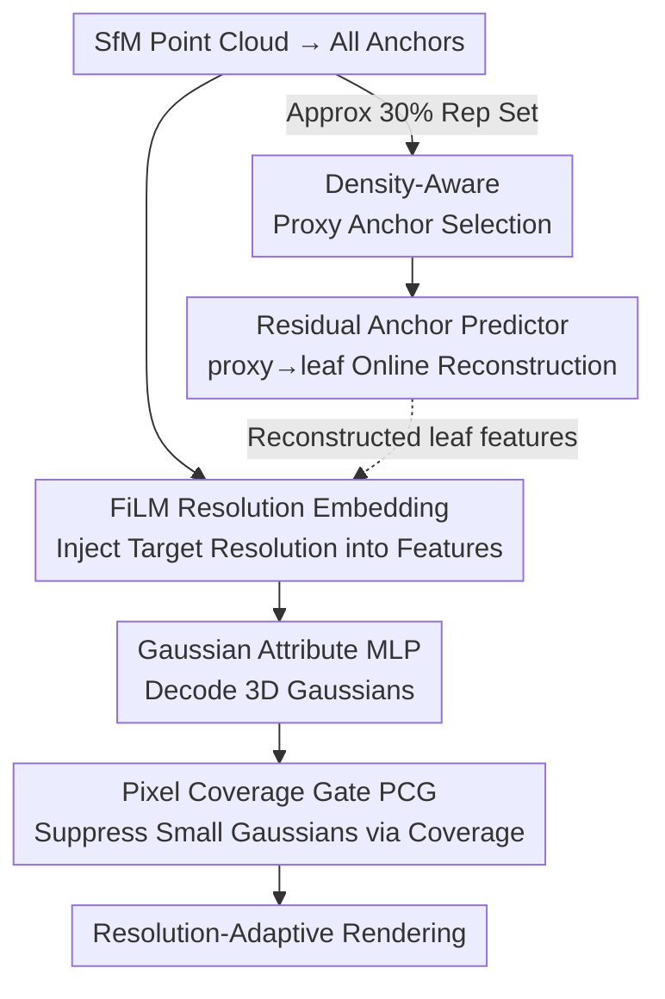

# 3D Gaussian Splatting at Arbitrary Resolutions with Compact Proxy Anchors

**Conference**: CVPR 2026  
**Paper**: [CVF Open Access](https://openaccess.thecvf.com/content/CVPR2026/html/Jeong_3D_Gaussian_Splatting_at_Arbitrary_Resolutions_with_Compact_Proxy_Anchors_CVPR_2026_paper.html)  
**Code**: https://github.com/JungMinKyun/ARCA-GS (Available)  
**Area**: 3D Vision  
**Keywords**: 3D Gaussian Splatting, Arbitrary Resolution Rendering, Anti-aliasing, Anchor Compression, FiLM Modulation

## TL;DR
Building upon the anchor-based framework of Scaffold-GS, this paper employs FiLM to inject "target resolution" into anchor features and introduces a "Pixel Coverage Gate" to dynamically activate Gaussians based on sampling rates, achieving aliasing-free rendering at continuous arbitrary resolutions. Simultaneously, the method stores only approximately 30% of proxy anchors and utilizes a residual predictor to reconstruct the remaining leaf anchors online, reducing storage to nearly half of Scaffold-GS without compromising quality.

## Background & Motivation
**Background**: 3D-GS represents scenes as a collection of anisotropic 3D Gaussians for real-time rendering. Scaffold-GS further organizes these Gaussians into anchors (where each anchor stores a latent feature used by an MLP to decode multiple Gaussians), significantly reducing GPU memory. This is the current mainstream approach for anchor-based Gaussian splatting.

**Limitations of Prior Work**: These methods are typically **trained at a fixed resolution**. During deployment (such as continuous zooming in AR/VR or digital twins), rendering at resolutions unseen during training leads to aliasing, jagged edges, and blurring because the projected 2D Gaussian coverage does not match the pixel sampling rate. Existing multi-resolution anti-aliasing methods either rely on test-time scale-dependent filtering (Mip-Splatting, SA-GS) or simply **store separate sets of Gaussians for different resolutions** (Multi-scale 3D-GS), the latter of which leads to memory explosion.

**Key Challenge**: There is a trade-off between fidelity and storage. Achieving clarity at arbitrary resolutions requires either scale-specific Gaussians (memory intensive) or filtering (not adaptive enough). Furthermore, compression of anchors is often fragile under continuous resolution changes, resulting in quality degradation during scaling.

**Goal**: Split the problem into two sub-problems: (1) Enabling a **single set of anchors** to adaptively generate Gaussians according to the target resolution (continuous anti-aliasing without storing multiple sets); (2) Further reducing the number of anchors without losing detail.

**Key Insight**: Anti-aliasing fundamentally requires matching the projected 2D Gaussian coverage to the pixel sampling rate. Since Scaffold-GS decodes Gaussians from anchor features "on-demand," encoding resolution information into anchor features and applying a coverage-based gate at the decoding end allows the same anchor to output different Gaussians for different resolutions.

**Core Idea**: Resolution is treated as a continuous condition to modulate anchor features via FiLM and generate "resolution-adaptive Gaussians" through pixel coverage gating. Storage is then compressed using a proxy/leaf anchor encoder-decoder structure (inspired by PointMAE).

## Method

### Overall Architecture
The method is built upon the "anchor → Gaussian" structure of Scaffold-GS. Inputs are all anchors obtained from SfM point cloud discretization, with each anchor storing a feature $f$, scale, and offset. All anchors are categorized into two types: approximately 30% as **proxy anchors** (red, the representative set actually stored) and the remainder as **leaf anchors** (gray, reconstructed during inference and not stored after training).

During rendering, for each anchor, target resolution information is injected into the feature via **FiLM Resolution Embedding** to obtain resolution-adaptive features $\hat f_v$. These features are fed into a Gaussian attribute MLP to decode 3D Gaussians, which are then filtered by the **Pixel Coverage Gate (PCG)** based on their projected coverage at the target resolution to remove excessively small Gaussians. Storage is handled by a **Residual Anchor Predictor**: in the second training stage, it learns to reconstruct leaf anchor features from neighboring proxy anchors, eliminating the need to save leaf anchor features.

Training proceeds in two stages: Stage 1 follows standard Scaffold-GS, using all (proxy+leaf) anchors. Stage 2 occurs after the anchor set is frozen (growing & pruning finished), jointly training proxy anchors and the residual predictor for leaf reconstruction.

### Key Designs

**1. FiLM Resolution Embedding: Writing "Target Resolution" Continuously into Anchor Features**

Anchors trained at a fixed resolution lack information about the current rendering scale, leading to mismatch. This method uses **Feature-wise Linear Modulation (FiLM)** to inject resolution as a condition. Specifically, for an anchor at position $x_v$ with a scaling ratio $\xi$, position encoding and a small MLP produce a pair of FiLM parameters:

$$[\gamma_v, \beta_v] = \mathrm{MLP}\big(\mathrm{PE}(x_v, \xi)\big)$$

Then, an element-wise affine modulation is applied to the original anchor feature $f_v$:

$$\hat f_v = (1 + \gamma_v) \odot f_v + \beta_v$$

The identity initialization of $(1+\gamma)$ allows the network to preserve original features initially and learn resolution-related offsets. The modulated $\hat f_v$ is then passed to the Gaussian MLP. Through resolution-dependent $(\gamma_v, \beta_v)$, the same opacity threshold can **automatically select different Gaussian subsets** for different resolutions.

**2. Pixel Coverage Gate (PCG): Aligning Projected Area with Pixel Sampling Rate**

Anti-aliasing ensures that projected 2D Gaussian coverage matches pixel size. Gaussians smaller than a pixel cause aliasing and flickering. PCG applies a soft gate to the coverage area. The projected 2D Gaussian coverage at resolution $\xi$ is calculated as:

$$A_{\xi,v} = \pi \rho^2 \sqrt{\det\big(\Sigma^{2D}_{\xi,v}\big)}$$

The method uses a sigmoid gate:

$$g_{pix}(A_{\xi,v}) = \frac{1}{1 + \exp\big(-\kappa(A_{\xi,v}-\eta)\big)$$

$\eta$ is the tunable coverage threshold, and $\kappa$ controls the steepness. When $A_{\xi,v} > \eta$, the gate approaches 1; otherwise, it approaches 0. The final effective opacity is $\tilde\alpha_{\xi,v} = \alpha_{\xi,v}\cdot g_{pix}(A_{\xi,v})$. Joint training is crucial here, as it allows the model to learn a resolution-aware anti-aliasing prior.

**3. Density-Aware Proxy Anchor + Residual Predictor: Online Reconstruction**

To further compress storage, the method partitions anchors into grids and selects approximately **30%** within each cell as proxy anchors based on density. The **residual anchor predictor** (an MLP) reconstructs leaf features $\hat f^q_i$ from the nearest proxy $\hat f^k_i$ using distance $\Delta x_i$ and direction $\vec d_i$:

$$\tilde f^q_i = \hat f^k_i + \Delta f_i$$

During training, 20% of leaf anchors are sampled for the predictor. Since leaf features are reconstructed on-the-fly, storage requirements drop significantly (e.g., from 78.9MB to 41.6MB on Mip-NeRF360).

### Loss & Training
Two-stage strategy. Stage 1 uses the standard 3D-GS rendering loss: $L_{base} = (1-\lambda_{SSIM})L_{L1} + \lambda_{SSIM}L_{SSIM}$. Growing and pruning occur here. Stage 2 introduces the predictor and a reconstruction loss:

$$L_{recon} = \frac{1}{|\tilde F^\in_q|}\sum_i \Big(\|\tilde f^q_i - \hat f^q_i\|_2^2 + 0.1\cdot[1-\cos(\tilde f^q_i, \hat f^q_i)]\Big)$$

Total Stage 2 loss is $L_{Stage2} = L_{base} + \lambda_{recon}L_{recon}$. Training involves random scaling (10%–100%) and 30k iterations.

## Key Experimental Results

### Main Results
Evaluation across 21 scenes (Mip-NeRF360, Tanks&Temples, DeepBlending, NeRF-Synthetic). All methods were trained with 10%–100% resolution sampling.

| Dataset | Resolution | Metric | 3D-GS | Scaffold-GS | Mip-Splat | Ours |
| :--- | :--- | :--- | :--- | :--- | :--- | :--- |
| Mip-NeRF360 | 10% | PSNR | 21.781 | 24.681 | 28.044 | **29.742** |
| Mip-NeRF360 | 100% | PSNR | 26.471 | 26.498 | 26.542 | **26.710** |
| Mip-NeRF360 | — | MEM | 220.9MB | 78.9MB | 185.8MB | **41.6MB** |
| DeepBlending | 10% | PSNR | 28.747 | 27.185 | 28.262 | **30.472** |
| DeepBlending | 100% | PSNR | 27.613 | 29.276 | 27.861 | **29.332** |
| DeepBlending | — | MEM | 162.1MB | 56.2MB | 135.7MB | **31.1MB** |

The most significant gains occur at low resolutions (10%), where PSNR increases by ~5 dB compared to Scaffold-GS, while utilizing only half the memory.

### Ablation Study

| Config | Mip-NeRF360 Avg PSNR | Description |
| :--- | :--- | :--- |
| No $E_\xi$ | 27.199 | No resolution injection |
| + $E_\xi$ | 28.036 | Simple addition of embedding |
| + FiLM$_\xi$ | **28.183** | Most stable across resolutions |

| Config (DeepBlending) | PSNR | SSIM | LPIPS | Description |
| :--- | :--- | :--- | :--- | :--- |
| Scaffold-GS | 29.465 | 0.886 | 0.201 | Baseline |
| Scaffold-GS + PCG (post-hoc) | 28.147 | 0.837 | 0.279 | Post-hoc application drops quality |
| Ours (Joint PCG) | **29.905** | **0.906** | **0.194** | PCG requires joint training |

### Key Findings
- **PCG requires joint training**: Applying PCG post-hoc degrades PSNR by ~1.3 dB; its value lies in the resolution-aware anti-aliasing prior learned during training.
- **Dynamic Adaptivity**: The number of active Gaussians scales monotonically with resolution (fewer at low, more at high).
- **FiLM > Addition**: Modulation handles both over-smoothing at low resolutions and under-expression at high resolutions better.
- **Proxy/Leaf Synergy**: Memory decreases while quality increases because the predictor forces proxy anchors to encode richer information.

## Highlights & Insights
- **Resolution as a Condition**: Using FiLM to modulate a single set of anchors for scale-adaptivity avoids the memory overhead of multi-scale models.
- **Geometric PCG Formulation**: The coverage formula $A=\pi\rho^2\sqrt{\det(\Sigma_{2D})}$ provides a clear physical link between Gaussian size and sampling rate.
- **Representation Compression**: Adopting the proxy-residual reconstruction from PointMAE optimizes storage by converting "store all" into "store representatives + online inference."
- **Experimental Rigor**: The post-hoc vs. joint training comparison proves that the system requires end-to-end learning to be effective.

## Limitations & Future Work
- Online reconstruction of leaf anchors introduces **additional inference computation** overhead.
- Fixed ratios (30% proxy, 20% leaf sampling) haven't been fully explored regarding sensitivity to scene complexity.
- Performance in super-resolution scenarios (>100% scaling) remains unverified.

## Related Work & Insights
- **vs. Mip-Splatting**: Mip-Splatting uses integrated filtering; this method adapts the generator (anchors) and utilizes significantly less memory (41.6MB vs 185.8MB).
- **vs. Multi-scale 3D-GS**: Avoids storing multiple discrete layers of Gaussians.
- **vs. Context-GS / TC-GS**: These focus on anchor structure compression; this method maximizes single anchor expressivity via the predictor.

## Rating
- Novelty: ⭐⭐⭐⭐
- Experimental Thoroughness: ⭐⭐⭐⭐
- Writing Quality: ⭐⭐⭐⭐
- Value: ⭐⭐⭐⭐ (High utility for AR/VR deployment).

<!-- RELATED:START -->

## Related Papers

- [\[CVPR 2026\] CGHair: Compact Gaussian Hair Reconstruction with Card Clustering](cghair_compact_gaussian_hair_reconstruction_with_card_clustering.md)
- [\[CVPR 2026\] AnchorSplat: Feed-Forward 3D Gaussian Splatting with 3D Geometric Priors](anchorsplat_feed-forward_3d_gaussian_splatting_with_3d_geometric_priors.md)
- [\[CVPR 2026\] E2EGS: Event-to-Edge Gaussian Splatting for Pose-Free 3D Reconstruction](e2egs_event-to-edge_gaussian_splatting_for_pose-free_3d_reconstruction.md)
- [\[CVPR 2026\] IDESplat: Iterative Depth Probability Estimation for Generalizable 3D Gaussian Splatting](idesplat_iterative_depth_probability_estimation_for_generalizable_3d_gaussian_sp.md)
- [\[CVPR 2026\] 4C4D: 4 Camera 4D Gaussian Splatting](4c4d_4_camera_4d_gaussian_splatting.md)

<!-- RELATED:END -->
