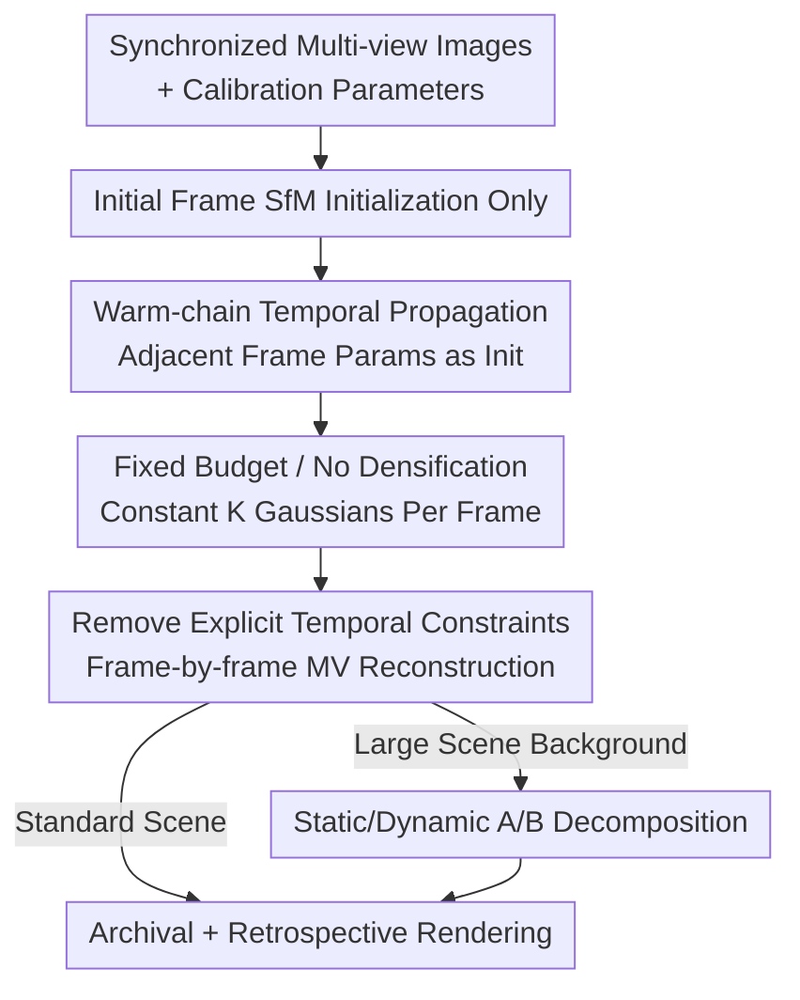

# 3D Gaussian Splatting for Efficient Retrospective Dynamic Scene Novel View Synthesis with a Standardized Benchmark

**Conference**: CVPR 2026  
**arXiv**: [2605.12437](https://arxiv.org/abs/2605.12437)  
**Code**: The paper states Code / API / Datasets are available at the corresponding link (no explicit repository address in original text).  
**Area**: 3D Vision  
**Keywords**: Dynamic 3DGS, Retrospective Novel View Synthesis, Synchronized Multi-view, Warm-start, Standardized Benchmark

## TL;DR
In **synchronized multi-view** capture scenarios such as sports, the authors argue that "the scene at each moment is already strictly constrained by multi-view geometry." Consequently, they **remove** common temporal deformation constraints in dynamic 3DGS. By relying on "initial frame SfM initialization + frame-by-frame warm-chain propagation + fixed Gaussian budget (no densification)," they achieve high-quality, low-memory, and randomly accessible retrospective dynamic Novel View Synthesis (NVS). They also provide a Blender data generation API to unify coordinate systems and data formats of NeRF/3DGS into a reproducible benchmark.

## Background & Motivation

**Background**: Novel view synthesis for dynamic scenes is a core requirement for sports replays, performance analysis, and immersive broadcasting—requiring both rendering from arbitrary views and high-quality "rewinding" to any past frame. NeRF and 3DGS have pushed static/dynamic NVS to the edge of practicality, with 3DGS gaining popularity due to explicit geometry and real-time rasterization. To extend 3DGS to dynamic scenes, mainstream methods (4DGS, Dynamic 3D Gaussians, space-time Gaussian, etc.) introduce **temporal coupling**: canonical space deformation fields, temporal latent variables, or multi-body rigidity constraints to maintain motion continuity across frames.

**Limitations of Prior Work**: These temporal coupling formulations are designed for scenarios where "both cameras and objects move smoothly." They are complex, slow to train, and memory usage grows with sequence length. Furthermore, implementations vary in camera coordinate systems, synchronization, training splits, and export formats, requiring significant effort to align data for fair comparison.

**Key Challenge**: In **typical synchronized multi-view (MV) capture for sports**, cameras are mounted on fixed platforms, strictly synchronized, and calibrated. In this case, the scene at any time $t$ is actually **well-posed** under the multi-view rigidity principle of projective geometry—spatial consistency is guaranteed frame-by-frame by calibration and multi-view supervision. This raises the question: is a complex temporal deformation model still necessary?

**Goal**: (1) To verify whether high-quality, memory-controlled, and randomly accessible retrospective dynamic NVS can be achieved without explicit temporal coupling in synchronized MV settings. (2) To provide a standardized dynamic MV data generation and benchmark framework with unified coordinates to eliminate reproduction friction.

**Key Insight**: Since each frame is strictly constrained by geometry and motion between adjacent frames is locally smooth, it is unnecessary to reconstruct each frame from scratch or learn cross-frame deformations. Instead, one can "warm-start" the optimization of Gaussian parameters for each frame using the converged parameters from the neighboring frame.

**Core Idea**: Use "warm-start chain propagation + fixed Gaussian budget (disable densification)" to replace "temporal deformation constraints" for efficient retrospective dynamic NVS in synchronized multi-view settings.

## Method

### Overall Architecture
The proposed method (denoted as TA-3DGS) targets $N$ **calibrated and synchronized** cameras. At each discrete time $t$, a set of RGB images $\mathcal{I}_t=\{I_t^{(i)}\}_{i=1}^N$ and known camera parameters $\pi_i=(K_i,R_i,\mathbf{t}_i)$ are provided. The goal is to render $\hat{I}_t^\star$ for any query time $t$ and virtual view $\pi^\star$, supporting **random access playback** in the temporal dimension.

The workflow is a chain advancing through time: the initial frame is initialized with SfM point clouds and optimized to convergence $\rightarrow$ each subsequent frame is warm-started from the converged parameters of the previous frame and optimized for a few iterations under a **fixed budget of $K$ Gaussians without densification** $\rightarrow$ **no explicit temporal deformation constraints** are added throughout (spatial consistency is handled by calibration and multi-view supervision) $\rightarrow$ static/dynamic A/B decomposition is used for large scenes to save computation $\rightarrow$ parameters for each frame $\Theta_t^\star$ are archived as $\mathcal{A}=\{\mathcal{G}_1,\dots,\mathcal{G}_T\}$ for retrospective rendering. The figure below illustrates this NVS pipeline.

### Key Designs

**1. Frame-by-frame modeling without explicit temporal coupling: Returning "inter-frame continuity" to multi-view geometry**

This is the core argument of the paper. Deformation fields and canonical templates used in 4DGS / Dynamic 3DGS often fail under highly dynamic motion and increase complexity. The authors argue that under synchronized MV, the optimization objective for each frame is simply a **pure multi-view reconstruction loss**:

$$\mathcal{L}_t(\Theta_t)=\sum_{i=1}^{N}\mathcal{L}_{\mathrm{img}}\!\left(\hat{I}^{(i)}_t(\Theta_t),\,I^{(i)}_t\right)+\lambda_{\mathrm{reg}}\,\mathcal{R}(\Theta_t),$$

where $\mathcal{L}_{\mathrm{img}}$ is a robust photometric loss ($\ell_1$/Charbonnier, optional SSIM), and $\mathcal{R}(\Theta_t)=\sum_k(\|\mathbf{s}_{t,k}\|_2^2+\alpha_{t,k}^2+\|\mathbf{b}_{t,k}\|_2^2)$ is a lightweight term to prevent degeneracy. **No cross-time deformation or canonical terms** are included. Calibration and multi-view supervision fix the spatial geometry frame-by-frame, and temporal continuity emerges naturally from the warm-start initialization.

**2. Initial frame SfM initialization + warm-chain temporal propagation**

To avoid the cost and randomness of rebuilding every frame from scratch: (a) Only the starting time $t_0$ (usually $t_0=1$) uses SfM point clouds $\mathcal{P}_{t_0}$ for initialization. $K$ points are sampled as Gaussian means $\boldsymbol{\mu}_{t_0,k}\leftarrow\mathbf{p}_k$, with scales/quadrics/opacity set to constants, and SH coefficients aggregated from median observed colors. (b) For subsequent frames, **no SfM is performed**. Instead, a warm-chain is used: $\Theta_t^{(0)}\leftarrow\Theta_{t-1}^\star$. Each frame is optimized for a fixed number of steps from this initial value. This is effective because sports motion is locally smooth between frames.

**3. Fixed budget, no-densification temporal indexing: Constant $K$ Gaussians per frame**

To prevent memory and archival size from spiraling out of control (a common issue if densification is active during warm-chains), the scene at each moment is represented as a fixed-size set of anisotropic Gaussians $\mathcal{G}_t=\{g_{t,k}\}_{k=1}^K$. The paper **disables densification/splitting entirely**, forcing $|\mathcal{G}_t|=K,\ \forall t$. This ensures predictable memory/archival size, constant rendering throughput, and constant per-frame training compute. Ablation (Table 3) shows that while densification (S1) increases Gaussians from 188K to 850K in 5 frames, the proposed S2 remains constant at 100K (approx. 23.65MB per frame).

**4. Static/Dynamic A/B Decomposition: Optimizing only moving parts in large scenes**

For large scenes (e.g., a stadium), optimizing the full view every frame is expensive. The scene is split into a static component A (stadium/background, reconstructed once) and a dynamic component B (moving players, modeled frame-by-frame). B is isolated by taking the RGB difference between GT and the "A-only" render $\rightarrow$ thresholding $\rightarrow$ morphological refinement to get a residual mask. Dynamic Gaussians are then filtered via **multi-view voting** to retain only points supported by masks across all views, suppressing background leakage. Background A and filtered B are merged for rendering.

**5. Standardized dynamic multi-view data generation framework: Unifying coordinates with Blender**

To address the lack of standardized benchmarks, the authors developed a Blender-based API. It supports hemi-spherical, global, elliptical, and stadium camera layouts and exports time-aligned images with calibration metadata. Crucially, it unifies coordinates to the OpenCV/COLMAP world-to-camera convention, eliminating ambiguity between NeRF and 3DGS repositories. It is compatible with Instant-NGP, TACV, and other formats, ensuring that training/validation/test splits remain **constant across time**.

### Loss & Training
- Single-frame objective $\mathcal{L}_t$: Multi-view photometric loss ($\ell_1$/Charbonnier + optional SSIM) + lightweight regularization $\mathcal{R}$ + scale clipping.
- Optimization for a fixed number of steps after warm-start (8,000 steps per frame in main experiments).
- Densification disabled ($|\mathcal{G}_t|=K$); for A/B decomposition, A is trained for 30,000 steps and B for 5,200 steps.
- Implementation: PyTorch 2.5.1 + CUDA 11.8 on A40 (50GB) and H100 GPUs.

## Key Experimental Results

### Main Results
On three synchronized MV dynamic datasets (D-WS, S-PK, S-MP), the method (TA-3DGS) was compared against D-NeRF, 4DGS, ST-GS, and TACV using PSNR↑ and LPIPS↓.

| Dataset | Metric | Ours (TA-3DGS) | Runner-up (TACV) | 4DGS | Note |
|--------|------|------|----------|------|------|
| D-WS | PSNR↑ | **42.50** | 34.28 | 28.17 | +8.2 dB over runner-up |
| D-WS | LPIPS↓ | **0.0110** | 0.0275 | 0.0800 | Perceptual error reduced by >50% |
| S-PK | PSNR↑ | **44.59** | 33.81 | 26.25 | +10.8 dB |
| S-PK | LPIPS↓ | **0.0023** | 0.0282 | 0.0450 | ~1/12 error |
| S-MP | PSNR↑ | **43.84** | 31.85 | 26.20 | +12.0 dB |
| S-MP | LPIPS↓ | **0.0023** | 0.0392 | 0.0610 | ~1/17 error |

Note: TA-3DGS achieves significantly higher PSNR/LPIPS but uses more VRAM (4.94GB vs 4DGS 21MB). The advantage lies in the best image quality with predictable per-frame costs and faster training than TACV.

### Ablation Study
On the Snow SoccerField dataset, three settings were compared: S1 (warm+densify), S2 (warm+no densify, Ours), and S3 (GT point cloud init per frame).

| Configuration | Gaussians (F1 → F5) | Per-frame Size | Trend | Conclusion |
|------|------|---------|------|------|
| S1 Warm+Densify | 188K → 846K | 44.6 → 200.1 MB | Continuous expansion | VRAM increases 5x in 5 frames; unsustainable |
| S2 Warm+NoDensify (Ours) | 100K (Fixed) | 23.65 MB (Fixed) | Stable | Predictable capacity/compute/storage |
| S3 GT Init | ~188K/frame | ~44.7 MB | Stable | Best quality but requires GT depth/LiDAR |

### Key Findings
- **Densification is the culprit for memory explosion**: S1 achieves better quality but at the cost of ballooning Gaussian counts. S2 is a more practical trade-off for long sequences.
- **Removing temporal coupling improves performance in sync MV**: By removing deformation constraints, PSNR reached 42–44 dB, significantly outperforming 4DGS/ST-GS, confirming that multi-view geometry is sufficient per frame.
- **A/B Decomposition conditions**: Works best when camera parameters are consistent and lighting is similar; otherwise, residual masks become noisy.

## Highlights & Insights
- **Innovation via "Subtraction"**: Instead of adding complex deformation fields, this paper removes them, demonstrating that geometric constraints are sufficient in synchronized multi-view settings—a problem-driven insight.
- **Predictability as Engineering Value**: A fixed Gaussian budget makes memory, archival size, and training costs constant, which is a requirement for archiving hours-long sports events.
- **Transferable warm-chain concept**: Any sequence reconstruction with smooth transitions and strong geometric constraints (surveillance, surgery, fixed-camera performances) can benefit from this approach.
- **Value of Benchmark Tools**: Unifying Blender modeling with OpenCV/COLMAP conventions significantly lowers the entry barrier for dynamic NVS research.

## Limitations & Future Work
- **Strict dependence on calibration and synchronization**: Errors in parameters or sub-frame desynchronization cause multi-view inconsistency, and warm-chains may accumulate errors over time.
- **Sensitivity to initialization**: Re-using the first frame's point cloud means the warm-chain may struggle to recover geometry missing in the initial state (e.g., due to reflections or occlusion).
- **VRAM usage**: While predictable, the absolute memory usage (GB level) is much higher than specialized compressed formats like 4DGS (MB level).
- **Synthetic data focus**: Evaluations primarily use Blender-generated data; performance in real-world stadiums (noise, dynamic exposure, crowds) remains to be verified.

## Related Work & Insights
- **vs 4DGS / ST-GS / Dynamic 3DGS**: These use deformation fields to model continuity across frames, which is suitable for smooth shape changes. Ours removes temporal coupling to achieve higher PSNR in synchronized MV settings at the cost of higher absolute memory.
- **vs Standard 3DGS**: Leverages the differentiable rasterizer but disables densification to ensure archival predictability.
- **vs Nerfstudio / CMU Panoptic Studio**: While platforms like Nerfstudio are excellent, they are often limited to rigid scenes; the proposed Blender API fills the gap for standardized synthetic dynamic benchmarks.

## Rating
- Novelty: ⭐⭐⭐⭐ Refreshing take on removing temporal coupling for specific scenarios; though individual components are existing techniques.
- Experimental Thoroughness: ⭐⭐⭐ Significant lead in metrics and clear ablation on memory; however, lacks real-world stadium testing and robustness analysis for sync errors.
- Writing Quality: ⭐⭐⭐⭐ Logical flow from motivation to method; clear formulas and algorithms.
- Value: ⭐⭐⭐⭐ Provides a practical solution for sports archiving with predictable costs and a valuable benchmarking tool for the community.

<!-- RELATED:START -->

## Related Papers

- [\[CVPR 2026\] Dynamic-Static Decomposition for Novel View Synthesis of Dynamic Scenes with Spiking Neurons](dynamic-static_decomposition_for_novel_view_synthesis_of_dynamic_scenes_with_spi.md)
- [\[CVPR 2026\] From None to All: Self-Supervised 3D Reconstruction via Novel View Synthesis](from_none_to_all_self-supervised_3d_reconstruction_via_novel_view_synthesis.md)
- [\[CVPR 2026\] Bringing a Personal Point of View: Evaluating Dynamic 3D Gaussian Splatting for Egocentric Scene Reconstruction](bringing_a_personal_point_of_view_evaluating_dynamic_3d_gaussian_splatting_for_e.md)
- [\[CVPR 2026\] Hierarchical Visual Relocalization with Nearest View Synthesis from Feature Gaussian Splatting](hierarchical_visual_relocalization_with_nearest_view_synthesis_from_feature_gaus.md)
- [\[CVPR 2026\] ClipGStream: Clip-Stream Gaussian Splatting for Any Length and Any Motion Multi-View Dynamic Scene Reconstruction](clipgstream_clip-stream_gaussian_splatting_for_any_length_and_any_motion_multi-v.md)

<!-- RELATED:END -->
