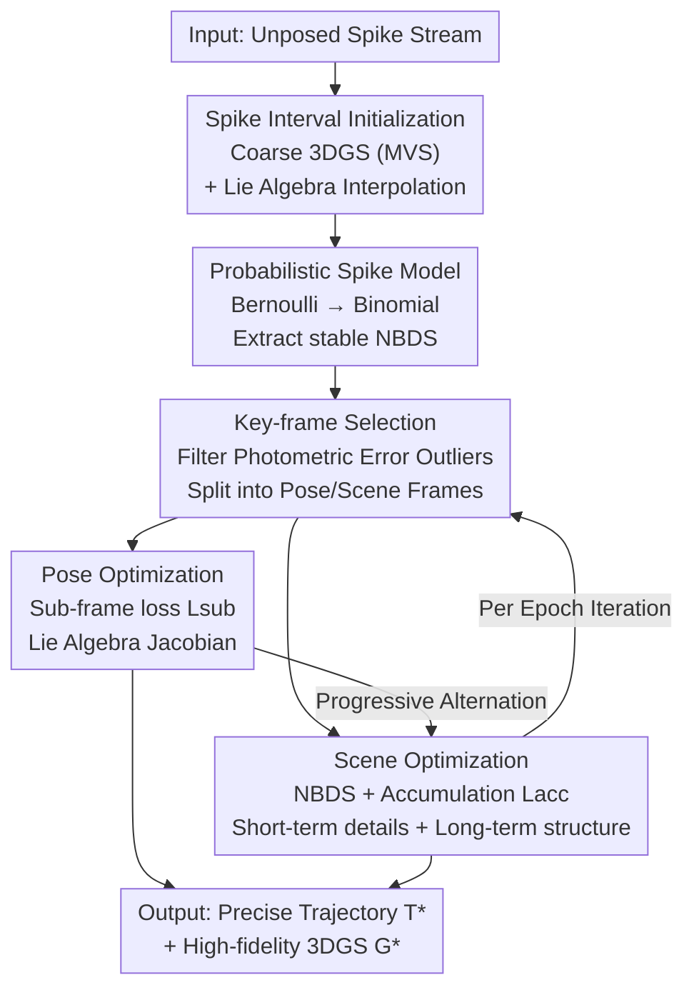

# Nope-SGS: 3D Gaussian Reconstruction from Unposed Spike Streams

**Conference**: CVPR 2026  
**Paper**: [CVF Open Access](https://openaccess.thecvf.com/content/CVPR2026/html/Guo_3D_Gaussian_Splatting_from_Unposed_Spike_Stream_CVPR_2026_paper.html)  
**Code**: TBD  
**Area**: 3D Vision  
**Keywords**: 3D Gaussian Splatting, Spike Camera, Pose-free Reconstruction, High-speed Scenes, Neural Rendering  

## TL;DR
This paper introduces Nope-SGS, the first framework for reconstructing high-speed 3D scenes directly from raw spike camera streams without camera pose priors. By remodeling spike imaging as a binomial distribution, it recovers a stable Normalized Binomial Distribution Spike (NBDS) supervision signal from unstable single-frame spikes. Combined with key-frame selection and progressive optimization, it simultaneously solves for camera trajectories and 3D Gaussians. Compared to SOTA, it achieves up to a 7.4dB improvement in PSNR, a 40% reduction in ATE, and is the fastest among spike-based methods.

## Background & Motivation

**Background**: 3D Gaussian Splatting (3DGS) has become a mainstream for 3D reconstruction due to its explicit representation and real-time rendering. However, it strongly relies on two components: clear images and precise camera poses. In high-speed motion scenarios, conventional exposure-based cameras suffer from severe motion blur due to shutter integration, and poses (typically estimated via COLMAP/SfM) are difficult to obtain accurately. To address this, some works introduce spike cameras—bio-inspired sensors where each pixel continuously integrates incident light, fires a spike upon reaching a threshold, and resets. These cameras output a 0/1 binary stream with extremely high temporal resolution, naturally avoiding motion blur.

**Limitations of Prior Work**: Although spike-based methods eliminate the need for clear images, they remain bottlenecked by the requirement for "precise poses." This is due to two reasons: (a) single-frame spike information is binary, with sparse and highly unstable texture details, causing feature extraction in pose estimators like COLMAP/VGGT to fail or produce inaccurate trajectories; (b) spike reconstruction typically requires significantly more frames than exposure cameras, leading to a surge in computational cost. Existing "pose-free 3DGS" methods (e.g., CF-3DGS, Instantsplat, ZeroGS) are designed for slow, clear images and perform poorly when applied directly to high-speed spike scenarios.

**Key Challenge**: The spike stream features high temporal resolution but extremely unstable single-frame signals. While one aims to use it to avoid motion blur, its instability ruins pose estimation. The root cause is that single-frame spikes are binary signals from Bernoulli sampling, exhibiting high variance and lacking stable textures, which prevents them from serving as reliable photometric supervision for joint pose and scene optimization.

**Goal**: To completely remove the dependence on precise pose priors for spike 3D reconstruction and end-to-end recover accurate camera trajectories and high-quality 3DGS scenes from unposed spike streams efficiently.

**Key Insight**: The authors revisit the physical imaging mechanism of spike cameras. Each pixel has a random initial voltage $V_x$ following a uniform distribution, making spikes at different times and adjacent pixels statistically independent. Since single-frame spikes follow a Bernoulli distribution, aggregating multiple spikes in space-time approximates a binomial distribution with an expectation proportional to the true light intensity and significantly lower variance.

**Core Idea**: Replace "unstable single-frame spike supervision" with a "probabilistic spike model + stable NBDS supervision signals." On this basis, joint pose and scene optimization are performed using key-frame selection and progressive optimization.

## Method

### Overall Architecture

The input to Nope-SGS is an unposed raw spike stream, and the output consists of a precise camera trajectory $T^*$ and a high-quality 3D Gaussian scene $G^*$. The pipeline follows three steps: first, **initialization**—coarse 3DGS and trajectory reconstruction from sparse spike intervals; second, converting unstable spikes into stable **NBDS supervision signals** via the reformulated probabilistic spike model; third, feeding NBDS into a **progressive optimization framework** using key-frame selection to alternately optimize camera poses (Sec 3.4) and the scene (Sec 3.5), refining the coarse trajectory into a smooth path and the coarse scene into a high-fidelity reconstruction.

Formally, the objective is to converge from initial estimates $\{G, T\}$ to $\{G^*, T^*\} = \arg\min_{G,T} \mathcal{L}(G, T)$. The key lies in the supervision signal $\mathcal{L}$ and the acceleration mechanism.

### Key Designs

**1. NBDS Extraction via Probabilistic Spike Modeling: Extracting Stable Supervision from Unstable Spikes**

This is the foundation of the work. Single-frame spikes $S \in \{0,1\}^{H \times W \times N}$ have high variance and no texture, making them unsuitable for direct supervision. The key observation is the random initial voltage $V_x \sim U[0, \phi]$ at each pixel, leading to spike accumulation $A(x,t) = (\int_0^t L_C(x,\tau)d\tau + V_x) \bmod \phi$. This allows the output of a pixel to be modeled as a Bernoulli distribution $s(x,y,k) \sim B(1, p(x,y,k))$, where the firing probability $p = (\int_t^{t+T} L_C(x,\tau)d\tau)/\phi$ is proportional to light intensity.

Due to the temporal independence introduced by $V_x$, summing $M$ adjacent pixels (assuming similar intensity $p$) results in an approximate Binomial distribution $B[n,p]$. The average expectation $E(x/N) = p_i$ approximates true intensity, while the variance is compressed to $\sigma^2(x/N) \approx p(1-p)/n$. The authors define this continuous result in $[0,1]$ as **Normalized Binomial Distribution Spike (NBDS)** $\hat{S} \in [0,1]^{H \times W}$. NBDS converts jittery binary spikes into denoised grayscale textures without bias, enabling reliable photometric supervision for pose and scene optimization.

**2. Sub-frame Photometric Loss + Key-frame Selection: Stabilizing and Accelerating Pose Optimization by 10x**

Given NBDS, the basic pose optimization objective is to minimize the photometric error $\mathcal{L}_{nbds}^k = |\hat{C}(P_\theta^k) - \hat{S}_{gt}^k|$, where $\hat{C}$ is the Gaussian rendering aligned with NBDS via average pooling. To improve stability, the authors introduce **sub-frame photometric loss** using the already optimized trajectory:

$$\mathcal{L}_{sub}^k = |(\hat{C}(P_\theta^k) - \hat{C}(P^{k-n})) - (\hat{S}_{gt}^k - \hat{S}_{gt}^{k-n})|$$

This differential form accomplishes two things: it cancels shared noise via adjacent frame subtraction to stabilize the signal, and it amplifies errors at key locations like edges. Lie algebra is used for derivation to align gradient dimensions with degrees of freedom, enhancing efficiency.

**Key-frame Selection** ensures optimization is only performed on essential frames. Photometric errors $\mathcal{L}_{nbds}$ are calculated for all frames, and those significantly above the mean are selected: $F_{key} = \{f^k | \mathcal{L}_{nbds}^k > \delta \cdot \text{mean}(\mathcal{L}_{nbds})\}$. Since photometric error originates from both Gaussian and pose errors, $\mathcal{L}_{sub}$ is used to isolate $F_{pose}$ for pose optimization, while $F_{scene} = F_{pose} \cap F_{key}$ is used for scene optimization. This accelerates pose optimization by 10x without quality loss.

**3. Scene Optimization via NBDS + Spike Accumulation: Complementing Short-term Details and Long-term Structure**

Relying solely on NBDS for scene optimization may lead to texture distortion as it neglects high-frequency structures. Influenced by SpikeGS, a **spike accumulation** mechanism is introduced: $I_{acc}(t_1, t_N) = (\phi/N)\sum_{t_i} S(P_i)$. The total scene loss combines both:

$$\mathcal{L}_{final} = \lambda_{acc}\mathcal{L}_{acc} + \lambda_{nbds}\mathcal{L}_{nbds}$$

where $\mathcal{L}_{acc}$ handles long-term temporal modeling (structure) and $\mathcal{L}_{nbds}$ preserves short-term details. Each component includes photometric and structural constraints $\mathcal{L}_* = (1-\lambda_1)\|C_* - I_*\|^2 + \lambda_1 \text{SSIM}(C_*, I_*)$. This **progressive optimization** of $T$ and $G$ is crucial for transforming inaccurate initial poses into a stable configuration.

### Loss & Training
Pose estimation uses $\mathcal{L}_{sub}$, while scene reconstruction uses $\mathcal{L}_{final} = \lambda_{acc}\mathcal{L}_{acc} + \lambda_{nbds}\mathcal{L}_{nbds}$. Hyperparameters: $n=32$, $M=16$, $\delta=1.0$. Progressive optimization involves 500 pose iterations and 1000 scene iterations per epoch. Total initialization takes ~1 minute on a single NVIDIA A800.

## Key Experimental Results

### Main Results

Ours outperforms baselines significantly in New View Synthesis (NVS) and pose estimation on Tanks and Temples and Deblur-NeRF. On Tanks, PSNR is 7.4dB higher than the best baseline.

| Dataset | Metric | Ours | Best Baseline | Gain |
|--------|------|------|----------|------|
| Tanks | PSNR↑ | **30.184** | 22.375 (Spikerecon+CF-3DGS) | +7.4dB |
| Tanks | SSIM↑ | **0.911** | 0.703 (Spikerecon+Instant) | High Lead |
| Tanks | LPIPS↓ | **0.122** | 0.339 (SpikeGS+Colmap) | Large reduction |
| Tanks | ATE↓ | **0.003** | 0.012 (SpikeGS+VGGT) | ~40% better |
| Deblur-NeRF | PSNR↑ | **28.058** | 24.143 (SpikeGS+VGGT) | +3.9dB |
| Deblur-NeRF | ATE↓ | **0.030** | 0.055 (Spikenerf) | Better |

On real data (no GT, using no-reference IQA):

| Dataset | NIQE↓ | IL-NIQE↓ |
|--------|-------|----------|
| Nope-SGS (Ours) | **5.72** | **44.97** |
| USP-Gaussian | 7.86 | 67.42 |
| SpikeGS | 9.93 | 87.92 |

Regarding depth estimation (evaluating via DepthAnythingV2 pseudo-depth alignment): Ours yields $\delta_1=67.11$, AbsRel=0.31, far exceeding SpikeGS ($\delta_1=18.92$). The method is ~3x faster than the current spike-based SOTA.

### Ablation Study

Verification on Tanks and Temples (Key. = Key-frame, Time = Avg optimization time per epoch):

| ID | Configuration | PSNR↑ | ATE↓ | Time/min | Note |
|------|------|---------|------|------|------|
| Ours | Full Model ($\mathcal{L}_{sub}$ + Key. + $\mathcal{L}_{nbds}$ + $\mathcal{L}_{acc}$) | **30.184** | **0.003** | **3.0** | Complete |
| IV | Pose uses $\mathcal{L}_{pho}$ instead of $\mathcal{L}_{sub}$ | 28.59 | 0.007 | 11.5 | ATE doubles, 3.8x slower |
| V | Pose uses $\mathcal{L}_{nbds}$ instead of $\mathcal{L}_{sub}$ | 29.69 | 0.004 | 9.0 | Still inferior |
| VI | w/o Key-frames | 29.62 | 0.003 | 45.3 | Similar quality, 15x slower |
| I | w/o $\mathcal{L}_{nbds}$ + $\mathcal{L}_{acc}$ | 22.42 | - | - | Supervision fails |
| II | w/o $\mathcal{L}_{acc}$ (keep $\mathcal{L}_{nbds}$) | 26.44 | - | - | Lacks structure |
| III | w/o $\mathcal{L}_{nbds}$ (keep $\mathcal{L}_{acc}$) | 29.16 | - | - | Lacks details |

### Key Findings
- **$\mathcal{L}_{sub}$ is critical for pose optimization**: It results in 33% lower ATE and 3x faster convergence compared to $\mathcal{L}_{pho}$, proving that differential supervision stabilizes signals while accelerating optimization.
- **Key-frame selection targets speed rather than accuracy**: Removing it (ID VI) results in similar quality but increases time from 3 min to 45.3 min (15x), proving it accurately identifies frames requiring correction.
- **NBDS and accumulation loss are complementary**: Removing either (ID II/III) drops PSNR. NBDS governs details/speed, while accumulation loss ensures long-term structure.

## Highlights & Insights
- **Turning "Sensor Noise" into "Statistical Signal"**: The random initial voltage $V_x$, usually a nuisance, is used to prove pixel independence, aggregating Bernoulli spikes into low-variance Binomial distributions. This "deriving stable supervision from physical noise" is a general-purpose insight for spikeカメラ.
- **Differential Sub-frame Loss**: Subtracting adjacent frames cancels shared noise and amplifies edge errors, unifying "stable supervision" and "importance on key regions" into one formula.
- **Error Attribution for Key-frame Splitting**: Using $\mathcal{L}_{nbds}$ and $\mathcal{L}_{sub}$ to separate photometric errors into pose and Gaussian errors allows optimization resources to be used where they are most needed.

## Limitations & Future Work
- NBDS binomial approximation assumes similar light intensity across $M$ pixels and sufficient independence across time interval $n$. This may fail in areas with extremely sharp texture changes or ultra-fast motion.
- The method requires per-scene optimization from scratch. Although 3x faster than SOTA, it remains slower than feed-forward reconstruction and is not real-time.
- Depth evaluation relies on pseudo-depth (DepthAnythingV2) rather than GT, meaning geometric accuracy is limited by the pseudo-depth quality.

## Related Work & Insights
- **vs CF-3DGS / Instantsplat**: These pose-free methods use progressive growth or stereo priors for slow, clear images, but fail under high-speed spike motion blur. Ours is the first to achieve "pose-free + spike + high-speed."
- **vs SpikeGS / USP-Gaussian**: These rely on precise COLMAP/VGGT poses. Poses errors lead to severe parallax in rendering. Ours removes pose priors and handles RGB spike streams.
- **vs EF-3DGS / IncEventGS**: Event cameras have lossy info and thin textures. Spike cameras with NBDS provide richer textures and higher reconstruction fidelity.

## Rating
- Novelty: ⭐⭐⭐⭐⭐ First pose-free spike 3D reconstruction framework; probabilistic spike modeling has general value for the field.
- Experimental Thoroughness: ⭐⭐⭐⭐⭐ Covers 4 datasets, NVS, pose, depth, and efficiency.
- Writing Quality: ⭐⭐⭐⭐ Clear derivations, though some Jacobian details require checking the appendix.
- Value: ⭐⭐⭐⭐⭐ Addresses the pain point of "pose difficulty" in high-speed scenes and provides a next-gen spike camera dataset.

<!-- RELATED:START -->

## Related Papers

- [\[ICLR 2026\] SpikeStereoNet: A Brain-Inspired Stereo Depth Estimation Framework for Spike Streams](../../ICLR2026/3d_vision/spikestereonet_a_brain-inspired_framework_for_stereo_depth_estimation_from_spike.md)
- [\[CVPR 2026\] Uni3R: Unified 3D Reconstruction and Semantic Understanding via Generalizable Gaussian Splatting from Unposed Multi-View Images](uni3r_unified_3d_reconstruction_and_semantic_understanding_via_generalizable_gau.md)
- [\[CVPR 2026\] eRetinexGS: Retinex Modeling for Low-Light Scene Enhancement via Event Streams and 3D Gaussian Splatting](eretinexgs_retinex_modeling_for_low-light_scene_enhancement_via_event_streams_an.md)
- [\[CVPR 2026\] E2EGS: Event-to-Edge Gaussian Splatting for Pose-Free 3D Reconstruction](e2egs_event-to-edge_gaussian_splatting_for_pose-free_3d_reconstruction.md)
- [\[ICLR 2026\] StreamSplat: Towards Online Dynamic 3D Reconstruction from Uncalibrated Video Streams](../../ICLR2026/3d_vision/streamsplat_towards_online_dynamic_3d_reconstruction_from_uncalibrated_video_str.md)

<!-- RELATED:END -->
