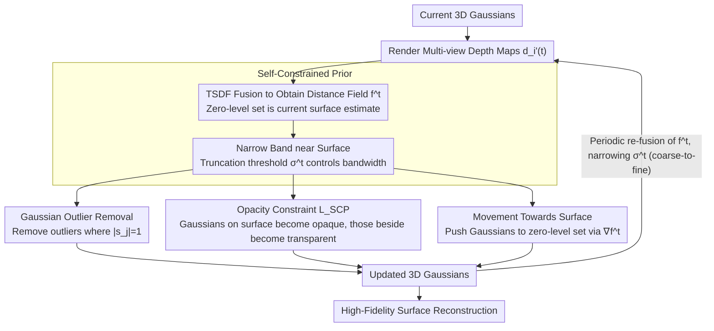

# 3D Gaussian Splatting with Self-Constrained Priors for High Fidelity Surface Reconstruction

**Conference**: CVPR 2026  
**arXiv**: [2603.19682](https://arxiv.org/abs/2603.19682)  
**Code**: [https://github.com/takeshie/GSPrior](https://github.com/takeshie/GSPrior)  
**Area**: 3D Vision  
**Keywords**: 3D Gaussian Splatting, Surface Reconstruction, TSDF, Self-Constrained Prior, Geometric Constraints

## TL;DR
This paper proposes the Self-Constrained Prior (SCP), which constructs a TSDF distance field by fusing depth maps rendered from the current 3D Gaussians. This field serves as a prior to impose geometry-aware constraints (outlier removal, opacity constraints, and movement toward the surface) on Gaussians, achieving SOTA high-fidelity surface reconstruction on NeRF-Synthetic and DTU datasets.

## Background & Motivation

**Background**: 3D Gaussian Splatting (3DGS) outperforms NeRF in speed and visual fidelity for novel view synthesis, but its geometric reconstruction precision remains significantly insufficient. Existing methods either use multi-view consistency to constrain depth, utilize implicit fields to guide Gaussian motion, or rely on data-driven pre-trained priors.

**Limitations of Prior Work**: These strategies either fail to impose constraints directly on 3D Gaussians or cannot operate in a geometry-aware, adaptive manner. Methods relying on external priors generalize poorly to complex or unseen scenes, leading to artifacts and degraded geometric quality.

**Key Challenge**: Rendering quality requires high degrees of freedom in Gaussian representation, whereas geometric accuracy demands strict geometric constraints. How can a balance be found between the two without relying on external priors?

**Key Insight**: It is observed that the currently rendered depth maps themselves contain surface estimation information, which can be fused into a TSDF (Truncated Signed Distance Field) as a "self-constrained prior," eliminating the need for external data-driven priors.

**Core Idea**: Automatically generate a TSDF distance field from rendered depth maps, define a narrow band near the surface, apply three geometric constraints to Gaussians within this band, and periodically update the prior while gradually narrowing the band to achieve coarse-to-fine optimization.

## Method

### Overall Architecture
The paper aims to solve the long-standing 3DGS issue of "looking good but measuring poorly": while the representation has high degrees of freedom and renders beautifully, geometric precision is lacking. Previous fixes required external data-driven priors or learning an auxiliary implicit field. This work changes perspective—rendering current Gaussians generates depth maps that already estimate a rough surface, serving as a "self-constrained" prior. The pipeline is a closed loop: render depth maps $\{d_i'(t)\}$ from current Gaussians, fuse them into a TSDF grid $f^t$ where the zero-level set is the current surface estimate. Guided by this distance field, three geometric operations are performed: removing outliers, adjusting opacity based on distance to surface, and pushing Gaussians toward the surface. After optimization proceeds for a period, $f^t$ is re-fused with updated depths, and the truncation threshold $\sigma^t$ of the narrow band is reduced, leading to coarse-to-fine convergence.

### Key Designs

**1. Self-Constrained Prior: Fusing Rendered Depth into TSDF as a Self-Prior**

External priors generalize poorly on complex or unseen scenes, which is a primary reason for geometric quality degradation. This paper avoids external dependencies by performing TSDF fusion on currently rendered multi-view depths $\{d_i'(t)\}$ to obtain a distance field $f^t = \mathcal{F}(\{d_i'(t)\})$. Its zero-level set represents the current surface estimate. The distance field defines a narrow band on both sides of the zero-level set, with signed distances normalized to $[-1, 1]$. The truncation threshold $\sigma^t$ determines the physical width of the narrow band—all subsequent geometric constraints only take effect within this band. Crucially, this prior is not one-off: as optimization progresses, $f^t$ is re-fused using fresh, more consistent depths, and $\sigma^t$ is reduced to narrow the band. Geometric precision is improved through this bootstrap cycle.

**2. Gaussian Outlier Removal: Eliminating Gaussians Outside the Narrow Band**

Outlier Gaussians floating away from the surface contaminate depth rendering, which in turn degrades the fused $f^t$. The solution is straightforward: interpolate the distance field at each Gaussian center $\mu_j$ to retrieve its signed distance $s_j = f^t(\mu_j)$. If $|s_j| = 1$, the Gaussian is located at the boundary of the narrow band (too far from the surface) and is removed. Removing these outliers results in a more compact Gaussian distribution adhering to the surface, leading to cleaner depth rendering in the next iteration.

**3. Opacity Constraint: Forcing Gaussians to be Opaque on Surface and Transparent Beside It**

This is the core innovation aimed at forcing a clear surface boundary. Using the distance field, Gaussians in the narrow band are divided into a subset on the surface $\mathcal{N}_{on} = \{g_j : |s_j| \leq \delta^t\}$ and a subset deviating from the surface $\mathcal{N}_{off} = \{g_j : \delta^t < |s_j| \leq 1\}$. The former is encouraged to have opacity near 1, while the latter is pushed toward 0:

$$L_{SCP} = \frac{1}{M}\left(\sum_{g_k \in \mathcal{N}_{on}} \varepsilon_k (o_k - 1)^2 + \sum_{g_{k'} \in \mathcal{N}_{off}} \varepsilon_{k'} o_{k'}^2\right)$$

The distance weighting $\varepsilon_j = 1/(1+|s_j|)^2$ ensures that Gaussians closer to the surface receive higher weights, focusing the constraint on the surface band. Unlike GOF or GSDF which learn a mapping from SDF to opacity, this method uses the real-time distance field to impose geometry-aware adaptive soft constraints.

**4. Movement Towards Surface: Using Distance Field Gradients to Shift Gaussians**

Opacity constraints alone are insufficient to correct positioning; Gaussians must be geometrically aligned near the surface. The gradient of the distance field naturally points in the direction of steepest ascent away from the surface. Thus, finite differences are used to calculate $\nabla f^t(\mu_j)$, and Gaussians are projected toward the zero-level set:

$$\mu_j \leftarrow \mu_j - s_j \cdot \nabla f^t(\mu_j)$$

Since $s_j$ is signed, Gaussians on either side of the surface are pulled back appropriately. This step is realized as an explicit position update after densification rather than through backpropagation, providing better stability without competing with RGB or depth losses.

### Loss & Training

Full objective function: $L = L_{RGB} + \lambda_1 L_{Depth} + \lambda_2 L_{NS} + \lambda_3 L_{NM} + \lambda_4 L_{SCP}$

- $L_{RGB}$: Rendering error (MAE + SSIM + NCC).
- $L_{Depth}$: Consistency constraint for depth distribution along rays.
- $L_{NS}$: Consistency between rendered normals and depth-derived normals.
- $L_{NM}$: Cross-view geometric consistency based on homography matrices.
- $L_{SCP}$: Opacity constraint from the self-constrained prior.

Hyperparameters: $\lambda_1=0.01, \lambda_2=0.1, \lambda_3=0.1, \lambda_4=0.01$

Constraint Schedule: $L_{SCP}$ is applied every iteration; the movement towards the surface is executed after densification, followed by outlier removal.

## Key Experimental Results

### Main Results (NeRF-Synthetic)

| Method | Category | CD$_{L1}$(×100)↓ | PSNR↑ |
|------|------|-------------------|-------|
| NeuS | Implicit | 2.33 | 30.20 |
| NeRO | Implicit | 1.92 | 27.48 |
| VolSDF | Implicit | 2.86 | 27.96 |
| 2DGS | Explicit | 2.26 | 33.07 |
| GS-UDF | Explicit | 2.25 | 33.37 |
| GS-Pull | Explicit | 2.31 | 33.29 |
| PGSR | Explicit | 2.18 | 34.05 |
| QGS | Explicit | 2.04 | 30.41 |
| **Ours** | Explicit | **1.87** | **34.21** |

Average CD on DTU dataset: **0.50** (vs. PGSR 0.53, QGS 0.54, 2DGS 0.80), training time is 42min.

### Ablation Study (DTU Mean CD)

| Configuration | Mean CD |
|------|---------|
| Full Model | **0.50** |
| w/o Self-Constrained Prior $f^t$ | Performance drop |
| w/o $L_{SCP}$ Constraint | Accuracy suffers due to missing opacity constraint |
| w/o Periodic Updates | Fixed prior cannot adapt to optimization |
| w/o Outlier Removal | Outliers affect rendering |
| w/o Movement towards Surface | Gaussians not focused on surface |

Visualizations show: Removing outliers significantly reduces stray Gaussians $\rightarrow$ Movement constraints focus Gaussians onto the surface $\rightarrow$ The full model achieves the best result.

### Key Findings
- Ours outperforms all implicit and explicit methods in Chamfer Distance (CD) while maintaining the highest PSNR (34.21), achieving excellence in both geometry and rendering quality.
- Achieved F1=0.51 on TNT dataset (highest among explicit methods); rendering metrics on Mip-NeRF360 are also competitive.
- Training time of 42min is significantly more efficient compared to implicit methods (>12h).

## Highlights & Insights
- **Self-Constrained Paradigm**: Introduces the use of TSDF from rendering results as a source of constraint signals, avoiding dependence on external priors. This "self-supervised geometric constraint" idea is transferable to other explicit/implicit representations.
- **Distance-Weighted Asymmetric Constraint**: The weighting function $\varepsilon_j = 1/(1+|s_j|)^2$ forces the constraint to automatically focus on Gaussians near the surface, encouraging high opacity on the surface and low opacity nearby, which is more effective than symmetric constraints.
- **Progressive Refinement Strategy**: Periodic updates of the prior along with narrowing the bandwidth act as curriculum learning, preventing premature strict constraints from hindering optimization.

## Limitations & Future Work
- Primarily validated on non-transparent scenes; performance on transparent or semi-transparent materials is unknown.
- Performance on TNT is slightly lower compared to NeRF-Synthetic; TSDF fusion accuracy might be limited in large-scale scenes.
- Poor depth map quality in early training stages might mislead optimization; although periodic updates mitigate this, initialization strategies could be improved.
- Exploration of multi-scale TSDF pyramids, joint learning with implicit representations, and extension to dynamic scenes.

## Related Work & Insights
- **vs GS-Pull/GS-UDF**: These require learning an additional implicit field (UDF) to constrain Gaussians, whereas Ours generates priors directly from rendered depth without extra modules.
- **vs PGSR**: PGSR uses multi-view depth-normal consistency constraints; Ours fuses views into a unified TSDF prior, which is more geometry-aware.
- **vs SuGaR/2DGS**: These constrain Gaussians as 2D surfels; Ours maintains 3D Gaussian degrees of freedom and uses TSDF priors instead of shape constraints.

## Rating
- Novelty: ⭐⭐⭐⭐ The self-constrained prior concept is novel, though TSDF fusion is a mature technique.
- Experimental Thoroughness: ⭐⭐⭐⭐⭐ Four standard benchmarks, comprehensive ablations, and full quantitative/qualitative results.
- Writing Quality: ⭐⭐⭐⭐ Clear logic with complete derivations.
- Value: ⭐⭐⭐⭐⭐ addresses a core 3DGS bottleneck (geometric accuracy) with high transferability.

<!-- RELATED:START -->

## Related Papers

- [\[CVPR 2026\] FastGS: Training 3D Gaussian Splatting in 100 Seconds](fastgs_training_3d_gaussian_splatting_in_100_seconds.md)
- [\[CVPR 2026\] InstantHDR: Single-forward Gaussian Splatting for High Dynamic Range 3D Reconstruction](instanthdr_singleforward_gaussian_splatting_for_hi.md)
- [\[CVPR 2026\] AnchorSplat: Feed-Forward 3D Gaussian Splatting with 3D Geometric Priors](anchorsplat_feed-forward_3d_gaussian_splatting_with_3d_geometric_priors.md)
- [\[CVPR 2026\] Cross-Instance Gaussian Splatting Registration via Geometry-Aware Feature-Guided Alignment](cross-instance_gaussian_splatting_registration_via_geometry-aware_feature-guided.md)
- [\[CVPR 2026\] DropAnSH-GS: Dropping Anchor and Spherical Harmonics for Sparse-view Gaussian Splatting](dropping_anchor_and_spherical_harmonics_for_sparse-view_gaussian_splatting.md)

<!-- RELATED:END -->
