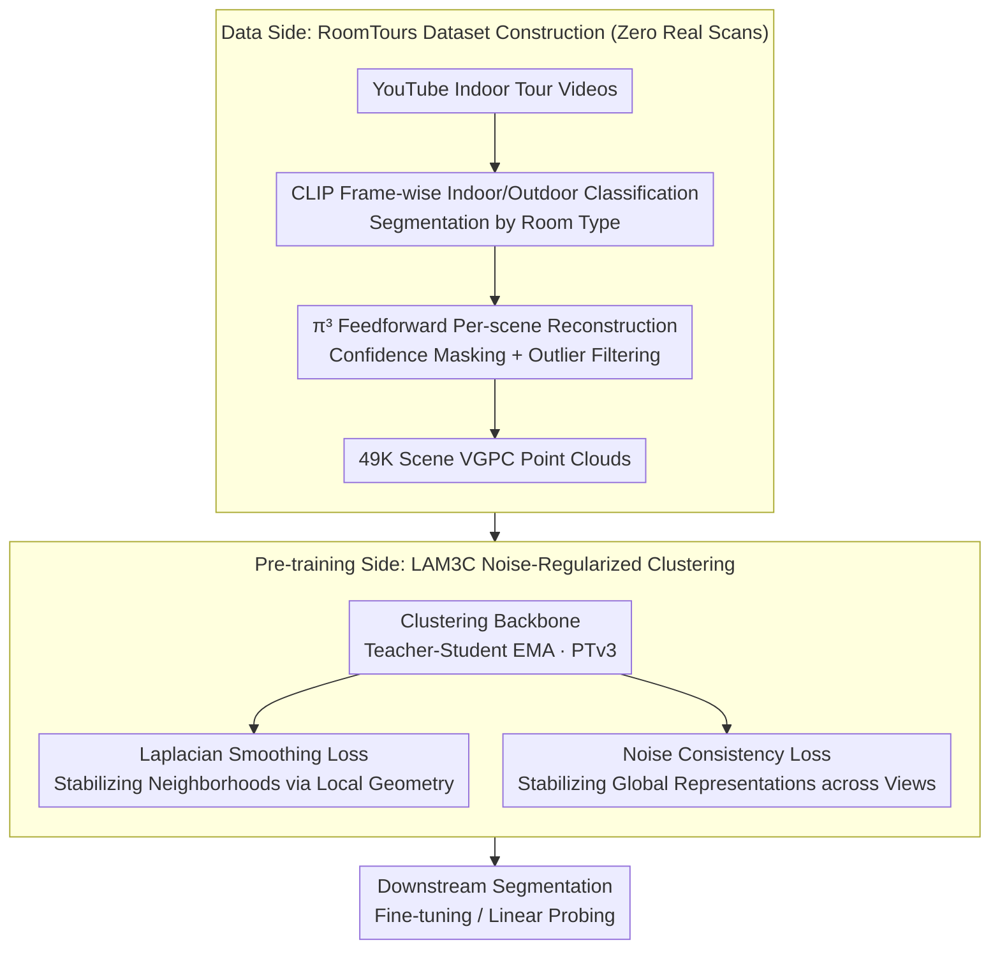

# 3D sans 3D Scans: Scalable Pre-training from Video-Generated Point Clouds

**Conference**: CVPR 2026  
**arXiv**: [2512.23042](https://arxiv.org/abs/2512.23042)  
**Code**: [https://github.com/ryosuke-yamada/lam3c](https://github.com/ryosuke-yamada/lam3c)  
**Area**: 3D Vision / Self-supervised Learning  
**Keywords**: 3D Self-supervised Learning, Video-Generated Point Clouds, Sinkhorn-Knopp Clustering, Noise Regularization, Indoor Scene Understanding

## TL;DR
The LAM3C framework demonstrates for the first time that Video-Generated Point Clouds (VGPC) reconstructed from unlabeled web videos (e.g., real estate tours) can substitute for real 3D scans in 3D self-supervised pre-training. By employing Laplacian smoothing and noise consistency losses to stabilize representation learning on noisy point clouds, combined with the self-constructed RoomTours dataset (49K scenes), the method matches or surpasses approaches using real scans in indoor semantic and instance segmentation.

## Background & Motivation

**Background**: 2D vision foundation models (e.g., DINOv2) have achieved significant success by leveraging massive unlabeled image datasets (1.7B+). However, 3D data is constrained by the high equipment and labor costs of 3D scanning—the largest current indoor scene datasets contain only approximately 5K unique scenes.

**Limitations of Prior Work**: Even state-of-the-art 3D-SSL methods like Sonata, which mix real and synthetic data, only reach a training scale of ~140K samples (with only 18K real 3D scans). This limited data scale prevents 3D-SSL from reaching the success levels seen in 2D vision. The data bottleneck is the fundamental limitation for progress in 3D self-supervised learning.

**Key Challenge**: Scarcity and high acquisition costs of 3D scene data vs. the requirement for large-scale data for 3D-SSL to succeed like 2D-SSL.

**Key Insight**: Platforms like YouTube host a vast number of indoor tour videos (real estate ads, apartment showcases). Recent feedforward 3D reconstruction models (e.g., $\pi^3$ and VGGT) can directly infer 3D structures from multi-view images with quality comparable to traditional SfM/MVS methods.

**Core Idea**: (1) Construct a large-scale Video-Generated Point Cloud (VGPC) dataset, RoomTours (49K scenes), from web videos without using any real 3D scans; (2) Design LAM3C, a noise-regularized clustering pre-training framework to make representation learning on imperfect/noisy point clouds feasible and stable.

## Method

### Overall Architecture
This paper aims to bypass the "3D scanning is expensive and scarce" deadlock. Instead of collecting real scans, it treats the massive amount of indoor tour videos on YouTube as a free 3D data mine, converted into point clouds via feedforward reconstruction models for pre-training. The challenge lies in the inherent noise of "Video-Generated Point Clouds" (VGPC)—blurring from camera shake, overlapping walls/floors, and large missing regions—which would cause standard 3D self-supervised clustering to collapse.

The pipeline consists of two parts. The data side: Tour videos searched via keywords are first classified frame-by-frame (indoor/outdoor) and segmented by room type using CLIP, then processed by $\pi^3$ feedforward reconstruction to generate colored point clouds per scene. After outlier filtering, the RoomTours dataset of 49,219 scenes is created. The pre-training side: Representation learning is performed on these noisy point clouds using a teacher-student clustering framework, supplemented by two noise-specific regularization terms (Laplacian smoothing for local stability and noise consistency for global stability). Finally, the learned PTv3 backbone is used for downstream segmentation fine-tuning or linear probing.

### Key Designs

**1. RoomTours Dataset Construction: Turning Unlabeled Web Videos into Large-scale 3D Point Clouds**

The bottleneck of 3D-SSL is data; the largest indoor scene sets comprise only about 5K unique scenes. This work breaks through by using YouTube tour videos as a data source. Tour channels are identified via multi-city keywords ("city, real-estate, walk-through"), manually screened, and automatically filtered by metadata to remove CG, drone, or short-form videos, totaling 3,462 videos supplemented by RealEstate10k, YouTube House Tours, and HouseTours. CLIP is used for zero-shot classification of indoor/outdoor frames, and indoor frames are segmented into clips based on room types (living room/bedroom/bathroom) with 0.5-second temporal smoothing. Each clip is processed by $\pi^3$ feedforward reconstruction (uniform frame sampling, mixed-precision forward pass), followed by confidence masking, edge suppression, and outlier removal. This yields 49,219 VGPC scenes, averaging ~5 minutes per scene. While visually similar to real scans, they contain noise from camera shake, overlapping surfaces, and holes.

**2. LAM3C Clustering Backbone: Teacher-Student Representation Learning on Noisy Point Clouds**

Pre-training utilizes a teacher-student architecture where the teacher is slowly updated via EMA. The base clustering objective combines three terms:

$$\mathcal{L}_{clustering} = w_u\mathcal{L}_{unmask} + w_m\mathcal{L}_{mask} + w_r\mathcal{L}_{roll}$$

The unmask term aligns student local features to teacher global features (via kNN matching), the mask term distills teacher global features into student masked global features, and the roll-mask term swaps global views for cross-view consistency (weights 4:2:2). This multi-level clustering followed the Sonata approach, but directly applying it to VGPC leads to unstable point-level embeddings due to noise. LAM3C introduces two regularization terms to address this.

**3. Laplacian Smoothing Loss: Pulling Noisy Points Toward Neighbors via Local Geometry**

The first instability is local: noisy point embeddings often deviate significantly from spatial neighbors. A kNN graph is constructed over the VGPC, weighting each edge by distance:

$$w_{ij} = \exp\!\left(-\|p_i-p_j\|^2/\sigma^2\right)$$

where $\sigma$ is the median kNN distance. This weight encourages spatially proximate points to produce similar embeddings:

$$R_{Lap} = \sum_{(i,j)\in E} w_{ij}\|z_i-z_j\|^2$$

Distant neighbors are truncated for robustness, and a Huber penalty replaces L2 to resist outliers. Since $w_{ij}$ decays exponentially with distance, true noise points (often further from valid neighbors) have reduced influence, allowing features to be smoothed along local geometry without being corrupted by outliers.

**4. Noise Consistency Loss: Ensuring Consistent Answers under Different Noisy Views**

The second instability is global: representations shift when the same scene is subjected to different augmentations or noise realizations. Two augmented views $x^{(a)}, x^{(b)}$ are generated from the same VGPC and fed to the EMA teacher and student, requiring consistency across the kNN-aligned point set $\mathcal{P}$:

$$R_{cons} = \frac{1}{|\mathcal{P}|}\sum_{(i,j)\in\mathcal{P}}\big\|g_{EMA}(x^{(a)})_j - f_\theta(x^{(b)})_i\big\|^2$$

This forces the model to output stable representations for the same point across different noise realizations. Laplacian smoothing stabilizes neighborhoods, while noise consistency anchors the global scene; both depend only on point relationships without requiring manual indoor priors. The total objective is:

$$\mathcal{L}_{total} = \mathcal{L}_{clustering} + \lambda R_{Lap} + \mu R_{cons}$$

During training, $\lambda$ increases linearly from 2e-4 to 3e-3, while $\mu$ is fixed at 0.05.

### Loss & Training
The backbone uses PTv3 (Base/Large). Pre-training runs for up to 437K steps using multi-level alignment with masked global and unmasked local views. The total loss $\mathcal{L}_{total}$ consists of clustering and the two noise regularization terms.

## Key Experimental Results

### Main Results (Indoor Semantic Segmentation mIoU, PTv3 Base, 100 epochs)

| Method | Pre-train Data | ScanNet LP | ScanNet FT | ScanNet200 FT | S3DIS FT |
|:---|:---|:---:|:---:|:---:|:---:|
| PTv3 (Scratch) | - | 16.1 | 74.7 | 32.0 | 67.8 |
| MSC | Real 7K | 21.8 | 78.2 | 33.4 | 69.9 |
| Sonata (Real only 15K) | Real 15K | 69.4 | 78.5 | 35.3 | 75.2 |
| Sonata (All) | Real 18K + Syn 121K | **72.5** | 79.4 | 36.8 | **76.0** |
| LAM3C (16K VGPC) | **Zero Real** | 58.9 | 75.6 | 32.8 | 71.9 |
| LAM3C (49K VGPC) | **Zero Real** | 66.0 | 77.7 | 35.1 | 72.9 |
| **LAM3C* (49K, Large)** | **Zero Real** | 69.5 | **79.5** | 35.9 | 75.5 |

LAM3C* (PTv3 Large + 437K steps) achieves 79.5% on ScanNet FT without any real 3D scans, **matching Sonata (18K real + 121K synthetic) at 79.4%**.

### Instance Segmentation Results
On S3DIS instance segmentation, LAM3C exceeds Sonata-real, which is trained only on real scans.

### Ablation Study (ScanNet LP/FT, PTv3 Base)

| Config | ScanNet LP | ScanNet FT | Description |
|:---|:---:|:---:|:---|
| Clustering Only | Unstable | Unstable | VGPC noise causes collapse |
| + Laplacian Smoothing | + Significant | + Improvement | Local feature stabilization |
| + Noise Consistency | + Further Gain | + Improvement | Global representation stabilization |
| 16K VGPC | 58.9 | 75.6 | Effect of data scale |
| **49K VGPC** | **66.0** | **77.7** | 3x data → 7 mIoU gain in LP |

### Key Findings
- **Zero Real Scans can Match/Exceed Real-scan Methods**: VGPC is a viable alternative data source for 3D-SSL, matching SOTA when scale and capacity are increased.
- **Data Scale is Crucial**: Increasing VGPC from 16K to 49K improved linear probing by 7 mIoU, confirming 3D-SSL follows "more data is better."
- **Dual Regularization is Essential**: Clustering alone is unstable on VGPC; Laplacian smoothing and noise consistency contribute independently and complementarily.
- LAM3C outperforms real-scan methods under 10% label fine-tuning on ScanNet.
- LAM3C remains competitive in instance segmentation tasks.

## Highlights & Insights
- **"3D sans 3D scans" Paradigm Shift**: Fundamentally changes the data acquisition path for 3D pre-training. YouTube is a near-infinite 3D source—49K is just the beginning.
- **General Noise Regularization**: Laplacian smoothing (local geometry) and noise consistency (global cross-view) do not rely on scene-specific priors, allowing generalization to any imperfect point cloud.
- **New Application for Feedforward Reconstruction**: Models like $\pi^3$/VGGT, originally for reconstruction, are now utilized to generate pre-training data for 3D-SSL.
- **Understanding 2D-3D Relationships**: The 3D geometric information embedded in videos is sufficient to support 3D representation learning, suggesting new avenues for joint 2D-3D pre-training.

## Limitations & Future Work
- Noise and holes in VGPC still limit the performance upper bound; improved feedforward models may enhance quality.
- RoomTours currently covers only indoor scenes; outdoor VGPC quality may be lower due to scale and dynamics.
- Data bias exists due to reliance on YouTube keywords.
- Larger scales (100K+) and longer schedules could unlock more potential.
- Temporal information in videos could be exploited as additional pre-training signals.

## Related Work & Insights
- **vs. Sonata**: Sonata relies on real+synthetic scans (18K+121K); LAM3C reaches comparable performance using zero real scans, offering better scalability.
- **vs. PointContrast/MSC**: Early 3D-SSL was limited by smaller real-scan datasets (1K-7K).
- **vs. PPT**: PPT uses synthetic data with supervised signals; LAM3C is purely self-supervised.
- **Insight**: Joint pre-training of 2D visual features and 3D reconstructed structures is a promising next step.

## Rating
- Novelty: ⭐⭐⭐⭐⭐ 
- Experimental Thoroughness: ⭐⭐⭐⭐⭐ 
- Writing Quality: ⭐⭐⭐⭐⭐ 
- Value: ⭐⭐⭐⭐⭐ 

<!-- RELATED:START -->

## Related Papers

- [\[CVPR 2026\] E-RayZer: Self-supervised 3D Reconstruction as Spatial Visual Pre-training](e-rayzer_self-supervised_3d_reconstruction_as_spatial_visual_pre-training.md)
- [\[CVPR 2026\] GaussianGrow: Geometry-aware Gaussian Growing from 3D Point Clouds with Text Guidance](gaussiangrow_geometry-aware_gaussian_growing_from_3d_point_clouds_with_text_guid.md)
- [\[CVPR 2026\] JOPP-3D: Joint Open Vocabulary Semantic Segmentation on Point Clouds and Panoramas](jopp3d_joint_open_vocabulary_semantic_segmentation.md)
- [\[CVPR 2026\] Ghosts in the Point Clouds: De-glaring LiDAR in the Transient Domain](ghosts_in_the_point_clouds_de-glaring_lidar_in_the_transient_domain.md)
- [\[CVPR 2026\] Edges Compete for Trust: Group Relative Edge Optimization for Building Reconstruction from Point Clouds](edges_compete_for_trust_group_relative_edge_optimization_for_building_reconstruc.md)

<!-- RELATED:END -->
