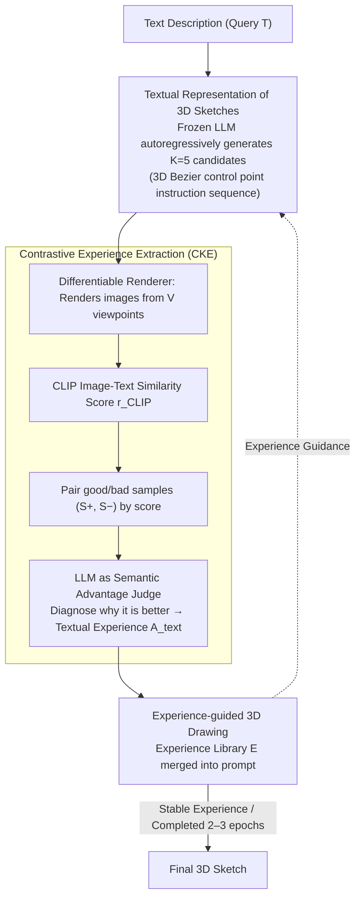

# 3DrawAgent: Teaching LLM to Draw in 3D with Early Contrastive Experience

**Conference**: CVPR 2026 Highlight  
**arXiv**: [2604.08042](https://arxiv.org/abs/2604.08042)  
**Code**: None (Based on LLM APIs)  
**Area**: 3D Vision / Generative AI  
**Keywords**: 3D Sketch Generation, LLM, Training-free, Contrastive Experience Optimization, Bezier Curves

## TL;DR
Proposes the training-free 3DrawAgent framework, which enables frozen LLMs to self-learn 3D spatial reasoning through "contrastive experience optimization." It generates language-driven 3D Bezier sketches in an autoregressive manner, achieving performance close to trained methods without parameter updates.

## Background & Motivation
**Background**: While progress has been made in language-driven 2D sketch generation (e.g., SketchAgent), 3D sketch generation remains largely unexplored. Existing 3D shape generation methods (diffusion or neural implicit methods) require explicit geometric supervision or extensive training.

**Limitations of Prior Work**:
   - Diffusion-based 3D sketching methods (Diff3DS, Dream3DVG) rely on SDS optimization, which is computationally intensive.
   - SketchAgent is limited to 2D coordinate spaces and cannot reason about depth and projection.
   - Training-free GRPO methods depend on scalar rewards or GT references, which are unsuitable for open-ended creative tasks.

**Core Idea**: LLMs possess strong sequential reasoning capabilities. Through carefully designed in-context prompts and self-contrastive feedback, an LLM can be "taught" to perform 3D drawing completely without gradient updates.

## Method

### Overall Architecture
The problem 3DrawAgent aims to solve is enabling a frozen LLM to learn to draw 3D sketches from textual descriptions without updating any parameters. It translates the "3D sketching" task into a text generation task that LLMs excel at—an LLM autoregressively outputs a sequence of control points for 3D Bezier curves. A differentiable renderer then renders these curves into images from multiple perspectives, and the LLM itself, alongside CLIP, scores these images to identify good and bad samples. The key to the process is not a single generation, but rather the consolidation of "what was good and what was bad" into a growing experience library. This experience is fed back into the prompt for the next generation round, allowing the LLM to improve iteratively—replacing gradients with "reading experience."

### Key Designs

**1. Textual Representation of 3D Sketches: Mapping Geometric Problems to Familiar Text Spaces**

3D shape generation typically requires cross-modal transitions (text → geometric supervision → rendering). Since the strength of LLMs lies in sequential reasoning, this design allows the LLM to work entirely within the text domain: each stroke is written as a structured instruction $a_t = \text{draw\_bezier}[(\mathbf{P}^{(0)}, \mathbf{P}^{(1)}, \mathbf{P}^{(2)}, \mathbf{P}^{(3)})]$, where each control point $\mathbf{P}^{(k)} \in \mathbb{R}^3$ is a 3D coordinate. The entire sketch is an action sequence $\mathcal{A} = \{a_1, \dots, a_N\}$. To ensure the LLM outputs valid, renderable coordinates, the prompt specifies role instructions, output formatting standards, data type constraints, coordinate system definitions, a GT example, and boundary rules. Thus, the LLM neither learns a new modality nor requires a geometric decoder; drawing is reduced to "formatted sequence completion."

**2. Contrastive Experience Extraction (CKE): Using Paired Samples Instead of Gradients and Scalar Rewards**

This is the core of the paper. Training-free GRPO-like methods rely on scalar rewards or GT references, which are inapplicable to open-ended creation. CKE generalizes this to a paired contrastive setting: for each query, $K=5$ candidate sketches are sampled. CLIP calculates the image-text similarity across $V$ viewpoints as a quality score:

$$r_{\text{CLIP}} = \frac{1}{V}\sum_{v=1}^{V} \cos\!\big(E_I(I_v),\, E_T(\mathcal{T})\big)$$

Contrastive pairs $(\mathcal{S}_i^+, \mathcal{S}_j^-)$ (where $r_i > r_j$) are then formed and given to the LLM acting as a "semantic advantage judge" to analyze why one is better—whether it is more continuous curvature or more symmetrical structure. The textual diagnosis $A^{\text{text}}$ produced by the LLM is added to the experience library $\mathcal{E} \leftarrow \text{Update}(\mathcal{E}, A^{\text{text}})$. This loop requires no GT 3D sketches, no backpropagation, and no structured group rollout, relying entirely on the LLM's self-observation and reasoning.

**3. Experience-guided 3D Drawing: Re-injecting Consolidated Experience as Prompts for Cumulative Improvement**

Extracting experience is insufficient; it must influence the next generation cycle. Here, the experience library $\mathcal{E}$ is directly concatenated into the context window as an additional prompt segment, making the generation distribution conditional on experience: $o = p_\theta(o \mid \mathcal{T}, \mathcal{E})$. The experiences encode transferable geometric principles (curvature continuity, symmetry preservation, etc.) rather than being object-specific. As cycles accumulate, the LLM internalizes these 3D perception strategies as default behaviors—the source of "progress without gradients."

### A Complete Example: Improving Step-by-Step

Take "drawing a chair" as an example. In Round 0, the experience library is empty. The LLM draws using the bare prompt; CLIP-ST is only 0.5735, with imbalanced proportions between legs and backrest. Entering CKE: 5 candidates are sampled, ranked by CLIP, and the highest and lowest scores are paired for the LLM judge. The LLM diagnoses that "the low-score one has uneven legs and an open seat surface," and records "maintain leg symmetry and seat topological closure" into the experience library. In Round 1, drawing with this experience, the score jumps to 0.6461. By Round 2, the experience further covers control point precision and format self-checking, peaking at 0.6643. However, by Round 3, the LLM starts "over-reasoning" and overfitting to the experience, causing the score to drop to 0.6428—which is why the process typically stops after 2–3 epochs.

### Loss & Training
- **Completely Training-free**: Frozen LLMs (DeepSeek-V3.2-Exp / Gemini-2.5Pro) are used with no parameter updates.
- During contrastive extraction, a temperature of 0.7 encourages candidate diversity; during inference generation, a temperature of 0.3 pursues stable quality.
- Experience extraction reaches its peak in approximately 2–3 epochs, after which performance slightly declines due to LLM over-reasoning.
- Requires only a single RTX 3090 (with the main computational cost being LLM API calls).

## Key Experimental Results

### Main Results

| Method | Training Required | CLIP-ST (Category) | AES (Category) | CLIP-ST (Fine-grained) | AES (Fine-grained) |
|------|--------|------|------|------|------|
| Diff3DS | ✓ | 0.648 | 3.791 | 0.650 | 3.770 |
| Dream3DVG | ✓ | 0.660 | 4.150 | 0.670 | 4.174 |
| **3DrawAgent (Gemini)** | **✗** | **0.649** | **4.161** | **0.669** | **4.175** |

### Ablation Study

| Configuration | Ep0 | Ep1 | Ep2 | Ep3 | Description |
|------|-----|-----|-----|-----|------|
| W/O CKE (Baseline) | 0.5735 | - | - | - | No experience baseline |
| W/ CKE | 0.5735 | 0.6461 | **0.6643** | 0.6428 | Improvement then decline |
| K=2 | 0.5735 | 0.5947 | 0.6493 | - | Insufficient contrast |
| K=5 (Default) | 0.5735 | 0.6461 | **0.6643** | - | Optimal balance |
| K=10 | 0.5735 | 0.6135 | 0.5612 | - | Excessive noise |
| W/O GT | 0.5735 | 0.6461 | **0.6643** | - | Independent of GT |
| W/ GT | 0.5735 | 0.6648 | 0.6552 | - | Faster start, lower sustainability |

### Key Findings
- The training-free method is close to or even comparable with training-based methods: CLIP-ST differs by only 0.001, and AES is similar.
- CKE is effective: Improvement from 0.5735 to 0.6643 (+15.8%).
- GT references are not needed: Self-supervised signals (CLIP) are sufficiently effective.
- User study: The 46.66% preference rate significantly leads over Dream3DVG (36.67%) and Diff3DS (16.67%).
- Experience analysis shows a clear learning progression: Basic shape construction → Spatial awareness → Control point precision → Format self-verification.

## Highlights & Insights
- **New Paradigm**: The LLM serves as both generator and judge, achieving self-improvement through self-criticism without any training.
- **Interesting Experience Evolution**: The progression from geometric correctness to spatial expressiveness and then to format self-verification exhibits a human-like learning curve.
- **High Practicality**: Requires only an LLM API + single GPU, significantly lowering the entry barrier.
- Statistical analysis of 200 rollouts reveals behavior patterns of LLMs generating 3D content.

## Limitations & Future Work
- Performance declines after 2-3 epochs due to "over-reasoning"; how to sustain improvement?
- Generation quality is limited by the upper bound of the LLM’s own spatial reasoning capabilities.
- Bezier curve representation is limited, making complex topologies difficult to express.
- Contrastive evaluation relies on CLIP, which may not be precise enough for 3D sketch assessment.
- Generation speed is constrained by LLM API latency.

## Related Work & Insights
- Extending the 2D sketch paradigm of SketchAgent to 3D is a natural and elegant generalization.
- The generalization from Training-free GRPO to Contrastive Experience Optimization is noteworthy and potentially applicable to other creative tasks.
- The potential of LLMs as 3D spatial reasoners warrants further deep exploration.

## Rating
- Novelty: ⭐⭐⭐⭐⭐ Training-free 3D sketch generation + contrastive experience optimization is a brand new paradigm.
- Experimental Thoroughness: ⭐⭐⭐⭐ Detailed ablation studies and in-depth statistical analysis.
- Writing Quality: ⭐⭐⭐⭐ Method is clear, although some details are in the appendix.
- Value: ⭐⭐⭐⭐ Highly inspirational, though the 3D sketching application is relatively niche.

<!-- RELATED:START -->

## Related Papers

- [\[CVPR 2026\] NTK-Guided Implicit Neural Teaching](ntk-guided_implicit_neural_teaching.md)
- [\[CVPR 2026\] ArtLLM: Generating Articulated Assets via 3D LLM](artllm_generating_articulated_assets_via_3d_llm.md)
- [\[CVPR 2026\] 3D-IDE: 3D Implicit Depth Emergent](3d-ide_3d_implicit_depth_emergent.md)
- [\[CVPR 2026\] ActionMesh: Animated 3D Mesh Generation with Temporal 3D Diffusion](actionmesh_animated_3d_mesh_generation_with_temporal_3d_diffusion.md)
- [\[CVPR 2026\] AnchorSplat: Feed-Forward 3D Gaussian Splatting with 3D Geometric Priors](anchorsplat_feed-forward_3d_gaussian_splatting_with_3d_geometric_priors.md)

<!-- RELATED:END -->
