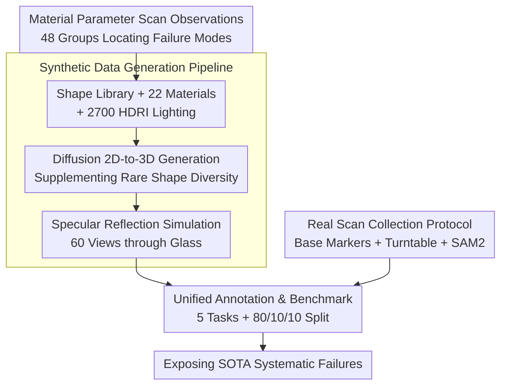

# 3DReflecNet: A Large-Scale Dataset for 3D Reconstruction of Reflective, Transparent, and Low-Texture Objects

**Conference**: CVPR 2026  
**arXiv**: [2605.10204](https://arxiv.org/abs/2605.10204)  
**Code**: None (The paper states it will be released with the dataset and benchmarks; the repository address is not provided in the text)  
**Area**: 3D Vision / Datasets & Benchmarks  
**Keywords**: 3D Reconstruction, Reflective and Transparent Objects, Physical Rendering, Multi-view Benchmark, Dataset

## TL;DR
3DReflecNet constructs a hybrid dataset exceeding 22 TB, containing over 120k synthetic instances and 1,000+ real scans with a total of 7M+ multi-view frames. It specifically targets three challenging material categories that "break photometric consistency assumptions"—reflective, transparent, and low-texture—and provides benchmarks for five major tasks. Experiments systematically expose the catastrophic failure of current SOTA reconstruction methods on these materials.

## Background & Motivation

**Background**: Multi-view 3D reconstruction is a fundamental capability for robotics, AR/VR, autonomous driving, and digital content production. The NeRF series and recent 3D Gaussian Splatting (3DGS) have pushed the reconstruction quality and rendering efficiency of well-textured, Lambertian surfaces to high levels.

**Limitations of Prior Work**: Once encountering specular reflections, transparent refractions, or low-texture surfaces, these methods fail extensively—the color/appearance of the same point becomes inconsistent across different viewpoints, leading to floaters, geometric misalignment, and rendering artifacts. The problem lies not in engineering implementation but in two underlying assumptions typically held by nearly all SfM/MVS pipelines: (i) photometric consistency (the appearance of the same surface point remains constant across views), and (ii) discriminative appearance features across views. Reflection makes appearance view-dependent (governed by BRDF), low texture leaves correspondence matching devoid of high-frequency features, and transparency is even more destructive—refraction directly violates the epipolar geometry constraints upon which multi-view triangulation depends.

**Key Challenge**: There is a fundamental mismatch between algorithmic assumptions (view-invariant Lambertian-like surfaces) and real-world light transport (view-dependent, transmission, refraction). However, existing datasets precisely avoid this mismatch: DTU, CO3D, and MVImgNet predominantly feature Lambertian textured objects. While OpenMaterial introduces physical rendering based on measured refractive indices, it is **purely synthetic, lacks real-world noise and motion, and has narrow task coverage**. Consequently, the community lacks both a metric to quantify "where methods fail" and materials to train new "physics-aware" methods.

**Goal**: To create a dataset and benchmark that simultaneously satisfies "challenging materials, large scale, synthetic-real hybrid, and comprehensive tasks," thereby quantitatively exposing these systematic failure modes.

**Key Insight**: The authors first conducted a controlled variable experiment (scanning 48 sets of material parameters) to prove that failures are "systematic and predictable by material parameters" rather than sporadic cases—providing the motivational basis for building a dataset specifically for difficult materials.

**Core Idea**: Generate data using a three-way hybrid approach: "physically-based rendering (PBR) synthesis + diffusion-based generation for shape diversity + commercial device real scanning." It explicitly incorporates three difficult material types—reflective (captured through glass), transparent, and low-texture—accompanied by five standard task benchmarks to push the failure boundaries of current methods.

## Method

### Overall Architecture
The "method" of 3DReflecNet is essentially a pipeline for **dataset construction + benchmark evaluation**. Two sub-datasets—synthetic and real-scan—are integrated into the same benchmark through a unified asset creation and annotation process. The synthetic set uses PBR in Blender to render shape libraries and diffusion-generated shapes with 22 material types and 2700+ HDRI lighting conditions into photo-realistic multi-view images. The real set uses an iPhone 16 Pro on a rotating platform to scan real hard-material objects. Both are eventually split into standard "Train/Val/Test = 80%/10%/10%" partitions for five task benchmarks: image matching, SfM, New View Synthesis (NVS), reflection removal, and relighting.

### Key Designs

**1. Material Parameter Scanning: Quantifying "What Drives Failure"**

A dataset paper must explain why its materials are important. The authors answer this with a clean controlled experiment: fixing a model and systematically scanning four key PBR parameters—metallic (0 or 1), roughness (0–0.9), IOR (Index of Refraction, 1.0–1.9), and transmission (0 or 1), totaling 48 configurations. 3DGS is trained for each group using 50 multi-view images with foreground masks, and PSNR is calculated on 10 held-out views. The conclusion is that failures are **predictable by material parameters**, showing three modes: ① Smooth reflective (roughness=0) metals achieve only ~19 dB PSNR, while high-roughness non-metals achieve ~35 dB, a ~45% difference; ② Low roughness "starves" correspondence matching of texture cues; as roughness increases from 0.0 to 0.9, PSNR improves by ~5 dB; ③ Transparency is the most severe mode, causing an average drop of 5.82 dB (~19.3% in quality), and it worsens as the IOR increases—transparent object PSNR rises from 19.9 dB at IOR=1.0 to 27.9 dB at IOR=1.9, confirming that stronger refraction disrupts epipolar geometry. These observations form the foundation: failures are not edge cases but systematic issues stemming from oversimplified light transport models.

**2. Unified Asset Creation Pipeline: Dual-Source Shapes from PBR + Diffusion**

The synthetic side must ensure both "optical realism" and "shape diversity." On one hand, the authors collected 10k+ high-quality shapes (covering artistic, industrial, and natural domains) from scanning libraries and 3D asset bases, rendered using Blender’s PBR engine. 22 materials are grouped into five categories: Diffuse, Transparent, Metallic, Glossy-Textured, and Glossy-Low-Texture, paired with 2700+ HDRI environment maps (indoor/outdoor, different times, different weather) plus 1–2 upper-hemisphere point lights to simulate local illumination. Each instance is rendered from 60 multi-views at $1000\times1000$ resolution, with full ground truth including point clouds/meshes, segmentation masks, dense depth maps, and surface normal maps. On the other hand, to break the ceiling of fixed shape libraries, a **diffusion-driven 2D→3D generation** branch was created: real images and GPT-4o-generated 2D reference images are processed via estimated normals and depth → mesh reconstruction → canonical pose normalization to generate 2k+ daily object shapes, which are then fed into the same PBR+HDR rendering pipeline. Each object is paired with different materials/lighting, yielding 120k+ synthetic instances.

**3. Multi-view Specular Reflection Simulation: Placing Glass between Object and Camera**

Specular reflection is a typical hard case for "view-dependent appearance," but previous work (reflection removal data) mostly captured single-view images through glass under limited lighting. The authors expanded this setup to multi-view: placing a glass plate between the object and the camera so the glass reflects the environment. Data is collected from **60 different angles and hundreds of lightings**, systematically generating complex view-dependent reflection effects. The resulting data naturally violates photometric consistency—environmental reflections shifting with the viewpoint are superimposed on the object point imaging, providing ideal material to stress-test image matching, SfM, and NVS.

**4. Real Collection Protocol: Decoupling "Pose Estimation" from "Hard-Material Objects"**

The core difficulty of real scanning is that reflective/low-texture objects lack stable, view-invariant features, causing standard camera pose estimation to fail. Without reliable poses, there is no ground truth. The authors' clever solution is to decouple the pose estimation task from the object: placing the target object on a **highly detailed base** that acts as a stable tracking marker. The entire setup is placed on a rotating platform to ensure a smooth, stable 360° capture trajectory (iPhone 16 Pro, $1080\times1920$, 30 FPS). During processing, RealityScan is used to track the base texture for robust camera pose estimation, and SAM 2 is used to segment out the base and background. Thus, "hard objects" obtain accurate poses without participating in the pose solving itself. The final real set contains 300+ shapes, >50 materials, and 1000+ instances.

**5. Five-Task Standard Benchmark: Turning Failures into Comparable Numbers**

The authors established benchmarks for five tasks on synthetic and real scenes: (i) Image matching under photometric inconsistency (using AUC@5°/10°/20°); (ii) SfM for non-Lambertian/low-texture surfaces (evaluating camera parameter recovery, deliberately removing backgrounds to prevent "cheating" and forcing the method to rely on intrinsic object features); (iii) NVS under complex materials (reporting PSNR grouped by five material types); (iv) Reflection and highlight removal; (v) Object relighting. Surface reconstruction is additionally evaluated using Chamfer Distance. The value of this benchmark lies in turning the qualitative impression that "methods perform worse on hard materials" into comparable numbers across materials and tasks.

## Key Experimental Results

### Dataset Scale and Comparison

| Dimension | Synthetic Set | Real Set |
| :--- | :--- | :--- |
| #Shapes | 12k+ | 300+ |
| #Materials | 22 | >50 |
| #Lighting | 2700+ | 5 |
| #Instances | 120k+ | 1000+ |
| #Views/Instance | 60 | 100+ |
| #Frames | 7M+ | 120k+ |

Compared to similar datasets, 3DReflecNet is the only one to check all boxes: "Transparent + Reflection + Low-Texture + Relighting + PBR + Real Data." OpenMaterial (1001 instances) has reflections but is purely synthetic with narrow tasks; NeRO has only 8 instances; ABO/Objaverse are large but lack physically plausible material simulations.

### Image Matching Benchmark (Table 3, AUC↑; parentheses show control results on MegaDepth)

| Method | AUC@5° | AUC@10° | AUC@20° |
| :--- | :--- | :--- | :--- |
| SuperPoint + SuperGlue | 15.2 (49.7) | 31.0 (67.1) | 39.9 (80.6) |
| LoFTR | 19.8 (52.8) | 35.6 (69.2) | 39.2 (81.2) |
| ELoFTR | 21.3 (56.4) | 36.2 (72.2) | 41.9 (83.5) |
| ROMA (Best) | **32.1 (62.6)** | **47.5 (76.7)** | **59.1 (86.3)** |

Even the strongest, ROMA, only achieves an AUC@5° of 32.1 on 3DReflecNet compared to 62.6 on MegaDepth—the same method's performance drops by nearly half, illustrating the difficulty of establishing accurate correspondences under hard materials.

### New View Synthesis (Table 4, PSNR↑ by Material)

| Method | Diffuse | Transparent | Metallic | Glossy-Textured | Glossy-Low-Tex |
| :--- | :--- | :--- | :--- | :--- | :--- |
| Instant-NGP | 36.12 | 19.20 | 25.59 | 34.01 | 26.52 |
| 3DGS | 36.99 | 20.20 | 27.02 | 34.10 | 27.62 |
| Splatfacto | 37.32 | 21.31 | 28.61 | 34.21 | 28.01 |
| 2DGS | 36.77 | 17.12 | 28.46 | 34.42 | 27.97 |

All methods exceed 36 dB on Diffuse but drop to ~17–21 dB on Transparent. Metallic and Glossy-Low-Texture also show significant declines due to strong specular reflections.

### Surface Reconstruction (Table 5, Chamfer Distance↓)

| Method | Diffuse | Transparent | Metallic | Glossy-Textured | Glossy-Low-Tex |
| :--- | :--- | :--- | :--- | :--- | :--- |
| 2DGS | 0.060 | 0.142 | 0.121 | 0.086 | 0.098 |
| PGSR | 0.062 | 0.502 | 0.412 | 0.162 | 0.228 |

While triangulation errors are small on Diffuse, PGSR's CD on Transparent spikes to 0.502 (about 8x that of Diffuse), confirming geometric collapse on non-Lambertian surfaces.

### Key Findings
- **Failures are predictable by material parameters**: Scanning 48 groups shows transparency causes an average drop of 5.82 dB (19.3%); smooth metal drops ~45% relative to high-roughness non-metals; higher IOR leads to worse results.
- **Transparency is the most fatal mode**: It violates both photometric consistency and the "straight-line light" geometric assumption; refraction causes epipolar constraints to fail, leading to near-total collapse in NVS and reconstruction.
- **Low texture "starves" matching**: Lack of high-frequency features in low roughness leads to a ~5 dB PSNR recovery when roughness increases from 0 to 0.9.
- **Consistency between synthetic and real**: SOTA performance is similarly poor across reflection removal, relighting, and real data, validating the physical realism of the benchmark.

## Highlights & Insights
- **Falsification before construction**: Using 48 groups of clean parameter scans turns the notion that "hard materials cause failure" from a slogan into a quantifiable, predictable law.
- **Multi-view glass capture** is a low-cost, high-fidelity reflection generation method: Instead of complex light-field equipment, expanding a single-view de-reflection setup to 60 views yields view-dependent reflection material.
- **Decoupled pose and object protocol**: Using a high-detail base for tracking + turntable + RealityScan for poses + SAM 2 for segmentation bypasses the deadlock where "hard objects cannot be used for pose estimation."
- **Diffusion 2D→3D for shape diversity**: Using GPT-4o for 2D references then generating 3D expands the dataset from a fixed library to generative expansion, while naturally providing text descriptions for generative tasks.

## Limitations & Future Work
- **Benchmark only tests existing methods**: The paper focuses on "exposing failures + setting benchmarks" rather than proposing new reconstruction models; physics-aware methods remain future work.
- **Small real set and limited lighting**: The real set has only 5 lighting conditions—far fewer than the synthetic set's 2700+, making real-domain lighting diversity a weakness.
- **Some task results relegated to appendix**: Reflection removal, relighting, and real data evaluations are only briefly mentioned in the main text.
- **Geometric truth of diffusion assets**: Meshes generated from diffusion 2D→3D may contain intrinsic geometric errors, requiring caution when used as "ground truth."

## Related Work & Insights
- **vs OpenMaterial**: OpenMaterial uses measured IOR for PBR, a key step for synthetic hard materials, but it is purely synthetic and has narrow tasks. This work provides both synthetic and real data across five tasks and explicitly includes low texture.
- **vs DTU / Tanks and Temples**: These classic MVS benchmarks are Lambertian-heavy and fail to expose non-Lambertian failures; 3DReflecNet makes material complexity a first-class citizen.
- **vs NeRO / MV Reflectance**: These focus on reflections but have extremely small object diversity (NeRO has only 8 instances), making it hard to support large-scale benchmarks.
- **vs Objaverse / ABO**: These have massive shape/appearance scale but lack physically plausible material-lighting simulation and unified multi-view ground truth.

## Rating
- Novelty: ⭐⭐⭐⭐ While not a new algorithm, the combination of "hard materials + synthetic-real hybrid + five-task benchmark + parameter scanning for motivation" is a clear increment at the dataset level.
- Experimental Thoroughness: ⭐⭐⭐⭐ Covers multiple tasks and methods with material-specific evaluations; some data is relegated to the appendix.
- Writing Quality: ⭐⭐⭐⭐ Clear logic chain from motivation to observation to construction to benchmark.
- Value: ⭐⭐⭐⭐⭐ Hard material reconstruction is a real pain point; the 22 TB scale and five-task benchmark are highly valuable for pushing physics-aware 3D vision.

<!-- RELATED:START -->

## Related Papers

- [\[CVPR 2026\] OLATverse: A Large-scale Real-world Object Dataset with Precise Lighting Control](olatverse_a_large-scale_real-world_object_dataset_with_precise_lighting_control.md)
- [\[CVPR 2026\] SpatialVID: A Large-Scale Video Dataset with Spatial Annotations](spatialvid_a_large-scale_video_dataset_with_spatial_annotations.md)
- [\[CVPR 2026\] Opti-NeuS: Neural Reconstruction for Dual-Layered Transparent and Opaque Objects](opti-neus_neural_reconstruction_for_dual-layered_transparent_and_opaque_objects.md)
- [\[CVPR 2026\] Ego-1K: A Large-Scale Multiview Video Dataset for Egocentric Vision](ego-1k_--_a_large-scale_multiview_video_dataset_for_egocentric_vision.md)
- [\[CVPR 2026\] SceneScribe-1M: A Large-Scale Video Dataset with Comprehensive Geometric and Semantic Annotations](scenescribe-1m_a_large-scale_video_dataset_with_comprehensive_geometric_and_sema.md)

<!-- RELATED:END -->
