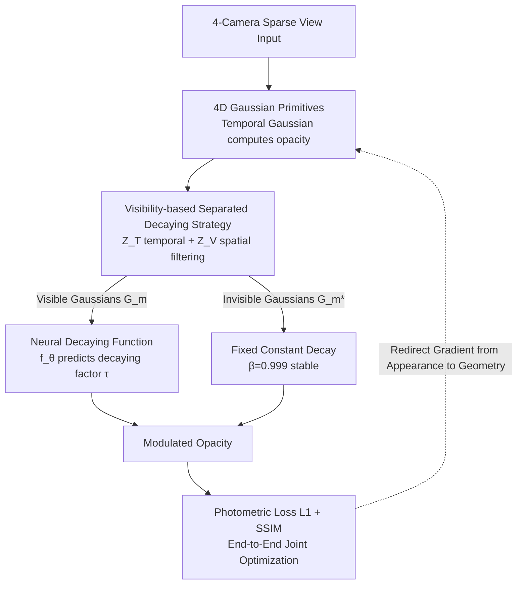

# 4C4D: 4 Camera 4D Gaussian Splatting

**Conference**: CVPR 2026  
**arXiv**: [2604.04063](https://arxiv.org/abs/2604.04063)  
**Code**: [Project Page](https://junshengzhou.github.io/4C4D)  
**Area**: 3D Vision  
**Keywords**: 4D Gaussian Splatting, Sparse Views, Dynamic Scene Reconstruction, Neural Decaying Function, Geometry-Appearance Balance

## TL;DR
The 4C4D framework is proposed to adaptively control Gaussian opacity decay through a Neural Decaying Function. This addresses the imbalance between geometry and appearance learning in sparse (only 4 cameras) 4D Gaussian Splatting, achieving SOTA performance on multiple datasets.

## Background & Motivation
**Background**: Novel view synthesis of 4D dynamic scenes typically requires dense camera arrays (dozens to hundreds), which limits everyday use. 3DGS/4DGS perform excellently under dense view conditions.

**Limitations of Prior Work**: 4DGS fails significantly under extremely sparse views (e.g., 4 cameras). The reason lies in **optimization bias**: fitting appearance (color) is relatively easy, but recovering accurate geometry (depth) is extremely difficult under insufficient supervision. Current Gaussian formulations cannot balance the two.

**Key Challenge**: Insufficient spatial supervision in sparse views → inadequate geometry learning → overfitting to training viewpoint appearance → severe artifacts in novel views.

**Key Insight**: 4DGS accurately reproduces appearance on training viewpoints, but the depth geometry is highly distorted (see Fig.3). This indicates the problem is not model capacity but optimization bias.

**Core Idea**: Introduce a learnable opacity decaying function to redirect optimization gradients toward geometry learning.

## Method

### Overall Architecture
4C4D aims to solve the problem where 4DGS focuses entirely on fitting training view colors when only 4 cameras are available, leaving geometry (depth) virtually unlearned, which leads to collapse at novel viewpoints. The approach does not modify the 3D representation itself but attaches a **learnable decaying factor** to the opacity of each 4D Gaussian to alter the gradient flow during optimization. The pipeline is as follows: 4D Gaussian primitives first calculate the opacity based on the original temporal Gaussian; the neural decaying function $f_\theta$ reads the attributes of each Gaussian to predict a decaying factor $\tau$ to modulate it. A separation strategy "effective only for currently visible Gaussians" is overlaid. Finally, the decaying function and 4D Gaussians are optimized end-to-end using standard photometric rendering loss.

### Key Designs

**1. Neural Decaying Function: Modulating opacity with a lightweight network to redirect gradients from appearance to geometry**

Under sparse views, appearance (color) is easily fitted while geometry (depth) is hard to recover; 4DGS defaults to the "easiest" path—memorizing training view colors at the cost of geometry. The key observation is that opacity is the pivotal parameter for geometry learning in 4DGS, determining visibility. 4C4D uses a lightweight MLP $f_\theta$ that inputs each Gaussian's position, opacity, and rotation to predict a decaying factor $\tau = f_\theta(x, y, z, o, r)$, which modulates the original temporal Gaussian opacity:

$$o(\tilde{t}) = \tau \cdot \exp\left(-\frac{1}{2}\frac{(\tilde{t} - \mu_t)^2}{\Sigma_{4,4}}\right) \cdot o$$

This additional learnable degree of freedom prevents backpropagation gradients from focusing solely on appearance errors, forcing more flow into geometric parameters like position and scale, thus re-balancing geometry and appearance optimization.

**2. Separated Decaying Strategy: Only active Gaussians participate in learning, inactive ones remain stable**

Applying the decaying function to all Gaussians is problematic: rendering a specific frame/view only provides gradients to currently visible Gaussians. Modulating Gaussians that are neither in the field of view nor temporally relevant would distort optimization. 4C4D first performs visibility detection to filter the set of Gaussians $G_m = Z_V(\tilde{v}, \sigma, Z_T(\tilde{t}, s_t, G))$ truly participating in rendering. $Z_T$ filters Gaussians whose temporal span does not include the current step, and $Z_V$ filters those whose centers fall outside the current view. The two categories are processed differently:

$$\tau(g) = \begin{cases} f_\theta(x,y,z,o,r) & \text{if } g \in G_m \\ \beta=0.999 & \text{if } g \in G_m^* \end{cases}$$

Visible Gaussians are precisely learned by the neural decaying function, while invisible Gaussians are assigned a small constant decay $\beta=0.999$ to maintain stability and avoid being misled by irrelevant gradients—consistent with observations in AbsGS.

### Loss & Training
- Uses only standard photometric rendering loss (L1 + SSIM) without additional geometric supervision.
- The neural decaying function and 4D Gaussians are optimized end-to-end.
- 4D Gaussians inherit temporal attributes ($\mu_t$, $s_t$) and 4D spherical harmonics from 4DGS.

## Key Experimental Results

### Main Results

| Dataset | Metric | 4C4D | 4DGS | 4DGaussians | Ex4DGS | Gain (vs Best) |
|--------|------|------|------|-------------|--------|------|
| Neural3DV | PSNR↑ | **22.29** | 20.60 | 20.82 | 19.33 | +1.47 |
| Neural3DV | LPIPS↓ | **0.146** | 0.244 | 0.190 | 0.239 | +23.2% |
| ENeRF-Outdoor | PSNR↑ | **24.32** | 23.52 | 18.21 | 21.89 | +0.80 |
| ENeRF-Outdoor | LPIPS↓ | **0.121** | 0.151 | 0.456 | 0.263 | +19.9% |
| Mobile-Stage | PSNR↑ | **22.36** | 22.15 | 20.15 | 17.85 | +0.21 |
| Mobile-Stage | LPIPS↓ | **0.121** | 0.180 | 0.226 | 0.260 | +32.8% |

### Ablation Study

| Configuration | PSNR↑ | DSSIM1↓ | LPIPS↓ | Note |
|------|-------|---------|--------|------|
| No Neural Decaying | 22.60 | 0.097 | 0.147 | Fixed decay insufficient |
| No Visibility Detection | 24.49 | 0.075 | 0.127 | No distinction between vis/invis |
| Full Model | **24.68** | **0.070** | **0.115** | Complementary components |
| Constant Decaying | 24.31 | 0.075 | 0.125 | Inferior to learnable decay |
| Exponential Decaying | 24.32 | 0.077 | 0.135 | Manual function sub-optimal |
| Power Function Decaying | 24.35 | 0.074 | 0.124 | Still inferior to MLP |
| **Neural Decaying (Ours)** | **24.68** | **0.070** | **0.115** | Learns optimal strategy |

### Key Findings
- High-fidelity 4D reconstruction is achievable with only 4 cameras, significantly lowering the capture barrier compared to dense array methods.
- Neural vs. Constant Decaying: PSNR +0.37, LPIPS -0.010, proving adaptive decay is superior to fixed strategies.
- Visibility separation strategy contribution: PSNR +0.19, LPIPS -0.012.
- Improvements are most significant in complex outdoor scenes (ENeRF-Outdoor).
- The self-captured dataset Dyn4Cam (4 GoPros, <$1500) generates temporally consistent 4D dynamics.

## Highlights & Insights
- **Profound Problem Analysis**: Clearly identifies the root cause of 4DGS sparse view failure as the geometry-appearance optimization imbalance, rather than model capacity.
- **Elegant Solution**: Does not alter the 3D representation; benefits significantly by merely redirecting gradient directions via opacity modulation.
- **High Practical Value**: Enables 4D capture with 4 GoPros (<$1500), truly moving towards consumer-level application.
- **Separated Handling**: The distinction between visible and invisible Gaussians is a critical detail that is easily overlooked.

## Limitations & Future Work
- Occlusion blind spots still exist with only 4 viewpoints; scenes with severe self-occlusion remain difficult to handle.
- The neural decaying function introduces slight computational overhead.
- Potential integration with depth priors (e.g., MiDaS) has not yet been explored.
- Dyn4Cam lacks ground truth test views for quantitative evaluation.

## Related Work & Insights
- Observations on constant decay for invisible Gaussians align with those in AbsGS.
- MVDream's view-dilation attention might be applicable to this scenario.
- The "gradient redirection" concept could be applied to other imbalanced optimization problems, such as sparse-view NeRF.

## Rating
- Novelty: ⭐⭐⭐⭐ Clear core idea, though not revolutionary.
- Experimental Thoroughness: ⭐⭐⭐⭐⭐ Solid evaluation across 4 datasets, detailed ablation, and self-captured data.
- Writing Quality: ⭐⭐⭐⭐ Effective problem analysis and concise methodology.
- Value: ⭐⭐⭐⭐ Significant implications for consumer-grade 4D capture.

<!-- RELATED:START -->

## Related Papers

- [\[CVPR 2026\] FastEventDGS: Deformable Gaussian Splatting for Fast Dynamic Scenes from a Single Event Camera](fasteventdgs_deformable_gaussian_splatting_for_fast_dynamic_scenes_from_a_single.md)
- [\[CVPR 2026\] Mark4D: Temporally-Consistent Watermarking for 4D Gaussian Splatting](mark4d_temporally-consistent_watermarking_for_4d_gaussian_splatting.md)
- [\[CVPR 2026\] GP-4DGS: Probabilistic 4D Gaussian Splatting from Monocular Video via Variational Gaussian Processes](gp-4dgs_probabilistic_4d_gaussian_splatting_from_monocular_video_via_variational.md)
- [\[CVPR 2026\] Flow4DGS-SLAM: Optical Flow-Guided 4D Gaussian Splatting SLAM](flow4dgs-slam_optical_flow-guided_4d_gaussian_splatting_slam.md)
- [\[CVPR 2026\] AeroDGS: Physically Consistent Dynamic Gaussian Splatting for Single-Sequence Aerial 4D Reconstruction](aerodgs_physically_consistent_dynamic_gaussian_splatting_for_single-sequence_aer.md)

<!-- RELATED:END -->
