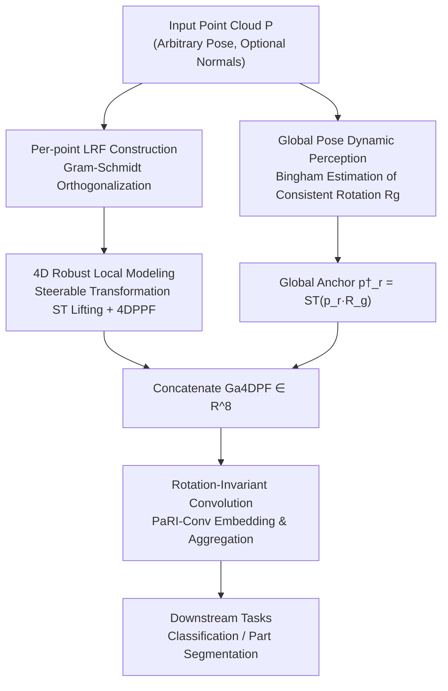

# 4D Local Modeling Toward Dynamic Global Perception for Ambiguity-free Rotation-Invariant Point Cloud Analysis

**Conference**: CVPR 2026  
**Paper**: [CVF Open Access](https://openaccess.thecvf.com/content/CVPR2026/html/Guo_4D_Local_Modeling_Toward_Dynamic_Global_Perception_for_Ambiguity-free_Rotation-Invariant_CVPR_2026_paper.html)  
**Code**: https://github.com/jiaxunguo/ga4dpf (Available)  
**Area**: 3D Vision  
**Keywords**: Rotation-invariant, point cloud analysis, equivariant-to-invariant, spherical neurons, Bingham distribution  

## TL;DR
To address the two major ambiguities in rotation-invariant (RI) point cloud representations—"local symmetric structures being indistinguishable" and "global pose information being discarded"—this paper proposes Ga4DPF. It uses learnable steerable transformations to **equivariantly lift** point clouds into a **4D space** to construct robust local point-pair features, combined with a **Bingham distribution** to dynamically estimate a consistent **global rotation** that assigns a global anchor to each point. It achieves SOTA performance on ModelNet40 / ScanObjectNN / ShapeNetPart with lower parameter counts and FLOPs.

## Background & Motivation
**Background**: In real-world scenarios, point clouds are often captured in arbitrary poses. Models like PointNet/DGCNN implicitly assume inputs are aligned to a canonical orientation, causing performance to collapse under arbitrary rotations (e.g., PointNet++ drops from 89.3% to 28.6% under z/SO(3) protocols). To eliminate alignment dependency, mainstream research follows the "rotation-invariant representation" route: establishing a Local Reference Frame (LRF) for each point and encoding relative geometric relationships. A typical representative is **Point Pair Features (PPF)**, which record distances and angles between point pairs that are naturally invariant under rotation.

**Limitations of Prior Work**: Local RI encoding based on rigid LRFs suffers from two structural ambiguities. The first is **local ambiguity**: point pairs with different spatial arrangements may yield nearly identical RI descriptors, which is particularly severe in symmetric or repetitive structures (e.g., left and right wings of an aircraft). Handcrafted rigid coordinate systems are also sensitive to noise. The second is **global ambiguity**: the LRF essentially discards global pose information, which is precisely what is needed to distinguish structures that appear "locally identical but globally different." The paper formalizes this via receptive fields—the existence of a symmetric rotation $R_{sym}$ such that the receptive fields of a symmetric pair satisfy $\Gamma(p_{right}) = \Gamma(p_{left})R_{sym}$, causing the network to output identical features for both and losing global information entirely.

**Key Challenge**: Rotation-**equivariant** representations preserve complete geometric structural information but cannot be directly used for tasks requiring orientation-independent predictions. Rotation-**invariant** representations are directly applicable but suffer from reduced discriminative power because they "wipe out" directional information. These two categories have complementary strengths but are rarely unified.

**Key Insight**: Inspired by the theoretical observation that "equivariant representations preserve more structural information than invariant ones," the authors advocate for first constructing a structure-preserving **equivariant** representation and then deriving an **invariant** representation from it, rather than discarding directional information from the start.

**Core Idea**: Use learnable steerable spherical neurons to lift point clouds to 4D to create point-pair features (addressing local ambiguity), while using a Bingham distribution to dynamically learn a global reference rotation to provide each point with a global anchor (addressing global ambiguity). These are combined into Ga4DPF, an RI descriptor that is both robust and globally aware.

## Method

### Overall Architecture
The input to Ga4DPF is a point cloud $P\in\mathbb{R}^{N\times3}$ in an arbitrary pose (optionally with normals), and the output is per-point rotation-invariant features fed into downstream classification or part segmentation heads. The entire pipeline flows through two parallel branches into a rotation-invariant convolution: the **local branch** first establishes an LRF for each reference point, then uses a learnable steerable transformation $ST$ to lift 3D points and axes to 4D to calculate 4D point-pair features (4DPPF); the **global branch** uses a Bingham distribution to model the uncertainty of "which global rotation to select" on the quaternion hypersphere, sampling to estimate a globally consistent rotation $R_g$, which rotates and lifts reference points into global anchors $p^\dagger_r$. The two branches form the 8-dimensional Ga4DPF, which is embedded and aggregated layer-by-layer using PaRI-Conv-style rotation-invariant convolutions. The framework does not change the downstream RI learning pipeline and can be directly inserted into DGCNN (classification) or AdaptConv (segmentation) backbones.

### Key Designs

**1. 4D Robust Local Modeling: Lifting Point Pairs to 4D Space to Resolve Symmetry Ambiguity**

The pain point is that 3D PPF calculates identical descriptors for symmetric point pairs. The authors' approach is to first build a local coordinate system $L_r=\{\partial^1_r,\partial^2_r,\partial^3_r\}$ for each reference point $p_r$ using Gram–Schmidt (using the normal for $\partial^1_r$ and the direction from the neighborhood centroid to the reference point for $\partial^2_r$). They then introduce **steerable 3D spherical neurons**: consisting of a learnable 5D spherical decision surface $S$ and three rotated replicas located at the vertices of a regular tetrahedron, forming a $4\times5$ filter bank $B(S)$ that maps 5D embeddings to 4D. This filter bank satisfies the equivariance condition $V_R\,B(S)\,P = B(S)\,RP$, meaning the lifting operation $ST:\mathbb{R}^{N\times3}\to\mathbb{R}^{N\times4}$ is **rotation-equivariant**—lifting does not destroy geometric structure; it simply moves it to a higher dimension.

Point pair features are redefined in 4D space:

$$4\text{DPPF}(p'_r, p'_j) = (\,\|d\|^2,\ \cos\alpha_1,\ \cos\alpha_2,\ \cos\alpha_3\,)$$

where $d=p'_j-p'_r$, and the three angles are between the lifted basis vectors $\Delta^1_r$, $\Delta^1_j$, and $d$. Formally it resembles classic 3D PPF, but the paper uses **Theorem 1 (Disambiguation Guarantee)** to prove a key difference: in 3D, if a reference point falls on the rotation axis, PPF remains unchanged when rotating neighbor points around that axis (creating ambiguity); in 4D, $p'_r$ is generally no longer an eigenvector of the induced rotation $V_R(\theta)$, so $\|d(\theta)\|^2$ and all angles vary with $\theta$, such that $4\text{DPPF}(p'_r,p'_j)\neq 4\text{DPPF}(p'_r,p'_j(\theta))$ (for $\theta\neq0$, excluding zero-measure degenerate sets). This is the mathematical source of "natural disambiguation" through 4D lifting. The entire lifting is fully learnable, making it more flexible and noise-robust than handcrafted rigid systems.

**2. Global Pose Dynamic Perception: Assigning a Global Anchor via Bingham Distribution**

Even robust local 4DPPF is limited by the local receptive field and cannot distinguish "locally identical, globally different" symmetric structures. The authors assign an additional **global anchor** $p^\dagger_r = ST(p_r R_g;S)$ to each reference point, expanding Ga4DPF to 8 dimensions:

$$\text{Ga4DPF}(p_r) = \big(\,4\text{DPPF}(p'_r,p'_j),\ 4\text{DPPF}(p^\dagger_r,p'_j)\,\big)\in\mathbb{R}^8$$

With the introduction of the anchor, the receptive field is no longer restricted to the local neighborhood but is aligned to a global reference, breaking the local equivalence $\Gamma(p_{right})=\Gamma(p_{left})R_{sym}$, ensuring $\text{Ga4DPF}(p_r)\neq\text{Ga4DPF}(p_rR_{sym})$.

The challenge is how to determine $R_g$. A fixed $R_g$ is insufficient: if it happens to coincide with a scene's symmetry transformation $R_{sym}$, the anchor fails. The authors instead **dynamically** model the uncertainty of "which $R_g$ to choose"—using a **Bingham distribution** $\mathcal{B}(q|V,\Lambda)\propto\exp(q^\top V\Lambda V^\top q)$ on the unit quaternion hypersphere $S^3$, where the orthogonal matrix $V$ provides principal axes and $\Lambda=\mathrm{diag}(\lambda_1,\lambda_2,\lambda_3,0)$ controls concentration. During training, Bingham parameters and the network are jointly optimized with the loss:

$$\mathcal{L}_{total} = \mathcal{L}_{task} + \delta\cdot\sqrt{(\mathcal{L}_{bingham} - 0.1\cdot\mathcal{L}_{task})^2}$$

$\mathcal{L}_{bingham}$ is the negative log-likelihood of sampled quaternions, with $\delta=0.8$. The second term keeps global pose adaptability consistent with task performance. To allow gradient backpropagation, $N_s=10$ quaternions are sampled, and a representative quaternion is estimated via the geometric mean $q_g=\arg\max_{q}\sum_i\langle q,q_i\rangle^2$ (the principal eigenvector of $\sum_i q_iq_i^\top$), which is converted to $R_g$. Thus, the global reference is "learned and task-adaptive" rather than a hard-coded constant.

### Loss & Training
The total loss is the sum of the task loss and the Bingham consistency term shown above. Optimization uses SGD with an initial learning rate of 0.1, cosine annealing to 0.001 over 300 epochs. Batch sizes are 32 for classification and 16 for segmentation, with 0.5 dropout in FC layers. To ensure RI initialization, a descriptor relative to the global centroid $O$ is defined for each point: $(\|\overrightarrow{Op_i}\|^2,\ \sin\angle(\partial^1_i,\overrightarrow{Op_i}),\ \cos\angle(\partial^1_i,\overrightarrow{Op_i}))$. For kNN graphs, $k=20$ for classification and $k=40$ for segmentation. Modules are inserted into PaRI-Conv, using DGCNN as the classification backbone and AdaptConv (5 layers + 3 max-poolings) for segmentation.

## Key Experimental Results

### Main Results
Three benchmarks and three rotation protocols (z/z, z/SO(3), SO(3)/SO(3); where z denotes upright and SO(3) denotes arbitrary rotation).

| Task / Dataset | Protocol | Ours | Prev. SOTA | Gain |
|--------------|------|------|----------|------|
| Class. ModelNet40 (pc) | SO(3)/SO(3) | 91.9 | PaRot 90.8 / TetraSphere 90.3 | +1.1 |
| Class. ModelNet40 (pc+n) | SO(3)/SO(3) | **92.8** | RI-GCN 91.0 | +1.8 |
| Real Class. ScanObjectNN (pc) | z/SO(3) | **87.4** | LocoTrans 85.0 | +2.4 |
| Real Class. ScanObjectNN (pc) | SO(3)/SO(3) | **87.3** | LocoTrans 84.5 | +2.8 |
| Seg. ShapeNetPart (pc+n) | z/SO(3) C.mIoU | **82.2** | RISurConv 81.5 | +0.7 |
| Seg. ShapeNetPart (pc) | z/SO(3) C.mIoU | **81.3** | LocoTrans 80.1 | +1.2 |

Note: On ModelNet40, all three protocols yield the same value (91.9 for pc, 92.8 for pc+n). On ScanObjectNN, the difference between z/SO(3) and SO(3)/SO(3) is only 0.1%, strongly proving the representation's true rotation invariance.

Model Complexity (ShapeNetPart, z/SO(3), coordinates only):

| Model | Params | FLOPs | I. mIoU |
|------|--------|-------|---------|
| LocoTrans | 6.72M* | 7998M* | 84.0 |
| TetraSphere | 1.31M | 7996M | 82.3 |
| RISurConv | 4.06M | 12120M | — |
| **Ours** | **2.25M** | **3841M** | **84.0** |

With parameters comparable to TetraSphere, I. mIoU is 1.7% higher with roughly half the FLOPs. FLOPs are less than 1/3 of RISurConv.

### Ablation Study
Ablation of relative pose representations (z/SO(3) classification accuracy):

| Configuration | Dim | ModelNet40 | ScanObjectNN | Description |
|------|------|-----------|--------------|------|
| PPF (Classic) | 4 | 91.8 | 82.8 | 3D point-pair feature baseline |
| Aug.PPF | 8 | 92.4 | 83.3 | Manual augmentation for disambiguation |
| 4DPPF($p'_r,p'_j$) | 4 | 92.4 | 84.4 | 4D local only, lower dim but stronger |
| (PPF, 4DPPF($p^\dagger_r,p'_j$)) | 8 | 92.5 | 86.7 | Classic local + global perception |
| **Ga4DPF Full** | 8 | **92.8** | **87.4** | 4D local + global anchor |

Ablation of sample size $N_s$ (z/SO(3)): Performance increases monotonically from $N_s=1$ to $10$ (ScanObjectNN 85.5→87.4). $N_s=10$ is optimal; further increases to 15/20 show no gain or slight decreases.

### Key Findings
- **Global anchors provide the largest gain on real data**: On ScanObjectNN, adding the global branch (Row 3 → Row 5) jumps accuracy from 84.4 to 87.4 (+3.0), which is much larger than the 0.4 gain on synthetic ModelNet40—indicating that global pose is critical for real-world scenes with noise, occlusion, and background clutter.
- **4D lifting is powerful on its own**: The 4-dimensional 4DPPF alone matches or exceeds the 8-dimensional manual Aug.PPF (ScanObjectNN 84.4 vs 83.3), confirming that "learnable lifting > manual disambiguation."
- **$N_s=10$ is the sweet spot for accuracy/efficiency**: Too few samples fail to estimate global rotation accurately; too many provide no benefit. Geometric mean estimation converges at 10 samples.
- **True Rotation Invariance**: z/SO(3) and SO(3)/SO(3) scores are nearly identical (0.1% difference on ScanObjectNN), proving the model is insensitive to whether arbitrary rotations were seen during training.

## Highlights & Insights
- **The "Equivariant Lifting → Invariant Derivation" paradigm is clever**: Unlike traditional RI methods that flatten directional info immediately, this preserves structure in a 4D equivariant space before calculating invariants, reducing information loss at the source—a concept transferable to any geometric task involving coordinate systems.
- **Modeling "which global rotation to choose" via probability distributions**: Changing the global reference rotation from a "hard-coded constant" to a "sampled estimate from a Bingham distribution" coupled with task performance via consistency loss elegantly avoids the trap where fixed rotations fail if they coincide with scene symmetries.
- **Theorem 1 provides mathematical guarantees for disambiguation**: Not just an empirical "4D seems better," but a proof that after 4D lifting, reference points are no longer eigenvectors of induced rotations, meaning descriptors necessarily change under rotation—this rigorous approach is highly commendable.
- **Surprisingly good efficiency**: 2.25M parameters / 3841M FLOPs are significantly lower than peers, showing that "lifting one dimension + adding an anchor" is a lightweight enhancement rather than a brute-force compute stack.

## Limitations & Future Work
- The authors suggest extending the representation to complex scenes, combining it with generative models, or using multi-modal/spatiotemporal frameworks—implying verification was mainly on single-object benchmarks (ModelNet40/ScanObjectNN/ShapeNetPart), with **large-scale/outdoor point clouds yet to be tested**.
- ⚠️ The method relies on normals in the LRF (optimal scores achieved in pc+n settings). While a coordinate-only fallback is provided (using centroid directions instead of normals), segmentation performance in pure coordinate settings still slightly lags; normal estimation itself is unstable on noisy real-world point clouds, which could be a bottleneck.
- The global branch introduces Bingham sampling and geometric mean estimation. While sampling $N_s=10$ quaternions is light, it introduces a layer of randomness, and training stability relative to the sensitivity of hyperparameter $\delta$ was not fully explored.
- Improvement ideas: Expand global anchors from a single $R_g$ to multiple anchors (to handle multi-axis symmetry scenes) or jointly learn Bingham modeling with normal estimation to reduce reliance on external normals.

## Related Work & Insights
- **vs PPF / Aug.PPF**: Classic PPF encodes distance and angles in 3D, where symmetric point pairs produce identical descriptors. Aug.PPF mitigates this with manual enhancements. This paper lifts point pairs to 4D to calculate PPF, disambiguating naturally through representation capacity; 4 dims outperform 8 dims of manual features.
- **vs PaRI-Conv**: PaRI-Conv relies on rigid manual LRFs and degrades under noise/occlusion (83.3% on ScanObjectNN). Ga4DPF dynamically lifts point-normal pairs to 4D using learnable spherical neurons, proving more robust and expressive (87.4%), and directly reuses the PaRI-Conv convolution as an aggregator.
- **vs TetraSphere / Equivariant Methods**: Equivariant methods (spherical harmonics, vector neurons) preserve directional info but lack explicit invariant mechanisms. This paper follows the "equivariant → invariant" path, leveraging equivariance to save structure while providing true invariant features, achieving higher mIoU and lower FLOPs than TetraSphere at similar parameter counts.
- **vs Alignment-based (STN/PCA normalization)**: Alignment methods assume category-level consistency and rely on heavy rotation augmentation, limiting generalization to unseen categories/partial observations. This paper provides intrinsic RI, with z/SO(3) and SO(3)/SO(3) scores being nearly identical without needing rotation augmentation for robustness.

## Rating
- Novelty: ⭐⭐⭐⭐⭐ The dual approach of "equivariant 4D lifting + Bingham dynamic global anchors" supported by a disambiguation theorem is a fresh paradigm.
- Experimental Thoroughness: ⭐⭐⭐⭐ Three datasets across three protocols + complexity + two sets of ablations are thorough, though verification on large-scale/outdoor scenes is missing.
- Writing Quality: ⭐⭐⭐⭐ Formalization of ambiguities is clear, theorem proofs are complete, and framework diagrams align well with the math.
- Value: ⭐⭐⭐⭐ Lightweight, plug-and-play, SOTA; directly valuable for robotics/autonomous driving point cloud tasks requiring rotation robustness.

<!-- RELATED:START -->

## Related Papers

- [\[CVPR 2026\] RINO: Rotation-Invariant Non-Rigid Correspondences](rino_rotation-invariant_non-rigid_correspondences.md)
- [\[AAAI 2026\] Graph Smoothing for Enhanced Local Geometry Learning in Point Cloud Analysis](../../AAAI2026/3d_vision/graph_smoothing_for_enhanced_local_geometry_learning_in_point_cloud_analysis.md)
- [\[CVPR 2026\] LoG3D: Ultra-High-Resolution 3D Shape Modeling via Local-to-Global Partitioning](log3d_ultra-high-resolution_3d_shape_modeling_via_local-to-global_partitioning.md)
- [\[CVPR 2026\] ECKConv: Learning Coordinate-based Convolutional Kernels for Continuous SE(3) Equivariant Point Cloud Analysis](learning_coordinate-based_convolutional_kernels_for_continuous_se3_equivariant_a.md)
- [\[CVPR 2026\] Generalized-CVO: Fast and Correspondence-Free Local Point Cloud Registration with Second Order Riemannian Optimization](generalized-cvo_fast_and_correspondence-free_local_point_cloud_registration_with.md)

<!-- RELATED:END -->
