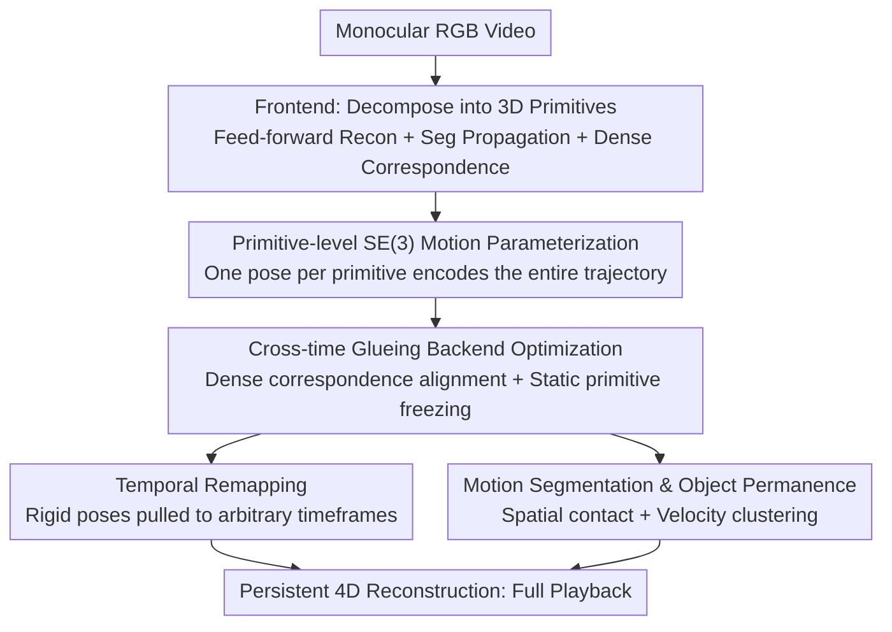

# 4D Primitive-Mâché: Glueing Primitives for Persistent 4D Scene Reconstruction

**Conference**: CVPR 2026  
**Paper**: [CVF Open Access](https://openaccess.thecvf.com/content/CVPR2026/html/Mazur_4D_Primitive-Mache_Glueing_Primitives_for_Persistent_4D_Scene_Reconstruction_CVPR_2026_paper.html)  
**Code**: Project page https://makezur.github.io/4DPM/ (Code repository not explicitly provided)  
**Area**: 3D Vision  
**Keywords**: 4D reconstruction, dynamic scenes, rigid primitives, monocular video, object permanence

## TL;DR
4DPM decomposes casual monocular RGB videos into a set of rigidly moving 3D primitives. By "glueing" each primitive over time using dense 2D correspondences, it only requires estimating an $SE(3)$ pose per primitive to remap all historical observations to any moment. This enables a **complete and persistent** scene geometry at every frame, even maintaining the positions of occluded objects (object permanence).

## Background & Motivation

**Background**: Geometric reconstruction of dynamic scenes is a foundational task for robotics, embodied AI, and AR. Traditional SLAM/SfM are robust for mapping static environments but deliberately avoid dynamic parts. Recent "4D reconstruction" methods that jointly estimate depth and camera pose from monocular video (including point-map warping methods based on DUSt3R) can handle dynamics, but most only reconstruct geometry at the "moment of observation."

**Limitations of Prior Work**: These methods lack **persistence**—only the depth of the current frame represents the latest geometry. Once a previously observed moving object moves away or is occluded, its geometric information is discarded, making it impossible to aggregate all historical observations into a complete scene. In other words, one cannot "playback" the complete 3D scene at an arbitrary moment. Another class of pair-wise warping methods based on DUSt3R, while expressive, suffers from limited accuracy due to the scarcity of real supervision data, and pair-wise processing has quadratic complexity as the number of frames increases.

**Key Challenge**: General non-rigid persistent reconstruction is extremely difficult even for RGB-D systems and can only be performed on controlled short sequences. To be both complete and accurate under monocular, casual capture conditions, one must find a representation that is **both compact for optimization and expressive enough to represent dynamic motion**. Solving for a dense pixel-wise all-to-all temporal motion field is too high-dimensional and ill-posed.

**Goal**: Under the piecewise-rigid assumption, reconstruct a dynamic scene that is as complete and persistent as possible, allowing every observed keyframe to be reconstructed correspondingly at all moments to achieve 4D playback.

**Key Insight**: Borrowing the idea from SuperPrimitive (SP) of decomposing frames into "object-level blocks." While SP assumes pixel-aligned primitives and only estimates unknown depth scales, this paper extends it by assigning **rigid motion parameters to each primitive**. The key observation is: if an object moves rigidly, its entire temporal trajectory can be encoded with a single $SE(3)$ pose.

**Core Idea**: Compress the "pixel-wise dense motion field" into "one $SE(3)$ pose per primitive," and use dense 2D correspondences to "glue" these primitives together. This reduces the high-dimensional dynamic reconstruction problem to solving for one pose per primitive.

## Method

### Overall Architecture
The input to 4DPM is a monocular RGB video, and the output is a set of complete scene point maps $\mathcal{X}^0,\dots,\mathcal{X}^n$ for every observation moment (playable 4D reconstruction). It is built on a point map representation: $X_k^t \in \mathbb{R}^{H\times W\times 3}$ represents the geometry captured from camera $k$ and warped to the world coordinate system at time $t$. Previous methods only provided image-aligned point maps at the observation time $\{X_0^0, X_1^1,\dots,X_n^n\}$; this work aims to complete the full set for every moment.

The entire pipeline is divided into three stages: frontend, backend, and remapping. The **frontend** decomposes the video into a set of non-overlapping 3D primitives: a feed-forward reconstruction model $\pi_3$ estimates point maps for each observation, SAMv2 propagates masks from the first frame to all keyframes (actively sampling to instantiate new objects in uncovered areas), and a dense point tracking network estimates pixel-wise correspondences between adjacent keyframes. Primitives are clustered into "objects"—each object is assumed to move rigidly and consists of a set of primitives over a duration $O=\{S_{t_\text{start}},\dots,S_{t_\text{end}}\}$. The **backend** uses dense 2D correspondences as constraints to jointly optimize the $SE(3)$ pose of each primitive across all objects and keyframes, "glueing" primitives into temporally consistent objects. Before optimization, primitives with tiny correspondence residuals are frozen as static to resolve geometric ambiguity between camera and scene motion. **Remapping** utilizes rigid poses to pull any primitive to any moment, obtaining a complete reconstruction of the entire process. Finally, a **motion segmentation** module infers the motion of occluded objects by attaching invisible objects to visible parent objects based on spatial contact and velocity similarity (object permanence).

### Key Designs

**1. Primitive-level SE(3) Motion Parameterization: Compressing dense motion fields into one pose per primitive**

The pain point is the dimensionality explosion in dense dynamic reconstruction—if temporal motion is estimated pixel-wise, the number of parameters scales linearly with pixels and frames, making all-to-all spatio-temporal mapping almost unsolvable. Ours approach partitions each frame into non-overlapping image regions $S_p$, which "slice" 3D primitives $S_p \odot X_i$ from the point map, assuming they move as rigid bodies over time. Motion is parameterized by a single $SE(3)$ pose $T(S_p)$. Within an object $O$, each primitive's pose $T(S)$ maps it to the coordinate system of the **last observed segment** $S_{t_\text{end}}$ of that object, with $T(S_{t_\text{end}})$ set as the identity matrix—since pose estimation for each object naturally has $SE(3)$ gauge freedom, fixing the last frame eliminates redundancy. Pose optimization uses Lie Group parameterization, with updates written as $T \leftarrow T \oplus \tau$, where $\tau \in \mathfrak{se}(3) \simeq \mathbb{R}^6$ is the Lie algebra increment. The elegance of this step is: for rigid objects, a single pose mapping to the last observed frame is sufficient to encode its complete temporal trajectory, reducing complex dense temporal mapping to "one $SE(3)$ per primitive," which is compact yet retains piecewise-rigid expressiveness.

**2. Cross-time Glueing Backend Optimization: "Welding" primitives into temporally consistent objects using dense correspondences**

The frontend only provides scattered primitives localized at their observation moments. How to align them over time into the same object? Ours matches primitives across time for two reasons: first, to filter out spurious correspondences frequently appearing at object boundaries; second, because each primitive needs only one $SE(3)$ to represent its full motion after matching. Specifically, for adjacent keyframes $I_k, I_{k+1}$, a dense correspondence network estimates pixel-wise optical flow (with pixel-wise confidence weights $w_{ij}$), and $X_{k+1}$ is warped according to the flow to obtain corresponding 3D points $X_{k+1}^V$. For an object $O=\{S_n,\dots,S_m\}$, the cost function directly minimizes the distance between corresponding 3D points of temporally adjacent primitives in the same object:

$$E(O)=\sum_{(i,j)\in \mathcal{T}(O)} \left\| \, \mathbf{w}_{ij}\cdot S_i \cdot \widehat{S_j}\left(T_j^{-1}T_i X_i - \widehat{X_j}\right) \right\|_\rho$$

where $\mathcal{T}(O)$ is the set of temporally adjacent primitive pairs for that object, and $\|\cdot\|_\rho$ is the Huber robust cost. The final cost $E_\text{final}=\sum_i E(O_i)$ is accumulated across all non-static objects. Jacobians are analytically derived and computed in parallel for all objects, solved using Iteratively Reweighted Least Squares (IRLS) + Gauss-Newton: $\mathbf{J}^T\mathbf{W}\mathbf{J}\,\tau = -\mathbf{J}^T\mathbf{W}\mathbf{r}$. A **static-dynamic classification** is also embedded here: because displacements induced by camera motion and true scene motion are difficult to distinguish from 2D correspondences in monocular video, objects with initial correspondence residuals below a threshold are frozen as static (assuming their observed motion comes entirely from the camera). This resolves the gauge ambiguity of backend optimization and yields motion segmentation as a byproduct.

**3. Temporal Remapping: Using rigid poses to pull any primitive to any moment for playback**

With poses for all primitives, geometry that "only exists at the moment of observation" can be completed for every moment—this is the source of persistence. Since each pose maps a primitive to the coordinate system of the last observed frame $S_{t_\text{end}}$, warping primitive $S^p$ at time $p$ to any time $q$ can be naturally written as:

$$T^{p\mapsto q} := \left[T(S^q)\right]^{-1} T(S^p)$$

That is, first transform $S^p$ to the coordinate system of the last observed frame, then pull it back to time $q$. This step is the "dividend" of the piecewise-rigid assumption: in non-rigid scenes, you cannot safely move past geometry into the future, but once all observations of a rigid object are aligned to the same coordinate system, its position can be replayed at any time. Thus, $\mathcal{X}^0,\dots,\mathcal{X}^n$ are all obtainable, achieving 4D playback.

**4. Motion Segmentation and Object Permanence: "Continuing" motion for occluded objects**

Once an object moves out of view (e.g., being placed in a drawer), its motion can no longer be estimated via its own correspondences, but humans can still infer its position. This work continues motion by attaching invisible objects to a still-visible **parent object**. The parent-child relationship is determined by two criteria: **spatial contact** and **velocity similarity**. Spatial contact is determined by the Oriented Bounding Box (OBB) of the objects at each moment—if the boxes have a non-zero intersection after being expanded by a factor $\alpha=1.1$, they are considered in contact, and transitive closure is allowed (if A touches B and B touches C, A is indirectly pulled by C). To compare velocities, a subtle problem must be solved: each object pose has an unknown gauge freedom $\mathcal{F}\in SE(3)$, making direct pose comparison ill-posed. However, **velocity is gauge-invariant**:

$$T'(t)^{-1}T'(t-1) = T(t)^{-1}\mathcal{F}^{-1}\mathcal{F}\,T(t-1) = T(t)^{-1}T(t-1)$$

Thus, the velocities of two co-observed objects are compared using $\log(V^{-1}W)$ under Mahalanobis distance (translation covariance $\sigma_\tau$, rotation covariance $\sigma_\psi$); values below a threshold are classified as the same motion. The drawer example in the paper is illustrative: an object inside a drawer does not directly touch the front panel, but its motion is **inferred through the drawer body**. Therefore, even when completely occluded, these objects remain grouped with the drawer's motion and are retained in the reconstruction—making this, to the authors' knowledge, the first system to demonstrate object permanence from casual monocular video.

### Loss & Training
4DPM is a test-time optimization system rather than an end-to-end trained network: feed-forward reconstruction $\pi_3$, SAMv2 segmentation, and dense point tracking are all "off-the-shelf" models. The core optimization objective is the correspondence alignment cost $E_\text{final}$ (Huber robust + confidence weighted) designed in Mechanism 2, solved jointly for the $SE(3)$ poses of all primitives of all objects using IRLS + Gauss-Newton with parallel analytical Jacobians. All experiments were performed on a single NVIDIA RTX 4090; long sequences were processed in 150-frame chunks.

## Key Experimental Results

Evaluation: All observations are time-warped to the final keyframe $n$ to obtain the final reconstruction $\mathcal{X}^n$, compared against pseudo-GT geometry from multi-view synthesis. Metrics include **accuracy (percentage of predicted points within 1cm of GT) / recall (percentage of GT points covered) / F-score (harmonic mean of the two)** at a 1cm threshold, and evaluation is **only performed on dynamic parts** (as static areas would dominate the recall, making it meaningless). Alignment is done via Umeyama (Sim(3)).

### Main Results

Average results on the HO3D object scanning dataset (GT provided by 4 calibrated depth cameras, with the hand approximated as static and moved objects as dynamic):

| Method | Average F-score | Precision | Recall |
|------|------|------|------|
| π3 last view (Last frame point map only) | 0.3206 | **0.9255** | 0.2018 |
| π3 (Raw output of feed-forward recon) | 0.5219 | 0.4735 | 0.6296 |
| St4Track | 0.5392 | 0.4549 | 0.7293 |
| POMATO | 0.5214 | 0.4065 | 0.7650 |
| TraceAnything | 0.6069 | 0.6365 | 0.5748 |
| **Ours (4DPM)** | **0.7573** | **0.7630** | **0.7774** |

`π3 last view` has the highest precision (0.9255) but terrible recall (0.2018)—it only keeps the last frame and discards information from all other keyframes. Other baselines have decent recall but lack precision. 4DPM achieves the best balance between precision and completeness, leading significantly in F-score (0.757 vs the next best 0.607).

The lead is even more pronounced on the self-collected **Multi-Object dataset** (4 synchronized Azure Kinects, single-view input, four-view synthesis for pseudo-GT):

| Method | Average F-score | Precision | Recall |
|------|------|------|------|
| π3 last view | 0.5071 | **0.8837** | 0.3707 |
| π3 | 0.4799 | 0.3637 | 0.7382 |
| St4track | 0.4630 | 0.3585 | 0.6792 |
| POMATO | 0.5864 | 0.4668 | 0.8071 |
| TraceAnything | 0.4817 | 0.3773 | 0.6946 |
| **Ours (4DPM)** | **0.7948** | **0.7195** | **0.9000** |

On challenging scenarios such as spinning balls, robotic grippers, and multiple objects revolving on a base, 4DPM raises the F-score from the next best 0.586 to 0.795, with a recall as high as 0.900, indicating it correctly aggregates all observations to obtain a complete and accurate object scan.

### Ablation Study (Analysis by baseline decomposition)

Rather than a traditional "module-removal" ablation table, the paper uses two natural baselines to isolate contributions:

| Configuration | Meaning | Observation |
|------|------|------|
| π3 last view | Only using the last frame point map | Highest precision but recall collapses (HO3D 0.20 / Multi-Object 0.37)—proves "persistent aggregation" is key to completeness. |
| π3 | Raw feed-forward recon (no glueing) | Geometry is complete but early frames are misaligned (low precision)—proves "cross-time glueing backend alignment" is key to precision. |
| Full (4DPM) | Glueing + Remapping + Motion Seg | Achieves both precision and completeness, overall best F-score. |

### Key Findings
- **The tradeoff between completeness and precision is the main battleground**: Only the last frame is precise but incomplete; the raw feed-forward output is complete but poorly localized. 4DPM, by rigidly aligning all observations to a unified coordinate system, achieves both for the first time.
- **Largest gains in multi-object scenes**: Compared to HO3D (lead of ~0.15 F-score), the lead on the Multi-Object dataset is ~0.21, showing that "independent $SE(3)$ per object + joint optimization" is especially effective under complex multi-rigid-body interactions.
- **Object permanence is a qualitative capability, not just a metric**: The drawer example shows that occluded objects are retained in the reconstruction via transitive contact and velocity clustering, a capability none of the baselines possess.

## Highlights & Insights
- **Replacing "pixel-wise motion fields" with "one $SE(3)$ per primitive"**: This is the key move to reduce high-dimensional dynamic reconstruction to a solvable optimization. For rigid bodies, a single pose for the last frame encodes the full trajectory—an elegantly simple approach that holds for a vast range of real-world scenes under the piecewise-rigid assumption.
- **Gauge-invariance of velocity**: Each object pose carries an unknown gauge $\mathcal{F}$. While direct pose comparison is ill-posed, the difference between adjacent poses $T(t)^{-1}T(t-1)$ causes $\mathcal{F}$ to cancel out. This observation makes "cross-object motion comparison" feasible and serves as the mathematical foundation for object permanence.
- **Modular usage of off-the-shelf models**: Using feed-forward reconstruction, SAMv2, and point tracking as blocks while focusing innovation on "primitive representation + glueing optimization" makes the system lightweight and easy to reproduce, while complementing upstream methods.
- **Static-dynamic classification as a byproduct**: Freezing low-residual primitives resolves gauge ambiguity and provides motion segmentation for free.

## Limitations & Future Work
- **Authors' Admission**: The assumption that each primitive is rigid prevents representing fine-grained non-rigid deformations; extending this while maintaining computational efficiency is an important direction. Additionally, incremental mapping (continually updating representations over long sequences) has not been explored.
- **Observations**: Performance depends on the quality of $\pi_3$ and point tracking networks; upstream errors propagate to pose optimization. Static-dynamic classification relies on an "initial residual threshold," which might misclassify slow-moving or low-texture objects as static.
- **Evaluation Limitations**: Dynamic GT relies on multi-view synthesis (and even raw feed-forward recon as pseudo-GT for Multi-Object due to depth quality issues), which may be biased. Global consistency across 150-frame chunks for very long sequences needs further investigation.

## Related Work & Insights
- **vs SuperPrimitive (SP)**: SP decomposes frames into 2.5D primitives and only estimates depth scale for static SLAM/SfM. 4DPM adapts the primitive decomposition but adds $SE(3)$ rigid motion parameters to extend it to dynamic 4D reconstruction.
- **vs DUSt3R-based (St4Track / POMATO)**: These extend DUSt3R's shared coordinate system to dynamics by establishing pair-wise temporal warping of point maps. They are more expressive but suffer from limited accuracy due to scarce real supervision and quadratic complexity. 4DPM's compact per-primitive poses and joint optimization yield better precision and completeness.
- **vs TraceAnything**: A SOTA method for dense time-warping of observed geometry, but 4DPM significantly outperforms it in F-score on both HO3D and Multi-Object datasets (0.61/0.48 → 0.76/0.79).
- **vs DynamicFusion / Co-fusion / MID-fusion**: These RGB-D methods use object-level motion but require continuous depth streams for map fusion and tracking, which is not applicable to monocular video. 4DPM uses monocular RGB with off-the-shelf feed-forward recon.

## Rating
- Novelty: ⭐⭐⭐⭐⭐ Introducing primitive $SE(3)$ parameterization to monocular persistent 4D reconstruction and achieving object permanence on casual videos for the first time.
- Experimental Thoroughness: ⭐⭐⭐⭐ Two datasets + multiple SOTA comparisons + qualitative object permanence, though lacking step-by-step module ablation and having potentially biased pseudo-GT.
- Writing Quality: ⭐⭐⭐⭐⭐ Formulas and motivations are clear; key points like gauge freedom and velocity invariance are well-explained.
- Value: ⭐⭐⭐⭐⭐ The persistent design, complementary to feed-forward reconstruction, has direct value for robotics and embodied mapping.

<!-- RELATED:START -->

## Related Papers

- [\[CVPR 2026\] Complet4R: Geometric Complete 4D Reconstruction](complet4r_geometric_complete_4d_reconstruction.md)
- [\[CVPR 2026\] MoRe: Motion-aware Feed-forward 4D Reconstruction Transformer](more_motion-aware_feed-forward_4d_reconstruction_transformer.md)
- [\[CVPR 2026\] MotionScale: Reconstructing Appearance, Geometry, and Motion of Dynamic Scenes with Scalable 4D Gaussian Splatting](motionscale_reconstructing_appearance_geometry_and_motion_of_dynamic_scenes_with.md)
- [\[CVPR 2026\] 4DEquine: Disentangling Motion and Appearance for 4D Equine Reconstruction from Monocular Video](4dequine_disentangling_motion_and_appearance_for_4d_equine_reconstruction_from_m.md)
- [\[ICLR 2026\] Joint Optimization for 4D Human-Scene Reconstruction in the Wild](../../ICLR2026/3d_vision/joint_optimization_for_4d_human-scene_reconstruction_in_the_wild.md)

<!-- RELATED:END -->
