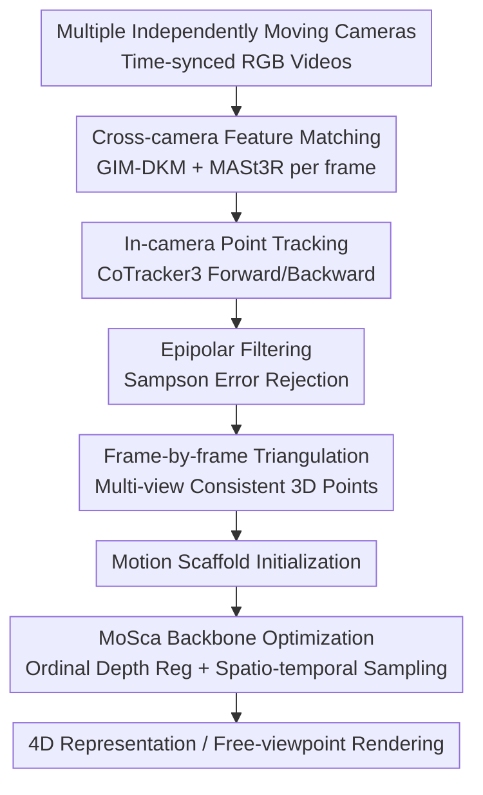

# 4D Reconstruction from Sparse Dynamic Cameras

**Conference**: CVPR 2026  
**arXiv**: [2606.04593](https://arxiv.org/abs/2606.04593)  
**Code**: TBD  
**Area**: 3D Vision  
**Keywords**: 4D Reconstruction, Sparse Dynamic Cameras, Multi-view Consistency, Motion Scaffold, 3DGS

## TL;DR
This paper investigates a new setting involving "a small number of independently moving cameras capturing the same dynamic scene" (sparse dynamic cameras). It identifies that directly applying monocular 4D reconstruction methods (MoSca) fails due to cross-view and cross-temporal inconsistencies. The authors propose a **multi-view consistent 3D trajectory initialization** pipeline (cross-camera feature matching + in-camera point tracking + epipolar filtering + triangulation) along with ordinal depth regularization and spatio-temporally diversified batch sampling. They also release the LetCamsGo dataset, demonstrating significant improvements in reconstruction quality for dynamic regions compared to monocular extensions and dense fixed-camera methods.

## Background & Motivation
**Background**: Dynamic 3D (4D) reconstruction has advanced rapidly with the progress of NeRF / 3D Gaussian Splatting (3DGS) and 2D foundation models. The most convenient acquisition method is using a **monocular dynamic camera**, where a single person moves around the scene.

**Limitations of Prior Work**: The monocular setting has a fundamental flaw—**depth ambiguity**. Due to the lack of multi-view constraints, even state-of-the-art methods (like MoSca) face underdetermined scene depth at any given moment, leading to "drifting" geometry. Conversely, dense fixed-camera setups (often requiring 20+ units) eliminate ambiguity but are impractical due to high deployment costs.

**Key Challenge**: High-fidelity reconstruction requires multi-view constraints to resolve depth ambiguity, yet these constraints traditionally rely on dense fixed-camera arrays, which directly conflicts with the goal of "low-cost, easy-to-deploy" systems. This paper targets the middle ground.

**Goal**: To study the overlooked yet practical setting of **sparse dynamic cameras**: a few (3 in this study) independently moving cameras simultaneously capturing the same subjects. This setup utilizes multi-view constraints to resolve depth ambiguity while remaining low-cost, naturally fitting real-world video production scenarios like concerts, sports, TV shows, and multi-phone casual captures to enable free-viewpoint video.

**Key Insight**: Experiments show that simply extending monocular methods (MoSca) or dense fixed-camera methods to this setting fails. The root cause is **spatio-temporal inconsistency across views and time**: each camera estimates depth and tracks points independently, resulting in dynamic point clouds that do not align across views or timestamps. Even the latest multi-view depth estimators and 3D point trackers fail due to the domain gap between their training data and the "large motion of both cameras and subjects" in this setting. The issue lies in **initialization**: MoSca’s motion scaffold initialization is designed for monocular use and fails with sparse dynamic cameras.

**Core Idea**: Instead of modifying the 3DGS backbone, the authors **redesign the 3D trajectory initialization for the motion scaffold**. They use cross-camera feature matching to establish correspondences between different views at the same timestamp, then use in-camera point tracking to link these correspondences over time. Through epipolar filtering and frame-by-frame triangulation, they obtain 3D trajectories that strictly satisfy multi-view consistency, providing a reliable "motion scaffold prior" for optimization.

## Method

### Overall Architecture
The input consists of $C$ (where $C=3$) time-synchronized RGB videos from independently moving cameras with known intrinsics and time-varying extrinsics. The output is a high-fidelity 4D representation. The backbone follows **MoSca**: the scene is represented by a set of 3D Gaussians, overlaid with sparse "motion scaffold nodes" carrying time-varying $SE(3)$ transformations. A KNN graph and Dual Quaternion Blending (DQB) are used to interpolate node motion to any query point, warping dynamic Gaussians from the canonical space to each frame for splatting.

The authors maintain this rendering/deformation mechanism but introduce three modifications to stabilize it for sparse dynamic cameras: ① Replacing fragile monocular initialization with **multi-view consistent 3D trajectory initialization** (the core contribution, involving cross-camera matching → in-camera tracking → epipolar filtering → triangulation); ② Replacing noise-sensitive L2 depth regularization with **ordinal depth regularization**; ③ Changing batch sampling to be **spatio-temporally diversified**. Together, these stabilize optimization in this unconstrained setting.

### Key Designs

**1. Multi-view Consistent 3D Trajectory Initialization: Spatial Correspondence before Temporal Linking**

This core design addresses the pain point where naive extensions fail to align across views. The naive approach involves each camera running independent depth estimation and point tracking, then forcing the noisy back-projected point clouds into a joint optimization—leading to 3D points appearing at different locations across views and preventing the track regularization loss from converging. This paper uses a two-stage relay:

First, **cross-camera feature matching**: for each frame $t$, 2D correspondences $(\mathcal{M}_t^c,\mathcal{M}_t^{c'})$ are extracted between camera pairs $(c,c')$. To maximize reliable correspondences, outputs from two dense matchers with different architectures/data (GIM-DKM and MASt3R) are merged. This step ensures **spatial consistency across views within the same frame**, though it lacks temporal links. Second, **in-camera point tracking**: using matched points as seeds, CoTracker3-Online—robust to non-rigid motion and long-range tracking—tracks points forward and backward within each camera to form single trajectories, aggregating a semi-dense set of 2D trajectories $\mathcal{T}_c$ for each camera. In short: cross-camera matching handles "spatial alignment," and in-camera tracking handles "temporal continuity," together creating dense spatio-temporal 2D correspondences.

**2. Epipolar Filtering + Frame-by-frame Triangulation: "Cleaning" and Lifting 2D Correspondences to 3D**

Mere 2D correspondences are insufficient; in-camera tracking contains noise, and mismatched cross-view pairs can derail optimization. Two steps convert 2D correspondences into trusted 3D trajectories. Step one, **epipolar filtering**: for each tracked point at each timestamp, its cross-view correspondence is checked against the epipolar constraint using the Sampson error. Given the fundamental matrix $\mathbf{F}$, only correspondences satisfying the following are kept:

$$d_{\mathrm{S}}(\mathbf{u},\mathbf{u}')=\frac{(\mathbf{u}'^{\top}\mathbf{F}\mathbf{u})^{2}}{(\mathbf{F}\mathbf{u})_{1}^{2}+(\mathbf{F}\mathbf{u})_{2}^{2}+(\mathbf{F}^{\top}\mathbf{u}')_{1}^{2}+(\mathbf{F}^{\top}\mathbf{u}')_{2}^{2}}<\tau_{\mathrm{epi}}$$

(where visibility $\nu_{i,c,t}$ is set to 0 if violated; in implementation $\tau_{\mathrm{epi}}=0.1$ px). Step two, **frame-by-frame triangulation**: for each trajectory $i$ at time $t$, the 3D position is calculated using all visible camera observations:

$$\mathbf{X}_{i,t}=\arg\min_{\mathbf{X}}\sum_{c\in\mathcal{C}_t(i)}\left\|\pi(\mathbf{P}_{c,t}\mathbf{X})-\mathbf{u}_{i,c,t}\right\|_2^2$$

where $\mathbf{P}_{c,t}=\mathbf{K}_c[\mathbf{R}_{c,t}\mid\mathbf{t}_{c,t}]$ is the projection matrix. Compared to back-projecting noisy monocular depth, triangulation provides **per-frame multi-view consistent** 3D points directly via geometric constraints. Repeating this per frame yields spatio-temporal 3D trajectories for scaffold initialization. Triangulation (Tri) is the primary driver of performance gains, especially in dynamic areas.

**3. Ordinal Depth Regularization + Spatio-temporal Diversified Batch Sampling**

These are optimization-layer "reinforcements." The original MoSca minimizes the L2 distance between normalized estimated depth and rendered depth. However, in sparse dynamic settings, depth estimation is noisy (even with Depth Anything 3), and pixel-wise alignment can be counterproductive. Thus, it is replaced with **ordinal depth regularization**: constraining only the **relative order** of depth values rather than absolute alignment, which is significantly more robust to noise. For batch sampling, the authors found that composing each batch with **samples from different cameras and different timestamps** leads to better generalization. Compared to mono-camera or temporally local batches, this cross-view cross-time sampling reduces short-range correlation in supervision signals and injects stronger spatio-temporal variation into every update.

### Loss & Training
The backbone optimization follows MoSca: photometric loss + depth/track regularization + as-rigid-as-possible scaffold geometric loss, combined with densification and pruning. The key changes are the ordinal depth loss and the D/D (different camera/different time) batch sampling. Implementation details: Sampson threshold 0.1 px, Depth Anything 3 for depth maps, static points initialized via MVS (except for the Play scene which uses Depth Anything 3), camera pose optimization disabled, trained on a single RTX A6000 at 30 FPS and half-FHD resolution.

## Key Experimental Results

Evaluation Protocol: Training with three dynamic cameras and rendering a held-out fixed camera view for NVS (New View Synthesis). Metrics include PSNR / SSIM / LPIPS reported for the Full image and Dynamic regions. Cosegmentation masks and exclusion of cameraman areas are used to ensure relevant evaluation.

### Main Results (Average of 5 LetCamsGo Scenes, PSNR↑ / SSIM↑ / LPIPS↓)

| Method | Full PSNR | Full LPIPS | Dynamic PSNR | Dynamic LPIPS |
|------|-----------|-----------|--------------|---------------|
| D3DGS* [71] | 16.32 | 0.387 | 15.51 | 0.251 |
| FTGS [58] | 16.91 | 0.362 | 16.34 | 0.247 |
| FTGS* [58] (Dense Fixed SOTA) | 18.01 | 0.294 | 17.05 | 0.236 |
| MoSca [20] (Monocular Ext.) | 18.28 | 0.339 | 15.60 | 0.274 |
| MoSca-M [20,44] (Multi-view Track) | 18.39 | 0.345 | 15.56 | 0.293 |
| **Ours** | **19.06** | **0.281** | **18.05** | **0.167** |

Key takeaway: The advantage is most pronounced in dynamic regions—Dynamic PSNR of 18.05 vs 17.05 for FTGS* (+1.0), and Dynamic LPIPS of 0.167 vs 0.236 (reduction of 0.069), indicating sharper and more temporally coherent subject reconstruction. Naive MoSca/MoSca-M, while maintaining decent Full PSNR, perform worse than FTGS* on Dynamic LPIPS (0.274 / 0.293), confirming that monocular extensions fail in dynamic areas. The largest gains occur in Lunch (independent motion, large baseline) and Walking / Bench (large global motion for both camera and subject).

### Ablation Study (All Scene Average)

3D Trajectory Initialization (Epi = Epipolar Filtering, Tri = Triangulation):

| Epi | Tri | Full PSNR | Dynamic PSNR | Dynamic LPIPS |
|-----|-----|-----------|--------------|---------------|
| ✗ | ✗ | 18.46 | 15.40 | 0.246 |
| ✓ | ✗ | 18.42 | 15.51 | 0.252 |
| ✗ | ✓ | 18.71 | 17.65 | 0.184 |
| ✓ | ✓ | **19.06** | **18.05** | **0.167** |

Depth Loss and Batch Sampling:

| Configuration | Full PSNR | Dynamic PSNR | Dynamic LPIPS |
|------|-----------|--------------|---------------|
| No Depth Loss | 18.95 | 18.25 | 0.148 |
| Normalized L2 Depth Loss | 18.97 | 18.27 | 0.147 |
| Ordinal Depth Loss | **19.02** | **18.36** | **0.144** |
| Batch: Same Cam / Diff Time (S/D) | 18.92 | 18.31 | 0.146 |
| Batch: Diff Cam / Same Time (D/S) | 18.86 | 18.33 | 0.148 |
| Batch: Diff Cam / Diff Time (D/D) | **19.02** | **18.36** | **0.144** |

### Key Findings
- **Triangulation (Tri) is the main contributor**: Enabling Tri alone raises Dynamic PSNR from 15.40 to 17.65 and drops LPIPS from 0.246 to 0.184; enabling only Epipolar Filtering (Epi) shows almost no change. This indicates Epi is meaningful only when paired with Tri (cleaning matches before triangulating).
- **Ordinal Depth > Normalized L2 > None**: In settings with noisy depth estimates, constraining relative order is more stable than absolute values, achieving the lowest Dynamic LPIPS (0.144).
- **Cross-view Cross-time Batching (D/D) is best**: It exposes the model to the widest range of spatio-temporal variations, leading to best generalization. However, the gap between sampling strategies is small, suggesting it is an incremental improvement compared to the initialization.
- **Sparse Dynamic > Monocular**: Comparing against a single camera with the most overlap with the evaluation view shows monocular methods are severely limited by depth ambiguity. Multiple views help—but only with the proposed strong initialization.

## Highlights & Insights
- **Precise diagnosis of initialization as the "root cause"**: Rather than reinventing the 4D representation, the authors identified spatio-temporal inconsistency in initialization as the failure point for sparse dynamic cameras. Fixing just the initialization yielded substantial gains.
- **Spatial-then-Temporal "Relay" is clever**: Cross-camera matching solves spatial alignment within a frame, and in-camera tracking solves temporal continuity. Solving these dimensions separately is more robust than using a single multi-view temporal tracker fraught with domain gap issues.
- **Triangulation vs. Back-projection**: When multi-view data is available, geometric triangulation is inherently multi-view consistent and far more reliable than back-projecting noisy single-view depths—a trick applicable to any reconstruction task with correspondences but unreliable depth.
- **Transferability of Ordinal Depth**: When supervision signals (depth) are noisy, abandoning absolute alignment in favor of relative order is a versatile robustification strategy.
- **New Benchmark for an Overlooked Setting**: LetCamsGo provides 5 sequences across 4 environments with 3 dynamic and 1 fixed camera, categorized by motion range and baseline, offering a fine-grained testbed for future research.

## Limitations & Future Work
- **Reliance on Extrinsics and Sync**: The method assumes known intrinsics, COLMAP-estimated extrinsics, and hardware time synchronization. The impact of extrinsic or sync errors on triangulation was not fully explored.
- **Foundation Model Dependency**: Cross-camera matching, in-camera tracking, and depth rely on off-the-shelf models; the overall performance ceiling is capped by these models' performance under large motion/occlusion.
- **Data Scale**: LetCamsGo is relatively small (5 sequences, 3 cameras). Generalization to more cameras or complex environments remains to be verified.
- **Optimization vs. Feed-forward**: Like MoSca, this requires per-scene optimization and lacks real-time reconstruction capabilities.
- **Future Directions**: Jointly optimizing camera poses and initialization, introducing weighting robust to triangulation noise, or distilling this multi-view consistency into feed-forward models.

## Related Work & Insights
- **vs MoSca (Monocular SOTA, current backbone)**: MoSca is designed for monocular use and relies on monocular depth for initialization. This paper keeps its deformation mechanism but replaces initialization entirely.
- **vs FTGS (Dense Fixed SOTA)**: FTGS relies on flexible Gaussian deformations but lacks explicit long-range temporal modeling, leading to blurring in fast motion. This paper integrates information across all timestamps, resulting in sharper reconstructions and better LPIPS.
- **vs D3DGS (Monocular without Priors)**: D3DGS uses deformation MLPs without priors, which fails to capture fine-grained dynamics or large global motions. This confirms that spatio-temporal views alone are insufficient; a flexible motion field combined with strong initialization is essential.
- **Insight**: When a new acquisition setting breaks existing methods, diagnostic experiments to locate the failure (representation, supervision, or initialization) can lead to minimal yet high-impact solutions.

## Rating
- Novelty: ⭐⭐⭐⭐ Systematizes a practical but overlooked setting; the "spatial-then-temporal" initialization is simple and effective.
- Experimental Thoroughness: ⭐⭐⭐⭐ Solid benchmark and ablations; however, the dataset scale is small.
- Writing Quality: ⭐⭐⭐⭐ Clear logical flow from motivation to diagnosis to method.
- Value: ⭐⭐⭐⭐ Provides a feasible path for low-cost "in-the-wild" 4D reconstruction.

<!-- RELATED:START -->

## Related Papers

- [\[CVPR 2026\] Catalyst4D: High-Fidelity 3D-to-4D Scene Editing via Dynamic Propagation](catalyst4d_highfidelity_3dto4d_scene_editing_via_d.md)
- [\[CVPR 2026\] AeroDGS: Physically Consistent Dynamic Gaussian Splatting for Single-Sequence Aerial 4D Reconstruction](aerodgs_physically_consistent_dynamic_gaussian_splatting_for_single-sequence_aer.md)
- [\[CVPR 2026\] 4D Primitive-Mâché: Glueing Primitives for Persistent 4D Scene Reconstruction](4d_primitive-mache_glueing_primitives_for_persistent_4d_scene_reconstruction.md)
- [\[CVPR 2026\] MoVieS: Motion-Aware 4D Dynamic View Synthesis in One Second](movies_motion-aware_4d_dynamic_view_synthesis_in_one_second.md)
- [\[CVPR 2026\] BulletGen: Improving 4D Reconstruction with Bullet-Time Generation](bulletgen_improving_4d_reconstruction_with_bullet-time_generation.md)

<!-- RELATED:END -->
