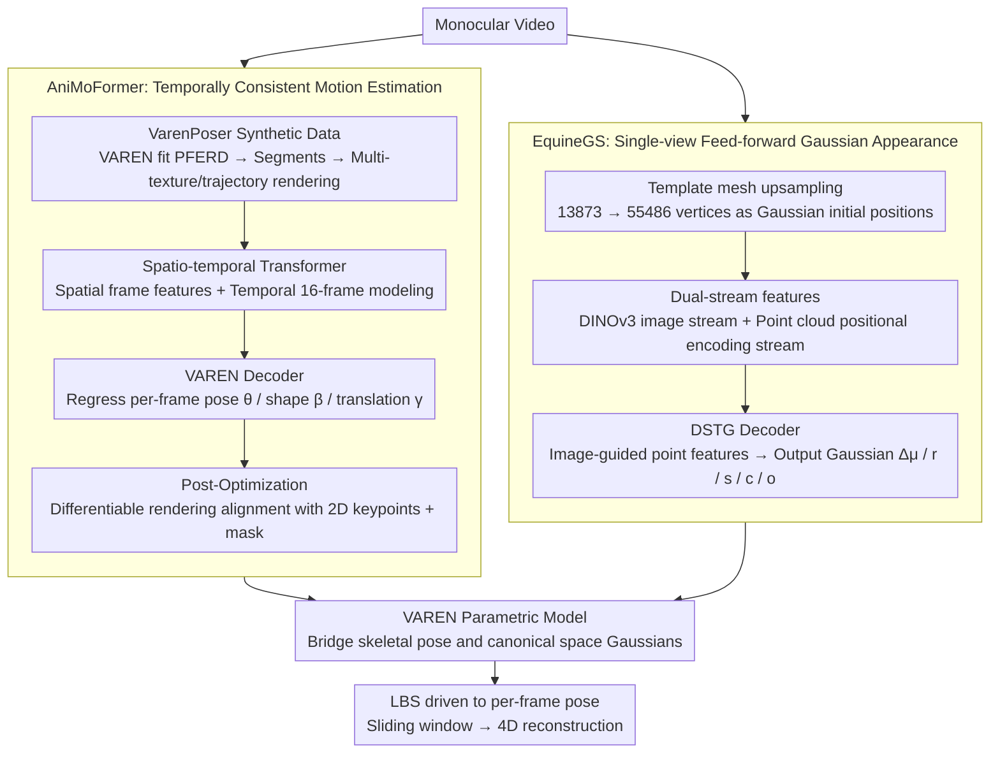

# 4DEquine: Disentangling Motion and Appearance for 4D Equine Reconstruction from Monocular Video

**Conference**: CVPR 2026  
**arXiv**: [2603.10125](https://arxiv.org/abs/2603.10125)  
**Code**: None  
**Area**: 3D Vision  
**Keywords**: 4D reconstruction, equine reconstruction, 3D Gaussian Splatting, parametric model, monocular video, feed-forward  

## TL;DR

The 4DEquine framework is proposed to **disentangle** 4D reconstruction of equines from monocular video into two sub-problems: dynamic motion estimation (AniMoFormer) and static appearance reconstruction (EquineGS). It achieves SOTA performance on real-world data while being trained only on synthetic data.

## Background & Motivation

Monocular 4D reconstruction of equines (horses, donkeys, zebras) holds significant value in fields such as animal welfare and sports analysis. However, existing methods face two major dilemmas:

**Optimization Bottleneck**: Leading 4D animal reconstruction methods (GART, SMALR/SMALST, DogRecon, etc.) require joint optimization of motion and appearance across an entire video. This entails high computational overhead (e.g., GART takes 15 minutes for 10k steps) and requires near-360° surround filming, which is extremely difficult to obtain in real-world scenarios.

**Representation Limitations**: Template-free methods (BANMo, RAC) lack explicit structural priors and yield poor geometric details. SMAL-based methods extract textures directly from images and are sensitive to mesh-image alignment accuracy. Feed-forward methods (MagicPony, 3D-Fauna) sacrifice shape realism for generalization.

**Key Insight**: 4D reconstruction can be **decomposed**—animal motion varies frame-by-frame, whereas appearance remains nearly constant within the same video. Therefore, it is unnecessary to optimize motion and appearance in a coupled manner. This disentanglement strategy offers two advantages: motion estimation can focus on temporal consistency, while appearance reconstruction can be generated feed-forward from a single image, avoiding dependence on multi-view complete observations.

The key to bridging motion and appearance is the **VAREN model**—a high-precision equine parametric model (13873 vertices, 38 joints) learned from thousands of 3D scans of 50 real horses. It introduces muscle deformation modeling and far exceeds the traditional SMAL model.

## Method

### Overall Architecture

4DEquine aims to solve 4D reconstruction of equines in monocular videos—restoring frame-by-frame motion while reconstructing high-fidelity, animatable appearances. The core premise is that while motion changes per frame, appearance remains nearly invariant in the same video. Consequently, the framework is split into two independent paths: AniMoFormer recovers frame-by-frame VAREN motion parameters (pose $\theta$, shape $\beta$, global translation $\gamma$) from the video, and EquineGS generates an animatable Gaussian avatar in canonical space from a single image. The two are bridged by the VAREN parametric model—AniMoFormer provides bone poses, while EquineGS generates canonical Gaussian point clouds, which are then driven to per-frame poses using LBS (Linear Blend Skinning). During inference, a sliding window processes videos of arbitrary length.

### Key Designs

**1. AniMoFormer: Temporally consistent motion recovery from video, trained only on synthetic data**

Real 4D VAREN annotations do not exist, which is the primary bottleneck for motion recovery. The authors circumvent this by creating the VarenPoser dataset: fitting the VAREN model to the PFERD optical marker-based equine motion dataset to obtain poses, cutting them into 600-frame segments, randomly varying shape parameters for diversity, and using MV-Adapter to generate diverse textures and simulate three real camera trajectories (fix/dolly/orbit). This yields 1,171 video segments at 512×512, 60 FPS. The network is a spatio-temporal Transformer: a Spatial Transformer extracts spatial features per frame, and a Temporal Transformer stacks $N=16$ frames using self-attention to model temporal dynamics. The VAREN Decoder regresses pose, shape, and camera parameters for each frame.

While the Transformer output is temporally smooth, it may not align perfectly with 2D images. Thus, a Post-Optimization step is added: a differentiable renderer projects the 3D mesh back to the image to compare against pseudo-GTs (2D keypoints from ViTPose++ and masks from Samurai), fine-tuning parameters via gradients for pixel-level alignment. Ablations show a significant drop in PCK@0.05 without post-optimization, indicating its necessity for true alignment.

**2. EquineGS: Feed-forward animatable Gaussian appearance from a single image**

The pain point of appearance reconstruction is achieving high fidelity without relying on multi-view complete observations. EquineGS upsamples the VAREN template mesh (which is too sparse at 13,873 vertices) via edge midpoint interpolation, splitting each face into four, resulting in $N_G = 55,486$ vertices as initial Gaussian positions. It then utilizes dual-stream features: an image stream using pre-trained DINOv3 (ViT-Large) to extract multi-scale features fused via 1×1 convolution into $\mathbf{F}_I \in \mathbb{R}^{784 \times 1024}$, and a point cloud stream using positional encoding on 3D coordinates processed through an MLP to obtain $\mathbf{F}_P \in \mathbb{R}^{N_G \times 1024}$.

Fusion is performed by the DSTG decoder (Dual-Stream Transformer Gaussian Decoder, modified from the Qwen-Image MMDiT block): first applying AvgPool + MLP to image features for a global context vector, then feeding image features, point features, and global context into the DSTG to allow image information to guide point features toward appearance representation. Finally, an MLP outputs position offset $\Delta\mu$, rotation $r$, scale $s$, color $c$, and opacity $o$ for each Gaussian. Ablations show that replacing DSTG with standard cross-attention degrades all perceptual metrics, proving that dual-stream interaction is superior for mapping image appearance to correct points. The training data, VarenTex, comprises 150,000 multi-view images synthesized via UniTex using normal maps, Canonical Coordinate Maps (CCM), and ControlNet.

### Loss & Training

The AniMoFormer loss combines VAREN fitting, smoothness, and 2D/3D alignment:

$$\mathcal{L} = \lambda_{\text{varen}}\mathcal{L}_{\text{varen}} + \lambda_{\text{smooth}}\mathcal{L}_{\text{smooth}} + \lambda_{\text{2D}}\mathcal{L}_{\text{2D}} + \lambda_{\text{3D}}\mathcal{L}_{\text{3D}}$$

Where $\mathcal{L}_{\text{smooth}}$ imposes L2 constraints on shape and pose differences between adjacent frames to ensure temporal smoothness. The post-optimization stage adds an additional mask L1 loss and pose regularization. The EquineGS loss is formulated as:

$$\mathcal{L} = \lambda_{\text{image}}\mathcal{L}_{\text{image}} + \lambda_{\text{mask}}\mathcal{L}_{\text{mask}} + \lambda_{\text{reg}}\mathcal{L}_{\text{reg}}$$

The image loss combines L1 and LPIPS perceptual loss to balance pixel accuracy with high-level semantics, while the mask loss provides contour L1 constraints.

## Key Experimental Results

### Main Results: Motion Estimation (Table 1)

| Method | APT36K PCK@0.05↑ | APT36K PCK@0.1↑ | APT36K Accel↓ | AiM PCK@0.05↑ | AiM PCK@0.1↑ | AiM Accel↓ | VarenPoser CD↓ |
|------|:-:|:-:|:-:|:-:|:-:|:-:|:-:|
| 3D-Fauna | 20.1 | 51.4 | 189.3 | 33.3 | 71.8 | 42.3 | 43.0 |
| 4D-Fauna | 25.5 | 53.5 | 177.7 | 46.5 | 74.8 | 32.7 | 38.5 |
| Dessie | 22.0 | 53.1 | 353.1 | 40.3 | 75.9 | 85.8 | 10.0 |
| GenZoo | 27.9 | 60.0 | 190.7 | 42.1 | 80.6 | 43.1 | 22.5 |
| AniMer | 44.5 | 76.6 | 130.5 | 55.5 | 87.7 | 26.2 | 15.2 |
| **AniMoFormer** | **61.8** | **83.9** | **128.6** | **84.2** | **95.3** | **21.8** | **3.4** |

AniMoFormer leads by a wide margin across all datasets: reaching 84.2% PCK@0.05 on AiM, which is 28.7 percentage points higher than the strongest baseline AniMer. The Chamfer Distance (CD) dropped from 15.2 to 3.4, a 4.5x improvement.

### Main Results: Appearance Reconstruction (Table 2)

| Method | Horse PSNR↑ | Horse SSIM↑ | Horse LPIPS↓ | Zebra PSNR↑ | Zebra SSIM↑ | Zebra LPIPS↓ |
|------|:-:|:-:|:-:|:-:|:-:|:-:|
| 3D-Fauna | 12.20 | 0.7205 | 0.2782 | 12.33 | 0.6827 | 0.3318 |
| 4D-Fauna | 13.41 | 0.7550 | 0.2467 | 13.39 | 0.7157 | 0.3055 |
| GVFDiffusion | 12.68 | 0.8189 | 0.2493 | 12.26 | 0.7749 | 0.2897 |
| GART* (few-shot) | 15.42 | 0.7550 | 0.2452 | 14.31 | 0.6485 | 0.2973 |
| GART (full) | 16.19 | 0.7819 | 0.2308 | 15.21 | 0.6752 | 0.2287 |
| **4DEquine** | **15.66** | **0.8364** | **0.1720** | **15.54** | **0.7828** | **0.2000** |

4DEquine surpasses all baselines, including the fully optimized GART, in perceptual metrics (SSIM, LPIPS). In zero-shot zebra generalization tasks, it leads in all three metrics. Efficiency-wise, 4DEquine takes only 11 seconds per frame (A100 GPU), compared to GART's fixed 15 minutes.

### Ablation Study (Table 3 & 4)

| AniMoFormer Variants | APT36K PCK@0.05↑ | APT36K Accel↓ | AiM PCK@0.05↑ | AiM Accel↓ |
|------|:-:|:-:|:-:|:-:|
| w/o PO & Temporal | 37.1 | 134.7 | 45.1 | 30.6 |
| w/o PO | 37.7 | 129.1 | 47.8 | 25.7 |
| w/o Temporal | 57.9 | 143.2 | 82.9 | 24.7 |
| **AniMoFormer (full)** | **61.8** | **128.6** | **84.2** | **21.8** |

| EquineGS Variants | PSNR↑ | SSIM↑ | LPIPS↓ |
|------|:-:|:-:|:-:|
| w/o PO | 13.84 | 0.8103 | 0.2170 |
| w/o SubDiv | 15.76 | 0.8237 | 0.1871 |
| w/o DSTG | 15.53 | 0.8353 | 0.1733 |
| **4DEquine (full)** | **15.66** | **0.8364** | **0.1720** |

### Key Findings

- **Post-Optimization is crucial**: Removing PO dropped PCK@0.05 from 61.8 to 37.7 (APT36K) and appearance PSNR from 15.66 to 13.84, showing that pixel-level alignment significantly impacts final reconstruction quality.
- **Temporal modeling improves smoothness**: Removing the Temporal Transformer led to a notable increase in acceleration error (from 128.6 to 143.2).
- **Point cloud subdivision is necessary but PSNR can be misleading**: The w/o SubDiv variant had slightly higher PSNR (15.76 vs 15.66), but the rendered results were full of holes; 13,873 points are insufficient for a continuous surface.
- **DSTG exceeds standard cross-attention**: Replacing DSTG with standard cross-attention led to a decline in all perceptual metrics.

## Highlights & Insights

1. **Elegant Disentanglement**: Decomposing 4D reconstruction into independent motion and appearance sub-problems—resolving motion with a spatio-temporal Transformer and appearance with a feed-forward network—effectively leverages the prior that appearance is invariant within a single video.
2. **Pure Synthetic Training, Real Generalization**: Both modules are trained solely on synthetic data yet achieve SOTA on real data, proving that high-quality synthetic data combined with strong structural priors can bridge the sim-to-real gap.
3. **Zero-shot Cross-species Generalization**: Trained only on horse data, the model can reconstruct donkeys and zebras, indicating it learns generalized image features rather than memorizing training textures.
4. **Efficiency Leap**: 11 seconds per frame vs. 15 minutes for GART, representing over an 80x speedup without relying on multi-frame optimization.
5. **VarenPoser Camera Track Design**: Simulating fix/dolly/orbit camera movements for rendering creates the first large-scale 4D synthetic video dataset for equines.

## Limitations & Future Work

1. **Poor Tail and Mane Reconstruction**: The VAREN model itself lacks adequate modeling for tails and manes; these complex physical structures require additional physics-based representations.
2. **Assumption of Invariant Ambient Lighting**: Current methods cannot handle dynamic lighting changes, which occur frequently in real outdoor scenes.
3. **Single-image Appearance Limitation**: EquineGS infers appearance from a single image; textures for invisible body regions are "guessed" by the network. Future work could fuse information from few keyframes to capture unique markings.
4. **Dependency on VAREN Prior**: The framework is tightly coupled with the VAREN model; generalizing to non-equine quadrupeds requires corresponding parametric models.
5. **Pseudo-GT Quality Bottleneck**: Post-optimization relies on detection quality from ViTPose++ and Samurai, which can introduce noise under occlusion or complex poses.

## Related Work & Insights

- **VAREN [61]**: High-precision equine parametric model, serving as the geometric prior base for this work.
- **AniMer [22]**: Single-frame Transformer for animal pose estimation, serving as the motion estimation baseline and extended here to a temporal version.
- **GART [13]**: Optimization-based animal avatar using 3DGS, the primary comparison method for appearance reconstruction.
- **3D/4D-Fauna [17, 53]**: Template-free generalized animal reconstruction methods.
- **UniTex [19]**: Multi-view diffusion model used to generate VarenTex training data.
- Insight: The disentanglement approach + synthetic data can be extended to 4D reconstruction for other quadrupeds; high-quality parametric models are a critical prerequisite for high-precision reconstruction.

## Rating

| Dimension | Score (1-10) | Explanation |
|------|:-:|------|
| Novelty | 7 | The disentanglement idea is innovative, though sub-modules (Spatio-temporal Transformer, 3DGS avatar) are largely combinations of existing techniques. |
| Technical Depth | 8 | The system is comprehensive, involving two datasets, two networks, and post-optimization with significant engineering effort. |
| Experimental Thoroughness | 8 | Three datasets, multiple baselines, thorough ablations, and zero-shot generalization are highlights. |
| Writing Quality | 7 | Clear structure, though dual-stream Transformer details rely on supplementary materials. |
| Value | 7 | Clear application value for equines; efficiency of 11s/frame is practical. |
| **Overall** | **7.5** | A comprehensive 4D equine reconstruction work; disentanglement + pure synthetic training are core contributions. |

<!-- RELATED:START -->

## Related Papers

- [\[CVPR 2026\] MotionScale: Reconstructing Appearance, Geometry, and Motion of Dynamic Scenes with Scalable 4D Gaussian Splatting](motionscale_reconstructing_appearance_geometry_and_motion_of_dynamic_scenes_with.md)
- [\[CVPR 2026\] MoVieS: Motion-Aware 4D Dynamic View Synthesis in One Second](movies_motion-aware_4d_dynamic_view_synthesis_in_one_second.md)
- [\[CVPR 2026\] 4D Primitive-Mâché: Glueing Primitives for Persistent 4D Scene Reconstruction](4d_primitive-mache_glueing_primitives_for_persistent_4d_scene_reconstruction.md)
- [\[CVPR 2026\] ReFlow: Self-correction Motion Learning for Dynamic Scene Reconstruction](reflow_self-correction_motion_learning_for_dynamic_scene_reconstruction.md)
- [\[ICCV 2025\] Shape of Motion: 4D Reconstruction from a Single Video](../../ICCV2025/3d_vision/shape_of_motion_4d_reconstruction_from_a_single_video.md)

<!-- RELATED:END -->
