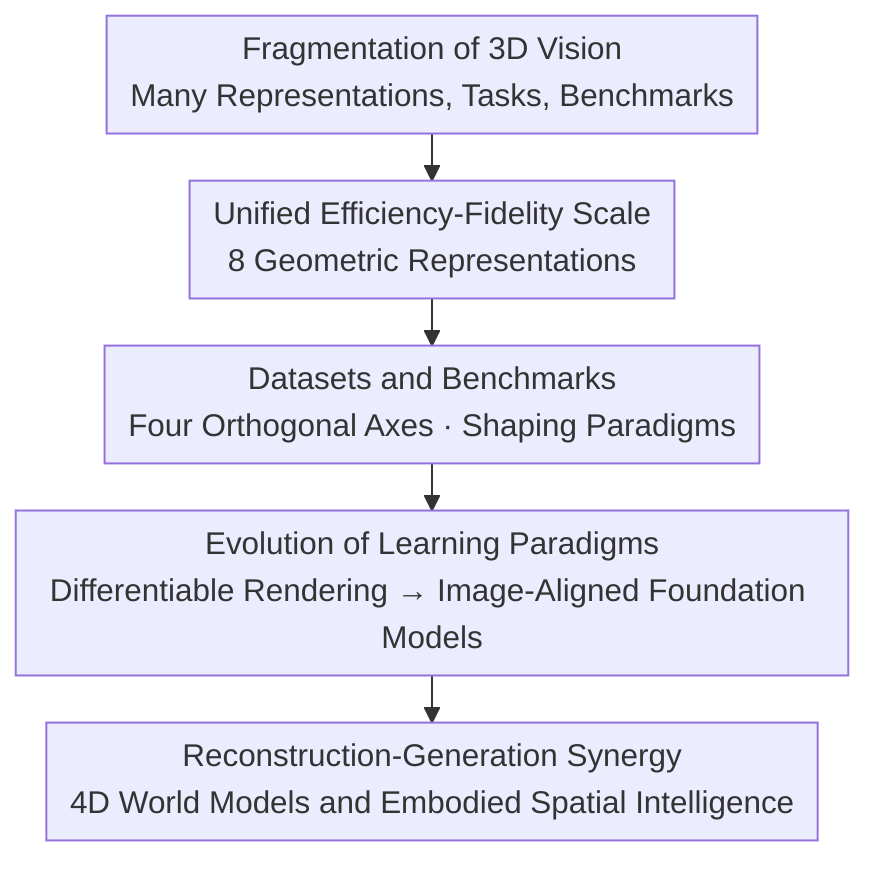

# A Cookbook of 3D Vision: Data, Learning Paradigms, and Application

**Conference**: CVPR 2026  
**arXiv**: [2606.04291](https://arxiv.org/abs/2606.04291)  
**Code**: https://github.com/Hongyang-Du/awesome-3d-datasets (Available, accompanying dataset list)  
**Area**: 3D Vision  
**Keywords**: 3D Representation, Data-centric Survey, Differentiable Rendering, Geometry Foundation Models, 4D World Models

## TL;DR
This is a 3D vision "cookbook" from a "data-centric" perspective. Rather than being organized by network architectures or single tasks, it connects **geometric representation → datasets & benchmarks → learning paradigms → downstream applications** into a unified conceptual map. It helps beginners understand the "efficiency-fidelity" trade-offs between point clouds, meshes, voxels, and 3D Gaussians, as well as the evolutionary main line from differentiable rendering to image-aligned geometry foundation models and 4D world models.

## Background & Motivation
**Background**: 3D vision has become a core pillar of autonomous driving, robotic manipulation, AR/VR, and digital reconstruction. With the popularization of RGB-D cameras, LiDAR, and real-time neural rendering, 3D perception is becoming increasingly practical, and methodologies are proliferating—there are nearly ten types of data representations alone (point clouds, meshes, voxels, RGB-D, multi-view, CAD, neural implicit fields, 3D Gaussians), each with its own structural assumptions, processing pipelines, and computational trade-offs. Downstream tasks span reconstruction, segmentation, pose estimation, and scene generation.

**Limitations of Prior Work**: This fragmentation of "multiple representations × multiple tasks × multiple benchmarks" creates a very steep learning curve for newcomers. More importantly, existing surveys are mostly **architecture-centric** (focusing on network families like PointNet/Transformer lineages), **representation-centric** (digging deep into only one representation), or **task-centric** (covering only a taxonomy of specific applications). Few have combined "data structure $\leftrightarrow$ benchmarks $\leftrightarrow$ modeling paradigms" within a single framework.

**Key Challenge**: The true difficulty of 3D vision lies in its **data**—the choice of representation directly determines which networks can be used, what supervision can be applied, and how much it can be scaled. However, traditional surveys treat "data" as an accessory, discussing models first and then tasks, leaving readers unable to assemble a global picture of "why this representation fits this paradigm, and which benchmark drives this paradigm."

**Goal**: To provide a **unified, data-centric** map of 3D vision that connects three things: (1) how 3D data is represented, stored, and processed in computers; (2) how datasets and benchmarks not only serve for evaluation but also conversely shape learning paradigms (defining data structures, supervision formats, and scalability constraints); (3) how the evolution from 2D-supervised 3D learning and neural implicit fields to 4D scene understanding and world models is unified by the "efficiency—fidelity—accessibility" main line.

**Key Insight**: The authors' core observation is that **geometric representation is the source of everything**. Once it is established that the "efficiency-fidelity" trade-off of 3D is determined by representation, one can compare all representations horizontally using the same scale (efficiency vs. fidelity) and naturally expand the field along the path of "representation $\to$ dataset $\to$ paradigm $\to$ application."

**Core Idea**: Use a "**unified data-centric taxonomy**" to replace the "architecture/task-centric puzzle," weaving fragmented 3D sub-fields into a navigable conceptual map.

## Method
As a survey paper, there is no "method" in the traditional sense; here, the **organizational framework and core insights** are clarified by explaining which axes of classification are proposed and which viewpoints are used to stitch 3D vision into a single map.

### Overall Architecture
The paper unfolds along three core axes with **sequential dependencies**: the first axis (data representation) establishes the unified "efficiency-fidelity" scale; the second axis (datasets/benchmarks) clarifies how these representations are implemented as learnable and evaluable problems and how they shape paradigms; finally, the third axis (learning paradigms and applications) explains how neural networks evolve on these representations and supervision, extending to downstream areas like reconstruction, generation, video, and 4D world models. It can be read as a "raw material to finished product" cooking pipeline—hence the name "cookbook."

### Key Designs
(For a survey, "Design" here refers to the **classification axes** and **core insights** proposed.)

**1. Unified "Efficiency-Fidelity" Scale for Eight Geometric Representations: Measuring all 3D data with one ruler**

Addressing the pain point that "there are too many representations and they are isolated," the authors put eight representations—RGB-D, multi-view images, point clouds, voxels, meshes, CAD, neural implicit fields, and 3D Gaussians—into **the same comparison table**, characterizing them through four dimensions: structure, efficiency, fidelity, and typical applications. Each representation is accompanied by a formal definition and acquisition pipeline: RGB-D uses the intrinsic matrix back-projection $\mathbf{p}=d(u,v)\cdot\mathbf{K}^{-1}\cdot[u,v,1]^{T}$ to convert 2.5D to 3D points in $O(H\times W)$; point clouds are unordered sets $\{\mathbf{p}_i=(x_i,y_i,z_i)\}_{i=1}^N$ with processing complexity varying by backbone (PointNet is $O(N)$, Point Transformer is $O(N^2)$, PointMamba returns to $O(N)$ using state spaces); CAD uses NURBS parametric surfaces $S(u,v)=\frac{\sum_{i,j}N_{i,p}(u)N_{j,q}(v)w_{ij}\mathbf{P}_{ij}}{\sum_{i,j}N_{i,p}(u)N_{j,q}(v)w_{ij}}$ supporting closed-form derivatives and Boolean operations; 3D Gaussians use $f(\mathbf{x})=\frac{1}{(2\pi)^{3/2}|\Sigma|^{1/2}}\exp(-\frac12(\mathbf{x}-\mu)^T\Sigma^{-1}(\mathbf{x}-\mu))$ and decompose covariance into $\Sigma=RSS^TR^T$ to ensure semi-definiteness. This scale is effective because it reveals a clear main line: from voxels (low efficiency) to 3D Gaussians (extremely high efficiency + high fidelity), the field is migrating toward "being both fast and realistic," arranging seemingly unrelated representations into the same evolutionary spectrum.

**2. Four Orthogonal Axes of Datasets/Benchmarks: Elevating "datasets" from supporting roles to driving forces**

Addressing the issue that "surveys only treat datasets as evaluation accessories," the authors catalog approximately 50 representative datasets along **four orthogonal axes**: (1) Data modality (RGB-D / Point Cloud / Mesh / Multi-view / Implicit Field / Gaussian); (2) Spatial granularity (Object-level / Scene-level indoor-outdoor / Human-level face-hand-body / Hybrid); (3) Task format (Segmentation / Correspondence / Reconstruction / Generation); (4) Temporal dimension (Static 3D vs. Dynamic 4D). The key insight is that modern benchmarks **no longer just collect data**; they directly encode "modern 3D pipeline assumptions" into data formats—for example, data tailored for image-aligned reconstruction or 3DGS native learning will in turn determine what the next generation of models looks like. In other words, **benchmarks define data structures, supervision formats, and scalability constraints, thereby actively shaping the direction of learning paradigm evolution**, which is the core argument for treating data as a "first-class citizen."

**3. Differentiable Rendering $\to$ Image-Aligned Geometry Foundation Models: Moving supervision from 3D space to the 2D pixel plane**

Addressing the pain point that "early direct 3D supervision (Chamfer / EMD / TSDF) faced computational explosion on dense voxels or high-resolution surfaces," the authors describe the evolution of learning paradigms as a single trajectory: **Differentiable rendering** (Neural Mesh Renderer / Soft Rasterizer) replaces 3D supervision with photometric loss on the image plane $\mathcal{L}_{\mathrm{photo}}=\sum_i\|I_i-\mathcal{R}(\mathcal{M}_\theta,P_i)\|^2$ by backpropagating through the imaging process. The rendering operators themselves transitioned from NeRF's volume rendering (physically rigorous but expensive for dense MLP queries) to 3DGS's tile-based rasterization (reducing rendering from seconds to milliseconds), a transition that directly catalyzed large-scale feed-forward 3D foundation models. Building on this, **image-aligned representations** have become the dominant paradigm (retaining per-pixel dense structures and keeping learning in the 2D domain), leading to a family of landmark models: DUSt3R uses confidence-weighted regression $\mathcal{L}_{\mathrm{pmap}}=\sum_i(\|C_i\odot(P_i-P_i^*)\|-\alpha\log C_i)$ to directly output image-aligned 3D point maps; VGGT expands to large-scale multi-view with multi-task targets $\mathcal{L}_{\mathrm{total}}=\mathcal{L}_{\mathrm{camera}}+\mathcal{L}_{\mathrm{depth}}+\mathcal{L}_{\mathrm{pmap}}+\lambda\mathcal{L}_{\mathrm{track}}$; RayZer performs pure 2D self-supervised reconstruction without explicit geometry; $\pi^3$ enforces permutation-equivariant supervision on unordered image collections; Depth Anything 3 compresses multiple geometry heads into a unified "depth + ray" representation $R\in\mathbb{R}^{H\times W\times 6}$. The reason this trajectory "works" is that the more supervision moves toward the 2D pixel plane, the more it can utilize massive 2D data and scalable training, pushing 3D learning toward "foundation model" scales.

**4. Reconstruction-Generation Synergy and 4D World Models: Moving from static geometry toward temporally persistent spatial intelligence**

Addressing the scarcity of explicit 3D data and the fact that reconstruction and generation have long been treated separately, the authors point out that the two have become deeply coupled recently: when 3D data is insufficient, paradigms shift to distilling priors from large-scale 2D models (Score Distillation Sampling in DreamFusion/Magic3D) or using structured latent spaces (TRELLIS learns a structured 3D latent decodable into radiance fields/Gaussians/meshes; SAM 3D uses Rectified Conditional Flow Matching + Model-in-the-Loop data engines, building recursive supervision from human-verified generation results to break data barriers). "Generation serves reconstruction" uses generative priors to hallucinate missing geometry in sparse views, while "reconstruction serves generation" uses rigid geometric skeletons to constrain the physical consistency of generation, forming a data flywheel in shared latent spaces. Furthermore, applications are extending into the temporal dimension: 4D rendering adds deformation fields to static Gaussians to represent motion as structured 3D evolution; 3D world models (PointWorld / ParticleFormer) push state spaces to persistent 3D points/particles to ensure temporal consistency and multi-view fidelity; finally, this reaches Embodied AI's 3D-VLA, grounding perception-language-control into shared 3D representations and expressing intentions with 3D point streams to achieve viewpoint robustness and cross-ontology generalization. This design point directs the "exit" of the entire map toward **spatial intelligence**.

## Key Experimental Results
As a survey paper, there is no experimental table for a specific method; here are the **key statistics and representative structured conclusions** used to support its arguments.

### Efficiency-Fidelity Comparison of Eight 3D Representations (Selected from Table 1)

| Representation | Structure | Efficiency | Fidelity | Typical Applications |
| :--- | :--- | :--- | :--- | :--- |
| RGB-D | 2.5D Grid (RGB+Depth) | High | Medium | SLAM, Indoor Mapping, Pose |
| Multi-view Image | 2D Views + Pose | High | High* | SfM, MVS, NeRF Input |
| Point Cloud | Unordered 3D Points | High | Low-Medium | Detection, Mapping, Robotics |
| Mesh | Vertex-Edge-Face Graph | Medium | High | Modeling, Animation, Simulation |
| Voxel | Dense 3D Grid | Low | Medium | Volumetric CNNs, Segmentation |
| Implicit Field | Neural Function $f(x)$ | Low | Extremely High | View Synthesis, Scene Modeling |
| 3D Gaussian | Sparse 3D Gaussian Dist. | Extremely High | High | Real-time NeRF-style Rendering |
| CAD | Parametric Surface (NURBS) | Extremely High | Extremely High | CAD Design, Reverse Engineering |

> *The "fidelity" of multi-view images refers to high visual appearance, while geometric structure must be inferred separately. This table is the "scale" for the entire paper—one can directly see the field migrating toward "High Efficiency + High Fidelity" (e.g., 3D Gaussians).

### Dataset Ecosystem Statistics (Section 5 / Figure 2)

| Dimension | Key Statistics/Conclusions |
| :--- | :--- |
| Scale | Catalogs approximately **50 representative datasets**, spanning from 2016 (Thingi10k) to 2025 (SAM 3D Body, GigaHands, InteriorGS, etc.). |
| Modality Distribution | Multi-label statistics used (one dataset can cover multiple modalities), hence represented by bar charts instead of pie charts. |
| Spatial Granularity | **Object-level** and **indoor scene-level** benchmarks currently dominate. |
| Temporal Dimension | Static 3D remains the majority; dynamic 4D (e.g., PointOdyssey, EgoExo4D, DIVA-360) is growing rapidly. |

### Key Findings
- **Representation determines everything**: The efficiency-fidelity scale explains why 3DGS became popular rapidly after 2024—it falls into the "Extremely High Efficiency + High Fidelity" quadrant, hitting the main line of the field.
- **Benchmarks are invisible paradigm drivers**: Recent benchmarks directly write assumptions of "image-aligned reconstruction" and "3DGS-native learning" into data formats, driving model forms from the data side.
- **Paradigms converge on 2D supervision**: From direct 3D supervision $\to$ differentiable rendering $\to$ image-aligned geometry foundation models, the main theme is "moving supervision to the 2D pixel plane" to leverage scalable training.
- **Reconstruction and generation are merging**: Shared latent spaces + data flywheels allow "generation to supplement geometry and reconstruction to provide constraints" to benefit each other, one of the most active current trends.

## Highlights & Insights
- **The data-centric perspective is a true differentiator**: Compared to architecture-centric or task-centric surveys, it treats "data representation" as the first principle of organization. Reading it helps build a navigable mental map of "representation $\leftrightarrow$ dataset $\leftrightarrow$ paradigm $\leftrightarrow$ application" rather than a list of unrelated sub-fields.
- **One scale for eight representations**: Using a 2D efficiency-fidelity coordinate to arrange all 3D representations is a highly reusable cognitive framework—it can be used to navigate trade-offs when selecting representations for any 3D project.
- **The "benchmarks shape paradigms" argument is insightful**: Repositioning datasets from "evaluation tools" to "paradigm drivers" reminds researchers to pay attention to implicit assumptions in data formats. This perspective is transferable to any data-intensive field like 2D vision or multi-modality.
- **Stitching fragmented frontiers into a main line**: New works from 2024–2025 like DUSt3R, VGGT, RayZer, $\pi^3$, DA3, TRELLIS, and SAM 3D are unified into a narrative of "Image-aligned $\to$ Generative Priors $\to$ Recon-Gen Synergy $\to$ 4D World Models," making it extremely friendly for rapid onboarding.

## Limitations & Future Work
- **Inherent obsolescence of surveys**: 3D Gaussians, geometry foundation models, and 4D world models are iterating rapidly; the cookbook’s snapshot will soon become outdated. It acknowledges itself as an introductory map for a "fast-expanding field."
- **Trade-off between depth and breadth**: To cover the full spectrum, technical details of individual representations/paradigms are relatively shallow (e.g., only one line of formula for each model's loss). For actual implementation, one still needs to return to the original papers; its positioning is "navigation" rather than "tutorial."
- **Lack of quantitative horizontal evaluation**: The "efficiency/fidelity" of the eight representations are qualitative labels (High/Medium/Low). Without quantitative figures under a unified benchmark, cross-representation comparisons remain at the conceptual level.
- **Application side leans toward the frontier**: Content like 4D world models and 3D-VLA are more like trend outlooks than established method reviews, with evidence coming from a small number of representative works.
- **Improvement ideas**: If an online leaderboard that updates over time could be provided (the accompanying repo is a prototype), and quantitative comparison tables under unified metrics for each axis were given, it would upgrade from a "map" to a "persistently searchable index."

## Related Work & Insights
- **vs. Architecture-centric surveys (e.g., PointNet/Transformer lineages)**: They focus on network families but do not touch upon the "dataset-representation" coupling. This paper conversely anchors on data, with the advantage of explaining "why a paradigm emerged" but the disadvantage of shallowly covering individual architectures.
- **vs. Task-centric / Representation-centric surveys**: Those works create deep taxonomies in single paradigms or tasks, but representations remain isolated. This paper connects them with a unified conceptual map, sacrificing local depth for global navigability.
- **vs. Mechanism-focused surveys (e.g., focusing only on differentiable rendering pipelines)**: They deep-dive into rendering as an independent topic. This paper **relegates differentiable rendering to a component** within a larger spectrum, emphasizing its bridge role in the evolution from "3D supervision $\to$ 2D pixel supervision," offering a more macroscopic view.
- **Insight**: This approach of "organizing a fragmented field with data/resources as the first principle" can be directly transferred to directions like embodied intelligence, video generation, and multi-modality, which similarly have diverse representations and numerous benchmarks, into their own "cookbooks."

## Rating
- Novelty: ⭐⭐⭐⭐ Not a new method, but the organizational perspective of "Data-centric + Efficiency-Fidelity Scale + Benchmarks Shaping Paradigms" is indeed rare in 3D surveys.
- Experimental Thoroughness: ⭐⭐⭐ Survey type, no method experiments; uses cataloging of ~50 datasets + representation comparison tables + paradigm lineages as support. Qualitative mainly, lacks quantitative cross-comparison.
- Writing Quality: ⭐⭐⭐⭐ The progression along three axes is clear, formulas and acquisition pipelines are well-explained, and a large number of frontier works are stitched into a readable main line.
- Value: ⭐⭐⭐⭐ A very good navigational map for beginners and researchers wanting to quickly onboard 3D frontiers; the accompanying repo enhances usability.

<!-- RELATED:START -->

## Related Papers

- [\[CVPR 2026\] Action-guided Generation of 3D Functionality Segmentation Data](action-guided_generation_of_3d_functionality_segmentation_data.md)
- [\[CVPR 2026\] GeoCodeBench: Benchmarking PhD-Level Coding in 3D Geometric Computer Vision](benchmarking_phd-level_coding_in_3d_geometric_computer_vision.md)
- [\[CVPR 2026\] 240FPS Stereo Vision from Monocular Mixed Spikes](240fps_stereo_vision_from_monocular_mixed_spikes.md)
- [\[CVPR 2026\] Ego-1K: A Large-Scale Multiview Video Dataset for Egocentric Vision](ego-1k_--_a_large-scale_multiview_video_dataset_for_egocentric_vision.md)
- [\[CVPR 2026\] AffordMatcher: Affordance Learning in 3D Scenes from Visual Signifiers](affordmatcher_affordance_learning_in_3d_scenes_from_visual_signifiers.md)

<!-- RELATED:END -->
