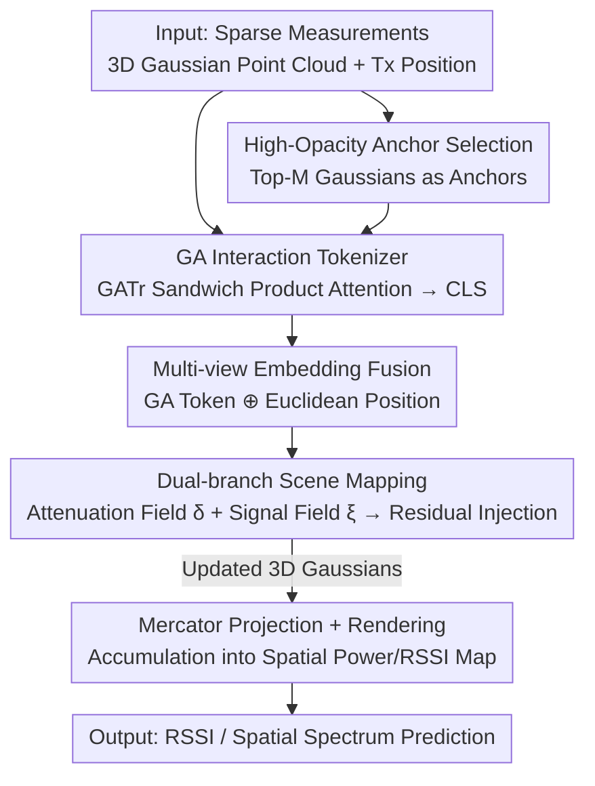

# GAI-GS: A Wireless Channel Prediction Framework Injecting Ray-Object Interaction into 3DGS via Geometric Algebra Attention

**Conference**: CVPR 2026  
**arXiv**: [2605.19065](https://arxiv.org/abs/2605.19065)  
**Code**: Dataset open-sourced at https://huggingface.co/datasets/NorahCS/GAT-series_Dataset (Code not explicitly released)  
**Area**: 3D Vision / 3D Gaussian Splatting / Wireless Channel Modeling  
**Keywords**: Geometric Algebra, 3D Gaussian Splatting, Wireless Channel Prediction, Ray-Object Interaction, RSSI/Spatial Spectrum

## TL;DR
GAI-GS treats 3D Gaussian Splatting (3DGS) as a wireless radiation field. It utilizes a Geometric Algebra (GA)-based attention tokenizer to implicitly model physical ray-object interactions—such as reflection, diffraction, and transmission—within the scene. These interaction features are then injected as residuals into Gaussian attributes via a dual-branch scene mapping network, achieving SOTA performance in MAE and SSIM across several real-world indoor RSSI and spatial spectrum datasets.

## Background & Motivation
**Background**: Wireless channel modeling characterizes the propagation of electromagnetic (EM) waves in complex environments (attenuation, reflection, diffraction, scattering), which is fundamental for network design, positioning, and resource allocation. Traditional approaches include probabilistic models (empirical statistics linking signal strength to distance, but failing to distinguish angle of arrival), deterministic models (ray tracing based on physical optics and CAD descriptions, but unable to capture fine material/structural details in real scenes), and neural models. Among neural methods, NeRF2 adopts NeRF for wireless scenarios to jointly encode geometry and signals, offering high precision but suffering from slow speeds. 3D-GS represents scenes as sets of points for real-time rendering, leading frameworks like RF-3DGS, WRF-GS, and GSRF to use 3D-GS for spatial channel reconstruction from sparse measurements.

**Limitations of Prior Work**: Existing wireless 3D-GS methods treat signal propagation as a **purely data-driven regression**, directly learning the mapping of "spatial coordinates → signal strength" while completely ignoring the physical interaction between EM rays and environmental geometry. These methods do not explicitly model reflection, refraction, or diffraction at material boundaries, nor do they leverage geometric and EM properties of obstacles, failing to capture the fundamental physical laws of wave propagation and causing distortion in Non-Line-of-Sight (NLOS) regions.

**Key Challenge**: Physics-based methods like ray tracing require explicit knowledge of scene geometry, material properties, and precise collision points to construct interaction operators, which are unavailable in large-scale real-world scenarios (unknown material labels and collision points). Purely neural methods bypass this difficulty by not modeling interactions at all. There is a trade-off between physical consistency and learnability.

**Goal**: To enable 3D-GS networks to **implicitly** learn ray-object interactions within the scene and inject this interaction awareness into the Gaussian representation without requiring material labels or explicit collision points, thereby maintaining the real-time performance of 3D-GS while restoring physical consistency.

**Key Insight**: The authors observe that Geometric Algebra (Clifford framework) can express geometric transformations such as rotation, reflection, diffraction, and transmission through a unified "sandwich product" $\mathbf{V}'=\boldsymbol{I}\mathbf{V}\boldsymbol{I}^{-1}$ involving rotors/versors. Furthermore, the attention mechanism in GATr (Geometric Algebra Transformer) inherently possesses this sandwich product structure. By aligning EM ray interaction with GA attention, multiple bounces and effects can be represented by a single differentiable operator, eliminating the need for dedicated modules for each interaction type.

**Core Idea**: Use GA attention to implicitly learn "ray-object interaction operators" into tokens, and inject them via residuals into Gaussian attributes (opacity, rotation, scaling, signal coefficients). Essentially, "replacing pure regression with GA sandwich products to supply the missing propagation physics in 3D-GS."

## Method

### Overall Architecture
The input to GAI-GS consists of sparse wireless measurements, initialized 3D point clouds (where each point is a 3D Gaussian), and the transmitter (Tx) position. The output is a spatial power map, RSSI map, or spatial spectrum on the receiver (Rx) sensing plane. The pipeline consists of two main components: the **Scene Mapping Network**, responsible for learning interaction physics into Gaussian attributes, and the **Projection & Render Module**, responsible for projecting the updated 3D Gaussians onto the Rx antenna plane to accumulate signals.

Specifically, Gaussian positions $P_x$ and the Tx position $P_{TX}$ are fed into a **multi-view tokenizer**: it uses GATr to perform GA attention on a set of Gaussians in the geometric algebra space $\mathbb{G}_{3,0,1}$, producing a global CLS token aggregating interaction context, which is then concatenated with Euclidean positional embeddings to form "interaction-aware + geometry-aware" multi-view embeddings. These embeddings are fed into a **dual-branch scene mapping network**: the attenuation branch predicts a spatially varying attenuation field $\delta(\mathbf{x})$ and intermediate geometric features $f$, while the signal branch predicts scattering field amplitude $\xi(\mathbf{x})$. These features are passed through three MLP heads (Rotation / Scaling / Signal) to update the rotation, scaling, and spherical harmonic (SH) coefficients of each Gaussian via **residuals**. An **opacity residual** $d_{\text{attn}}$ related to the transmitter is also calculated. Finally, the updated 3D Gaussians are projected via Mercator projection, sorted by depth, and alpha-blended to accumulate pixel signals $R_k$ under EM propagation constraints.

### Key Designs

**1. GA Interaction Tokenizer: Implicitly learning ray-object interaction via sandwich product attention without material labels**

To address the lack of physical interaction modeling in existing wireless 3D-GS methods, the authors model EM ray interactions as operators in geometric algebra. In $\mathbb{G}_{3,0,1}$ (3 spatial + 1 temporal dimension, with Minkowski signature), a ray state $\mathbf{V}$ undergoing an interaction can be written as a sandwich product $\mathbf{V}'=\boldsymbol{I}\mathbf{V}\boldsymbol{I}^{-1}$: reflection as $\mathbf{x}'=-R\mathbf{x}R^{-1}$, diffraction as $\mathbf{x}'\approx D\mathbf{x}D^{-1}$ (approximation), and material penetration as $\mathbf{x}'=T\mathbf{x}T^{-1}$. A full path with $n$ interactions is $V'=I_1I_2\cdots I_n V I_n^{-1}\cdots I_1^{-1}=IVI^{-1}$, where the physically consistent trajectory is determined by the cumulative operator $I=\prod_i I_i$.

The key is that GA attention in GATr naturally shares this sandwich product structure. Standard dot-product attention $\text{Attention}(q,k,v)=\sum_i \text{Softmax}_i(\langle q,k\rangle/\sqrt{8n_c})\,v$ can be reformulated as $\text{Attention}(q,k,v)_{i'c'}=\sum_i A_{i'} v_{ic'} A_{i'}^{-1}$, where $A_{i'}$ is a multivector operator, analogous to the interaction operator $I$. By embedding GA into attention, the encoder possesses equivariance to rotation/reflection and aligns with EM propagation symmetries, allowing it to **implicitly** infer complex interactions from data without requiring material types or collision points.

**2. High-Opacity Anchor Selection: Reducing GATr's $O(N^2)$ attention to $O(M^2)$**

Processing all $N$ Gaussian positions through GATr is computationally expensive due to quadratic complexity. The authors select the **top-$M$ Gaussians with the highest opacity** ($M \ll N$) as anchors to instantiate the tokenizer. These high-opacity primitives usually correspond to walls and obstacles—regions that are geometrically significant and most impactful for propagation. As the Gaussian representation evolves, the anchor subset updates accordingly. Global context from the encoder is then broadcasted back to all $N$ Gaussians.

**3. Multi-view Embedding Fusion: Complementing GA interaction features with Euclidean geometric features**

Interaction tokens alone are insufficient for capturing absolute positions or large-scale layout metrics. The authors extract positional embeddings from Euclidean space in parallel and **concatenate** the GA stream with the Euclidean stream. This allows the network to distinguish scenarios with similar Tx configurations but different interactions (via GA features) and resolve local geometric ambiguities (via the complementary streams).

**4. Dual-branch Scene Mapping + Tx-dependent Residual Parameterization: Injecting interaction residuals into Gaussian attributes**

The mapping network splits wireless propagation into two physical processes. The attenuation branch $F_{\text{att}}$ takes Tx/Gaussian embeddings and CLS to output a scalar attenuation field $\delta(\mathbf{x})$ and geometric features $f$, representing extinction as waves pass through media. The signal branch $F_{\text{sig}}$ predicts scattering amplitude $\xi(\mathbf{x})$ to model NLOS propagation. These updated parameters are added as **residuals**: rotation $d_{\text{rotation}}$, scaling $d_{\text{scaling}}$, and signal $d_{\text{signal}}$.

A critical physical insight is that **opacity should vary with the transmitter**. In standard 3DGS, opacity $\alpha_i$ is fixed. However, an obstacle's blocking effect depends on the Tx location. The authors use $f$ to calculate an opacity residual $\tilde{\alpha}_i=\alpha_i+d_{\text{attn},i}$ with $L_2$ regularization. Residual parameterization ensures the network learns offsets relative to canonical Gaussian parameters, maintaining structural priors.

### Loss & Training
The model is optimized end-to-end using MAE and SSIM, plus $L_2$ regularization for opacity residuals (specific to spectrum datasets):

$$L=\frac{1}{M}\sum_{i=1}^{M}\big(\beta L_{\text{MAE}}(I_{gt},I_{pred})+(1-\beta)L_{\text{SSIM}}(I_{gt},I_{pred})\big)+\alpha L_2(d_{attn})$$

For BLE datasets, invalid measurements far from the Tx are filtered. During rendering, a softmax attention weighting step is applied to the RSSI map to emphasize strong signal regions while resisting noise and outliers.

## Key Experimental Results

### Main Results
Evaluated across two self-built indoor rooms (2.4 GHz / 5.0 GHz RSSI), public BLE-RSSI, and RFID spatial spectrum datasets. Lower MAE and higher SSIM indicate better performance. GAI-GS achieved the best results in all settings.

| Method | Room1 2.4GHz MAE↓ | Room1 5.0GHz MAE↓ | Room2 2.4GHz MAE↓ | Room2 5.0GHz MAE↓ | BLE MAE↓ | Spectrum SSIM↑ |
|------|------|------|------|------|------|------|
| Ray Tracing | 25.52 | 20.66 | 25.56 | 20.78 | – | 0.33 |
| MLP | 7.3 | 9.3 | 8.2 | 9.9 | 8.0 | 0.71 |
| FIRE | 5.8 | 5.5 | 4.5 | 2.7 | 6.4 | 0.73 |
| DCGAN | 4.0 | 3.4 | 4.2 | 3.0 | 4.6 | 0.56 |
| NeRF2 | 3.6 | 2.9 | 3.9 | 2.0 | 3.1 | 0.78 |
| NeRF-APT | 3.3 | 2.7 | 3.6 | 2.0 | 3.1 | 0.84 |
| WRF-GS (Prev. SOTA) | 3.1 | 2.4 | 3.1 | 1.9 | 2.8 | 0.82 |
| **GAI-GS (Ours)** | **2.9** | **1.6** | **2.7** | **1.8** | **2.3** | **0.91** |

Compared to the strongest baseline (WRF-GS): MAE decreased by 1.2 dB / 0.6 dB in Room 1 and 0.4 dB / 0.1 dB in Room 2. Spectrum SSIM improved significantly from 0.82 to 0.91.

### Efficiency Analysis
Comparison of training/inference/rendering times on a single A100 for the Spectrum subset. While GAI-GS is slower due to GA attention, its **rendering speed is the fastest**, with the highest reconstruction quality.

| Method | Training (mins) | Inference (ms) | Rendering (ms) | Spectrum SSIM |
|------|------|------|------|------|
| WRF-GS | 312.38 | 434.21 | 39.29 | 0.82 |
| WRF-GS+ | 101.06 | 4.78 | 1.43 | – |
| **GAI-GS** | 203.00 | 17.37 | **0.91** | **0.91** |

> ⚠️ The rendering time "0.91" for GAI-GS matches its SSIM value; this might be a typo in the original paper, but it is reported as is.

### Key Findings
- ⚠️ **Absence of Standard Ablation**: The paper lacks a per-module ablation study (w/o individual components), making it difficult to quantify the specific contribution of GA tokens versus residual injection.
- The most significant gains are in **spatial spectrum SSIM (0.82→0.91)** and **5.0 GHz MAE**, suggesting GA interaction modeling primarily benefits perceptual fidelity in capturing fine reflection/diffraction structures.
- Superiority is more stable in indoor environments with structural obstacles, validating the intention to model ray-object interactions.

## Highlights & Insights
- **Mapping EM interactions to GA sandwich products**: Aligning $IVI^{-1}$ with the mathematical structure of GATr attention allows the "physical operator" to naturally become a "learnable operator," bypassing the need for separate modules for different interactions.
- **Tx-dependent opacity residuals**: This trick captures query-dependent attenuation effectively and could be applied to any splatting scenario where the medium is sensitive to query conditions.
- **Complexity reduction via high-opacity anchors**: A simple but effective way to handle large-scale Gaussian attention by focusing on geometrically significant regions.
- **Residual parameterization**: Updating attributes via offsets rather than absolute values preserves the 3DGS structural prior and stabilizes training.

## Limitations & Future Work
- **Lack of ablation studies**: It is difficult to isolate whether GA is the primary driver of performance or if dual-branch/residual designs play a larger role.
- **Marginal gains in specific frequency bands**: In some cases (e.g., Room 2 5.0 GHz), the improvement over WRF-GS is minimal (0.1 dB).
- **Slower training/inference**: The inclusion of GA attention increases computational overhead compared to WRF-GS+.
- **Limited scale**: Trials were conducted in small indoor rooms; generalization to large-scale outdoor or mmWave scenarios is unknown.
- **Future Directions**: Supplementing with ablation studies; upgrading anchor selection to learnable importance sampling; combining GA operators with real-world material priors for better NLOS accuracy.

## Related Work & Insights
- **vs. WRF-GS / WRF-GS+**: Both build on 3D-GS for wireless fields. While WRF-GS+ uses physics enhancement as regression, GAI-GS **injects interaction physics via GA attention**, resulting in higher SSIM and faster rendering at the cost of higher training/inference latency.
- **vs. NeRF2 / NeRF-APT**: NeRF approaches are slow; GAI-GS maintains real-time character while outperforming them in MAE/SSIM on BLE/Spectrum datasets.
- **vs. Ray Tracing**: Traditional ray tracing requires CAD models and material labels, which are often unavailable, leading to high errors (20+ dB). GAI-GS acts as a neural alternative that **requires no labels** and learns interactions implicitly.
- **vs. GATr**: GAI-GS reinterprets GATr's equivariant attention as a wireless ray interaction operator, marking the first application of GA-Transformers in the wireless channel domain.

## Rating
- Novelty: ⭐⭐⭐⭐ Integrating GA attention into wireless 3D-GS to unify reflection/diffraction modeling is mathematically elegant.
- Experimental Thoroughness: ⭐⭐⭐ Main results are solid, but the **lack of ablation** is a significant omission.
- Writing Quality: ⭐⭐⭐⭐ Clear physical intuition and mathematical derivation.
- Value: ⭐⭐⭐⭐ Practical applications in wireless digital twins; valuable tricks like Tx-dependent residuals and anchor-based speedups.

<!-- RELATED:START -->

## Related Papers

- [\[CVPR 2026\] Geometric-Photometric Event-based 3D Gaussian Ray Tracing](geometric-photometric_event-based_3d_gaussian_ray_tracing.md)
- [\[CVPR 2026\] BEA-GS: BEyond RAdiance Supervision in 3DGS for Precise Object Extraction](bea-gs_beyond_radiance_supervision_in_3dgs_for_precise_object_extraction.md)
- [\[CVPR 2026\] DropAnSH-GS: Dropping Anchor and Spherical Harmonics for Sparse-view Gaussian Splatting](dropping_anchor_and_spherical_harmonics_for_sparse-view_gaussian_splatting.md)
- [\[CVPR 2026\] GAP: Action-Geometry Prediction with 3D Geometric Prior for Bimanual Manipulation](action-geometry_prediction_with_3d_geometric_prior_for_bimanual_manipulation.md)
- [\[CVPR 2026\] CARI4D: Category Agnostic 4D Reconstruction of Human-Object Interaction](cari4d_category_agnostic_4d_reconstruction_of_human_object_interaction.md)

<!-- RELATED:END -->
