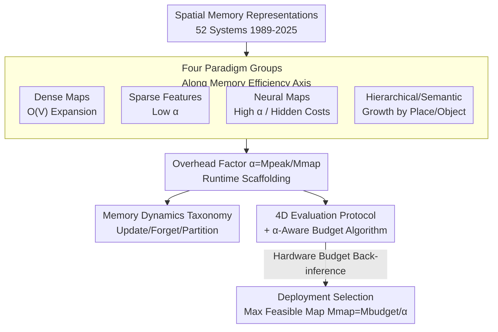

# A Survey of Spatial Memory Representations for Efficient Robot Navigation

**Conference**: CVPR 2026  
**arXiv**: [2604.16482](https://arxiv.org/abs/2604.16482)  
**Code**: None  
**Area**: 3D Vision / SLAM / Robot Navigation  
**Keywords**: Spatial Memory, SLAM, Memory Efficiency, Neural Implicit Representations, 3D Gaussian Splatting

## TL;DR
This paper provides a comprehensive survey of SLAM spatial memory representations (covering 1989–2025, 88 papers, and 52 systems) centered on "memory efficiency." Its core contribution is the introduction of the **overhead factor $\alpha=M_{\text{peak}}/M_{\text{map}}$**, which reveals the significant, often hidden gap between "reported map size" and "actual runtime memory required for deployment" (with $\alpha$ spanning two orders of magnitude, 2.3–215, within neural methods). It provides independently measured $\alpha$ reference values, a four-dimensional evaluation protocol, and a deployment algorithm that calculates feasible map sizes based on memory budgets.

## Background & Motivation
**Background**: Visual SLAM (Simultaneous Localization and Mapping) has been researched for over two decades, evolving from occupancy grids and sparse features to neural implicit representations like NeRF and 3D Gaussian Splatting (3DGS). This has led to numerous systems achieving high precision (ATE, PSNR) on indoor short-sequence benchmarks like Replica, EuRoC, and TUM RGB-D. Existing surveys (e.g., Tosi et al.) primarily organize these systems **by methodology and accuracy**.

**Limitations of Prior Work**: When robots navigate in real-world large-scale environments, spatial memory grows **unboundedly**. Dense representations expand with mapping volume $O(V)$, observations accumulate linearly with task duration, and revisited areas are stored redundantly. This leads to query latencies exceeding real-time thresholds and map updates failing to keep pace with sensor streams, ultimately causing system termination on embedded platforms due to memory overflow. Deployment platforms are highly constrained: autonomous robots, drones, and AR headsets typically run on 8–16 GB shared memory and $<30$ W embedded GPUs (e.g., Jetson Orin), with **no hardware upgrade path after deployment**.

**Key Challenge**: The "map size" reported in papers (the saved checkpoint) does not predict deployment feasibility. The authors' measurements reveal that while Co-SLAM's checkpoint is only 8 MB, it consumes 1.3 GB of GPU memory at runtime; NICE-SLAM's 47 MB map requires 10 GB at runtime; and SplaTAM's 254 MB map takes 14 GB. On a 16 GB embedded GPU, this leaves less than 2 GB for perception, planning, and the OS, rendering the system infeasible. **It is the memory architecture, not the paradigm label (e.g., "neural" or "sparse"), that determines deployability.**

**Goal**: ① Quantify the gap between "runtime overhead vs. saved map" using a unified diagnostic metric; ② Provide reliable, independently measured cross-paradigm reference data; ③ Offer a tool allowing engineers to determine the "maximum feasible map size for a paradigm on target hardware" **before implementation**.

**Key Insight**: Re-examine all representations through a different organizational dimension—not by methodology or accuracy ranking, but by **memory behavior (scaling, $\alpha$, and compression strategies)**. Neural methods are treated as a special case of the broader "memory scaling problem."

**Core Idea**: Establish "memory feasibility" as a first-class citizen by using the "overhead factor $\alpha$" to decouple deployment costs into "map itself + computational scaffolding." This forms the basis for a classification system, evaluation protocol, and budget algorithm.

## Method

### Overall Architecture
The survey is structured around the "memory efficiency axis." It first categorizes spatial memory representations into **four paradigm groups**, analyzing the scaling behavior, $\alpha$, and compression strategies of each (Section 3). It then uses the unified **overhead factor $\alpha$** to bring them into a single table for cross-paradigm comparison and Pareto analysis (Section 4). Next, it proposes a **four-dimensional evaluation protocol + $\alpha$-aware budget algorithm** (Section 5) to cover gaps in existing benchmarks. Finally, it characterizes **memory dynamics** through update, forget, and partition dimensions (Section 6), and outlines open challenges such as city-scale mapping, lifelong learning, and uncertainty quantification (Section 7). The result is an actionable toolchain for practitioners.

The following diagram illustrates the organizational backbone of the survey:

### Key Designs

**1. Overhead Factor $\alpha$: Quantifying the Gap between "Map Size" and "Deployment Cost"**

The survey notes that nearly all papers report only the saved map size $M_{\text{map}}$, but the peak runtime memory $M_{\text{peak}}$ is what dictates deployability. The authors define the overhead factor as:

$$\alpha=\frac{M_{\text{peak}}}{M_{\text{map}}}$$

Where $M_{\text{peak}}$ is the peak runtime memory (CPU RSS or GPU memory allocation), and $M_{\text{map}}$ represents all persistent checkpoints written to disk (including network weights, feature banks, codebooks, etc.). This dimensionless ratio decomposes runtime costs into the "map itself + computational scaffolding" (optimizer states, gradient buffers, rendering caches, vocabularies, allocator overhead). A low $\alpha$ indicates that map size reliably predicts deployment cost; a high $\alpha$ indicates hidden runtime overhead. A critical detail is the distinction between $\alpha_{\text{CPU}}$ and $\alpha_{\text{GPU}}$. The authors emphasize that $\alpha$ must be interpreted alongside absolute $M_{\text{peak}}$ and $M_{\text{map}}$ values. For example, Point-SLAM's $\alpha \approx 2.3$ appears optimal, but it is because it pre-loads 2.9 GB of cost into the map itself; its absolute peak is not low.

**2. Classification of Four Paradigm Groups x Memory Efficiency Axis**

The survey categorizes 52 systems into four groups based on scaling behavior. **Dense Maps** (Occupancy Grids, OctoMap, Voxblox/TSDF) expand with volume $O(V)$. Occupancy grid size is $M_{\text{grid}}=\frac{V}{r^{3}}\times b$ (where $r$ is resolution and $b$ is bytes per cell; a 3000 m³ floor at 5 cm resolution requires ~96 MB). **Sparse Features** (ORB-SLAM3, VINS-Mono, Basalt) store only landmarks/keyframes, resulting in maps an order of magnitude smaller and low $\alpha$ (ORB-SLAM3 $\alpha_{\text{CPU}} \approx 4$). **Neural Maps** (NeRF-based like iMAP/NICE-SLAM or 3DGS-based like SplaTAM) have extremely small maps but massive runtime overhead or load costs into the map. **Hierarchical/Semantic** (FabMap, Hydra, VLMaps) grow by "place/object" rather than volume. A key insight is that CLIP features (512-d, 32-bit) cost ~2 GB per million points, which can be as large as the geometric map itself.

**3. Three-dimensional Taxonomy of Memory Dynamics**

Even compact representations can overflow without management. The survey characterizes dynamics through: **Update Strategies** (incremental + BA, sliding window, gating), **Forgetting Rules** (discarding old data: keyframe culling, working-to-long-term memory transfer, temporal windows, merging), and **Partitioning** (monolithic vs. hierarchical). A key insight is that **forgetting only reduces $M_{\text{map}}$, not $\alpha$**. To reduce $\alpha$, the architecture must be modified (e.g., inference-only deployment, gradient checkpointing, mixed precision).

**4. 4D Evaluation Protocol and $\alpha$-aware Budget Algorithm**

Existing benchmarks miss critical dimensions. The authors propose adding: ① **Memory Growth Rate $dM/dt$** (distinguishing bounded vs. unbounded systems); ② **Query Latency** (comparing $O(1)$ hashes vs. full NeRF inference); ③ **Memory-Completeness Curve** (F1 score vs. cumulative map size); ④ **Throughput Degradation** (FPS as memory limits are approached). The **$\alpha$-aware Budget Algorithm** works backward: given a budget $M_{\text{budget}}$, the maximum feasible map is $M_{\text{map}}^{\max}=\frac{M_{\text{budget}}}{\alpha}$.

## Key Experimental Results

As this is a survey, it contains no new methodology experiments. Its core "data" consists of **independent profiling** of 5 neural SLAM systems on an NVIDIA A100-SXM4-80GB (sampling at 1 Hz via `nvidia-smi`), providing the first cross-paradigm $\alpha$ reference values.

### Comparison Table (Section 3 & 4 Abridged)

| System | Paradigm | Benchmark | Map $M_{\text{map}}$ | Peak $M_{\text{peak}}$ | $\alpha$ | Note |
|------|------|------|------|------|------|------|
| ORB-SLAM3 | Sparse | EuRoC | 55 MB | 220 MB | $\alpha_{\text{CPU}}$=4.0 | Reliable prediction |
| Basalt | Sparse (VI) | EuRoC | 35 MB | 120 MB | ≈3.4 | Minimum peak |
| Point-SLAM | NeRF | Replica | 2865 MB | 6563 MB | $\alpha_{\text{GPU}}$=2.3 | Cost loaded into map |
| Co-SLAM | NeRF | Replica | 8 MB | 1258 MB | $\alpha_{\text{GPU}}$=157 | 8MB map, 1.3GB overhead |
| NICE-SLAM | NeRF | Replica | 47 MB | 10082 MB | $\alpha_{\text{GPU}}$=215 | Extreme overhead |
| SplaTAM | 3DGS | Replica | 254 MB | 14024 MB | $\alpha_{\text{GPU}}$=55 | No Gaussian pruning |

> ⚠️ **Benchmarks are not directly comparable**: Sparse systems use EuRoC (real-world), while neural systems use Replica (synthetic). Values should only be interpreted through scaling behavior and $\alpha$.

## Key Findings
- **$\alpha$ spans two orders of magnitude**: Within neural methods, it ranges from 2.3 to 215, proving runtime architecture is more critical than paradigm labels for feasibility.
- **Architectural drivers of $\alpha$**: Optimizer states (Adam stores two momentum buffers per parameter, roughly 3x model size), gradient buffers, and rendering caches drive high $\alpha$.
- **Forgetting $\neq$ lowering $\alpha$**: Bounded map sizes (like Co-SLAM's fixed hash table) do not reduce runtime scaffolding.
- **No single winner**: 3DGS achieves best absolute accuracy on Replica at the cost of high memory, while scene graphs offer semantic abstraction with predictable costs.

## Highlights & Insights
- **Quantifying systemic bias**: The $\alpha$ ratio exposes the "8 MB map vs. 1.3 GB actual cost" discrepancy and can be easily calculated for future works.
- **Organization by behavior**: Moving from "accuracy ranking" to "memory behavior" allows the survey to answer the engineer's question: "Will this run on my Jetson?"
- **Honest reporting**: The authors disclose discrepancies between their measured checkpoints and values reported in original literature, enhancing the credibility of the reference data.

## Limitations & Future Work
- **Limitations**: Profiling is limited to 5 systems on a single GPU (A100) and focused on training-time $\alpha$; inference-only $\alpha$ is not yet profiled. The 4D protocol's metrics are not yet implemented across all existing benchmarks.
- **Future Work**: Development of long-term benchmarks (30+ min) to record $M(t)$ and $FPS(t)$, separation of training vs. inference $\alpha$, and exploration of information-theoretic forgetting criteria to achieve $O(\log t)$ growth.

## Related Work & Insights
- **vs. Tosi et al. [68]**: While they organize by method and rank by accuracy, this paper organizes by memory behavior and uses $\alpha$ to reveal hidden costs.
- **vs. Memory Optimization works (RTAB-Map)**: This survey contextualizes specific solutions (like RTAB-Map's long-term memory transfer) into the unified update/forget/partition framework.
- **Insight**: The budget algorithm $M_{\text{map}}^{\max}=M_{\text{budget}}/\alpha$ provides a "feasibility threshold" that can be integrated into robot selection pipelines to avoid OOM errors after implementation.

## Rating
- Novelty: ⭐⭐⭐⭐ 
- Experimental Thoroughness: ⭐⭐⭐ 
- Writing Quality: ⭐⭐⭐⭐⭐ 
- Value: ⭐⭐⭐⭐⭐ 

<!-- RELATED:START -->

## Related Papers

- [\[CVPR 2026\] LightSplat: Fast and Memory-Efficient Open-Vocabulary 3D Scene Understanding in Five Seconds](lightsplat_fast_and_memory-efficient_open-vocabulary_3d_scene_understanding_in_f.md)
- [\[CVPR 2026\] Context-Nav: Context-Driven Exploration and Viewpoint-Aware 3D Spatial Reasoning for Instance Navigation](context-nav_context-driven_exploration_and_viewpoint-aware_3d_spatial_reasoning_.md)
- [\[CVPR 2026\] AERGS-SLAM: Auto-Exposure-Robust Stereo 3D Gaussian Splatting SLAM](aergs-slam_auto-exposure-robust_stereo_3d_gaussian_splatting_slam.md)
- [\[CVPR 2026\] HumanBA: Human-Aware Bundle Adjustment via Global Human-Camera Decoupling](humanba_human-aware_bundle_adjustment_via_global_human-camera_decoupling.md)
- [\[CVPR 2026\] Fast Spatial Tracking with Visual Geometry Transformer](fast_spatial_tracking_with_visual_geometry_transformer.md)

<!-- RELATED:END -->
