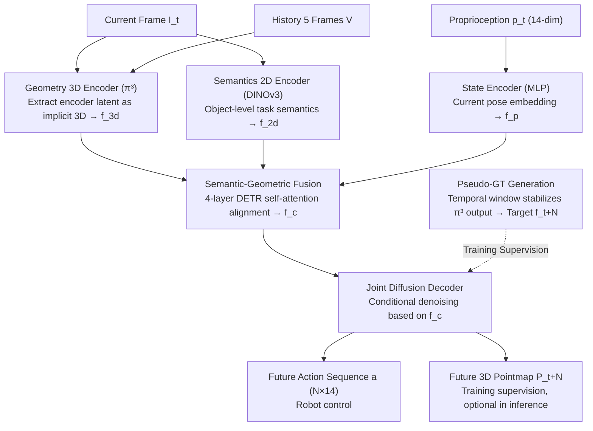

# GAP: Action-Geometry Prediction with 3D Geometric Prior for Bimanual Manipulation

**Conference**: CVPR2026  
**arXiv**: [2602.23814](https://arxiv.org/abs/2602.23814)  
**Code**: [https://github.com/Chongyang-99/GAP.git](https://github.com/Chongyang-99/GAP.git)  
**Area**: 3D Vision  
**Keywords**: Bimanual manipulation, 3D geometric prior, Diffusion policy, Point cloud prediction, Imitation learning

## TL;DR
GAP utilizes a pre-trained 3D geometric foundation model (π³) to extract 3D features, fuses 2D semantics and proprioception, and jointly predicts future action sequences and future 3D pointmaps via conditional diffusion, achieving SOTA in RoboTwin 2.0 and real-world bimanual experiments.

## Background & Motivation

**Background**: Bimanual manipulation requires policies to simultaneously generate coordinated movements for two arms, involving precision assembly, deformable object manipulation, and interaction in cluttered environments. Current mainstream methods include 2D-based ACT (action chunking + DETR Transformer), Diffusion Policy (DP), and 3D-integrated DP3 (point cloud input).

**Limitations of Prior Work**:
   - **2D methods lack spatial awareness**: Methods like ACT and DP rely on 2D features, failing to explicitly reason about 3D spatial relationships, occlusions, and contacts, leading to poor performance in bimanual tasks requiring precise spatial reasoning.
   - **3D methods depend on explicit point clouds**: DP3 and similar methods require depth cameras to generate point clouds. In the real world, high-quality point clouds require precise calibration and are sensitive to noise and occlusions. 2D-to-3D lifting methods (e.g., back-projection) suffer from low resolution and high engineering overhead.
   - **Lack of predictive 3D reasoning**: Existing methods only perceive the current 3D state and do not predict 3D changes following action execution, limiting long-horizon planning capabilities.

**Key Challenge**: Bimanual manipulation requires 3D perception to reason about spatial relationships, but obtaining explicit 3D information (point clouds) is unreliable in real-world scenarios. Furthermore, perceiving only the current state is insufficient for complex manipulations that require predicting future geometric changes.

**Goal**: Can a 3D geometric foundation model be used to obtain implicit 3D features directly from RGB images, bypassing explicit point cloud pipelines? Can joint prediction of the future 3D structure enhance the policy's spatial understanding and long-horizon planning?

**Key Insight**: Recent 3D geometric foundation models (e.g., DUSt3R, VGGT, π³) can reconstruct dense 3D structures robustly from RGB images. The authors utilize π³ as a perception backbone, where its latent features naturally encode rich 3D information—eliminating the need for explicit point cloud generation. Furthermore, predicting the "future 3D latent" forces the model to learn 3D-aware forward reasoning.

**Core Idea**: Leveraging the latent features of a pre-trained 3D geometric foundation model as a 3D prior, the model jointly denoises future action sequences and future 3D pointmaps to achieve RGB-only, 3D-aware bimanual manipulation.

## Method

### Overall Architecture
The core problem GAP addresses is the need for 3D spatial reasoning without relying on explicit point clouds that are difficult to obtain stably in real scenes. It leverages the latent space of a pre-trained 3D foundation model (π³) as an implicit 3D prior, allowing the policy to "understand" spatial structures from RGB images alone and predict the future 3D scene while generating actions, forcing the model to learn forward reasoning.

The pipeline operates as follows: the current frame $I_t$, a 5-frame historical sequence $V$, and robot proprioception $p_t \in \mathbb{R}^{14}$ (6 joint angles + 1 gripper state per arm) are fed into three parallel encoders to produce 3D geometric, 2D semantic, and proprioceptive features. These are concatenated and fused via a Transformer into a unified context $\mathbf{f}_c$. Using $\mathbf{f}_c$ as a condition, a conditional diffusion decoder denoises two targets: a future N-step bimanual action sequence $a_{t:t+N} \in \mathbb{R}^{N \times 14}$ and the future 3D pointmap at step N, $P_{t+N} \in \mathbb{R}^{H \times W \times 4}$. Actions are used for control, while the pointmap serves as auxiliary supervision during training and can be skipped during inference to save computation.

### Key Designs

**1. Geometry 3D Encoder (π³): Replacing explicit point clouds with implicit 3D geometry from RGB**
This module addresses the dependency of 3D methods on depth cameras. GAP samples 5 historical frames $V$ and combines them with the current frame $I_t$ into a 6-frame sequence for the π³ encoder. Each frame is divided into $14 \times 14$ patches, and features from the last two backbone layers are concatenated to form a 1024-dimensional 3D geometric feature $\mathbf{f}_{3d}$. Crucially, only the π³ encoder is used—no point clouds are explicitly reconstructed. This latent space naturally encodes inter-frame 3D relationships and is robust to calibration errors and depth noise.

**2. Semantics 2D Encoder (DINOv3): Supplementing "task semantics" missing in geometric features**
While 3D features capture structure, they lack the "which object to manipulate" context. GAP processes $I_t$ through DINOv3 to extract 1024-dimensional semantic features $\mathbf{f}_{2d}$ from $16 \times 16$ patches. DINOv3 provides object-level semantic priors that complement geometric information.

**3. State Encoder (MLP): Injecting current robot pose**
A simple MLP maps the 14-dimensional proprioception $p_t$ to a 1024-dimensional embedding $\mathbf{f}_p$, informing the fusion stage of the robot's current configuration.

**4. Semantic-Geometric Fusion: Cross-modal alignment via attention**
Features $[\mathbf{f}_{3d}, \mathbf{f}_{2d}, \mathbf{f}_p]$ are concatenated along the token dimension and fed into a 4-layer DETR encoder. Self-attention achieves deep fusion to output a unified context $\mathbf{f}_c$. This captures cross-modal relationships, such as locating semantic objects in 3D space and identifying reachable actions based on current configuration.

**5. Joint Diffusion Decoder: Embedding an implicit world model via joint denoising**
This is the core of GAP. The decoder uses a DETR-like structure for conditional diffusion. During training, it denoises a target $x_0 = \{a_{t:t+N}, \mathbf{f}_{t+N}, P_{t+N}\}$ from Gaussian noise $x_k$ conditioned on $\mathbf{f}_c$. By predicting the future 3D pointmap latent $\mathbf{f}_{t+N}$ alongside actions, the model is forced to reason about how 3D scenes change given a sequence of actions, effectively embedding a world model into the policy.

**6. Pseudo-GT Generation: Stabilizing 3D latent supervision**
To provide stable supervision for the "future 3D latent," GAP uses a temporal window strategy. For a frame $s$, the π³ encoder processes a sequence $\{V, I_s\}$. The latent $\mathbf{f}_s$ corresponding specifically to $I_s$ is used as the pseudo-GT. This temporal joint processing significantly improves latent quality compared to single-frame inference.

### Loss & Training
The diffusion training objective uses an L1 loss for the three denoising components:

$$\mathcal{L} = \mathbb{E}_{k, x_0, \epsilon}\left[\|{\hat{a}_{t:t+N}} - a_{t:t+N}\|_1 + \lambda\|\hat{\mathbf{f}_{t+N}} - \mathbf{f}_{t+N}\|_1 + \gamma\|\hat{P}_{t+N} - P_{t+N}\|_1\right]$$

where $\lambda, \gamma$ are weights for the 3D latent and pointmap terms. Training follows ACT-style action chunking; 2D-based baselines and GAP are trained for 200–600 epochs, while 3D-based methods are trained for 3000 epochs with a batch size of 32.

## Key Experimental Results

### Main Results - RoboTwin 2.0 Simulation (Average Success Rate %)

| Method | Dominant-select (16 tasks) | Sync-bimanual (8 tasks) | Seq-coordinate (8 tasks) |
|------|------------------------|-----------------------|------------------------|
| ACT (2D) | 34.1 | 32.4 | 29.4 |
| DP (2D) | 44.4 | 37.1 | 33.6 |
| DP3 (3D Point Cloud) | 61.2 | 42.0 | 42.0 |
| G3Flow (3D+Semantics) | 54.3 | 43.2 | 40.5 |
| RDT (1.2B Params) | 49.5 | 44.6 | 41.2 |
| Xu et al. (2D+Predictive) | 55.1 | 47.5 | 44.9 |
| **GAP (Ours)** | **63.2** | **51.3** | **50.4** |

### Ablation Study (Average Success Rate % over 4 tasks)

| 2D Semantic | 3D Geometric | Geometric Imagination | Success Rate Avg. |
|:-----------:|:------------:|:---------------------:|:-----------:|
| ✓ | ✓ | ✓ | **25.1** |
| ✗ | ✓ | ✓ | 24.4 |
| ✓ | ✓ | ✗ | 23.6 |
| ✓ | ✗ | ✗ | 21.0 |

### Real World Results (Success Rate %, 20 trials/task)

| Task | ACT | DP | Xu et al. | **Ours** |
|------|-----|----|-----------|----------|
| Place Empty Cup | 70 | 70 | 75 | **80** |
| Place Dual Shoes | 0 | 10 | 15 | **20** |
| Hanging Mug | 0 | 0 | 5 | **20** |
| Scan Object | 25 | 20 | 35 | **40** |
| **Average** | 23.8 | 25 | 32.5 | **40** |

### Key Findings
- **3D geometric awareness is critical**: Removing the 3D Geometric Module and Geometric Imagination causes the success rate to drop from 25.1% to 21.0%, the largest decline among all modules.
- **Geometric Imagination is a core innovation**: Removing it alone reduces success from 25.1% to 23.6%, proving that predicting future 3D structures improves 3D reasoning.
- **RGB-only input surpasses explicit point cloud methods**: GAP (RGB only) outperforms DP3 on Dominant-select tasks (63.2% vs 61.2%), demonstrating that latents from 3D foundation models can replace explicit point clouds.
- **Superiority in synchronous bimanual tasks**: On "Place Dual Shoes", GAP achieves 43.3% while DP3 only reaches 17.7%, highlighting better bimanual coordination.

## Highlights & Insights
- **Implicit latents from 3D foundation models are an elegant paradigm**: This bypasses complex point cloud engineering. π³ latents encode dense 3D information robustly, a strategy applicable to various robotics tasks.
- **Joint prediction of actions and future 3D structures acts as an implicit world model**: By predicting only the final 3D state at the end of the horizon, the policy gains "geometric foresight" without the computational cost of step-by-step video prediction.
- **Semantic-geometric fusion via DETR encoder**: This allows heterogeneous modalities (3D, 2D, state) to interact through self-attention, capturing complex cross-modal relationships.

## Limitations & Future Work
- **Single-step horizon prediction**: The model only predicts the 3D state at horizon $N$; multi-step 3D trajectory prediction may be needed for longer horizons.
- **Lack of persistent 3D memory**: The model does not accumulate 3D knowledge across episodes, treating each inference step independently.
- **Real-world success rates**: Complex tasks like "Hanging Mug" still show relatively low success rates (20%), indicating a need for more data or better sim-to-real transfer.

## Related Work & Insights
- **vs DP3**: DP3 relies on explicit point clouds and depth cameras. GAP uses RGB and implicit latents, outperforming DP3 in most tasks and showing better robustness.
- **vs G3Flow**: G3Flow projects 2D semantic features into 3D point clouds. GAP fuses them in the latent space, avoiding quantization errors and calibration issues.
- **vs Xu et al.**: Xu et al. jointly predict actions and future 2D frames. GAP upgrades the prediction target to 3D pointmaps, which is more relevant to manipulation.

## Rating
- Novelty: ⭐⭐⭐⭐ 
- Experimental Thoroughness: ⭐⭐⭐⭐⭐ 
- Writing Quality: ⭐⭐⭐⭐ 
- Value: ⭐⭐⭐⭐ 

<!-- RELATED:START -->

## Related Papers

- [\[CVPR 2026\] Rethinking Pose Refinement in 3D Gaussian Splatting under Pose Prior and Geometric Uncertainty](rethinking_pose_refinement_in_3d_gaussian_splatting_under_pose_prior_and_geometr.md)
- [\[CVPR 2026\] MatE: Material Extraction from Single-Image via Geometric Prior](mate_material_extraction_from_single-image_via_geometric_prior.md)
- [\[CVPR 2026\] Flow3r: Factored Flow Prediction for Scalable Visual Geometry Learning](flow3r_factored_flow_prediction_for_scalable_visual_geometry_learning.md)
- [\[CVPR 2026\] GenSplat: Bridging the Generalization Gap in 3DGS Language Comprehension](gensplat_bridging_the_generalization_gap_in_3dgs_language_comprehension.md)
- [\[ICLR 2026\] G4Splat: Geometry-Guided Gaussian Splatting with Generative Prior](../../ICLR2026/3d_vision/g4splat_geometry-guided_gaussian_splatting_with_generative_prior.md)

<!-- RELATED:END -->
