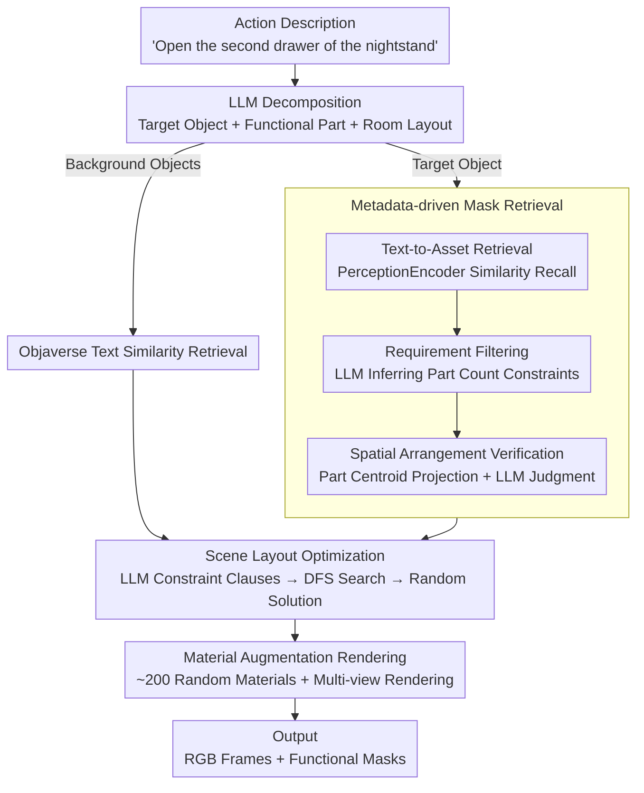

# Action-guided Generation of 3D Functionality Segmentation Data

**Conference**: CVPR 2026  
**arXiv**: [2511.23230](https://arxiv.org/abs/2511.23230)  
**Code**: [Project Page](https://tev-fbk.github.io/synthfun3d)  
**Area**: 3D Vision / Embodied AI  
**Keywords**: 3D functionality segmentation, synthetic data generation, action descriptions, LLM retrieval, scene layout

## TL;DR
The authors propose SynthFun3D, the first method to automatically generate training data for 3D functionality segmentation from action descriptions. By leveraging metadata-driven 3D object retrieval and scene layout, it generates precise part-level interaction masks without human annotation. Training with synthetic and real data improves performance on the SceneFun3D benchmark by +2.2 mAP / +6.3 mAR / +5.7 mIoU.

## Background & Motivation
**Task Definition**: 3D functionality segmentation—given a natural language action description (e.g., "open the second drawer of the nightstand"), the goal is to segment the 3D scene parts required for interaction (e.g., the drawer handle). This is a critical perception task for embodied AI.

**Limitations of Prior Work**: Annotated data is extremely scarce. Currently, the only public dataset, SceneFun3D, contains only 230 scenes and 3,041 functional masks. The collection and annotation costs are prohibitively high (estimated at \$25K for 230 scenes).

**Key Challenge**: Deep learning models require massive amounts of training data, but fine-grained 3D functional masks are nearly impossible to annotate at scale. While synthetic data has succeeded in other perception tasks, no targeted data generation solution exists for 3D functionality segmentation.

**Core Idea**: Starting from action descriptions, LLMs are used to infer scene composition, retrieve 3D assets with part annotations, and automatically generate scene layouts and precise functional masks that satisfy spatial semantic constraints.

## Method

### Overall Architecture
SynthFun3D addresses the prohibitively high cost of annotating 3D functional masks. Rather than hiring humans to manually delineate drawer handles in real scans, the method starts with an action description and uses a pipeline to construct a reasonable scene where the target interaction part is inherently known. The process begins by using an LLM to decompose the action description into "target object + functional interaction part + room layout." Assets are retrieved through two paths: background objects (beds, rugs, curtains) are pulled from Objaverse based on text similarity, while the target object (the cabinet to be interacted with) is carefully selected from PartNet-Mobility, which contains part-level annotations. A DFS search finds a layout satisfying spatial constraints, followed by multi-view rendering with random material augmentation to output RGB frames and functional masks. Since part annotations are inherited from asset metadata, masks are annotation-free and pixel-accurate.

### Key Designs

**1. Metadata-driven mask retrieval: Decoding structural hints in action descriptions**

This core component addresses the limitation that generic text-to-asset retrieval only returns objects based on broad categories. An action like "open the second drawer" contains specific structural requirements (at least two drawers, vertically aligned). SynthFun3D implements a three-stage retrieval process: (1) **Text-to-asset retrieval** uses PerceptionEncoder to compute similarity between text and rendered views, prioritizing recall. (2) **Requirement filtering** uses an LLM to infer hard constraints on part counts (e.g., "second drawer" implies at least two drawer-handles) and checks the part metadata of candidates. (3) **Spatial arrangement verification** computes 3D centroids for parts in candidates, projects them to 2D, and uses an LLM to verify if relative positions match semantic constraints (e.g., "top-left drawer" requires a grid layout). Hierarchical metadata from PartNet-Mobility is used to refine generic labels (e.g., "handle" to "drawer handle") to ensure precise counting.

**2. Scene Layout Optimization: Placing objects according to spatial constraints**

Action descriptions often contain spatial cues (e.g., "cabinet near the window"). If the target object is placed randomly, the "pointing" cues in the text will not align with the visual data. The LLM translates the description into discrete layout constraint clauses (e.g., `nightstand bed <left-of>`). A DFS search then explores possible object placements to find configurations satisfying all constraints. Randomly selecting from feasible solutions ensures data diversity while maintaining strict spatial semantics.

**3. Material Augmentation Rendering: Expanding appearance distribution at near-zero cost**

Synthetic data often suffers from domain gaps due to monotonous appearances. SynthFun3D generates approximately 200 random materials (metal, matte, plastic, glass, etc.) and randomly replaces materials for walls and target objects during rendering. This changes the visual appearance without altering geometry or part annotations, keeping masks valid at near-zero extra cost. This design alone contributed a +83% increase in mIoU in experiments.

### Loss & Training
SynthFun3D is a data generation pipeline and does not contain a dedicated loss function. For downstream validation, the authors use LoRA to fine-tune Gemma3-4B, enabling it to point to functional parts from action descriptions. This is integrated into the Fun3DU pipeline: Gemma3 provides the pointing $\rightarrow$ SAM performs 2D segmentation $\rightarrow$ 2D masks are lifted to 3D.

## Key Experimental Results

### Main Results

| Training Data | mAP | AP50 | AP25 | mAR | mIoU | P-acc |
|----------|-----|------|------|-----|------|-------|
| Zero-shot | 0 | 0 | 0 | 8.4 | 0.07 | 0.003 |
| R (Real only) | 0.31 | 0.67 | 1.12 | 20.22 | 1.18 | 0.170 |
| S (Synthetic only) | 0.43 | 0.90 | 1.57 | 18.29 | 1.23 | 0.118 |
| S + A (Synthetic + Aug) | 0.38 | 1.35 | 3.60 | 18.49 | 2.25 | 0.176 |
| R + S | 1.17 | 2.92 | 7.42 | 26.20 | 4.40 | 0.320 |
| **R + S + A (Ours)** | **2.56** | **5.17** | **12.81** | **26.54** | **6.91** | **0.384** |

### Ablation Study

| Configuration | Key Findings |
|------|---------|
| Synthetic vs. Real | Performance of synthetic-only is comparable to real-only (1.23 vs 1.18 mIoU). |
| Material Augmentation | Resulted in 2.25 vs 1.23 mIoU (+83% Gain). |
| Mixed Training | 4.40 vs 2.25 (S+A); real data effectively bridges the domain gap. |
| Full Data | 6.91 mIoU; proves that diversity is crucial for performance. |
| Category Analysis | Major improvements in Furniture; limited gains in Windows due to asset coverage. |

### Key Findings
- Synthetic data alone can achieve performance parity with real data (1.23 vs 1.18 mIoU).
- Mixing synthetic and real data is critical, significantly outperforming individual sources.
- Material augmentation provides a substantial boost (+83% mIoU) at near-zero cost.
- Generation cost is approximately \$1/scene compared to \$109/scene for real data (100x reduction).
- Point accuracy (P-acc) increased from 0.170 to 0.384, indicating that synthetic data helps VLMs learn precise localization.

## Highlights & Insights
- **First generation scheme for functional masks**: Effectively fills a gap in the sub-field of functionality segmentation.
- **Sophisticated metadata-driven retrieval**: The three-stage filter (text-similarity $\rightarrow$ count requirements $\rightarrow$ spatial arrangement) ensures retrieved objects precisely match the implicit structural requirements of action descriptions.
- **Key Insight**: "Correct spatial relationships are more important than visual realism," suggesting that functional understanding relies more on structure than appearance.
- **High cost-efficiency**: \$1/scene vs \$109/scene.

## Limitations & Future Work
- Dependency on the PartNet-Mobility asset library (~2K objects across 46 classes) limits coverage.
- Layout strategies for certain categories like windows occasionally fail, leading to lower frequency.
- Current pipeline generates 2D multi-view images rather than direct 3D functional masks.
- Material augmentation is relatively simple; advanced style transfer might further reduce domain gaps.
- Overall task performance remains low (6.91 mIoU vs 29.26 GT upper bound), reflecting the extreme difficulty of the task.

## Related Work & Insights
- Inspired by the LLM-driven scene layout of Holodeck, but introduces functional constraints.
- Diverges from 3D scene synthesis (PhyScene, SceneFactor) by focusing on part-level precision and annotations.
- Functionality is expected to improve naturally with the advancement of 3D articulated object generation (e.g., CAGE, ArtFormer) and expanded asset libraries.

## Rating
- Novelty: ⭐⭐⭐⭐ First synthetic generation for functionality segmentation, though methods are combined.
- Experimental Thoroughness: ⭐⭐⭐⭐ Detailed data combination comparisons and per-category analysis.
- Writing Quality: ⭐⭐⭐⭐ Clear pipeline and well-defined problem.
- Value: ⭐⭐⭐⭐ Provides a scalable solution for the data bottleneck in embodied AI.

<!-- RELATED:START -->

## Related Papers

- [\[CVPR 2026\] LangRef3DGS: Natural Language-Guided 3D Referential Segmentation from Partial Observations via 3D Gaussian Splatting](langref3dgs_natural_language-guided_3d_referential_segmentation_from_partial_obs.md)
- [\[CVPR 2026\] GAP: Action-Geometry Prediction with 3D Geometric Prior for Bimanual Manipulation](action-geometry_prediction_with_3d_geometric_prior_for_bimanual_manipulation.md)
- [\[CVPR 2026\] A Cookbook of 3D Vision: Data, Learning Paradigms, and Application](a_cookbook_of_3d_vision_data_learning_paradigms_and_application.md)
- [\[CVPR 2026\] Extend3D: Town-Scale 3D Generation](extend3d_town-scale_3d_generation.md)
- [\[CVPR 2026\] JOPP-3D: Joint Open Vocabulary Semantic Segmentation on Point Clouds and Panoramas](jopp3d_joint_open_vocabulary_semantic_segmentation.md)

<!-- RELATED:END -->
