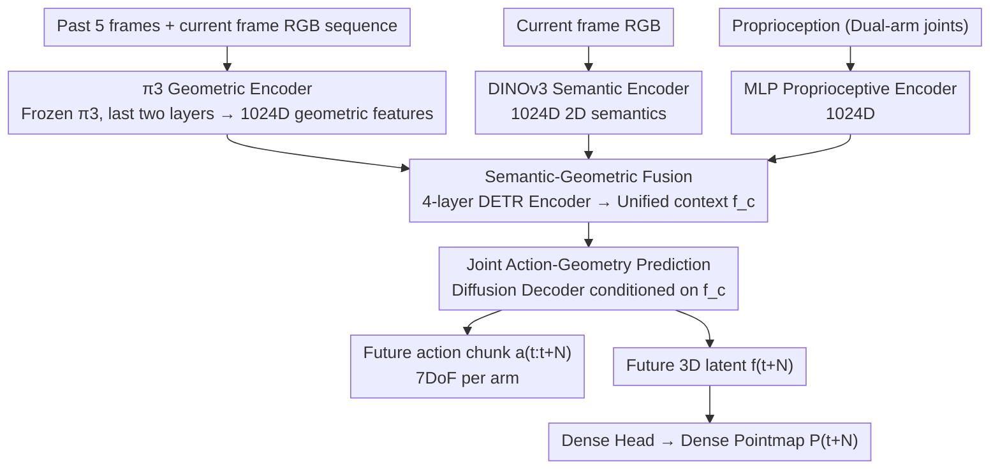

# Action–Geometry Prediction with 3D Geometric Prior for Bimanual Manipulation

**Conference**: CVPR 2026  
**arXiv**: [2602.23814](https://arxiv.org/abs/2602.23814)  
**Code**: [https://github.com/Chongyang-99/GAP.git](https://github.com/Chongyang-99/GAP.git)  
**Area**: 3D Vision  
**Keywords**: Bimanual manipulation, 3D geometric foundation models, joint action-geometry prediction, π3, diffusion policy  

## TL;DR
By leveraging the pretrained 3D geometric foundation model $\pi3$ as a perception backbone, this work integrates 3D geometric, 2D semantic, and proprioceptive features. Utilizing a diffusion model to jointly predict future action chunks and 3D pointmaps, the proposed method significantly outperforms point-cloud-based methods on the RoboTwin bimanual benchmark using only RGB inputs.

## Background & Motivation

**Background**: Bimanual manipulation requires precise 3D spatial reasoning and coordination between arms. Existing 2D methods (ACT, DP) lack spatial awareness, while 3D methods (DP3) are effective but rely on point cloud acquisition, which requires calibration, is sensitive to noise, and is difficult to obtain reliably in real-world scenarios. Meanwhile, 3D geometric foundation models (DUSt3R, $\pi3$, etc.) can already reconstruct high-quality 3D structures directly from RGB images. The core question is: can 3D foundation models be directly utilized as perception priors to achieve or even surpass the 3D awareness of point-cloud methods using only RGB inputs?

**Goal**: To replace explicit point cloud pipelines with pretrained 3D geometric foundation models, implementing a 3D-aware bimanual manipulation policy with RGB-only input and achieving predictive planning capabilities through joint prediction of future 3D geometry.

## Method

### Overall Architecture
The framework employs a three-way parallel encoder fusion: a $\pi3$ encoder processes temporal RGB sequences to extract 3D geometric features, DINOv3 encodes the current frame for 2D semantic features, and an MLP encodes proprioception. These three 1024-dimensional features are fused into a unified semantic-geometric context $\mathbf{f}_c$ via a 4-layer DETR Encoder. A diffusion decoder, conditioned on $\mathbf{f}_c$, jointly denoises and generates: (1) a future action chunk $a_{t:t+N}$ (7DoF per arm); (2) a future 3D latent $\mathbf{f}_{t+N}$, which is decoded by a Dense Head into a dense Pointmap $P_{t+N} \in \mathbb{R}^{H \times W \times 4}$.

### Key Designs

**1. π3 Geometric Encoder: Direct geometry from RGB via frozen 3D foundation models**

Bimanual manipulation suffers from the dependence of 3D methods on calibrated and noise-sensitive point clouds. GAP feeds a temporal sequence (past 5 frames + current frame) into a pretrained $\pi3$ backbone to extract 3D geometric features. As a permutation-equivariant multi-view 3D reconstruction model, $\pi3$ infers dense geometry from RGB. The last two layers are concatenated into a 1024D feature. Keeping $\pi3$ frozen avoids the engineering overhead of point cloud collection and provides a more stable prior than learning 3D features from scratch.

**2. Semantic-Geometric Fusion: Compensating geometric lack of object understanding with 2D semantics**

While $\pi3$ provides spatial structure, it lacks task-relevant object semantics. GAP adds a frozen DINOv3 branch for current-frame 2D semantics and an MLP branch for proprioception. Ablations indicate that semantics play an auxiliary role: removing 2D semantics leads to a ~1% performance drop, whereas removing 3D geometry and "geometric imagination" leads to a 4% drop. This confirms that 3D awareness is the primary contributor, while semantics map observed structures to the target objects.

**3. Joint Action-Geometry Prediction: Implicit look-ahead planning via 3D "imagination"**

Policies that only predict actions often lack foresight. GAP's diffusion decoder simultaneously predicts the action chunk and the 3D Pointmap latent $\mathbf{f}_{t+N}$ for a future timestep. Forcing the model to "imagine" the 3D scene state after action execution embeds implicit look-ahead planning into the denoising process. Removing geometric imagination reduces the success rate from 25.1% to 23.6%, and further removing the 3D geometric module drops it to 21.0%.

### Loss & Training

$$\mathcal{L} = \|a - \hat{a}\|_1 + \lambda\|\mathbf{f}_{t+N} - \hat{\mathbf{f}}_{t+N}\|_1 + \gamma\|P_{t+N} - \hat{P}_{t+N}\|_1$$

The model is supervised by joint L1 losses for actions, future 3D latents, and dense pointmaps. Ground truth for future 3D latents is pre-extracted using $\pi3$ across all demonstrations. Training is conducted for 200-600 epochs with a batch size of 32 on a 4090 GPU.

## Key Experimental Results

| RoboTwin 2.0 | Metric | Ours | DP3 | ACT | DP | RDT |
|--------|------|------|----------|------|------|------|
| Dominant-select (16 tasks) | Avg SR(%) | **63.2** | 61.2 | 34.1 | 44.4 | 44.5 |
| Sync-bimanual (8 tasks) | Avg SR(%) | **51.3** | 40.7 | 32.4 | 37.1 | 47.0 |
| Seq-coordinate (8 tasks) | Avg SR(%) | **50.4** | 41.1 | 29.4 | 33.6 | 42.3 |
| Real-world (4 tasks) | Avg SR(%) | **40.0** | - | 23.8 | 25.0 | - |

### Ablation Study
- **Removing 2D Semantic Module**: 25.1% → 24.4% (-0.7%), confirming semantics as auxiliary.
- **Removing Geometric Imagination**: 25.1% → 23.6% (-1.5%), showing that predicting future 3D is vital for planning.
- **Removing 3D Geometry + Imagination**: 25.1% → 21.0% (-4.1%), highlighting 3D perception as the core.
- **Data Efficiency**: Signals are present with only 10 demonstrations, whereas the 2D method (DP) fails completely (0%).
- **Real-world "Hang Mug" task**: ACT/DP achieve 0%, while Ours achieves 20%, demonstrating the value of 3D reasoning for complex tasks.

## Highlights & Insights
- Exceeds explicit point cloud methods using only RGB inputs by leveraging 3D foundation models, avoiding calibration and collection overhead.
- The "future 3D Pointmap prediction" is an elegant design serving as both an auxiliary training signal and an implicit look-ahead planner.
- Comprehensive evaluation across 32 RoboTwin tasks and 4 real-world tasks is significant for the bimanual manipulation field.
- Clear data efficiency advantages: pretrained features allow performance in low-data regimes that far exceed 2D methods trained from scratch.

## Limitations & Future Work
- Only predicts a single future 3D step (Pointmap after N steps), lacking multi-step 3D trajectory prediction and persistent 3D memory.
- Performance depends on the pretraining quality of $\pi3$; degradation may occur in unseen scenarios.
- Real-world experiments were limited to 50 demonstration training samples.
- Pointmap decoding can be skipped, suggesting room for improving inference efficiency.

## Related Work & Insights
- **DP3**: Uses explicit point clouds; GAP uses RGB but achieves better 3D awareness via $\pi3$.
- **G3Flow**: Projects 2D features into 3D; GAP operates directly in the 3D latent space.
- **RDT**: A 1.2B parameter foundation model; GAP outperforms it on Seq-coordinate (50.4% vs 42.3%), suggesting 3D prediction is more effective than sheer model scale.
- **Xu et al.**: Jointly predicts actions and future 2D frames; GAP's 3D Pointmap prediction offers better geometric consistency.

## Rating
- **Novelty**: ⭐⭐⭐⭐ First to apply 3D geometric foundation models like $\pi3$ to bimanual manipulation with joint geometry prediction.
- **Experimental Thoroughness**: ⭐⭐⭐⭐⭐ Extremely comprehensive evaluation across 32 simulation tasks, 4 real tasks, data efficiency, and ablations.
- **Writing Quality**: ⭐⭐⭐⭐ Clear methodological explanation and well-structured experiments.
- **Value**: ⭐⭐⭐⭐ Provides a practical paradigm for RGB-only 3D-aware bimanual manipulation.

<!-- RELATED:START -->

## Related Papers

- [\[CVPR 2026\] GAP: Action-Geometry Prediction with 3D Geometric Prior for Bimanual Manipulation](action-geometry_prediction_with_3d_geometric_prior_for_bimanual_manipulation.md)
- [\[CVPR 2026\] MatE: Material Extraction from Single-Image via Geometric Prior](mate_material_extraction_from_single-image_via_geometric_prior.md)
- [\[CVPR 2026\] Action-guided Generation of 3D Functionality Segmentation Data](action-guided_generation_of_3d_functionality_segmentation_data.md)
- [\[CVPR 2026\] Dynamic Visual SLAM using a General 3D Prior](dynamic_visual_slam_using_a_general_3d_prior.md)
- [\[CVPR 2026\] AnchorSplat: Feed-Forward 3D Gaussian Splatting with 3D Geometric Priors](anchorsplat_feed-forward_3d_gaussian_splatting_with_3d_geometric_priors.md)

<!-- RELATED:END -->
