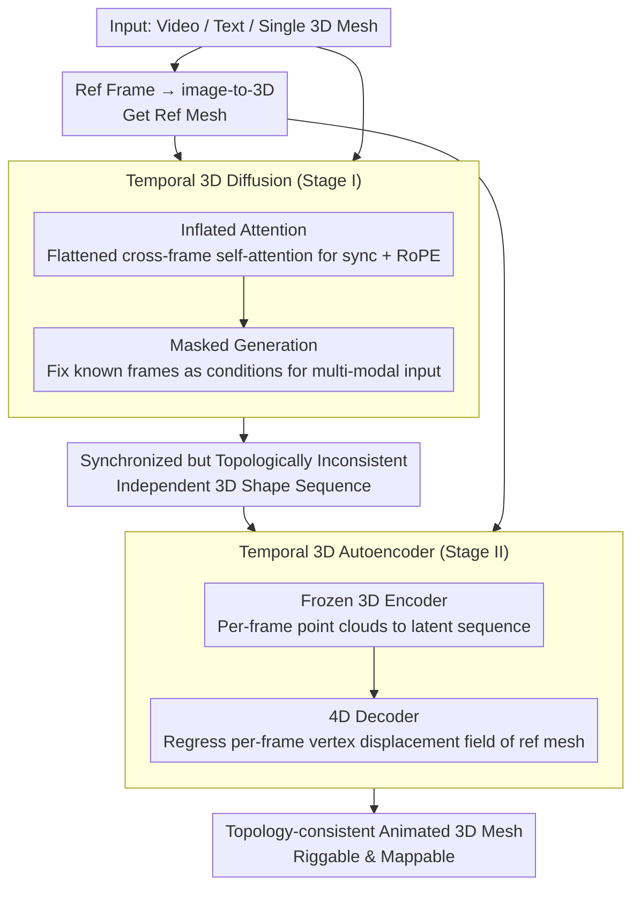

# ActionMesh: Animated 3D Mesh Generation with Temporal 3D Diffusion

**Conference**: CVPR 2026  
**arXiv**: [2601.16148](https://arxiv.org/abs/2601.16148)  
**Code**: [Project Page](https://remysabathier.github.io/actionmesh/)  
**Area**: 3D Vision / 4D Generation  
**Keywords**: Animated 3D Mesh Generation, Temporal 3D Diffusion, Topology Consistency, Rigging-free, Feed-forward

## TL;DR
ActionMesh is proposed to add a temporal axis to pre-trained 3D diffusion models through minimal extension (temporal 3D diffusion), and then utilizes a temporal 3D autoencoder to convert independent shape sequences into topology-consistent animated meshes. Generating production-grade animated 3D meshes from various inputs such as video, text, or 3D meshes in only 2 minutes, it achieves SOTA in both geometric accuracy and temporal consistency.

## Background & Motivation
**Background**: Automatically generating animated 3D objects is a core requirement for games, film/TV, and AR-VR. However, existing methods face three major limitations.

**Limitations of Prior Work**:
   - **Input constraints**: Most are restricted to specific input modalities and object categories.
   - **Slow speed**: Reliance on per-scene optimization lasting 30-45 minutes (DreamMesh4D, V2M4, LIM).
   - **Insufficient quality**: Models do not meet production standards (e.g., Gaussian Splatting lacks fixed topology and cannot support texture mapping).

**Key Challenge**: How to achieve rapid, topology-consistent 4D generation while maintaining high quality?

**Key Insight**: Inspired by early video models, pre-trained 3D diffusion models can be minimally extended with a temporal axis, reusing robust 3D priors to compensate for the scarcity of 4D animation data.

**Core Idea**: Decoupling "3D generation" and "animation prediction"—first generating synchronized independent 3D shape sequences, and then transforming them into deformations of a reference mesh.

## Method

### Overall Architecture
ActionMesh addresses the problem of generating a topology-consistent animated 3D object suitable for production pipelines from a video (or text, or a single 3D mesh) within two minutes. The key logic is to split this task into two steps: first generating synchronized 3D shapes for each frame regardless of topology, and then "compressing" these independent meshes into frame-by-frame deformations of a single topology.

Specifically, in Stage I, an off-the-shelf image-to-3D model is applied to a reference frame of the video to obtain a reference mesh, while a **temporal 3D diffusion model** generates a synchronized 3D shape sequence in one go; this sequence is motion-aligned, but each frame consists of an independent mesh with inconsistent topology. In Stage II, a **temporal 3D autoencoder** is used to represent this sequence of independent meshes as frame-by-frame vertex offsets of the reference mesh, outputting a topology-consistent, riggable, and texture-mappable animated 3D mesh.

### Key Designs

**1. Temporal 3D Diffusion Model (Stage I): Adding a temporal axis to a 3D-only model**

Since 4D animation data is scarce, training a temporal model from scratch is impractical. The approach here is to minimize modifications and maximize reuse of pre-trained 3D priors—similar to how video models were extended from image models. Built on the 3DShape2VecSet / TripoSG latent diffusion framework, ActionMesh introduces two minimal modifications. The first is **Inflated Attention**: expanding independent per-frame self-attention to cross-frame attention, allowing tokens across all frames to attend to each other, thus encoding the synchronization constraint directly into the attention mechanism. This is achieved by flattening $N \times T \times D$ inputs into $1 \times NT \times D$ for self-attention, then reshaping back:

$$\text{infattn}(\mathbf{X}) = \text{reshape}^{-1}(\text{selfattn}(\text{reshape}(\mathbf{X})))$$

This reuses pre-trained self-attention weights without introducing new parameters, requiring only fine-tuning. A Rotary Positional Encoding (RoPE) layer is added to inject relative temporal positions and suppress jitter. The second is **Masked Generation**: during training, part of the latent is randomly kept noise-free (flow step set to 0), signaling the model that "these frame shapes are known." This allows for fixing any known 3D mesh during inference as a condition, enabling various inputs ({3D mesh + video} → animation, text → animation) and making motion transfer (applying a bird's flight to a dragon) possible.

**2. Temporal 3D Autoencoder (Stage II): Compressing independent meshes into a single topology**

Stage I yields shapes with inconsistent per-frame topology, making it impossible to apply textures or rigs. Conventional methods use per-scene optimization for registration, which is slow and fragile. Stage II reformulates this as a feed-forward inference task. The encoding side uses a frozen 3D encoder $\mathcal{E}_{\text{3D}}$ to encode per-frame point clouds into a latent sequence. The 4D decoder $\mathcal{D}_{\text{4D}}$ processes the entire sequence to regress the displacement field from each vertex of the reference mesh to the target time step. Query points use reference mesh vertex positions plus normals—normals help disambiguate points that are spatially close but topologically distant. Two time steps $(t_i, t_j)$ are injected as additional tokens via Fourier encoding to guide the decoder on the transformation transition. Inflated attention and RoPE are also reused here to ensure cross-frame deformation coherence.

### Loss & Training
The two stages are trained independently and concatenated during inference. Stage I uses a flow matching loss, calculated only for masked latents (the generated parts), with no gradient backpropagation from known frames. Stage II uses MSE supervision for the displacement field. Inference for a 16-frame sequence takes approximately 2 minutes, roughly 10x faster than per-scene optimization approaches.

## Key Experimental Results

### Main Results (ActionBench)

| Method | Inference Time | CD-3D↓ | CD-4D↓ | CD-M↓ |
|------|---------|--------|--------|-------|
| DreamMesh4D | 35min | 0.104 | 0.152 | 0.265 |
| LIM | 15min | 0.089 | 0.126 | 0.243 |
| V2M4 | 35min | 0.068 | 0.340 | 0.616 |
| ShapeGen4D | 15min | 0.056 | 0.170 | 0.348 |
| TripoSG (Per-frame) | 2min | 0.056 | 0.184 | - |
| **Ours (ActionMesh)** | **2min** | **0.053** | **0.081** | **0.148** |

### Ablation Study

| Config | CD-3D↓ | CD-4D↓ | CD-M↓ | Description |
|------|--------|--------|-------|------|
| Full Model | 0.050 | 0.069 | 0.137 | Optimal |
| w/o Stage II | 0.050 | 0.069 | - | Stage II maintains 3D quality |
| w/o Stage I & II | 0.050 | 0.187 | - | Stage I is key to 4D |
| Craftsman Backbone | 0.072 | 0.117 | 0.216 | Framework is backbone-agnostic |

### Key Findings
- CD-4D improved by 35% (0.081 vs 0.126), CD-M improved by 39% (0.148 vs 0.243), with a 10x speedup.
- Per-frame TripoSG matches ActionMesh in CD-3D (0.056 vs 0.053) but lags significantly in CD-4D (0.184 vs 0.081), proving that temporal consistency is the critical contribution.
- Stage II does not compromise 3D quality while providing topology consistency.
- Operates on real-world DAVIS videos; generalizes well despite training only on synthetic data.
- Outstanding motion transfer capability: can transfer bird flight motion to a dragon model.

## Highlights & Insights
- **Minimal extension strategy**: Only adds inflated attention and masked generation to pre-trained 3D diffusion, maximizing 3D prior reuse.
- **Topology consistency + Rigging-free**: These two features are critical for actual production, making texture propagation and retargeting trivial.
- **Decoupling generation and animation**: An elegant simplification that reduces 4D problem complexity.
- **Motion transfer**: An emergent capability; masked generation naturally supports {3D + video} → animation.

## Limitations & Future Work
- **Topological changes**: The fixed topology assumption cannot handle changes like splitting or merging during deformation.
- **Severe occlusion**: Occlusion in reference frames or during motion may lead to reconstruction failure.
- Reliance on the initial image-to-3D model's quality.
- ActionBench is relatively small (128 scenes); a larger-scale benchmark is required.

## Related Work & Insights
- The naming "Temporal 3D Diffusion" accurately distinguishes it from "4D Diffusion" (multi-view extension).
- Follows a path similar to the extension of video models from image models (adding temporal attention + fine-tuning).
- The versatility of the VecSet architecture (3DShape2VecSet → TripoSG → CLAY) makes this temporal extension widely applicable.

## Rating
- Novelty: ⭐⭐⭐⭐ Minimalist extension of 3D diffusion to temporal domains is clear and elegant.
- Experimental Thoroughness: ⭐⭐⭐⭐⭐ Comprehensive quantitative benchmarks, qualitative comparisons, ablations, real-video tests, and motion transfer.
- Writing Quality: ⭐⭐⭐⭐⭐ Clearly differentiates terminology (4D mesh vs. animated 3D mesh) with a refined structure.
- Value: ⭐⭐⭐⭐⭐ Achieves speed, quality, and topology consistency simultaneously; highly practical for production.

<!-- RELATED:START -->

## Related Papers

- [\[CVPR 2026\] PartDiffuser: Part-wise 3D Mesh Generation via Discrete Diffusion](partdiffuser_part-wise_3d_mesh_generation_via_discrete_diffusion.md)
- [\[CVPR 2026\] MeshFlow: Efficient Artistic Mesh Generation via MeshVAE and Flow-based Diffusion Transformer](meshflow_efficient_artistic_mesh_generation_via_meshvae_and_flow-based_diffusion.md)
- [\[CVPR 2026\] MeshMosaic: Scaling Artist Mesh Generation via Local-to-Global Assembly](meshmosaic_scaling_artist_mesh_generation_via_local-to-global_assembly.md)
- [\[CVPR 2026\] Learning Spatial-Temporal Consistency for 3D Semantic Scene Completion](learning_spatial-temporal_consistency_for_3d_semantic_scene_completion.md)
- [\[CVPR 2026\] Nestwork: Conditional 3D Furnished House Layout Generation through Latent Heterogeneous Graph Diffusion](nestwork_conditional_3d_furnished_house_layout_generation_through_latent_heterog.md)

<!-- RELATED:END -->
