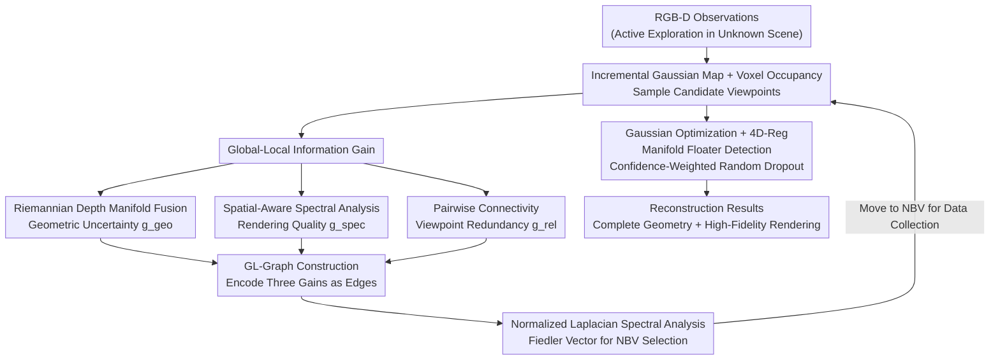

# ActivePolicy: Active Gaussian Reconstruction and Optimization Strategy Based on Global-Local Information Gain

**Conference**: CVPR 2026  
**Paper**: [CVF Open Access](https://openaccess.thecvf.com/content/CVPR2026/html/Li_ActivePolicy_Active_Gaussian_Reconstruction_and_Optimization_Strategy_Based_on_Global-Local_CVPR_2026_paper.html)  
**Code**: None  
**Area**: 3D Vision  
**Keywords**: Active Reconstruction, 3D Gaussian Splatting, Next-Best-View, Graph Spectral Analysis, Floater Suppression  

## TL;DR
ActivePolicy reformulates the next-best-view (NBV) selection in active 3D Gaussian reconstruction as a **graph spectral stability optimization problem**. It constructs a GL-Graph that concurrently encodes geometric uncertainty, rendering quality, and viewpoint redundancy, and selects viewpoints using the Fiedler vector of the normalized Laplacian. Furthermore, a floater detection and confidence-weighted random dropout scheme (4D-Reg) based on Riemannian depth manifold inconsistency is proposed to suppress overfitting under sparse viewpoints, achieving state-of-the-art (SOTA) geometric completeness and rendering fidelity on Replica/MP3D.

## Background & Motivation
- **Background**: 3D Gaussian Splatting (3D-GS) has emerged as a mainstream representation for high-fidelity novel view synthesis. In embodiment intelligent and autonomous exploration scenarios involving unknown environments, passive reconstruction (capturing images along pre-defined trajectories) suffers from incomplete coverage and poor rendering quality outside training views. Consequently, "active reconstruction" autonomously determines camera movements through Next-Best-View (NBV) selection to maximize reconstruction efficiency.
- **Limitations of Prior Work**: The authors identify two fundamental issues in existing active reconstruction methods. First, **information gain metrics only assess geometric coverage, ignoring rendering quality**. Existing methods (such as ActiveGAMER, NARUTO) can only determine whether a region has "valid observations", but cannot distinguish whether "a viewpoint can render highly realistic images" versus "a viewpoint is geometrically novel but yields poor render quality". This "quantity over quality" paradigm tends to select viewpoints with complete spatial coverage at the cost of visual fidelity. Second, **minimizing overlap between viewpoints to maximize efficiency leads to sparse configurations, which highly prone to overfitting**. This manifests as floaters—fictitious Gaussians that exploit depth ambiguities solely to minimize photometric loss without corresponding to actual surface geometry, severely degrading rendering quality and compromising reconstruction stability.
- **Key Challenge**: There is a trade-off between geometric coverage (completeness) and rendering fidelity (photometric fidelity). Existing NBV planners typically optimize one or the other, and rarely balance both while maintaining multi-view consistency. Moreover, NBV planning and Gaussian field modeling are decoupled architecturally; planning, selection, and reconstruction are treated as three independent modules, making rendering-aware viewpoint optimization impossible. Furthermore, there lacks a principled manifold analysis to address floaters.
- **Goal**: To achieve both (1) geometrically complete + photometrically faithful NBV selection, and (2) floater suppression under sparse views, within a unified framework.
- **Key Insight**: The authors' core insight is that the optimal viewpoint should emerge from the **structural properties** of an "information gain graph", rather than being greedily maximized via single-point heuristics. By encoding heterogeneous objectives—geometric uncertainty, rendering quality, and viewpoint redundancy—as graph edges, and naturally unifying them through spectral analysis (frequency domain), one can avoid manual tuning of multi-metric weights and achieve globally-aware selection.
- **Core Idea**: To select NBV by replacing single-point information gain maximization with "graph spectral stability analysis (Laplacian Fiedler vector)", and to mitigate overfitting by replacing "direct deletion of floaters" with "Riemannian depth manifold inconsistency combined with random dropout".

## Method

### Overall Architecture
ActivePolicy is a multi-stage active reconstruction pipeline that **alternates between exploration and refinement**, running in the Habitat simulator. In each planning iteration, a global 3D Gaussian map is incrementally constructed and fused from new keyframes, converted into a voxel occupancy grid, and candidate viewpoints are sampled in unobserved/free areas. For each candidate, the "global-local information gain" is calculated, which consists of three components: **geometric uncertainty** $g^{geo}$ provided by Riemannian depth manifold fusion, **rendering quality** $g^{spec}$ provided by spatial-aware spectral analysis, and **viewpoint redundancy** $g^{rel}$ provided by pairwise connectivity. These three types of gain are encoded as edges in the GL-Graph. Finally, the NBV is selected via spectral analysis (Fiedler vector) of the normalized Laplacian, and the camera moves there to collect data before returning to the next round. Parallelly, in the Gaussian optimization stage, 4D-Reg is incorporated to detect floaters using geodesic inconsistency of three depth variants in manifold space, and their "photometric responsibility" is progressively transferred to occluded, real surface Gaussians via confidence-weighted random dropout.

### Key Designs

**1. GL-Graph: Unifying Geometric/Rendering/Redundancy Heterogeneous Objectives as a Graph Spectral Stability Problem**

This serves as the core innovation of the paper, directly addressing the pain point that existing metrics only perform weighted summation of individual metrics and focus solely on geometric coverage. Instead of calculating a scalar gain for each candidate and greedily taking the maximum, the authors construct an undirected weighted graph $\mathcal{G}=(V,E,A)$. The node set $V=\{V_0,V_1,\dots,V_N\}$ contains a virtual global map node $V_0$ and $N$ candidate viewpoint nodes. The adjacency matrix is designed with "partitioned encoding":

$$A_{ij}=\begin{cases}\lambda_g g_i^g+\lambda_s g_i^s,& i=0 \text{ 或 } j=0,\ i\neq j\\ \lambda_r g_{ij}^r,& i,j\geq1,\ i\neq j\\ 0,&\text{otherwise}\end{cases}$$

Specifically, the **edges between the virtual node and candidate viewpoints** encode the "intrinsic quality" of the viewpoint (geometric uncertainty $g_i^g$ + rendering quality $g_i^s$), while **edges between candidate viewpoints** encode "viewpoint redundancy" $g_{ij}^r$. Consequently, intrinsic qualities and pairwise relationships occupy different structural regions of the graph. Eigendecomposition is then performed on the normalized Laplacian $L=I-D^{-1/2}AD^{-1/2}$, and the **Fiedler vector** $v_1$ corresponding to the second smallest eigenvalue is retrieved to reveal structural centrality. The NBV is selected as:

$$i^*=\arg\max_{i\in\{1,\dots,N\}}\frac{1}{|v_1[i]|+\epsilon}$$

Smaller components in the Fiedler vector indicate stronger topological centrality. Why it works: Greedily selecting single points with maximum gain is prone to observation bias or spatial discontinuity. In contrast, spectral analysis is "globally-aware" and balances coverage, quality, and redundancy simultaneously in the frequency domain. This allows the optimal viewpoint to emerge naturally from the structural properties of the graph, avoiding manual tuning of the three weights. Setting up an ablation without the GL-Graph (degraded to using only raw valid pixel counts as gain) causes **direct exploration failure** within five steps, demonstrating the indispensability of this spectral selection.

**2. Riemannian Depth Manifold Fusion: Robust Quantization of Geometric Uncertainty without Ground Truth Depth**

This is the source of $g^{geo}$ (the geometric part of absolute information gain) and serves as the shared foundation for the subsequent 4D-Reg. The main bottleneck is that active reconstruction lacks ground truth depth, and existing methods relying on single depth estimation are highly susceptible to floater contamination. The authors extract three complementary depth estimates from the same rasterization: $\alpha$-blending depth $d_\alpha=\sum_i w_i d_i/\sum_i w_i$, and max-contribution depth $d_c=d_{\arg\max_i w_i}$ (where $w_i=\alpha_i T_i$ is the contribution weight of the $i$-th Gaussian), and realize that depth values reside on the positive real manifold $\mathbb{R}_{++}$ and should be measured using a hyperbolic metric. Hence, the geodesic distance is computed as $\delta_g=|\log(d_\alpha/d_c)|$, and consistency as $\kappa=(1+\gamma\delta_g)^{-1}\cdot\min(N_g/N_{min},1)$. Fisher accuracy weighting is then utilized to fuse both along the geodesic into R-Depth:

$$d_r=d_\alpha^{w_\alpha}d_c^{1-w_\alpha}=\exp\big(w_\alpha\log d_\alpha+(1-w_\alpha)\log d_c\big)$$

Uncertainty is adaptively fused according to local textures based on the "pixel-wise variance" $\tilde\sigma_d^2$ and "smoothing variance" $\tilde\sigma_s^2$ (variance after Laplacian operator) of the three depth variants: $\mathcal{U}=\omega_s\sigma(\eta_d\tilde\sigma_d^2)+(1-\omega_s)\sigma(\eta_s\tilde\sigma_s^2)$, where smooth variance is weighted more heavily in areas with weak texture. The geometric information gain $g_i^{geo}$ is defined as the count of highly uncertain pixels where $\mathcal{U}>\tau_u$. Why it works: In regions contaminated by floaters, the inconsistency among the three depth estimates is geometrically amplified in the manifold space, converting ambiguities that cannot be resolved by a single depth estimate into quantifiable signals (Fig. 4 shows R-Depth is visibly closer to the GT than $\alpha$-Depth). In the ablation study, replacing it with simple variance degrades the accuracy from 1.12cm to 1.28cm, and increases the depth RMSE from 0.75 to 1.38cm.

**3. Spatial-Aware Spectral Analysis + Pairwise Connectivity: Completing the Other Two Types of Edges for "Rendering Quality" and "Viewpoint Redundancy"**

These modules yield $g^{spec}$ and $g^{rel}$ respectively, together with Design 2 populating the three categories of edges in the GL-Graph. **Spatial-aware spectral analysis** is designed for scenarios "without ground truth images, making it impossible to directly evaluate rendering quality": traditional global frequency domain analysis overlooks spatial heterogeneity (boundaries have high uncertainty, textured regions require dense sampling, while flat regions contribute little). The authors adaptively partition the rendered grayscale image into $K$ blocks based on gradient magnitude (larger gradients yield smaller blocks), and calculate the windowed power spectrum $P_k=|\mathcal{F}\{I_k\odot W_k\}|^2$ for each block. The block score is given by $s_k=\beta_h\rho_k^{high}+\beta_a\rho_k^{aniso}+\beta_b\mathbb{I}[\mathcal{B}_k\in\text{boundary}]$, which aggregates high-frequency energy, directional anisotropy, and boundary importance (with boundary blocks weighted by $\beta_b>1$), and is then aggregated into viewpoint-level rendering gain $g_i^{spec}=\sum_k s_k c_k m_k/\sum_k c_k m_k$ based on complexity and efficiency. This enables the NBV selection to explicitly optimize for "rendering quality" rather than just "geometric novelty". **Pairwise connectivity** calculates $s_{ij}$ by multiplying the depth-reprojection overlap ratio $o_{ij}$ with normalized cross-correlation $\text{NCC}(I_i,I_j)$, and decays it based on spatial proximity $g_{ij}^{rel}=s_{ij}\cdot\exp(-\gamma_d\, d_{ij}/\bar d)$ to ensure the selected NBV provides complementary information rather than redundant observations. Removing the spectral analysis degrades PSNR by 0.39dB, and removing the relative gain decreases C.R. from 99.48% to 97.08%.

**4. 4D-Reg: Floater Detection via Manifold Inconsistency and Soft Suppression via Confidence-Weighted Random Dropout**

This serves as the key to mitigating overfitting under sparse views. The authors highlight that **directly pruning floaters leads to irreversible rendering collapses** because the optimizer is unable to reallocate the photometric responsibility of the deleted Gaussians. Thus, a "soft suppression" scheme is introduced instead. In the detection phase, the three depth variants are reused. Utilizing the fact that the three depth variants should be consistent for true surface points while floaters introduce geodesic divergence, the pairwise geodesic divergence is computed as:

$$\Delta_{geo}=\sqrt{|\log(d_\alpha/d_c)|^2+|\log(d_\alpha/d_r)|^2+|\log(d_c/d_r)|^2}$$

This is integrated with multi-scale consistency $C_i^{scale}$ and neighborhood consistency $C_i^{nbr}$ to derive the floater confidence $\phi_i^{detect}=\mathcal{N}\{\Delta_{geo,i}\}\cdot(1-C_i^{scale})\cdot(1-C_i^{nbr})$. During the suppression stage, instead of hard deletion, a stability-aware confidence $\phi_i^{stab}$ is computed for each floater to obtain the dropout probability $p_{drop,i}=p_{base}+\lambda_{drop}\cdot\mathcal{N}\{\phi_i^{stab}\}\cdot\phi_i^{detect}$—where high-confidence floaters are dropped aggressively, and low-confidence ones are conservatively retained to avoid rendering breakdown. To prevent random dropout from inducing optimization instability, remaining floaters receive opacity compensation $\alpha_i^{comp}=\alpha_i(1+\gamma_{keep}p_{drop,i})$, while stable surface Gaussians with low divergence receive gradient enhancement to bias the gradient toward the true surface geometry rather than floater-dense regions. Additionally, temporal annealing is applied to adapt the regularization strength according to the reconstruction progress. Why it works: The randomness in dropout dynamically guides the optimization to "naturally" shift photometric responsibility from phantom Gaussians to the occluded real surface Gaussians, exposing the hidden geometry without degrading rendering quality. Disabling dropout in the ablation study drops PSNR from 31.29 to 29.22dB, and increases LPIPS from 0.104 to 0.152.

### Loss & Training
The authors intentionally refrain from introducing any additional loss terms, utilizing only the standard photometric and geometric losses:

$$\mathcal{L}_{total}=w_{rgb}\mathcal{L}_{rgb}+w_{depth}\mathcal{L}_{depth}$$

where $\mathcal{L}_{rgb}=\frac{1}{|P|}\sum_p\|C(p)-C^{ref}(p)\|_1$ and $\mathcal{L}_{depth}=\frac{1}{|P|}\sum_p\|\hat D(p)-D^{ref}(p)\|_1$. All performance gains stem from the NBV selection strategy and the optimization dynamics of 4D-Reg rather than loss function design—indicating that the proposed approach serves as a "plug-and-play" pipeline/regularization enhancement.

## Key Experimental Results

### Main Results
Evaluations are conducted in the Habitat simulator on a single RTX 4090 with a budget of 2000 frames per sequence, across Replica (8 indoor scenes) and MP3D (5 large real environments). Metrics: Geometric Accuracy Acc(cm)↓, Completeness Com.(cm)↓, 5cm threshold coverage C.R.(%)↑, as well as rendering PSNR↑/SSIM↑/LPIPS↓.

| Dataset | Metric | ActivePolicy (Ours) | ActiveGAMER | ActiveSplat | NARUTO | Note |
|--------|------|------|------|------|------|------|
| Replica | Acc (cm)↓ | **1.03** | 1.28 | 1.43 | - | 19.5% improvement over ActiveGAMER |
| Replica | C.R. (%)↑ | **98.04** | 96.59 | 93.64 | - | 4.40% absolute gain over ActiveSplat |
| Replica | PSNR↑ | **31.89** | 30.99 | 24.72 | - | Higher than dense passive baseline |
| MP3D | Acc (cm)↓ | **1.42** | 1.63 | 4.05 | 5.44 | 12.9% improvement over ActiveGAMER |
| MP3D | Com. (cm)↓ | **1.82** | 2.54 | 6.66 | 3.81 | 28.3% improvement over ActiveGAMER |
| MP3D | C.R. (%)↑ | **96.42** | 94.63 | 84.81 | 86.39 | Most stable across scenes |
| MP3D | PSNR↑ | **26.86** | 25.43 | 21.79 | 21.63 | 5.7% higher than ActiveGAMER, 24.2% higher than NARUTO |

Table 1 highlights a common trade-off: passive methods (MonoGS with PSNR 29.28, SplaTAM) secure high rendering fidelity but low coverage, whereas active methods (ActiveSplat/NARUTO) achieve high coverage at the expense of accuracy and PSNR. ActivePolicy stands out as one of the few approaches that concurrently excel in both geometry and rendering.

### Ablation Study (Replica Room2, Table 3)

| Configuration | Acc↓ | C.R.↑ | PSNR↑ | Depth RMSE↓ | Note |
|------|------|------|------|------|------|
| Full | 1.12 | 99.48 | 31.29 | 0.75 | Full model |
| w/o GL-Graph | 1.27 | 94.55 | 24.20 | 2.82 | Degrades to valid pixel count; PSNR drops by 7dB |
| w/o Riemann Depth | 1.28 | 96.59 | 30.00 | 1.38 | Replaced with simple variance; depth RMSE nearly doubles |
| w/o Spectral Analysis | 1.21 | 97.49 | 30.90 | 0.93 | PSNR drops by 0.39dB |
| w/o Abs. IG | - | - | - | - | Exploration fails within five steps |
| w/o Rel. IG | 1.17 | 97.08 | 30.50 | 1.24 | Redundancy increases, coverage decreases |
| w/o 4D-Reg | 1.23 | 99.04 | 29.22 | 1.02 | Disabling dropout drops PSNR by 2dB, increases LPIPS to 0.152 |

### Key Findings
- **GL-Graph and absolute information gain are crucial**: Removing either causes active exploration to fail within five steps, demonstrating that spectral selection and geometric uncertainty serve as the bedrock of NBV, and that naive gain maximization cannot support the entire pipeline.
- **Riemannian depth fusion primarily preserves geometry**: Replacing it with simple variance nearly doubles the depth RMSE from 0.75 to 1.38, whilst the PSNR remains almost unaffected—indicating its specific role in geometric robustness.
- **Spectral analysis and 4D-Reg primarily safeguard rendering**: The former impacts PSNR by 0.39dB, and disabling the latter drops PSNR by 2dB with a major spike in LPIPS, while depth remains stable thanks to the Riemannian depth renderer—showing a clear, complementary division of labor between the two mechanisms.

## Highlights & Insights
- **Reformulating NBV selection as a graph spectral problem**: The most elegant design lies in abandoning the "multi-metric weighting and greedy maximization" paradigm, instead allowing the optimal viewpoint to emerge from the structural centrality of the Laplacian Fiedler vector. This converts the trade-off between geometric coverage, rendering quality, and viewpoint redundancy from a manual weight-tuning issue into a spectral analysis problem, which is inherently globally-aware.
- **Reusing the same triad of depth variants twice**: The Riemannian depth fusion simultaneously produces the geometric uncertainty required for NBV planning and serves as the foundation for geodesic divergence in 4D-Reg floater detection—an elegant, highly cost-effective engineering design.
- **Manifold-based 'soft suppression' of floaters**: The intuition of "direct deletion causing collapse, mitigated by using confidence-weighted random dropout + gradient enhancement to naturally redirect responsibility" offers transferrable insights to any sparse-view or under-constrained Gaussian optimization frameworks (e.g., fast mapping, SLAM).
- **Zero extra loss terms**: Since all performance boosts stem from planning strategy and optimization dynamics rather than new loss objectives, the method can be cleanly integrated into existing active 3D-GS reconstruction pipelines.

## Limitations & Future Work
- **Dependence on simulators (Habitat)**: Experiments are purely conducted in Replica/MP3D simulation environments. The paper does not validate performance under real robot deployments considering sensor noise, dynamic objects, or localization drift.
- **Relatively high number of hyperparameters**: Riemannian fusion, spectral analysis, and 4D-Reg introduce a lengthy list of thresholds and scale factors (e.g., $\gamma,\beta,\tau_w,\eta_d,\eta_s,\nu,\lambda_{drop}$). The paper lacks a sensitivity analysis, leaving questions regarding cross-scene generalization and tuning costs.
- **Computational overhead of spectral decomposition**: Performing eigendecomposition on a $(N+1)\times(N+1)$ Laplacian matrix at each planning iteration may face scalability and real-time constraints when the number of candidate viewpoints is large. Although the authors claim to "avoid dense analytical computation", no detailed time budget comparison is provided.
- **Future Directions**: Exploring incremental/low-rank spectral updates to bypass full redocompositions; combining 4D-Reg random dropout with explicit geometric priors (such as planar or Manhattan assumptions) to further suppress floaters.

## Related Work & Insights
- **vs ActiveGAMER / NARUTO (Uncertainty-driven active reconstruction)**: These methods select viewpoints using information-theoretic criteria (e.g., valid observation count, occupancy estimation) which only optimizes for geometric coverage or rendering in isolation, decoupling planning from Gaussian modeling. In contrast, this paper explicitly encodes rendering quality into graph edges and unifies the three objectives via spectral stability, thereby mastering both geometric accuracy and PSNR (achieving a 24.2% higher PSNR than NARUTO on MP3D).
- **vs ActiveSplat / GS-Planner (Hierarchical/multi-stage active Gaussian planning)**: These methods implement hierarchical exploration but decouple the NBV and reconstruction modules, leading to high cross-scene variance (e.g., ActiveSplat achieves only 44.45% C.R. on MP3D HxpK). This work uses a global-local graph to place the virtual global node and candidate viewpoints into a single graph, producing more stable coverage across scenes (96.42% average).
- **vs FisherRF / PUP-3DGS (Information-theoretic NBV)**: They utilize principles like the Fisher Information Matrix but fail to address floaters under sparse viewpoints. This paper leverages Riemannian manifold geodesic inconsistency to explicitly detect and softly suppress floaters, representing the first effort using principled manifold analysis to resolve this issue.

## Rating
- Novelty: ⭐⭐⭐⭐⭐ Reformulating NBV selection as Laplacian graph spectral stability and curing floaters via geodesic manifold inconsistency are both novel and self-consistent angles.
- Experimental Thoroughness: ⭐⭐⭐⭐ Evaluated on dual datasets with multiple baselines and meticulous ablations, but lacks hyperparameter sensitivity analysis and physical robot validation.
- Writing Quality: ⭐⭐⭐⭐ High logical clarity in motivations and methodology, with comprehensive mathematical formulations; equations are somewhat dense, and some threshold definitions are mildly rushed.
- Value: ⭐⭐⭐⭐ A practical and constructive strategy for active 3D-GS reconstruction, with highly transferable concepts in "soft floater suppression" and "graph-spectral viewpoint selection."

<!-- RELATED:START -->

## Related Papers

- [\[CVPR 2026\] AREA3D: Active Reconstruction Agent with Unified Feed-Forward 3D Perception and Vision-Language Guidance](area3d_active_reconstruction_agent_with_unified_feed-forward_3d_perception_and_v.md)
- [\[CVPR 2026\] MeshMosaic: Scaling Artist Mesh Generation via Local-to-Global Assembly](meshmosaic_scaling_artist_mesh_generation_via_local-to-global_assembly.md)
- [\[CVPR 2026\] LoG3D: Ultra-High-Resolution 3D Shape Modeling via Local-to-Global Partitioning](log3d_ultra-high-resolution_3d_shape_modeling_via_local-to-global_partitioning.md)
- [\[CVPR 2026\] Plug-and-Play PDE Optimization for 3D Gaussian Splatting: Toward High-Quality Rendering and Reconstruction](plug-and-play_pde_optimization_for_3d_gaussian_splatting_toward_high-quality_ren.md)
- [\[CVPR 2026\] Faster-GS: Analyzing and Improving Gaussian Splatting Optimization](faster-gs_analyzing_and_improving_gaussian_splatting_optimization.md)

<!-- RELATED:END -->
