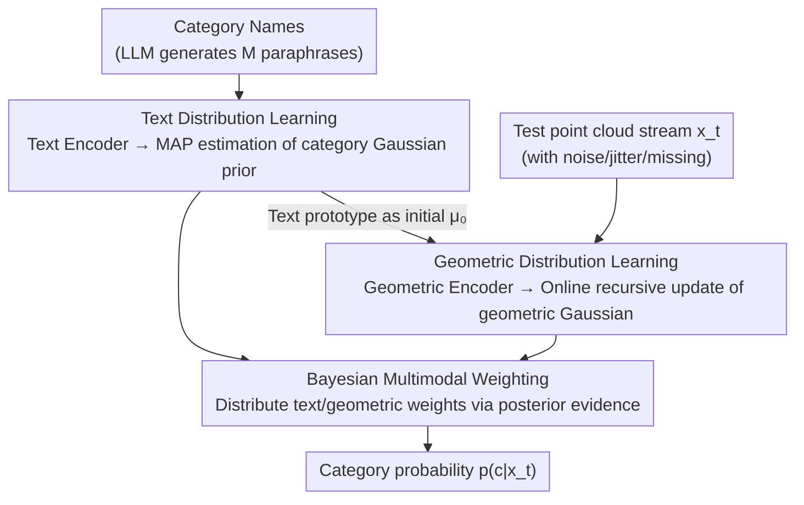

# Adapting Point Cloud Analysis via Multimodal Bayesian Distribution Learning

**Conference**: CVPR 2026  
**arXiv**: [2603.22070](https://arxiv.org/abs/2603.22070)  
**Code**: None  
**Area**: 3D Vision / Point Cloud Analysis  
**Keywords**: Test-time adaptation, Point cloud recognition, Bayesian inference, Multimodal distribution learning, Zero-shot generalization

## TL;DR
BayesMM proposes a training-free dynamic Bayesian distribution learning framework that models text and geometric modalities as Gaussian distributions and automatically adjusts modality weights through Bayesian Model Averaging. It achieves robust test-time adaptation across multiple point cloud benchmarks with an average gain of over 4%.

## Background & Motivation
**Background**: Large-scale multimodal 3D vision-language models (e.g., ULIP-2, Uni3D) achieve strong zero-shot generalization through contrastive pre-training, but their performance drops significantly under distribution shifts.

**Limitations of Prior Work**:
   - Cache-based test-time adaptation (TTA) methods maintain a limited-capacity sample cache; sample replacement leads to progressive loss of information.
   - Fusion of zero-shot and cache logits relies on empirical hyperparameter tuning ($\lambda$, $\gamma$), which lacks a theoretical foundation and results in unstable adaptation.

**Key Challenge**: How to continuously utilize the statistical information of all historical samples at test time while fusing different modalities in a principled manner?

**Key Insight**: Model the text and geometric features of each category as Gaussian distributions and automatically balance the contribution of the two modalities within a Bayesian framework.

**Core Idea**: Replace discrete caches with distributions and use Bayesian Model Averaging instead of heuristic fusion to achieve continuous, stable, training-free test-time adaptation.

## Method

### Overall Architecture
BayesMM aims to maintain accuracy without retraining when point cloud data undergoes distribution shifts (noise, jitter, missing points) during testing. It replaces the discrete sample cache for each category with a Gaussian distribution that updates continuously with the data stream. The process is as follows: first, a text encoder compresses multiple paraphrases of each category into a text Gaussian distribution (offline, one-time computation). During testing, as each point cloud sample arrives, the geometric Gaussian distribution of the corresponding category is updated online recursively. Finally, instead of manual coefficient tuning, the text and geometric distributions share weights based on their "explanatory power" for the sample to obtain category probabilities. All encoders are frozen, and the adaptation involves only closed-form updates of Gaussian parameters.

### Key Designs

**1. Text Distribution Learning: Anchoring category semantics with paraphrases instead of a single template**

A single prompt template (e.g., "a point cloud of a {class}") provides only a single sampling point of category semantics, which is fragile for diverse real-world categories. BayesMM uses an LLM to generate $M$ semantic paraphrases for each category. After processing through a text encoder to obtain $M$ features, it estimates the empirical mean $\bar{\mathbf{z}}^c$ and covariance $\mathbf{S}^c$. It then performs MAP estimation with a Gaussian prior $p(\boldsymbol{\nu}^c) = \mathcal{N}(\bar{\mathbf{z}}^c, \beta^2\mathbf{I})$ to obtain a deterministic category prototype $\boldsymbol{\nu}^c_{\text{MAP}}$. Thus, the category prior becomes a region with variance rather than a single point, preserving semantic diversity and providing a stable starting point for geometric distribution updates.

**2. Geometric Distribution Learning: Consuming the entire historical stream instead of an overflowing cache**

Cache-based TTA suffers from performance degradation because finite cache capacity forces the replacement of old samples, leading to loss of historical statistics. BayesMM maintains an online Gaussian $\{\boldsymbol{\mu}_t^c, \boldsymbol{\Sigma}_t^c\}$ for each category, starting with the text prototype $\boldsymbol{\mu}_0^c = \bar{\mathbf{z}}^c$. For each new sample $\mathbf{x}_t$, it performs a closed-form recursive update according to Bayesian rules:

$$\boldsymbol{\Sigma}_t^c = \big((\boldsymbol{\Sigma}_{t-1}^c)^{-1} + (\boldsymbol{\Sigma}^c)^{-1}\big)^{-1}, \qquad \boldsymbol{\mu}_t^c = \boldsymbol{\Sigma}_t^c\big((\boldsymbol{\Sigma}^c)^{-1}\mathbf{x}_t + (\boldsymbol{\Sigma}_{t-1}^c)^{-1}\boldsymbol{\mu}_{t-1}^c\big)$$

The update is a precision-weighted average of the previous distribution and the new sample likelihood. All observed samples are continuously integrated into $(\boldsymbol{\mu}_t^c, \boldsymbol{\Sigma}_t^c)$, avoiding capacity limits and information loss from replacement.

**3. Bayesian Multimodal Weighting: Letting evidence decide modality weights instead of manual coefficients**

Cache methods rely on empirical $\lambda$ and $\gamma$ to fuse zero-shot and cache logits, which often fail across domains. BayesMM formulates fusion as Bayesian Model Averaging:

$$p(c|\mathbf{x}_t) = p(c|\mathbf{x}_t, \boldsymbol{\Omega}^c)\, p(\boldsymbol{\Omega}^c|\mathbf{x}_t) + p(c|\mathbf{x}_t, \boldsymbol{\Theta}_t^c)\, p(\boldsymbol{\Theta}_t^c|\mathbf{x}_t)$$

The weights for the text and geometric modalities are their respective posterior evidence $p(\boldsymbol{\Omega}^c|\mathbf{x}_t)$ and $p(\boldsymbol{\Theta}_t^c|\mathbf{x}_t)$ for the current sample. The modality that explains the sample better automatically receives higher weight. Consequently, the text prior dominates when the geometric distribution has few samples, and weight shifts naturally to geometry as statistics stabilize, without domain-specific manual tuning.

### Loss & Training
- **Totally training-free**: All encoders are frozen; distribution parameters are updated online via Bayesian rules.
- No additional hyperparameters requiring per-domain adjustment.

## Key Experimental Results

### Main Results (ModelNet-C, 7 corruption types)

| Base Model | Method | Add Global | Add Local | Drop Global | Jitter | Average |
|---------|------|-----------|-----------|-------------|--------|------|
| ULIP | Zero-shot | 33.55 | 43.92 | 54.70 | 44.08 | 48.60 |
| ULIP | + Hierarchical Cache | 46.15 | 47.85 | 59.16 | 49.92 | 55.02 |
| ULIP | + **BayesMM** | **54.82** | **53.93** | **63.09** | **53.04** | **59.42** |
| Uni3D | Zero-shot | 72.45 | 56.36 | 68.15 | 56.24 | 69.69 |
| Uni3D | + Hierarchical Cache | 77.51 | 71.15 | 72.16 | 62.52 | 74.63 |
| Uni3D | + **BayesMM** | **77.59** | **73.30** | **74.96** | **65.84** | **76.56** |

### Ablation Study (Distribution Consistency Verification)

| Configuration | KL Divergence (Initial→Final) | MMD (Initial→Final) | Description |
|------|---------------------|-----------------|------|
| Text Modality Only | Higher | Higher | Single modality is insufficient |
| Geometric Modality Only | Medium | Medium | Lacks semantic prior |
| BayesMM (Full) | 17.2 → 12.6 | 0.91 → 0.71 | Bayesian fusion converges continuously |

### Key Findings
- BayesMM yields significant improvements across all four base models (ULIP, ULIP-2, OpenShape, Uni3D).
- It remains effective in Sim-to-Real settings, demonstrating cross-domain generalization.
- KL and MMD values decrease continuously during adaptation, indicating distribution alignment rather than overfitting.

## Highlights & Insights
- **Completely training-free TTA method**: No gradient updates required; achieved solely via closed-form Bayesian updates.
- Introduces distribution learning to 3D multimodal TTA, which is theoretically more elegant than cache-based methods.
- Model-agnostic: Can be plugged into any pre-trained 3D vision-language model.

## Limitations & Future Work
- The Gaussian assumption may not suit complex non-Gaussian feature distributions.
- Computational overhead for maintaining covariance matrices per category can be high when the number of classes is large.
- Geometric distribution estimation may be inaccurate when specific categories have very few samples in the test stream.

## Related Work & Insights
- Similar in concept to DOTA (Online Gaussian TTA for 2D VLMs) but extended to 3D multimodality.
- The concept of Bayesian Model Averaging can be generalized to other multimodal fusion scenarios.

## Rating
- Novelty: ⭐⭐⭐⭐ Bayesian framework replaces cache methods, providing theoretical elegance.
- Experimental Thoroughness: ⭐⭐⭐⭐⭐ Four base models across multiple benchmarks and settings.
- Writing Quality: ⭐⭐⭐⭐ Clear derivations and rigorous formulas.
- Value: ⭐⭐⭐⭐ A practical, plug-and-play TTA solution.

<!-- RELATED:START -->

## Related Papers

- [\[CVPR 2026\] ECKConv: Learning Coordinate-based Convolutional Kernels for Continuous SE(3) Equivariant Point Cloud Analysis](learning_coordinate-based_convolutional_kernels_for_continuous_se3_equivariant_a.md)
- [\[CVPR 2026\] Deformation-based In-Context Learning for Point Cloud Understanding](deformation-based_in-context_learning_for_point_cloud_understanding.md)
- [\[AAAI 2026\] Graph Smoothing for Enhanced Local Geometry Learning in Point Cloud Analysis](../../AAAI2026/3d_vision/graph_smoothing_for_enhanced_local_geometry_learning_in_point_cloud_analysis.md)
- [\[CVPR 2026\] Image-to-Point Cloud Feature Back-Projection for Multimodal Training of 3D Semantic Segmentation](image-to-point_cloud_feature_back-projection_for_multimodal_training_of_3d_seman.md)
- [\[CVPR 2026\] 4D Local Modeling Toward Dynamic Global Perception for Ambiguity-free Rotation-Invariant Point Cloud Analysis](4d_local_modeling_toward_dynamic_global_perception_for_ambiguity-free_rotation-i.md)

<!-- RELATED:END -->
