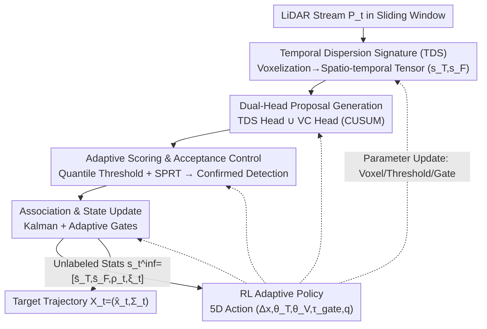

# Adaptive 3D Perception for Small Aerial Targets Under Sparse Sampling via Reinforcement Learning

**Conference**: CVPR 2026  
**Paper**: [CVF Open Access](https://openaccess.thecvf.com/content/CVPR2026/html/Yuan_Adaptive_3D_Perception_for_Small_Aerial_Targets_Under_Sparse_Sampling_CVPR_2026_paper.html)  
**Code**: To be confirmed  
**Area**: 3D Vision  
**Keywords**: LiDAR small target perception, anti-UAV, RL adaptation, temporal dispersion, closed-loop perception control

## TL;DR
Addressing the issue where small aerial targets (birds, UAVs) under long-range LiDAR yield extremely sparse and jittery point clouds, A3PRL utilizes a lightweight 5D reinforcement learning policy. Based on unlabeled statistics such as sparsity, acceptance rates, and trajectory continuity, it jointly adjusts voxel resolution, detection thresholds, and association gates online. This transforms a "fixed-parameter perception pipeline" into a "closed-loop adaptive perception-control system," reducing 3D localization error by approximately 19% in MMAUD cross-scenario testing.

## Background & Motivation

**Background**: Anti-UAV perception has utilized various modalities including vision, thermal imaging, radar, acoustics, and RF. However, each is bound to specific operational conditions (lighting, clutter, payload, spectrum), leading to poor generalization. LiDAR is an attractive choice due to its geometric richness, lighting-independent range information, compact size, and moderate cost. Nonetheless, mainstream 3D LiDAR detectors (PointPillars, CenterPoint, VoxelNet, etc.) are designed for the dense, near-range point clouds typical of autonomous driving.

**Limitations of Prior Work**: When targets are small and distant, and sampling density varies drastically over time, fixed voxelization and static score/gate thresholds fail. The paper identifies three overlapping challenges: (i) long-range sparsity makes motion estimation unreliable; (ii) solar glare and atmospheric interference distort distance measurements; (iii) scene-dependent thresholds cause unstable detection and tracking. Furthermore, motion itself causes non-uniform point distributions—fast targets return only a few points per frame, while hovering targets accumulate dense clusters; a single set of fixed parameters cannot accommodate both.

**Key Challenge**: The optimal values for perception parameters (voxel size, detection sensitivity, association gates) drift in real-time with scene sparsity and target motion, yet traditional pipelines hard-code these values. Heuristic adaptation methods either tune only individual detector settings without downstream tracking feedback or rely on manual rules that require re-tuning for every new LiDAR configuration.

**Goal**: To re-model SAT (Small Aerial Target) perception for long-range sparse LiDAR from "fixed-parameter feedforward detection" to "closed-loop adaptive perception-control," enabling the system to self-tune based on online scene feedback without labels during inference.

**Key Insight**: The authors observe that motion leaves quantifiable "spatio-temporal dispersion" fingerprints within voxels—fast/short-lived targets and stable backgrounds exhibit distinct statistical features in terms of temporal tightness and frame occupancy. Feeding these unlabeled statistics into an RL controller allows it to infer that "the LiDAR has become sparser / the trajectory is fragmenting" without needing ground truth, thereby coordinating parameter adjustments.

**Core Idea**: A lightweight RL policy jointly adjusts voxel scaling, detection thresholds, and association gates within a streaming "detector-tracker" loop, based on unlabeled spatio-temporal dispersion, acceptance rates, and trajectory continuity. Privileged ground-truth trajectories are used to shape rewards during training, while the system runs purely on LiDAR-derived statistics during testing.

## Method

### Overall Architecture

A3PRL models the problem as active perception: observing a LiDAR stream $P_t$ within a sliding window of length $W$ and discretizing the workspace into voxels with base resolution $(\delta_x,\delta_y,\delta_z)$. The goal is the online estimation of the state $X_t=(\hat{x}_t,\Sigma_t)$ (position, velocity, covariance) of a single active aerial target, requiring low-latency emergence of new targets, bounded false alarms, and trajectory continuity.

The pipeline consists of five serial stages coupled with an RL feedback loop: ① Voxelizing the windowed point cloud into a spatio-temporal tensor and extracting the **Temporal Dispersion Signature (TDS)**; ② Using a parallel **TDS head and Velocity Change (VC) head** to generate candidate voxels; ③ Performing **adaptive fusion scoring and acceptance control** (dynamic quantile thresholds + sequential testing) to output confirmed detections; ④ Using lightweight **association and state updates** (Kalman filter + adaptive gates) to maintain the single-target trajectory; ⑤ The **RL policy** observes unlabeled statistics $s_t^{\text{inf}}=[\bar{s}_T,\bar{s}_F,\rho_t,\xi_t]$ and outputs a 5D continuous action $a_t=(\Delta x_t,\theta_T,\theta_V,\tau_{\text{gate}},q)$ to update parameters for the preceding stages. Crucially, the voxel scaling $\Delta x_t$, proposal thresholds $(\theta_T,\theta_V)$, association gate $\tau_{\text{gate}}$, and dynamic quantile $q$ are no longer constants but are produced dynamically at each step.

### Key Designs

**1. Temporal Dispersion Signature (TDS): Encoding "Motion Sparsity" into Voxel-level Spatio-temporal Tensors**

In long-range LiDAR, point counts alone cannot distinguish "fast UAVs (few points)" from "background noise (also few points)." The authors maintain two temporal statistics for each voxel $v$—the latest/earliest timestamps $\tau_{\max}(v), \tau_{\min}(v)$ and the frame occupancy count $O(v)$ (number of distinct frames observing the voxel within the window). Temporal dispersion is defined as $\Delta T(v)=\tau_{\max}-\tau_{\min}$ and the fill rate as $\kappa(v)=O(v)/(W/\delta_t)$. This yields two normalized features:

$$s_T(v)=1-\frac{\Delta T(v)}{W},\qquad s_F(v)=1-\kappa(v),$$

where $s_T\in[0,1]$ measures temporal tightness and $s_F\in[0,1]$ reflects frame sparsity. Fast-moving or short-lived targets produce high $(s_T, s_F)$. The entire window is mapped to an $N_x\times N_y\times N_z\times 2$ 4D spatio-temporal tensor. This encodes motion cues directly from asynchronous LiDAR returns without relying on dense statistics. Global average pooling provides $\bar{s}_T, \bar{s}_F$, serving both as proposal cues and RL state components.

**2. Dual-Head Proposals + Sequential Acceptance Control: Capturing "Transients" and "Abrupt Motion" with Statistical Confirmation**

A fixed threshold leads to either misses or explosions in sparse scenes. Two parallel heads are used: the **TDS Head** calculates a raw score $\phi_T(v)=w_T s_T(v)+w_F s_F(v)$; voxels exceeding $\theta_T$ enter candidate set $C_T$, targeting short-lived/sparse occupancy. The **VC (Velocity Change) Head** fits short-term velocity $u_\tau(v)$ over the last $L$ frames and calculates change $\delta v_\tau(v)=\|u_\tau-u_{\tau-1}\|_2$. Voxels exceeding $\theta_V$ enter $C_V$. A one-sided CUSUM accumulator $G_\tau(v)=\max\{0,G_{\tau-1}(v)+(\delta v_\tau(v)-\nu)\}$ triggers an alarm when $G_\tau\ge h$, making it sensitive to "slow but continuous motion." The union $C_t=C_T\cup C_V$ is expanded via 6-neighbor connectivity and 3D morphological closing.

The statistical core is acceptance control: fusion confidence $\psi(v)$ is calculated (temporal tightness, frame sparsity, velocity consistency, and spatial stability). The quantile of background voxels $B_t=V\setminus C_t$, $\hat{\tau}_\psi(t)=Q_q(\{\psi(v)\,|\,v\in B_t\})$, serves as the dynamic threshold. Since $q$ is an RL action, the threshold adapts to density. Finally, a **log-SPRT (Sequential Probability Ratio Test)** is run on the Bernoulli sequence $\{y_{t_m}(v)\}$, accepting as a true target when $S_k \ge a$. This process naturally yields the **unlabeled foreground acceptance rate** $\rho_t=|D_t|/\max(1,|C_t|)$, which is fed back to the RL policy.

**3. RL Adaptive Policy: Jointly Tuning Five Coupled Hyperparameters using Unlabeled Statistics**

This acts as the "brain" that closes the loop. Optimal values for voxel size, detection thresholds, and association gates drift together with the scene. A lightweight MLP policy $\pi_\phi:S\to A$ observes the 4D unlabeled state $s_t^{\text{inf}}=[\bar{s}_T,\bar{s}_F,\rho_t,\xi_t]$ ($\xi_t$ is a trajectory continuity score serving as an unlabeled proxy for temporal consistency) and outputs the 5D action $a_t=(\Delta x_t,\theta_T,\theta_V,\tau_{\text{gate}},q)$.

The policy is optimized via PPO to maximize the expected return $\mathbb{E}_{\pi_\phi}[\sum_t\gamma^t r_t]$, where the reward is:

$$r_t=-\big(\lambda_1\,\varepsilon_t+\lambda_2(1-\xi_t)+\lambda_3|\rho_t-\tau_\rho|\big),$$

penalizing geometric error $\varepsilon_t$, temporal discontinuity $(1-\xi_t)$, and deviation of the acceptance rate from the target $\tau_\rho=0.6$, balancing accuracy, stability, and efficiency.

**4. Privileged Training, Unlabeled Inference: GT-Shaped Rewards and LiDAR-Only Inference**

A hybrid scheme is used: during training, privileged statistics $s_t^{\text{train}}=[\bar{s}_T,\bar{s}_F,\rho_t,\xi_t,\varepsilon_t]$ are observed, where $\varepsilon_t$ is the geometric error calculated using GT trajectories to shape the reward. During inference, $\varepsilon_t$ is removed, and the policy relies purely on the 4D LiDAR-derived statistics $s_t^{\text{inf}}$. Domain randomization using LiDAR noise from the MCD dataset is used during training to enhance robustness to unseen environments.

### Loss & Training
The policy is trained using PPO with the reward $r_t$ defined above. Reward normalization, entropy regularization, and PPO clipping are used to stabilize training. Action EMA (Exponential Moving Average) is applied during deployment to ensure smooth parameter transitions. Cost weights $(\lambda_p,\lambda_T,\lambda_v)$ for the association component are tuned offline and fixed during inference.

## Key Experimental Results

Experiments used the MMAUD dataset (providing LiDAR/Radar/Audio/Vision + survey-grade 3D GT). Training on V1, testing on unseen V2/V3 (long-range flights $\le 100$ m). Metrics: 3D localization RMSE (meters).

### Main Results (Cross-Scenario MMAUD V2/V3, RMSE↓)

| Method | Modality | Supervision | Day RMSE (m) | Night RMSE (m) |
|------|------|----------|--------------|----------------|
| YOLOv5s | Vision | Supervised | 3.18 | 10.42 |
| RTDETR | Vision | Supervised | 2.78 | 9.72 |
| TAME | Audio | Self-supervised | 4.74 | 4.74 |
| PointPillars | LiDAR | Supervised | 9.32 | 9.32 |
| U3DTE | LiDAR | Unsupervised | 1.76 | 1.76 |
| **Ours (w/o RL)** | LiDAR | Unsupervised | 1.45 | 1.45 |
| **Ours (full)** | LiDAR | Hybrid | **1.17** | **1.17** |

> Vision methods perform well during the day but collapse at night. Supervised LiDAR detectors fail globally in long-range sparse scenarios (9–12 m) due to reliance on dense voxel occupancy. Ours achieves 1.17 m, a ~19% reduction relative to the no-RL version, maintaining consistency across day/night.

### Ablation Study: Observation & Action Spaces (MMAUD V2/V3)

| Variant | Observation Set | Action Set | RMSE (m) |
|------|--------|--------|----------|
| (A) Density only | $\{\bar{s}_T\}$ | Voxel only | 2.80 |
| (B) + Continuity | $\{\bar{s}_T,\xi_t\}$ | Voxel only | 2.55 |
| (C) + Acceptance | $\{\bar{s}_T,\xi_t,\rho_t\}$ | Voxel only | 2.33 |
| (D) Full Obs | $\{\bar{s}_T,\bar{s}_F,\xi_t,\rho_t\}$ | Voxel only | 2.12 |
| (E) + Det Threshold | Full Obs | Voxel + Threshold | 1.95 |
| (F) + Assoc Gate | Full Obs | Voxel + Thresh + Gate | 1.72 |
| (G) Full (Ours) | Full Obs | 5D Full Action | **1.17** |

### Key Findings
- **Sequential addition of observations and actions leads to monotonic improvement** (2.80 → 1.17), indicating that all four statistics are useful and joint control is essential.
- **TDS Head is the strongest cue**: Removing it causes the error to jump from 1.17 to 2.84 m, confirming that short-window temporal dispersion is the dominant signal.
- **Gains stem from design rather than capacity**: A 1-layer linear policy reaches 1.48 m, while a 3-layer MLP saturates at 1.17 m.

## Highlights & Insights
- **Parameter tuning as an RL action space**: Instead of engineer-tuned constants, a lightweight policy outputs parameters at each step. This approach is highly transferable to any pipeline where parameters drift with the scene.
- **Clever design of unlabeled proxy statistics**: Acceptance rate $\rho_t$ and trajectory continuity $\xi_t$ serve as online proxies for geometric accuracy, bypassing the need for GT during deployment.
- **Privileged Training + Unlabeled Inference**: This framework satisfies the constraints of "difficult unlabeled training" and "unlabeled deployment" simultaneously.
- **Efficient Engineering**: The TDS uses circular buffers and monotonic deques for $O(1)$ amortized updates, making it suitable for online streaming applications.

## Limitations & Future Work
- **Single active target focus**: The current state $X_t$ is single-hypothesis; multi-target or swarm scenarios are not yet covered.
- **Privileged reward dependence**: The training phase still requires survey-grade 3D GT. The paper does not show performance degradation when such GT is unavailable for training on new platforms.
- **Evaluation breadth**: Quantitative evidence is largely limited to the MMAUD series; cross-dataset evidence on heterogeneous scanning patterns is sparse.
- **Future Directions**: Extending $\xi_t$ to multi-target trajectory graphs and replacing static domain randomization with learnable adversarial noise to better approximate real-world glare.

## Related Work & Insights
- **vs. Supervised LiDAR Detectors**: Mainstream detectors assume dense distributions and fail when targets have $<5\text{--}10$ points. Ours utilizes spatio-temporal dispersion to handle sparsity.
- **vs. Unsupervised Heuristics (e.g., U3DTE)**: While U3DTE achieves 1.76 m with static parameters, Ours improves this to 1.17 m through RL-based closed-loop parameter adaptation.
- **vs. Existing RL Perception**: Previous works often focus on beam reallocation or frame-level utility. This work jointly optimizes spatial sampling, target emergence, and temporal consistency within the detector-tracker loop.

## Rating
- Novelty: ⭐⭐⭐⭐ Reformulating long-range sparse LiDAR perception as a closed-loop RL control problem is innovative.
- Experimental Thoroughness: ⭐⭐⭐⭐ Solid cross-scenario generalization with multi-angle ablations.
- Writing Quality: ⭐⭐⭐⭐ Clear motivation, complete formulas, and well-explained ablations.
- Value: ⭐⭐⭐⭐ Strong deployment orientation for anti-UAV applications; the closed-loop tuning logic is highly transferable.

<!-- RELATED:START -->

## Related Papers

- [\[ICLR 2026\] CLAP: Unsupervised 3D Representation Learning for Fusion 3D Perception via Curvature Sampling and Prototype Learning](../../ICLR2026/3d_vision/clap_unsupervised_3d_representation_learning_for_fusion_3d_perception_via_curvat.md)
- [\[CVPR 2026\] BuildingGPT: Auto-Regressive Building Wireframe Reconstruction Model with Reinforcement Learning](buildinggpt_auto-regressive_building_wireframe_reconstruction_model_with_reinfor.md)
- [\[CVPR 2026\] Long-SCOPE: Fully Sparse Long-Range Cooperative 3D Perception](long_scope_fully_sparse_long_range_cooperative_3d_perception.md)
- [\[CVPR 2026\] Wavelet-Driven 3D Anomaly Detection under Pose-Agnostic and Sparse-View](wavelet-driven_3d_anomaly_detection_under_pose-agnostic_and_sparse-view.md)
- [\[CVPR 2026\] HeroGS: Hierarchical Guidance for Robust 3D Gaussian Splatting under Sparse Views](herogs_hierarchical_guidance_for_robust_3d_gaussian_splatting_under_sparse_views.md)

<!-- RELATED:END -->
