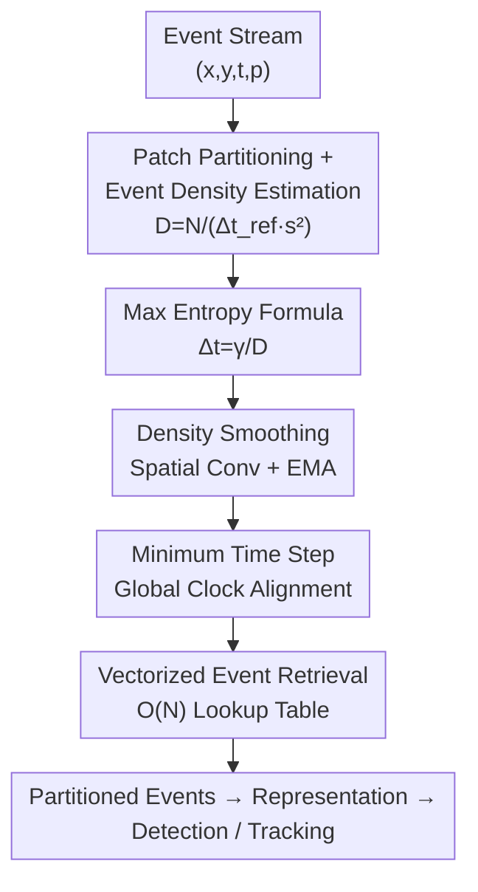

# Adaptive Spatial-Temporal Window: Unlocking the Potential of Event Cameras in Heterogeneous Velocity Scenarios

**Conference**: CVPR 2026  
**Paper**: [CVF Open Access](https://openaccess.thecvf.com/content/CVPR2026/html/Sui_Adaptive_Spatial-Temporal_Window_Unlocking_the_Potential_of_Event_Cameras_in_CVPR_2026_paper.html)  
**Code**: None (Links not public in paper)  
**Area**: Event Camera / Neuromorphic Vision  
**Keywords**: Event Camera, Event Partitioning, Maximum Entropy, Heterogeneous Velocity Scenarios, Object Detection and Tracking

## TL;DR
Addressing "Heterogeneous Velocity Scenarios" (HVS) containing both fast and slow objects, this paper proposes the ASTW event partitioning strategy: the pixel plane is divided into small patches, and an analytical formula for the optimal time window $\Delta t = \gamma / D$ (where $D$ is event density) is derived based on the Maximum Entropy principle. Implemented with $O(N)$ vectorization, ASTW allows each spatial region to adaptively select windows, achieving up to +2.6 mAP in object detection and +2.2 SR in tracking.

## Background & Motivation
**Background**: Event cameras output asynchronous event streams $(x,y,t,p)$. Downstream algorithms (detection, tracking) almost always require "partitioning" the stream before converting it into representations like event frames or voxels. Partitioning is the initial step in most event vision pipelines, typically using **Fixed Time Window** or **Fixed Number of Events** strategies.

**Limitations of Prior Work**: Fixed strategies apply a single set of rules across the entire Field of View (FOV). They fail to account for dynamic scene changes and treat all spatial locations uniformly—fast objects require short windows (to avoid motion blur), while slow objects require long windows (to gather sufficient information). Existing **adaptive** strategies (ATS, AEC, Adaptive Global Decay, SpikeSlicer, etc.) only provide **temporal adaptivity**: they estimate a uniform optimal window length for the entire frame, which handles speed changes over time but fails to address **spatial heterogeneity** where multiple objects move at different speeds within the same FOV.

**Key Challenge**: Real-world scenes are often **Heterogeneous Velocity Scenarios (HVS)**—exhibiting both temporal and spatial heterogeneity. Addressing this requires partitioning to possess both **temporal adaptivity** and **spatial locality**. The few methods considering spatial locality either lack adaptivity (TORE maintains fixed-length queues per pixel) or are computationally prohibitive (Event Lifetime requires per-event velocity estimation at 56 µs/event and is sensitive to noise).

**Goal / Key Insight**: To design a partitioning strategy that is **local, adaptive, and computationally efficient**. The key observation is that event count and motion satisfy $N(\Delta t)=c\cdot L\cdot v\cdot \Delta t$ (under the brightness constancy assumption, events are triggered by motion; longer edge length $L$ and faster velocity $v$ produce more events per unit time). Thus, the optimal window length is essentially determined by local $L\cdot v$, which can be indirectly proxied by the **statistically accessible event density**, bypassing explicit velocity estimation.

**Core Idea**: Divide the pixel plane into non-overlapping patches and derive the optimal window length $\Delta t_{ij}=\gamma/D_{ij}$ for each patch using the **Maximum Entropy principle**, substituting expensive velocity estimation with event density $D$ and utilizing $O(N)$ vectorization.

## Method

### Overall Architecture
The objective of ASTW is singular: **calculating the specific time window each spatial patch should use at a given moment to capture events.** The process is a continuous loop: estimate event density $D_{ij}$ for each patch within a reference window $\Delta t_{\text{ref}}$ → apply spatial smoothing and EMA temporal smoothing to obtain robust $\bar D_{ij}$ → convert $\bar D_{ij}$ to per-patch window length $\Delta t_{ij}$ via an analytical formula → retrieve events using vectorized lookups and advance global timestamps using a "minimum time step" strategy. The process requires no training and serves as a purely geometric/statistical preprocessing module compatible with any detection/tracking network.

### Key Designs

**1. Maximum Entropy Formula: Converting window selection into density division**

The challenge is selecting optimal windows per patch without expensive velocity estimation. The authors bypass this using **information entropy**. Converting events into a binary Event Frame (1 for event, 0 otherwise), the entropy of a patch is:
$$H_{ij}=-p_{ij}\log_2 p_{ij}-(1-p_{ij})\log_2(1-p_{ij}),$$
where $p_{ij}$ is the ratio of non-zero pixels. Entropy is maximized at 1 bit when $p_{ij}=1/2$—intuitively, boundaries are clearest when half the patch contains edges. Two constraints are applied: **Local Information Maximization** ($p \approx 1/2$ per patch) and **Spatial Consistency** (all patches balanced at $1/2$). Given $p_{ij}=L_{ij}v_{ij}\Delta t_{ij}/s^2$, setting $p=1/2$ yields:
$$\frac{c\cdot L_{ij}\cdot v_{ij}\cdot \Delta t_{ij}}{s^2}=\gamma,$$
where $\gamma$ is an information constant. This indicates: **longer edges or faster motion require shorter windows**. Defining event density:
$$D_{ij}=\frac{N_{ij}}{\Delta t_{\text{ref}}\cdot s^2}=\frac{c\cdot L_{ij}\cdot v_{ij}}{s^2},$$
results in the minimal formula $D_{ij}\cdot \Delta t_{ij}=\gamma$, or $\Delta t_{ij}=\gamma/D_{ij}$. The ingenuity lies in substituting velocity estimation with simple event counting ($D$), making ASTW both adaptive and fast.

**2. Density Smoothing (Spatial Conv + EMA): Stabilizing estimates against fluctuations**

Instantaneous density $D_{ij}$ is not robust due to objects spanning multiple patches or sudden motion changes. Two levels of smoothing are applied: spatial fusion using a kernel $K$ of size $n\cdot s$ to account for multi-scale objects, and temporal fusion via Exponential Moving Average (EMA):
$$\widetilde{D}_{ij}=(K*D)_{ij},\qquad \bar D_{ij}(t)=\alpha\widetilde{D}_{ij}(t)+(1-\alpha)\bar D_{ij}(t-1).$$
The final window length is clamped: $\Delta t_{ij}=\mathrm{clamp}\!\big(\frac{\gamma}{\bar D_{ij}+\varepsilon},\Delta t_{\min},\Delta t_{\max}\big)$. This ensures the "density-to-window" mapping is practical under noise.

**3. Minimum Time Step Strategy: Maintaining causal consistency**

If every patch followed its own window independently, global causal consistency would break, risking missing events. The authors enforce that **all patches share the same end timestamp** while looking back over their respective $\Delta t_{ij}$. The global timestamp advances by the smallest window found: $\Delta t_{\text{step}}=\min(\Delta t_{ij})$. This ensures progressive updates without gaps, providing millisecond-level responsiveness to fast-moving objects while maintaining a unified time reference.

**4. Vectorized Implementation: Forcing per-patch loops into $O(N)$**

Naive looping through patches is slow. ASTW maps coordinates $(x,y)$ to patch indices $(g_x,g_y)$, uses those indices to query window lengths in the $\Delta t_{ij}$ table, and performs vectorized comparison to retain valid events. Complexity is $O(N)$. At 7.43 µs/event, it is slightly slower than TORE (2.04) but 7.6× faster than Event Lifetime (56.38) and 2.3× faster than Adaptive Global Decay (16.76).

## Key Experimental Results

### Main Results
Evaluation conducted on Gen1 (Detection) and EventVOT/HetVel (Tracking). Architectures and training remained constant; only the partitioning strategy varied.

| Task / Model | Metric | ASTW | Next Best | Gain |
|------|------|------|------|------|
| Det. ResNet-50 | mAP / AP50 | 50.6 / 76.0 | 48.3 / 75.2 (TORE) | +2.3 / +0.8 |
| Det. Swin V2 | mAP / AP50 | 46.6 / 75.2 | 44.0 / 73.2 | +2.6 / +2.0 |
| Det. RVTs(recurrent) | mAP / AP50 | 48.3 / 75.4 | 47.3 / 73.8 (TORE) | +1.0 / +1.6 |
| Track. EventVOT | SR / PR / NPR | 62.3 / 60.5 / 85.1 | 62.1 / 60.5 / 84.8 | +0.2 / 0 / +0.3 |
| Track. HetVel | SR / PR / NPR | 50.7 / 58.5 / 84.9 | 48.6 / 56.3 / 82.7 | +2.1 / +2.2 / +2.2 |

ASTW leads across all configurations (Feed-forward/Recurrent, CNN/Transformer). Gains are higher in feed-forward models compared to recurrent ones, likely because recurrent models (e.g., LSTMs in RVTs) inherently learn some temporal dependencies, reducing reliance on partition quality. In tracking, performance is less sensitive overall, except on the HVS-specific HetVel dataset where ASTW shows a significant advantage (+2.1~2.2).

### Ablation Study
(Gen1 + ResNet-50)

| Config | mAP | Description |
|------|------|------|
| Full model | 50.6 | Complete ASTW |
| w/o Patching | 46.6 | -4.0, spatial locality is the most critical factor |
| w/o Causal Consistency | 49.4 | -1.2, unified time reference is vital |
| w/o Spatial Smoothing | 50.1 | -0.5 |
| w/o Temporal (EMA) | 50.3 | -0.3 |

ASTW consistently outperforms fixed baselines across various representations: Time Surface (53.0 vs 51.3), Event Count (52.1 vs 50.1), and Voxel Grid (49.0 vs 47.6).

### Key Findings
- **Patch partitioning is the primary contributor**: Removing it causes a 4.0 mAP drop, validating the focus on spatial locality.
- **Robust Hyperparameters**: Patch size 4 is optimal (balance of statistics and locality), $\gamma \approx 1.7$, and $\Delta t_{\text{ref}} = 250$ ms.
- **Extreme Scenario Handling**: In high-speed scenes, ASTW can partition 1 second of events into ~1000 segments (1 ms/frame), effectively handling speeds up to 2400 px/s while minimizing latency.

## Highlights & Insights
- **Reducing "Window Selection" to a Division**: Deriving $\Delta t=\gamma/D$ from $p=1/2$ simplifies what usually requires optical flow or velocity estimation into basic density counting and division.
- **Density as an Implicit Proxy**: Using $D=N/(\Delta t_{\text{ref}} s^2)$ instead of explicit velocity is computationally cheap and noise-robust, a concept transferable to tasks like event denoising or adaptive representations.
- **HetVel Dataset**: Fills a gap with the first RGB-Event dual-modality dataset specialized for Heterogeneous Velocity Scenarios (100 fps RGB provides high-frequency labels).

## Limitations & Future Work
- **Window Overlap**: The "minimum time step" strategy causes window overlap in some patches. This is dismissed as "experimentally acceptable" without quantifying the redundancy.
- **Brightness Constancy Assumption**: Modeling assumes events are motion-triggered; performance might degrade under lighting changes or flickering.
- **Limited Gain in Tracking**: Improvements on EventVOT are marginal compared to TORE, suggesting ASTW's strengths lie primarily in partitioning-sensitive detection and highly heterogeneous scenes.
- **Open Source Access**: Recurrent mention of Supplementary materials for $O(N)$ analysis and dataset details; the code was not public at submission time.

## Related Work & Insights
- **vs Fixed Strategies**: Fixed windows lack both adaptivity and locality; ASTW provides both, yielding up to +2.6 mAP.
- **vs Global Adaptive Methods**: Prior adaptive methods handle temporal changes but fail at simultaneous multi-object velocity differences (spatial heterogeneity). 
- **vs Local Methods**: TORE offers locality without adaptivity. Event Lifetime offers both but at high cost (56 µs/event) and noise sensitivity. ASTW achieves locality, adaptivity, and efficiency (7.43 µs/event) simultaneously.

## Rating
- Novelty: ⭐⭐⭐⭐ Elegant unification of spatial/temporal adaptation via max entropy.
- Experimental Thoroughness: ⭐⭐⭐⭐ High coverage of tasks and architectures; includes a new dataset.
- Writing Quality: ⭐⭐⭐⭐ Clear derivations and well-aligned motivations.
- Value: ⭐⭐⭐⭐ A plug-and-play, representation-agnostic frontend for the event vision community.

<!-- RELATED:START -->

<!-- RELATED:END -->

## Related Papers

- [\[CVPR 2026\] Event Structural Valley: A Unified Theoretical and Practical Framework for Event Camera Autofocus](event_structural_valley_a_unified_theoretical_and_practical_framework_for_event_.md)
- [\[CVPR 2026\] Event-based Visual Deformation Measurement](event-based_visual_deformation_measurement.md)
- [\[CVPR 2026\] Event Stream Filtering via Probability Flux Estimation](event_stream_filtering_via_probability_flux_estimation.md)
- [\[ACL 2025\] Unlocking Speech Instruction Data Potential with Query Rewriting](../../ACL2025/others/unlocking_speech_instruction_data_potential_with_query_rewriting.md)
- [\[CVPR 2025\] Full-DoF Egomotion Estimation for Event Cameras Using Geometric Solvers](../../CVPR2025/others/full-dof_egomotion_estimation_for_event_cameras_using_geometric_solvers.md)

<!-- RELATED:END -->
