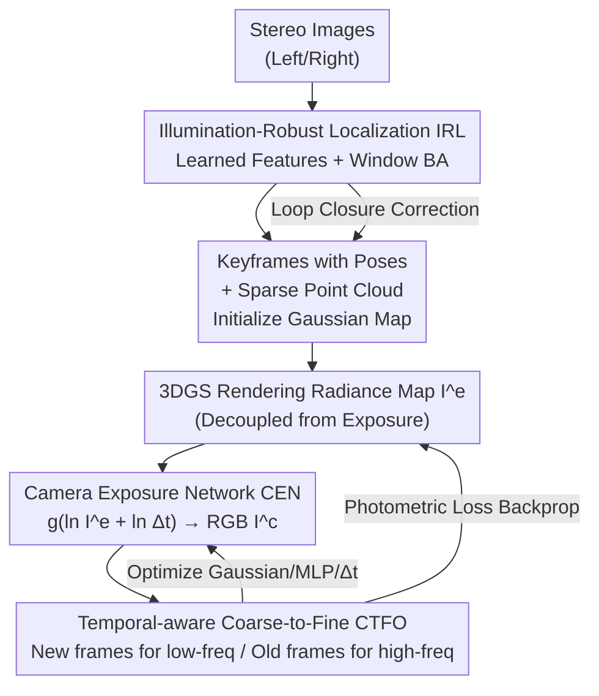

# AERGS-SLAM: Auto-Exposure-Robust Stereo 3D Gaussian Splatting SLAM

**Conference**: CVPR 2026  
**Paper**: [CVF Open Access](https://openaccess.thecvf.com/content/CVPR2026/html/Zhou_AERGS-SLAM_Auto-Exposure-Robust_Stereo_3D_Gaussian_Splatting_SLAM_CVPR_2026_paper.html)  
**Code**: https://github.com/zzy-2021/AERGS-SLAM  
**Area**: 3D Vision  
**Keywords**: 3D Gaussian Splatting, SLAM, Auto-Exposure, Camera Response Function, Decoupled Localization  

## TL;DR
Addressing the issue where image appearance drift caused by camera Auto-Exposure (AE) in real-world scenes destroys the photometric consistency of 3DGS, AERGS-SLAM introduces a Camera Exposure Network (CEN) that decouples the "rendered radiance map" from the "exposure process." Combined with learned illumination-robust feature localization and temporal-aware coarse-to-fine optimization, it produces the first decoupled 3DGS SLAM robust to exposure variations. It outperforms existing baselines in both localization accuracy and high-fidelity reconstruction, while rendering nearly 10x faster than HDR-GS.

## Background & Motivation

**Background**: 3D Gaussian Splatting (3DGS) explicitly represents scene geometry and appearance using anisotropic Gaussian ellipsoids, becoming a mainstream differentiable rendering representation in SLAM. 3DGS-based SLAM is categorized into two types: coupled (e.g., MonoGS, where localization and mapping share Gaussian maps and trainable appearance parameters, offering high accuracy but poor real-time performance and robustness) and decoupled (e.g., Photo-SLAM, which uses traditional ORB-SLAM3 for localization and a separate thread for 3DGS mapping to ensure real-time operation).

**Limitations of Prior Work**: Most 3DGS SLAM systems assume that input images strictly satisfy photometric consistency. However, real-world cameras use AE algorithms to automatically adjust light intake, introducing view-independent appearance changes that destroy the multi-view photometric consistency required for 3DGS optimization. Existing remedies have drawbacks: MonoGS uses only two exposure parameters for brightness, failing to model complex AE; SEGS-SLAM uses "view-dependent appearance embeddings" for compensation, but AE-induced changes are inherently view-independent (stemming from camera mechanisms), making such embeddings a temporary fix; HDR-NeRF / HDR-GS model exposure using a Camera Response Function (CRF) but couple the "per-point/per-Gaussian radiance-to-color" mapping with the rendering process.

**Key Challenge**: In methods like HDR-GS, the CRF operates on each Gaussian individually, causing exposure estimation and the rendering process to be entangled. This degrades appearance reconstruction quality and causes computational costs to explode as the number of Gaussians increases. Meanwhile, decoupled localization threads often rely on handcrafted features like ORB, which are not robust to AE-induced illumination changes, leading to significant degradation in localization accuracy. Furthermore, existing coarse-to-fine acceleration schemes use fixed low-to-high frequency schedules, ignoring the temporal dynamics of SLAM keyframes.

**Goal**: To develop a decoupled 3DGS SLAM robust to AE, achieving both (a) reliable localization under exposure changes and (b) high-fidelity mapping with controllable exposure.

**Key Insight**: The authors observed that the AE process can be modeled by a CRF, which only needs to be applied to the "per-image radiance map" rather than individual Gaussians—allowing for the complete decoupling of rendering and exposure. The localization component is replaced with learned illumination-robust features.

**Core Idea**: Use a Camera Exposure Network (CEN) acting on the entire radiance map to replace per-Gaussian CRF mapping, stripping exposure away from rendering. Combined with illumination-robust localization and temporal-aware coarse-to-fine optimization, this system unifiedly addresses "AE-consistency destruction" and "localization degradation under exposure changes."

## Method

### Overall Architecture
AERGS-SLAM is a dual-thread decoupled system: The **Localization Thread** processes stereo images using a visual SLAM with learned illumination-robust features, outputting keyframes with poses and sparse point clouds used to initialize the Gaussian map. The **Mapping Thread** first renders an exposure-independent "radiance map" $\mathbf{I}^e$ using 3DGS, then feeds it along with exposure time $\Delta t$ into the CEN to obtain the final RGB image $\mathbf{I}^c$, which is compared against the ground truth for photometric loss. This loss backpropagates to optimize three components: Gaussian parameters, the CEN MLP, and the exposure time $\Delta t$. Loop closure detection in the localization thread establishes constraints between temporally distant but spatially close keyframes to correct trajectory drift, further improving mapping accuracy. The three core modules—Illumination-Robust Localization (IRL), Camera Exposure Network (CEN), and Temporal-aware Coarse-to-Fine Optimization (CTFO)—correspond to "accurate localization," "correct appearance," and "clear details," respectively.

### Key Designs

**1. Camera Exposure Network (CEN): Stripping Exposure from Rendering to Decouple Complexity from Gaussian Count**

This module addresses the "exposure-rendering coupling" pain point of HDR-GS. 3DGS ellipsoids are parameterized by position $\mathbf{P}$, covariance $\mathbf{\Sigma}$, spherical harmonics $\mathbf{S}$ (to recover radiance $\mathbf{e}$), and opacity $\alpha$. Standard $\alpha$-blending renders as $\mathbf{I}=\sum_{i\in N}\mathbf{e}_i G'_i \alpha_i \prod_{j=1}^{i-1}(1-G'_j\alpha_j)$. HDR-GS applies the CRF to the radiance $\mathbf{e}_i$ of each Gaussian to get color $\mathbf{c}_i$, tying exposure to rendering. The authors do the opposite: 3DGS renders the **radiance map of the whole image** $\mathbf{I}^e$, and CEN learns the CRF to map $\mathbf{I}^e\Delta t$ to RGB: $\mathbf{I}^c = f(\mathbf{I}^e\Delta t)$. Following Debevec–Malik CRF calibration and assuming $f$ is monotonic and invertible, transitioning to the log-radiance domain yields $\ln f^{-1}(\mathbf{I}^c)=\ln\mathbf{I}^e+\ln\Delta t$. Letting $g(\cdot)=(\ln f^{-1}(\cdot))^{-1}$, we get:

$$\mathbf{I}^c = g\!\Big(\ln\sum_{i\in N}\mathbf{e}_i G'_i \alpha_i \prod_{j=1}^{i-1}(1-G'_j\alpha_j) + \ln\Delta t\Big),$$

where $g(\cdot)$ uses three independent MLPs to model the RGB channels. This has two direct benefits: First, the radiance map can be rendered once and exposure can be repeatedly adjusted/estimated without recomputing the rendering equation. Second, the computational complexity depends only on the network structure and image resolution, **independent of the number of Gaussians**—the root cause of it being nearly 10x faster than HDR-GS (3700 FPS vs. 416 FPS). The photometric loss $\mathcal{L}_c=(1-\lambda)|\mathbf{I}^c-\mathbf{I}^c_{\text{gt}}|_1+\lambda(1-\text{SSIM})$ optimizes Gaussians, the MLP, and $\Delta t$ simultaneously. A unit exposure loss $\mathcal{L}_u=\|g(0)-C_0\|_2^2$ (where $C_0$ is the median pixel value) from HDR-NeRF is added to anchor the scale of the radiance map, resulting in the total loss $\mathcal{L}=\mathcal{L}_c+\lambda_u\mathcal{L}_u$.

**2. Illumination-Robust Localization (IRL): Replacing Handcrafted Features to Prevent BA Residual Distortion**

This solves the AE-robustness issue in the localization thread of decoupled SLAM. Localization uses a sliding window to jointly optimize poses and landmarks: Given a window of $K$ keyframes, each frame $F_k$ has $m_k$ 2D-3D matches. Rotation $\mathcal{R}$, translation $\mathcal{T}$, and landmarks $\mathcal{X}$ are solved via local BA: $\arg\min\sum_k\sum_j\rho(E(k,j))$, where the reprojection residual is $E(k,j)=\|\mathbf{p}_{kj}-\pi(\mathbf{R}_k\mathbf{P}_{kj}+\mathbf{t}_k)\|^2$. The key insight is that residual reliability depends on feature matching accuracy; AE-induced appearance changes cause handcrafted features like ORB to fail, degrading $E(k,j)$ and ruining pose/landmark estimation. The authors use learned illumination-robust features (from AirSLAM) for detection and matching. The optimized keyframes $\mathcal{F}$ and landmarks $\{\mathbf{P}_{kj}\}$ are used as training views and initial Gaussian ellipsoids for mapping—meaning localization robustness propagates directly to mapping quality.

**3. Temporal-aware Coarse-to-Fine Optimization (CTFO): Allocating Frequency Supervision by "Dwelling Time"**

This targets a blind spot in previous coarse-to-fine methods, which apply a fixed schedule to the entire scene, ignoring that SLAM keyframes carry different temporal information. New keyframes represent incomplete reconstructions and are suitable for supervising low-frequency structures; older keyframes possess more information and are better for supervising high-frequency appearance details. The authors design an image sampling strategy within the sliding window: For $L$ keyframes $\{F_l\}$, each has a dwelling time $N_l$. A scaling function calculates the downsampling scale $\alpha_l=h(N_l)$—old frames (large $N_l$) use small $\alpha_l$ (preserving high frequencies), while new frames (small $N_l$) use large $\alpha_l$ (low-frequency supervision). Optimization proceeds frame-by-frame: $\arg\min\mathcal{L}(\mathbf{I}^l_r,\text{sample}(\mathbf{I}^l_{\text{gt}},\alpha_l))$. In implementation, $h(N_l)=-0.065N_l+8$ (for $N_l\le100$), and remains fixed at 1.5 for $N_l>100$.

### Loss & Training
The total mapping loss is the photometric loss + unit exposure loss $\mathcal{L}=\mathcal{L}_c+\lambda_u\mathcal{L}_u$, jointly optimizing Gaussian parameters, the CEN MLP, and exposure time $\Delta t$. Key hyperparameters: $\lambda=0.4, \lambda_u=0.5, C_0=0.73$. MLP learning rate is 0.001, exposure time learning rate is 0.02. Localization follows AirSLAM defaults, and Gaussian learning rates follow Photo-SLAM. The system is implemented in C++ and LibTorch, with parallel localization and mapping threads.

## Key Experimental Results

Datasets: As no public SLAM dataset evaluates AE robustness specifically, the authors (a) manually injected exposure variations into EuRoC MAV using $V_{out}=AV_{int}$ (random $A\sim\mathcal{U}[0.5,1.5]$ per image) and (b) collected 6 real-world sequences using a ZED 2i stereo camera, with DROID-SLAM trajectories as reference and recorded real exposure times. Metrics: ATE RMSE for localization, PSNR/SSIM/LPIPS for mapping, and estimated relative exposure time for exposure.

### Main Results

Localization (RMSE↓, selected representative sequences; 'X' indicates failure):

| Method | MH01 | V103 | V203 | S4 | S5 |
|------|------|------|------|------|------|
| ORB-SLAM3 | 0.044 | X | 1.522 | 2.481 | 3.423 |
| MonoGS (Coupled) | 0.089 | 0.745 | X | 16.975 | 32.227 |
| Photo-SLAM (Decoupled) | 0.029 | X | 1.001 | 2.500 | 3.553 |
| SEGS-SLAM (Decoupled) | 0.037 | 0.288 | X | 2.473 | 3.633 |
| **Ours** | **0.021** | **0.024** | **0.215** | **0.132** | **0.523** |

Takeaway: Handcrafted feature baselines (Photo-SLAM/SEGS-SLAM) failed (X) on several exposure-varying sequences. AERGS-SLAM succeeded across all and achieved optimal accuracy, validating the value of learned illumination-robust features. Decoupled methods significantly outperformed the coupled MonoGS.

Mapping (novel view synthesis, selected sequences):

| Method | V102 PSNR↑ | V103 PSNR↑ | V102 SSIM↑ | V102 LPIPS↓ |
|------|------|------|------|------|
| MonoGS | 15.32 | 14.90 | 0.750 | 0.472 |
| Photo-SLAM | 11.34 | X | 0.577 | 0.588 |
| SEGS-SLAM | 14.98 | 15.51 | 0.730 | 0.327 |
| Ours + HDR-GS | 20.31 | 18.03 | 0.787 | 0.317 |
| **Ours** | **23.55** | **22.93** | **0.832** | **0.204** |

Takeaway: CEN comprehensively outperforms Photo-SLAM (no exposure mechanism), SEGS-SLAM (appearance embeddings), and MonoGS (learnable exposure parameters). Notably, replacing CEN with HDR-GS (Ours+HDR-GS row) leads to a drop in PSNR, proving that an image-wide CRF on the radiance map handles exposure better than per-Gaussian CRFs. CEN's exposure estimation is closer to ground truth and renders at 3700 FPS vs. 416 FPS for HDR-GS (~9x faster).

### Ablation Study

Average RMSE and PSNR reported on processed EuRoC and self-collected datasets (Row (1) is original Photo-SLAM):

| Configuration | EuRoC PSNR↑ | EuRoC RMSE↓ | Self PSNR↑ | Self RMSE↓ |
|------|------|------|------|------|
| (1) w/o CTFO+CEN+IRL (=Photo-SLAM) | 11.76 | 0.164 | 18.32 | 1.754 |
| (2) w/o CTFO+CEN (+IRL) | 14.76 | 0.072 | 19.59 | 0.199 |
| (3) w/o CEN (+IRL+CTFO) | 15.10 | 0.051 | 19.69 | 0.214 |
| (4) w/o CTFO (+IRL+CEN) | 20.48 | 0.077 | 20.05 | 0.199 |
| (5) Ours (Full) | **21.11** | **0.049** | 20.06 | 0.233 |

### Key Findings
- **IRL is the primary driver for localization**: Adding IRL (1)→(2) slashed EuRoC RMSE from 0.164 to 0.072 and self-collected from 1.754 to 0.199. Improved localization also lifted PSNR (better poses/initialization), confirming the "localization → initialization → mapping" chain.
- **CEN contributes most to mapping quality**: Adding CEN (2)→(4) improved EuRoC PSNR by over 5 dB (14.76→20.48). Since CEN/CTFO only affect the mapping thread, their impact on RMSE in the table is secondary.
- **CTFO consistently improves details**: PSNR improved in both (2)→(3) and (4)→(5) comparisons, showing that allocating frequency supervision by dwelling time indeed enhances high-fidelity reconstruction.
- **CEN is both fast and accurate**: Decoupling complexity from the number of Gaussians allows for higher fidelity while achieving nearly 10x the rendering speed of HDR-GS.

## Highlights & Insights
- **More Complete "Decoupling"**: Beyond decoupling localization and mapping, this work decouples "rendering" from "exposure"—applying the CRF to the full radiance map instead of per-Gaussian. This improves quality and reduces complexity from $O(\text{Gaussians})$ to image resolution—a clever shift in perspective.
- **Capturing the Essence of AE**: The authors correctly identify AE-induced changes as view-independent, which is why view-dependent appearance embeddings (SEGS-SLAM) fail. This insight dictated the CRF route over embeddings.
- **Feeding SLAM Temporal Structure into Coarse-to-Fine**: Using "dwelling time" to distinguish between new and old frames for frequency supervision is a concrete adaptation of coarse-to-fine strategies for SLAM, transferable to other online reconstruction tasks.
- **Controllable Exposure as a Side Benefit**: By explicitly modeling the CRF and $\Delta t$, the system can remove exposure flicker, render at a specified $\Delta t$, and even recover real per-frame exposure times.

## Limitations & Future Work
- The paper does not provide system-level end-to-end speed/memory comparisons with baselines (only rendering FPS). Real-time global performance likely requires supplemental data.
- AE simulation uses linear brightness scaling $V_{out}=AV_{int}$, which differs from real non-linear CRFs. EuRoC results may be idealized; real-world generalization relies primarily on self-collected data.
- The "ground truth" for self-collected data uses DROID-SLAM trajectories, which contains reference frame errors compared to absolute truths.
- The method depends on stereo input and learned features; performance in monocular or purely geometric thin-textured scenes is not discussed.

## Related Work & Insights
- **vs. HDR-GS / HDR-NeRF**: These use CRF for per-point/per-Gaussian radiance-to-color mapping, coupling exposure with rendering. Ours uses CEN for image-wide CRF on the radiance map, achieving higher quality and $O(1)$ complexity relative to Gaussian count (rendering ~10x faster).
- **vs. MonoGS (Coupled)**: MonoGS uses simple brightness parameters and a coupled map, failing to model complex AE and suffering from poor real-time speed. Ours uses a decoupled dual-thread + CEN for better robustness.
- **vs. SEGS-SLAM / Photo-SLAM (Decoupled)**: Photo-SLAM lacks exposure mechanisms, and SEGS-SLAM uses view-dependent embeddings (ineffective for view-independent AE); both use ORB. Ours uses learned features + CEN, succeeding where they fail.

## Rating
- Novelty: ⭐⭐⭐⭐ First exposure-robust decoupled 3DGS SLAM; "rendering-exposure decoupled image-wide CRF" is a solid and practical perspective.
- Experimental Thoroughness: ⭐⭐⭐⭐ Public + self-collected datasets, three categories of metrics, and comprehensive ablation.
- Writing Quality: ⭐⭐⭐⭐ Clear motivation, complete derivations, and good figure-text alignment.
- Value: ⭐⭐⭐⭐ Addresses the universal pain point of camera AE; open-sourced and highly practical for real-world SLAM.

<!-- RELATED:START -->

## Related Papers

- [\[CVPR 2026\] ODGS-SLAM: Omnidirectional Gaussian Splatting SLAM](odgs-slam_omnidirectional_gaussian_splatting_slam.md)
- [\[CVPR 2026\] VarSplat: Uncertainty-aware 3D Gaussian Splatting for Robust RGB-D SLAM](varsplat_uncertainty-aware_3d_gaussian_splatting_for_robust_rgb-d_slam.md)
- [\[CVPR 2026\] Flow4DGS-SLAM: Optical Flow-Guided 4D Gaussian Splatting SLAM](flow4dgs-slam_optical_flow-guided_4d_gaussian_splatting_slam.md)
- [\[ECCV 2024\] I²-SLAM: Inverting Imaging Process for Robust Photorealistic Dense SLAM](../../ECCV2024/3d_vision/i2-slam_inverting_imaging_process_for_robust_photorealistic_dense_slam.md)
- [\[CVPR 2025\] WildGS-SLAM: Monocular Gaussian Splatting SLAM in Dynamic Environments](../../CVPR2025/3d_vision/wildgs-slam_monocular_gaussian_splatting_slam_in_dynamic_environments.md)

<!-- RELATED:END -->
