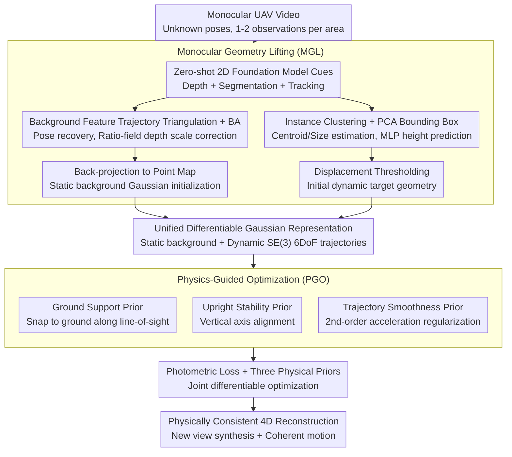

# AeroDGS: Physically Consistent Dynamic Gaussian Splatting for Single-Sequence Aerial 4D Reconstruction

**Conference**: CVPR2026  
**arXiv**: [2602.22376](https://arxiv.org/abs/2602.22376)  
**Author**: Hanyang Liu, Rongjun Qin
**Code**: To be confirmed  
**Area**: 3D Vision  
**Keywords**: 4D reconstruction, 3D Gaussian Splatting, Physical Prior, Monocular UAV Video, Dynamic Scene, Aerial Photography

## TL;DR

AeroDGS is proposed as a physics-guided 4D Gaussian Splatting framework for monocular UAV videos. It reconstructs reliable static and dynamic geometry through a Monocular Geometry Lifting module and introduces differentiable physical priors—ground support, upright stability, and trajectory smoothness—to transform ambiguous image cues into physically consistent motion estimations, outperforming existing methods on both synthetic and real-world UAV scenes.

## Background & Motivation

**Progress and Bottlenecks in 4D Reconstruction**: Recent advances in 4D scene reconstruction have shown significant progress. 3D Gaussian Splatting (3DGS) has become a popular foundation for modeling static and dynamic scenes due to its efficient differentiable rendering and explicit representation. However, existing dynamic 3DGS methods (e.g., Dynamic 3D Gaussians, 4D-GS, Deformable 3DGS) are primarily designed for close-range dynamic scenes in multi-view or controlled environments.

**Unique Challenges of Aerial Scenes**: UAV aerial videos possess several special properties that cause existing methods to fail:
   - **Single-view Capture**: UAVs typically fly along fixed routes, where each region is observed only once or very few times, lacking multi-view redundancy.
   - **Wide Spatial Scale**: The coverage area of aerial photography is much larger than indoor or street-view scenes, with complex background geometry.
   - **Dynamic Target Characteristics**: Moving objects (e.g., vehicles, pedestrians) occupy small spatial proportions in the frame but exhibit large motion disparity, leading to severe motion blur and occlusion.
   - **Depth Ambiguity**: Monocular depth estimation in aerial photography is inherently ill-posed; long distances and top-down perspectives make depth cues scarce.

**Key Challenge**: The accumulation of these factors leads to severe depth ambiguity and unstable motion estimation, making monocular aerial dynamic reconstruction an inherently ill-posed problem. Existing methods under this setting either fail completely or produce physically implausible motion trajectories (e.g., objects floating, penetrating the ground, or jittering).

**Key Insight**: Utilize common-sense physical priors (objects should stand on the ground, remain upright, and follow smooth trajectories) to constrain and resolve monocular depth ambiguity, converting uncertain image cues into physically consistent dynamic reconstructions.

## Method

### Overall Architecture

AeroDGS addresses the dynamic 4D reconstruction of monocular UAV aerial videos—an inherently ill-posed problem. Since UAVs fly along fixed routes, regions are seen only once or twice, and dynamic targets have small pixel ratios but large motion, the resulting depth ambiguity and motion instability are severe. The mechanism of the framework is to "supplement geometry with physics": first, use Monocular Geometry Lifting (MGL) to extract reliable static background and initial dynamic geometry from single-observation sequences, parameterizing both into a differentiable 3D Gaussian representation (modeling dynamic motion as continuous 6DoF trajectories on SE(3)). Then, Physics-Guided Optimization (PGO) incorporates common-sense constraints—ground support, uprightness, and smooth motion—into differentiable losses to resolve monocular ambiguity. Photometric reconstruction loss and the three physical priors are jointly optimized to refine static backgrounds and dynamic entities collaboratively.

### Key Designs

**1. Monocular Geometry Lifting (MGL): Extracting reliable static and dynamic geometry from limited aerial observations**

Aerial photography often lacks multi-view redundancy, and traditional SfM can only recover sparse ground points often contaminated by dynamic objects, causing initialization failures. MGL first utilizes zero-shot 2D foundation models for coarse cues: depth estimation networks provide dense pseudo-depth per frame, while segmentation and tracking provide consistent masks and IDs for movable instances. On the static side, long-term background feature trajectories are used for triangulation and local Bundle Adjustment (BA) to recover camera poses, followed by a ratio-field between geometric and predicted depths to correct the monocular depth scale. On the dynamic side, pixels of the same instance are clustered into object point sets, using PCA to fit oriented bounding boxes for estimating centroids and base dimensions $(w, \ell)$. Height $h$ is predicted by a pre-trained MLP since it is unobservable from a single view. Instances with displacement below a threshold are labeled static, while others are dynamic candidates. ID switches and occlusions are resolved in 3D space via "reasonable ray placement + trajectory smoothness."

**2. Ground Support Prior: Preventing dynamic objects from floating or penetrating the ground**

The most direct consequence of monocular depth ambiguity is dynamic objects drifting vertically. The ground support prior derives a local ground plane from static geometry and constrains the dynamic target to stay on the ground along the camera's line-of-sight, using a robust penalty to measure the signed distance between the object centroid and its ground projection:

$$\mathcal{L}_{\text{support}} = \mathbb{E}_{o,t}\big[\psi\big(\mathbf{r}_{o,t}^\top (\mathbf{c}_{o,t} - \hat{\mathbf{c}}^{g}_{o,t})\big)\big]$$

Where $\mathbf{c}_{o,t}$ is the 3D centroid of object $o$ at time $t$, $\hat{\mathbf{c}}^{g}_{o,t}$ is its projection on the local ground plane along ray $\mathbf{r}_{o,t}$, and $\psi(\cdot)$ is a robust penalty. The constraint is applied slightly above the centroid to allow the object base to snap to the ground while tolerating reconstruction noise.

**3. Upright Stability Prior: Maintaining vertical orientation during motion**

Controlling height alone is insufficient, as object orientation can tilt due to ambiguity. The upright prior constrains the vertical principal axis of dynamic targets to align with a reference direction:

$$\mathcal{L}_{\text{upright}} = \mathbb{E}_{o,t}\big[1 - |\mathbf{u}_{o,t} \cdot \mathbf{v}_{o,t}|\big]$$

Where $\mathbf{u}_{o,t}$ is the vertical axis of the object and $\mathbf{v}_{o,t}$ is the reference direction—the ground normal $\mathbf{n}_t$ for rigid bodies or gravity $\mathbf{g}$ for non-rigid bodies. This pulls the 3-DoF rotation toward "rotation around the vertical axis," suppressing unrealistic tilting.

**4. Trajectory Smoothness Prior: Suppressing sudden jumps and jitter via inertial constraints**

Frame-by-frame independent estimation leads to teleportation and high-frequency jitter. The smoothness prior applies a second-order smoothing constraint on the centroid trajectories of dynamic targets:

$$\mathcal{L}_{\text{traj}} = \mathbb{E}_{o,t}\big[\| \mathbf{c}_{o,t+1} - 2\mathbf{c}_{o,t} + \mathbf{c}_{o,t-1} \|_2^2\big]$$

It penalizes the second-order difference (acceleration) of the centroid trajectory, allowing constant velocity motion while suppressing jitter. It also enables objects leaving the frame to maintain motion inertia rather than stopping abruptly at the boundary.

### Loss & Training

The total loss combines photometric supervision with the three physical priors:

$$\mathcal{L} = \lambda_{\text{photo}}\mathcal{L}_{\text{photo}} + \lambda_{\text{sup}}\mathcal{L}_{\text{support}} + \lambda_{\text{upr}}\mathcal{L}_{\text{upright}} + \lambda_{\text{traj}}\mathcal{L}_{\text{traj}}$$

The photometric term $\mathcal{L}_{\text{photo}}$ is the standard L1 + SSIM reconstruction loss:

$$\mathcal{L}_{\text{photo}} = (1-\lambda_{\text{ssim}})\|\hat{I}_t - I_t\|_1 + \lambda_{\text{ssim}}(1 - \text{SSIM}(\hat{I}_t, I_t))$$

The optimization uses a warm-up strategy: initially, static and dynamic regions are weighted equally for stable convergence. Once the background converges, the weight for dynamic regions is increased for motion refinement. Static and dynamic Gaussians are jointly optimized via differentiable rendering, with gradients from physical priors directly updating the position and orientation parameters of dynamic Gaussians.

## Key Experimental Results

### Experimental Settings

- **Datasets**: (1) Synthetic UAV scenes (Town03 sequences from UAV3D, containing numerous dynamic targets and diverse motions) for quantitative evaluation; (2) Real UAV dataset—the newly created Aero4D, covering nighttime intersections, high-altitude blocks, and daytime intersections with varying flight heights.
- **Metrics**: PSNR, SSIM, LPIPS (rendering quality); trajectory error metrics for dynamic evaluation.
- **Baselines**: Existing dynamic 3DGS methods (e.g., Deformable 3DGS, 4D-GS, SC-GS) and traditional dynamic NeRF methods.

### Table 1: Quantitative Comparison on Synthetic UAV Scenes

| Method | Type | PSNR ↑ | SSIM ↑ | LPIPS ↓ | Dynamic Object Quality |
|------|------|--------|--------|---------|-------------|
| Deformable 3DGS | Dynamic 3DGS | Lower | Lower | Higher | Unstable motion |
| 4D-GS | Dynamic 3DGS | Medium | Medium | Medium | Partial floating |
| SC-GS | Dynamic 3DGS | Medium | Medium | Medium | Trajectory jitter |
| **AeroDGS** | **Physics-guided** | **Best** | **Best** | **Best** | **Physically consistent** |

AeroDGS outperforms SOTA methods on both synthetic and real UAV scenes, achieving higher reconstruction fidelity.

### Table 2: Ablation Study — Contribution of Physical Priors

| Configuration | Ground-Support | Upright | Smooth | Reconstruction Quality | Motion Plausibility |
|------|:-:|:-:|:-:|------|------|
| Baseline (No Priors) | ✗ | ✗ | ✗ | Baseline | Floating/Penetr./Jitter |
| + Ground-Support | ✓ | ✗ | ✗ | Gain | No ground penetration |
| + Upright | ✓ | ✓ | ✗ | Further Gain | Stable pose |
| + All (AeroDGS) | ✓ | ✓ | ✓ | **Best** | **Physically consistent** |

The incremental addition of the three physical priors yields gains, validating their independent contributions: ground support addresses vertical drift, upright constraints stabilize orientation, and trajectory smoothing suppresses high-frequency jitter.

## Highlights & Insights

- **Paradigm of Resolving Monocular Ambiguity via Physical Priors**: Depth ambiguity is extreme in aerial photography. The authors ingeniously transform common-sense physics (ground contact, uprightness, inertia) into differentiable loss functions, using physical constraints to compensate for insufficient geometric observations. This "physics-for-geometry" approach is more generalizable than pure data-driven depth estimation.
- **Designed Specifically for Aerial Scenes**: Unlike existing dynamic 3DGS works tailored for ground or indoor views, AeroDGS systematically addresses UAV monocular 4D reconstruction, including challenges like wide FOV and small targets with large motion.
- **Value of the New Dataset**: The creation of a real UAV dataset covering various flight altitudes and motion conditions fills a gap in the field's evaluation benchmarks.
- **Modularity and Scalability**: MGL and PGO are decoupled, allowing physical priors to be easily extended (e.g., adding collision constraints or velocity limits).

## Limitations & Future Work

- **Scope of Physical Priors**: Ground support and upright stability apply mainly to ground vehicles and pedestrians; they may not hold for aerial targets (e.g., bird flocks, other drones).
- **Ground Plane Estimation Accuracy**: Ground support relies on accurate local plane estimation, which may require finer models in complex terrains (hills, stairs, multi-layer buildings).
- **Dependence on Detection and Segmentation**: The upstream quality depends on motion segmentation accuracy; missed or false detections directly impact dynamic modeling.
- **Computational Overhead**: Physical priors add constraint terms to the optimization, potentially increasing training time compared to vanilla 3DGS.
- **Occlusion and Reappearance**: Dynamic targets may be occluded by buildings for long periods; monocular methods may struggle with re-identification and trajectory continuity.
- **Night/Adverse Weather**: Performance under degraded conditions like low light or fog was not explicitly detailed.

## Related Work & Insights

- **Dynamic 3D Gaussian Splatting**: Dynamic 3D Gaussians (Luiten et al.) model scenes by tracking Gaussian trajectories; 4D-GS uses spatio-temporal parameters; Deformable 3DGS learns deformation fields. These are effective under multi-view settings but degrade in monocular aerial sequences due to lack of observations.
- **Monocular Dynamic Scene Reconstruction**: Methods like RoDynRF and MonST3R handle monocular videos but target ground-view scenes with large foregrounds. Aerial targets are smaller and faster, presenting fundamentally different challenges.
- **Aerial 3D Reconstruction**: Traditional aerial reconstruction (SfM+MVS) focuses on static scenes. Recent works like Mega-NeRF and Switch-NeRF address large-scale aerial NeRF but do not handle dynamic objects.
- **Physical Priors in 3D Reconstruction**: PAC-NeRF introduces physical simulation for deformation; PhysDreamer learns physical attributes. AeroDGS is unique in applying physical priors specifically to resolve monocular dynamic ambiguity in aerial scenes.

## Rating

- Novelty: ⭐⭐⭐⭐ — First to introduce physically consistent priors into aerial 4DGS; the combination of ground support, upright, and smoothing is highly targeted.
- Experimental Thoroughness: ⭐⭐⭐⭐ — Dual verification on synthetic and real UAV scenes with a new dataset, though full paper data availability is pending.
- Writing Quality: ⭐⭐⭐⭐ — Clear abstract, accurate problem definition, and intuitive module naming.
- Value: ⭐⭐⭐⭐ — Addresses high-value application scenarios in UAV remote sensing and urban monitoring.

<!-- RELATED:START -->

## Related Papers

- [\[CVPR 2026\] Mark4D: Temporally-Consistent Watermarking for 4D Gaussian Splatting](mark4d_temporally-consistent_watermarking_for_4d_gaussian_splatting.md)
- [\[CVPR 2026\] InstantHDR: Single-forward Gaussian Splatting for High Dynamic Range 3D Reconstruction](instanthdr_singleforward_gaussian_splatting_for_hi.md)
- [\[CVPR 2026\] FastEventDGS: Deformable Gaussian Splatting for Fast Dynamic Scenes from a Single Event Camera](fasteventdgs_deformable_gaussian_splatting_for_fast_dynamic_scenes_from_a_single.md)
- [\[CVPR 2026\] 4C4D: 4 Camera 4D Gaussian Splatting](4c4d_4_camera_4d_gaussian_splatting.md)
- [\[CVPR 2026\] Consistent Instance Field for Dynamic Scene Understanding](consistent_instance_field_for_dynamic_scene_understanding.md)

<!-- RELATED:END -->
