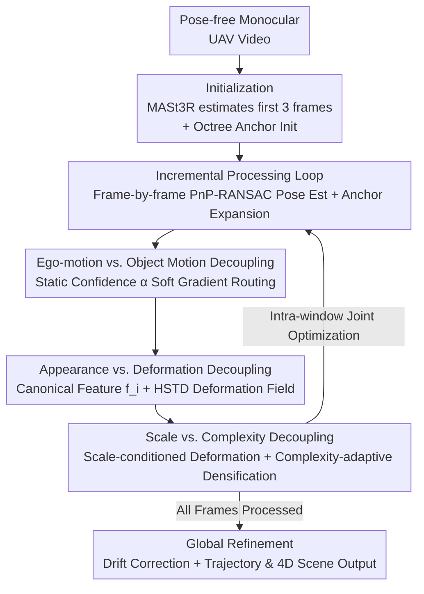

# AeroGS: Scale-Aware Gaussian Splatting for Pose-Free Dynamic UAV Scene Reconstruction

**Conference**: CVPR 2026  
**Paper**: [CVF Open Access](https://openaccess.thecvf.com/content/CVPR2026/html/Li_AeroGS_Scale-Aware_Gaussian_Splatting_for_Pose-Free_Dynamic_UAV_Scene_Reconstruction_CVPR_2026_paper.html)  
**Code**: Not available  
**Area**: 3D Vision  
**Keywords**: Gaussian Splatting, Pose-Free Reconstruction, Dynamic Scenes, UAV Video, Scale-Aware  

## TL;DR
AeroGS utilizes "Scale-Aware Spatio-Temporal Anchors" (S2A-Anchors) to **simultaneously** estimate camera trajectories and reconstruct dynamic 4D scenes containing moving objects from pose-free monocular UAV videos. By relying on three decoupling mechanisms (ego-motion vs. object motion, appearance vs. deformation, and scale vs. complexity) to stabilize joint optimization, it achieves SOTA performance in both rendering PSNR and trajectory accuracy on VisDrone, UAVDT, and KITTI datasets.

## Background & Motivation
**Background**: Reconstructing dynamic 3D scenes from monocular video is a core problem in VR/AR and robotic perception. The Unmanned Aerial Vehicle (UAV) perspective offers wide coverage, making it particularly suitable for large-scale scene reconstruction. However, 3D Gaussian Splatting (3DGS) typically requires accurate camera poses beforehand (usually from SfM/COLMAP).

**Limitations of Prior Work**: UAV footage possesses three critical characteristics. First, monocular capture is severely under-constrained regarding depth and geometry. Second, the presence of numerous small moving objects (pedestrians, vehicles)—often occupying only a few pixels—causes **extreme scale variations** spanning orders of magnitude, from coarse scales at high altitudes to fine scales at low altitudes. Third, long trajectories, low-texture areas, and rolling shutter effects cause SfM/SLAM to frequently fail, resulting in pose drift or total failure to solve.

**Key Challenge**: Dynamic scene modeling **requires** accurate poses, yet recovering poses **requires** the scene to be static/rigid. Existing methods are often forced into a trade-off: either "pose-free but assuming a static scene" (treating moving objects as outliers, which pollutes poses and geometry) or "dynamic reconstruction with known poses" (becoming unusable if SfM fails). A deeper complication is that pixel displacement of a dynamic object in monocular video is a **mixture** of its own motion and the camera's ego-motion; these two are entangled, causing optimizers to misattribute motion and converge to degenerate solutions.

**Goal**: To jointly solve camera trajectories and reconstruct both rigid and non-rigid dynamics from long UAV videos **without prior poses**.

**Key Insight**: The authors argue that the essence of the problem lies in the coupling of three groups of variables: ego-motion vs. object motion, static appearance vs. temporal deformation, and spatial scale vs. deformation complexity. Systematically decoupling these allows the joint optimization to stabilize.

**Core Idea**: The proposed Scale-Aware Spatio-Temporal Anchors (S2A-Anchors) serve as a unified primitive. Three decoupling mechanisms are used to separate the aforementioned coupled variables, enabling the joint optimization of poses and the dynamic scene within an incremental sliding window.

## Method

### Overall Architecture
The input to AeroGS is a pose-free monocular UAV video $\{I_t\}_{t=1}^{T}$, and the output is the camera trajectory $\{P_t\}$ along with a high-fidelity 4D dynamic scene. Built upon octree anchors, the core primitive is the S2A-Anchor: each anchor $A_i$ carries a time-invariant 32-dimensional canonical feature $f_i$ (encoding appearance and geometry), motion parameters $\theta_{dyn,i}$ (parameterizing velocity $v_i(t)$), a learnable static confidence $\alpha_i\in[0,1]$, and its scale $s_i$ within the octree.

The process follows an **incremental** frame-by-frame approach in three stages: (i) **Initialization**—MASt3R is used for the first $N_{init}=3$ frames to estimate poses and initialize S2A-Anchors from its point cloud and depth priors; (ii) **Incremental Frame Loop**—for each new frame $I_t$, the pose is estimated via PnP-RANSAC and refined photometrically, anchors are expanded, and poses/scene are jointly optimized within a local sliding window $W$, where all three decoupling mechanisms take effect; (iii) **Global Refinement**—a global optimization of all poses and anchors is performed after processing all frames to correct drift and ensure consistency. The three decoupling mechanisms are unified by a joint loss function.

### Key Designs

**1. Ego-motion vs. Object Motion Decoupling: Soft Gradient Routing via Static Confidence**

Addressing the fundamental issue of entangled ego-motion and object motion, each anchor is equipped with a lightweight Anchor Filter network. Inputting the canonical feature, positional encoding, and temporal encoding, it predicts a static confidence $\alpha_i = \mathrm{MLP}_{filter}(f_i, \gamma(\mu_i), \gamma(t))$, allowing the model to learn whether an anchor belongs to the static background.

The core is **soft gradient routing**: camera poses should only be constrained by static structures. The reconstruction loss $L_{recon}=L_{photo}+\lambda_d L_d$ is weighted by $\alpha_i$ to derive the static loss:

$$L_{static}=\sum_{t\in W}\sum_{i\in A}\alpha_i\cdot L_{recon}(t,A_i),$$

Consequently, the pose gradient $\nabla_{P_t}L_{static}=\sum_i \alpha_i\cdot\nabla_{P_t}L_{recon}$ is dominated by high-confidence (static) anchors, resulting in a "dynamics-free" pose gradient. Conversely, 3D motion flow $v_i(t)$ for dynamic anchors is constrained by a self-supervised **temporal cycle consistency loss**:

$$L_{cycle,i}(t,\Delta t)=\bigl\lVert \mu_i-(\mu_i+v_i(t)\Delta t - v'_{pred}\Delta t)\bigr\rVert_2^2,$$

weighted by $(1-\alpha_i)$ as $L_{motion}$. Its gradient is detached from the pose variables. An entropy regularization $L_{entropy}=\mathbb{E}_i[\alpha_i(1-\alpha_i)]$ forces $\alpha_i$ toward binary values.

**2. Appearance vs. Deformation Decoupling: Canonical Features for Appearance, HSTD for Temporal Changes**

Existing methods often mix static and dynamic information in the feature layer, which limits dynamic expressiveness and pollutes static appearance. AeroGS separates these in the **representation layer**: canonical features $f_i$ only handle appearance, mapped via a lightweight MLP decoder into frame-wise Gaussian attributes $\{c_t,o_t,s_t,q_t\}=D(f_i,t)$. All temporal dependencies are modeled as spatial deformations.

Temporal deformation $\Delta\mu_i(t)$ is predicted by the **HSTD (Hierarchical Spatio-Temporal Deformation)** module, guided by the coarse velocity prior $v_i$. It consists of B-spline temporal bases, $L$-level multi-scale control points, and motion-guided modulation. The final anchor position is a **softly differentiable blend**: $\tilde\mu_i(t)=\mu_i+(1-\alpha_i)\cdot\Delta\mu_{mod}(t)$. This ensures that static anchors ($\alpha_i\to1$) remain stationary while dynamic anchors ($\alpha_i\to0$) adopt the deformed positions.

**3. Scale vs. Complexity Decoupling: Scale-Conditioned Deformation + Complexity-Adaptive Densification**

To handle order-of-magnitude scale variations where fixed network capacity causes coarse-scale overfitting or fine-scale underfitting, two mechanisms are used. **Scale-conditioned deformation** modifies the control point network to be scale-aware: $P^{(l)}_i=F^{(l)}_{ctrl}(f_i,\gamma(t_{norm}),\gamma(s_i))$, suppressing non-rigid components at coarse scales and releasing capacity at fine scales. **Complexity-adaptive densification** defines motion complexity using temporal deformation variance:

$$\mathrm{complexity}(A_i)=\frac{1}{|W_t|}\sum_{t\in W_t}\bigl\lVert\Delta\mu_{mod,i}(t)-\overline{\Delta\mu}_{mod,i}\bigr\rVert_2^2,$$

If a threshold $\tau_{complex}$ is exceeded, eight child anchors are spawned to learn fine-grained residual deformations, allocating capacity where motion is most active.

### Loss & Training
The end-to-end joint loss unifies the mechanisms:

$$L_{total}=L_{static}+\lambda_{motion}L_{motion}+\lambda_{entropy}L_{entropy}+\lambda_{sparse}L_{sparse},$$

where $L_{sparse}=\sum_i(1-\alpha_i)$ encourages sparse dynamic anchors. Implementation is based on LongSplat, using 32-dim canonical features and 3-stage HSTD with 5 B-spline control points per stage. Training involves $K_\ell=400$ local iterations within the sliding window, $K_g=900$ global synchronization iterations every $N_{sync}=10$ frames, and a final refinement of $K_r=10000$ iterations on a single RTX 3090.

## Key Experimental Results

### Main Results
Testing on VisDrone, UAVDT, Au-air, and KITTI Odometry shows that AeroGS outperforms methods requiring **known poses** (4DGS, PVG, DeSiRe-GS) and **pose-free** methods (CF-3DGS, LongSplat), even without pose inputs.

| Dataset | Metric | AeroGS | Prev. Best | Gain |
|--------|------|--------|----------|------|
| VisDrone (Recon) | PSNR↑ | **29.40** | DeSiRe-GS 28.31 | +1.09 dB |
| VisDrone (NVS) | PSNR↑ | **28.56** | DeSiRe-GS 26.99 | +1.57 dB |
| UAVDT (Recon) | PSNR↑ | **27.77** | PVG 25.06 | +2.71 dB |
| UAVDT (NVS) | PSNR↑ | **26.07** | DeSiRe-GS 23.91 | +2.16 dB |

On KITTI, AeroGS significantly improves trajectory accuracy (ATE/RPE) and rendering quality:

| Method | PSNR↑ | LPIPS↓ | RPEt↓ | RPEr↓ | ATE↓ |
|------|-------|--------|-------|-------|------|
| LongSplat | 23.43 | 0.220 | 0.512 | 1.966 | 0.014 |
| **AeroGS** | **26.10** | **0.139** | **0.143** | **0.292** | **0.006** |

Compared to LongSplat, ATE is reduced by 57%, and RPEt by 72%. A naive concatenation (CF-3DGS+4DGS) failed optimization, confirming that explicit decoupling is essential.

### Ablation Study
Ablation on Au-air (cumulative losses):

| Configuration | PSNR↑ | SSIM↑ | LPIPS↓ |
|------|-------|-------|--------|
| $L_{static}$ only | 28.14 | 0.821 | 0.263 |
| + $L_{motion}$ | 30.21 | 0.862 | 0.192 |
| + $L_{entropy}$ | 30.83 | 0.874 | 0.186 |
| + $L_{sparse}$ (full) | **31.35** | **0.896** | **0.175** |

Ablation on UAVDT (cumulative modules):

| Configuration | PSNR↑ | SSIM↑ | LPIPS↓ |
|------|-------|-------|--------|
| Ego-Obj Decoupling only | 24.59 | 0.824 | 0.216 |
| + HSTD | 27.37 | 0.841 | 0.198 |
| + Scale-Comp (full) | **27.77** | **0.852** | **0.185** |

### Key Findings
- **All Three Decouplings are Essential**: Ego-Obj decoupling addresses the foundational "motion ambiguity" issue; HSTD provides the largest rendering gain (+2.78 dB on UAVDT); Scale-Comp is particularly effective for scenes with extreme altitude changes.
- **Pose-Free Surpasses Posed**: AeroGS exceeds methods using GT poses, suggesting that joint optimization effectively mitigates pose uncertainty rather than being hindered by it.
- **Clean Static/Dynamic Separation**: Visualizations show that while baselines suffer from "ghosting" (motion bleeding into static layers), AeroGS achieves clean isolation via soft gradient routing.

## Highlights & Insights
- **Soft Gradient Routing**: Using a learnable scalar $\alpha_i$ as both a "static classifier" and a "gradient valve" allows an elegant separation of pose and motion constraints.
- **Self-Supervised 3D Flow**: Cycle consistency on 3D anchor velocities removes the need for external optical flow labels.
- **Scale as a First-Class Citizen**: Feeding physical scale $s_i$ directly into the deformation network prevents overfitting at coarse scales while enabling high-fidelity modeling at fine scales.

## Limitations & Future Work
- **Extreme Dynamics**: Highly erratic motion or cluttered scenes can lead to performance degradation.
- **Computational Cost**: The overhead of Gaussian Splatting hinders real-time deployment for large-scale scenes.
- **Initialization Reliance**: The method depends on MASt3R for initial poses; failures in the first few frames could cause the entire incremental optimization to drift.

## Related Work & Insights
- **vs. Pose-Free Static 3DGS**: Methods like LongSplat assume rigid scenes and treat motion as outliers, leading to biased poses and geometry. AeroGS explicitly models dynamics to protect poses.
- **vs. Known-Pose Dynamic Reconstruction**: Baselines like 4DGS rely on SfM, which fails in low-texture UAV sequences. AeroGS remains robust without pose inputs.
- **vs. Naive Concatenation**: Simply combining pose-free estimation with 4DGS (CF-3DGS+4DGS) leads to failure, proving that explicit triple decoupling is required for convergence.

## Rating
- Novelty: ⭐⭐⭐⭐⭐ 
- Experimental Thoroughness: ⭐⭐⭐⭐ 
- Writing Quality: ⭐⭐⭐⭐ 
- Value: ⭐⭐⭐⭐⭐ 

<!-- RELATED:START -->

## Related Papers

- [\[CVPR 2026\] E2EGS: Event-to-Edge Gaussian Splatting for Pose-Free 3D Reconstruction](e2egs_event-to-edge_gaussian_splatting_for_pose-free_3d_reconstruction.md)
- [\[CVPR 2026\] Bringing a Personal Point of View: Evaluating Dynamic 3D Gaussian Splatting for Egocentric Scene Reconstruction](bringing_a_personal_point_of_view_evaluating_dynamic_3d_gaussian_splatting_for_e.md)
- [\[CVPR 2026\] MimiCAT: Mimic with Correspondence-Aware Cascade-Transformer for Category-Free 3D Pose Transfer](mimicat_mimic_with_correspondence-aware_cascade-transformer_for_category-free_3d.md)
- [\[CVPR 2026\] LASER: Layer-wise Scale Alignment for Training-Free Streaming 4D Reconstruction](laser_layer-wise_scale_alignment_for_training-free_streaming_4d_reconstruction.md)
- [\[CVPR 2026\] ClipGStream: Clip-Stream Gaussian Splatting for Any Length and Any Motion Multi-View Dynamic Scene Reconstruction](clipgstream_clip-stream_gaussian_splatting_for_any_length_and_any_motion_multi-v.md)

<!-- RELATED:END -->
