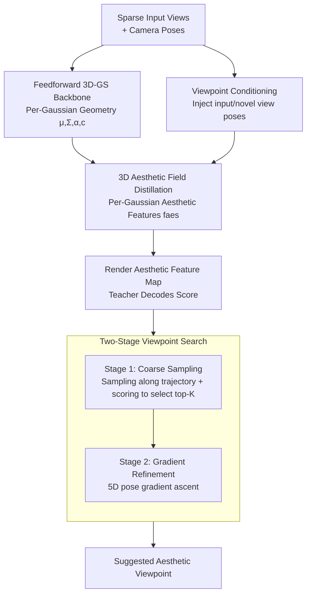

# Aesthetic Camera Viewpoint Suggestion with 3D Aesthetic Field

**Conference**: CVPR 2026  
**Paper**: [CVF Open Access](https://openaccess.thecvf.com/content/CVPR2026/html/Tang_Aesthetic_Camera_Viewpoint_Suggestion_with_3D_Aesthetic_Field_CVPR_2026_paper.html)  
**Code**: To be confirmed  
**Area**: 3D Vision / Computational Photography  
**Keywords**: 3D Aesthetic Field, 3D Gaussian Splatting, Feature Distillation, Viewpoint Suggestion, Composition Aesthetics

## TL;DR
This paper proposes the "3D Aesthetic Field"—employing a feedforward 3D Gaussian Splatting network to distill high-level knowledge from a pre-trained 2D aesthetic model into per-Gaussian aesthetic features. Consequently, using only a sparse set of photos, the model can predict the composition aesthetics of any novel viewpoint in 3D space. Combined with a two-stage "coarse sampling + gradient refinement" search, it efficiently suggests the most visually appealing shooting viewpoints, avoiding the dilemma of either local fine-tuning on a single image or brute-force exploration via dense acquisition and reinforcement learning.

## Background & Motivation
**Background**: Whether a photo looks appealing depends heavily on the camera viewpoint. In the same 3D scene, changing the angle can turn a "mediocre" shot into a "stunning" one, because spatial relationships and perspectives alter with the viewer's position. Therefore, aesthetics are inherently "3D-dependent". Teaching machines to behave like photographers—"scanning the scene from a few angles, establishing an aesthetic map in their mind, and predicting how the frame changes with a new perspective"—is highly valuable for personal photography, VR/AR viewpoint planning, and autonomous UAV/robot filming.

**Limitations of Prior Work**: Existing solutions fall into two categories, each with critical drawbacks. One is **single-view fine-tuning**: predicting limited camera translation/rotation from a single image (e.g., Su, Li, UNIC) or using outpainting/image-to-video generation to "hallucinate" a larger field of view (Uchida, Yao). The former lacks scene geometry awareness, confining its inference to a small neighborhood around the anchor view. The latter relies on hallucinated content, failing to guarantee consistency with the real scene geometry. Neither can perform 3D-reasoning-required actions, such as moving an object in or out of the frame for better composition. The other is **3D exploration**: directly searching for optimal viewpoints in real or simulated 3D environments using reinforcement learning or genetic algorithms (AutoPhoto, GAIT, ViewActive, Skartados, etc.). However, they either require dense, high-quality capture or pre-built 3D assets (simulators, pre-trained NeRFs), resulting in high construction costs. Moreover, RL requires iterative step-by-step exploration in the environment, which is computationally expensive and demands physical adjustments of a real camera.

**Key Challenge**: To be "geometry-aware" requires dense capture and expensive search; to "minimize capture" restricts the method to geometry-agnostic local fine-tuning on a single image. There exists a fundamental trade-off between **geometry awareness** and **sparse inputs with efficient inference**.

**Goal**: Under the premise of sparse observations, to construct a representation that is both grounded in scene geometry and capable of reasoning about aesthetic changes across viewpoints. This turns "finding the optimal viewpoint" into a differentiable optimization problem, avoiding iterative exploration and dense capture from RL.

**Key Insight**: The authors notice that recent works successfully distill 2D semantic features into a 3D Gaussian field for segmentation, showing that "importing 2D knowledge into a 3D representation" is feasible. However, semantic features are largely viewpoint-invariant, whereas aesthetic information is inherently viewpoint-dependent, which has not yet been explored. Hence, the authors extend this distillation paradigm to aesthetics.

**Core Idea**: To learn a **3D Aesthetic Field**—using feedforward 3D Gaussian Splatting (3D-GS) to distill a pre-trained 2D aesthetic model into per-Gaussian aesthetic features. Consequently, the aesthetic quality of any novel viewpoint can be differentiably rendered and evaluated, and a two-stage search replaces RL to efficiently locate the optimal viewpoint.

## Method

### Overall Architecture
The method consists of two major components: "field construction" and "viewpoint search". **Field construction**: Given sparse input views and their camera poses, a feedforward 3D Gaussian Splatting backbone (DepthSplat) is first used in a single forward pass to regress per-Gaussian geometric parameters (means $\mu$, covariances $\Sigma$, opacities $\alpha$, colors $c$). On top of this, a lightweight aesthetic branch is attached to distill intermediate features of a pre-trained 2D aesthetic teacher model (VEN) into per-Gaussian aesthetic embeddings $f_{aes}$. Consequently, any novel viewpoint can render aesthetic features into a feature map using the same rasterization process as RGB rendering, which is then fed into the remaining layers of the teacher model to decode the aesthetic score. This step establishes a continuous, differentiable, and geometry-grounded mapping from "camera pose $\rightarrow$ aesthetic score", termed the 3D Aesthetic Field. **Viewpoint search**: A two-stage coarse-to-fine search is executed within this field. First, a set of candidate viewpoints is coarsely sampled along the input trajectory, scored, and the top-K are selected. Then, gradient-based pose refinement is performed on the candidates to output the final suggested viewpoint.

### Key Designs

**1. 3D Aesthetic Field Distillation: Shifting from "Pixel Scoring" to "Feature Reasoning" to Stabilize the Aesthetic Landscape**

The most naive approach would be to render novel views using feedforward 3D-GS and directly evaluate the rendered images using a pre-trained aesthetic model. However, the authors point out two fatal flaws of this "direct RGB scoring" approach. First, aesthetic models are extremely sensitive to minor pixel perturbations—where adjacent viewpoints have almost identical content, yet their scores fluctuate wildly (for example, in Fig.3(c) of the paper, the scores of two nearly identical frames jump from $0.23$ to $-1.12$). The root cause is that existing aesthetic datasets lack annotations for "adjacent viewpoints," meaning the model has never encountered such continuous variations during training. Second, novel view renderings naturally contain artifacts such as noise or blur. These low-level artifacts mislead the aesthetic model and bias the optimization.

The authors' solution is to move the scoring from the pixel level to the feature level: selecting an intermediate layer (VEN layer 23, $14\times14\times512$) of the teacher network as the distillation target, and training the model to predict per-Gaussian aesthetic embeddings $f_{aes}$, which are then decoded into scores by the remaining layers of the teacher. Specifically, three lightweight modules are added on top of the backbone: a CNN aesthetic encoder (taken directly from the teacher's feature extraction layers), an aesthetic DPT head, and a transformer downsampler. The aesthetic encoder extracts multi-scale aesthetic features $\{F^i_{aes}\}$ from the input images, which are fused with the backbone's multi-view features $\{F^i_{mv}\}$ and processed by the DPT head to regress $f_{aes}$. This $f_{aes}$, along with the geometric properties $(\mu,\Sigma,\alpha)$, is rasterized into an aesthetic feature map $\hat F_{pred}$ of the novel view. To reduce storage and rasterization overhead, $f_{aes}$ is compressed to **32 dimensions** (instead of the teacher's 512 dimensions), and the transformer downsampler is used to align it with the "smaller and deeper" teacher feature map $F_{gt}$, yielding the final prediction $F_{pred}$. During training, the entire backbone (multi-view transformer, DPT head, aesthetic encoder) is frozen to maintain consistent geometry and 2D aesthetic perception. Only the newly added modules are trained end-to-end using an MSE loss between the rendered feature map $F_{pred}$ and the teacher ground truth $F_{gt}$ on held-out views. Reasoning within the feature space is effective because it is more robust to low-level artifacts and implicitly enforces multi-view spatial consistency. Consequently, the aesthetic landscape becomes smooth, and adjacent viewpoint scores no longer fluctuate randomly (and this smoothness is not artificially introduced through window-based smoothing, which would require arbitrary choices of window size and smoothing intensity without a principled basis). This smoothness is precisely the prerequisite for stable gradient ascent later.

**2. Viewpoint Conditioning: Explicitly Encoding Viewpoint-Dependent Aesthetics**

While semantic features are mostly viewpoint-invariant, aesthetics are viewpoint-dependent—the same set of Gaussians possesses different aesthetic appeal when viewed from different poses. Without informing the model of the current observation pose, it cannot characterize this dependency. Therefore, the authors inject the camera pose as a condition both at the input views and the novel views, allowing the aesthetic representation to explicitly vary with the viewpoint. Ablations show that this feature significantly improves the accuracy of novel-view aesthetic prediction (see Tab.4), indicating that explicitly modeling viewpoint dependency is key to capturing cross-view aesthetic cues, rather than a trivial trick.

**3. Two-Stage Coarse-to-Fine Search: Replacing RL Exploration with Differentiable Optimization**

With a continuous and differentiable aesthetic field, "finding the optimal viewpoint" becomes a differentiable optimization problem. However, directly performing gradient ascent in the entire viewpoint space is prone to local minima and is highly inefficient. Therefore, the authors design a two-stage pipeline. **Stage 1 (Coarse Sampling)**: The camera positions and orientations of the sparse input views are first interpolated to form a smooth trajectory covering the primary observed regions of the scene. Candidates are linearly sampled along this trajectory (16 points uniformly per segment). Around each sample point, a neighborhood of camera poses is generated with small planar translations and orientation perturbations (8 cameras per point) to enable local exploration while maintaining focus on the scene. Each candidate renders features through the aesthetic field to be decoded and scored. The top-K candidates are selected, and a distance-based deduplication check is applied to filter out redundant candidates to maintain diversity (default top-2). **Stage 2 (Gradient Refinement)**: Starting from the selected candidates, the camera poses are updated via gradient ascent along the direction of the aesthetic score: $\mathbf{P}_{t+1}=\mathbf{P}_{t}+\eta\nabla_{\mathbf{P}}\,score(\mathbf{P}_t)$ (where $\eta$ is the step size, implemented using Adam with a step size of $0.01$ and 25 iterations). The optimization is performed on a **5D** vector—3D translation + yaw + pitch, since camera roll is rarely adjusted in daily shooting. Because the aesthetic field provides a smooth score landscape, this gradient ascent converges stably. In contrast, the direct RGB scoring landscape is extremely rugged, causing gradient updates to frequently deteriorate the results (see Tab.3).

## Key Experimental Results

The dataset consists of RealEstate10k (RE10k, mostly indoor videos) and DL3DV (more diverse scenes), both containing per-frame camera parameters. DepthSplat is used as the backbone, and VEN is used as the aesthetic teacher. During training, 2 input views are randomly sampled for RE10k, and 2–6 views are sampled for DL3DV.

### Main Results

**Novel View Aesthetic Prediction (Evaluating the Aesthetic Field itself)**: The correlation with the teacher ground truth scores is calculated using PLCC/SRCC, comparing against the "Direct RGB Scoring" baseline. The table below shows the results at $256\times256$ resolution. Ours is significantly higher than the baseline across all settings, and the correlation improves as the number of input views increases.

| Dataset | # Input Views | Method | PLCC | SRCC |
|--------|----------|------|------|------|
| RE10k | 2 | Baseline | 0.657 | 0.628 |
| RE10k | 2 | **Ours** | **0.780** | **0.740** |
| RE10k | 6 | Baseline | 0.745 | 0.701 |
| RE10k | 6 | **Ours** | **0.836** | **0.794** |
| DL3DV | 2 | Baseline | 0.326 | 0.307 |
| DL3DV | 2 | **Ours** | **0.509** | **0.477** |
| DL3DV | 6 | Baseline | 0.580 | 0.553 |
| DL3DV | 6 | **Ours** | **0.753** | **0.719** |

**Aesthetic Viewpoint Suggestion**: Scoring the suggested viewpoints using VEN and SAMPNet, comparing against the RGB scoring baseline, single-view approximations (In-plane Shift, Rotation as approximate upper bounds of non-open-source single-view methods), and open-source methods like UNIC and Uchida et al. Ours dominates across all datasets, input view counts, and metrics.

| Dataset | Method | 2-view VEN↑ | 4-view VEN↑ | 6-view VEN↑ |
|--------|------|-----------|-----------|-----------|
| RE10k | Baseline | 1.48 | 1.79 | 2.01 |
| RE10k | Rotation* | 1.78 | 1.95 | 2.13 |
| RE10k | Uchida et al.† | 1.58 | 1.89 | 2.13 |
| RE10k | **Ours** | **1.89** | **2.03** | **2.20** |
| DL3DV | Rotation* | 2.52 | 2.67 | 2.85 |
| DL3DV | **Ours** | **2.56** | **2.76** | **2.91** |

(* represents an approximation of non-open-source single-view methods. The authors note that it directly maximizes the target score, equivalent to an upper bound for such methods, yet is still outperformed by ours; † represents open-source methods adapted to this setting.)

### Ablation Study

| Configuration | Dataset | PLCC | SRCC | Description |
|------|--------|------|------|------|
| w/o Viewpoint Conditioning | RE10k | 0.732 | 0.695 | Removing pose conditioning |
| w/ Viewpoint Conditioning | RE10k | **0.796** | **0.758** | Full Model (4 Input Views) |
| w/o Viewpoint Conditioning | DL3DV | 0.658 | 0.625 | Removing pose conditioning |
| w/ Viewpoint Conditioning | DL3DV | **0.700** | **0.668** | Full Model |

| Dimension | Value | RE10k | DL3DV | Description |
|------|------|-------|-------|------|
| Number of Candidates K | 1 | 1.96 | 2.57 | VEN↑ |
| Number of Candidates K | 2 | 2.03 | 2.76 | Default, Gain Saturates |
| Number of Candidates K | 3 | 2.05 | 2.78 | Diminishing Returns |
| Refinement Steps | 15 | 0.21 | 0.15 | ΔVEN↑ |
| Refinement Steps | 25 | 0.46 | 0.43 | Default, Gain Saturates |
| Refinement Steps | 30 | 0.49 | 0.45 | Diminishing Returns |

Additionally, the gradient ascent analysis (Tab.3) shows that starting from the same random initial viewpoint and running 25 gradient ascent steps, the average score improvement $\Delta$VEN of ours is $0.46$/$0.43$ on RE10k/DL3DV, whereas the RGB scoring baseline only achieves $0.20$/$0.18$ and often suffers from unstable updates that degrade the quality.

### Key Findings
- **Feature distillation providing a stable optimization landscape is the crux of the paper**: Direct RGB scoring yields only ~0.2 improvement under gradient ascent and often degrades, whereas ours doubles this to ~0.45. This proves that mapping aesthetics into feature space implicitly smooths the score landscape.
- **Viewpoint conditioning provides clear contributions**: Removing it drops the PLCC from 0.796 to 0.732 on RE10k, and from 0.700 to 0.658 on DL3DV, showing that explicitly modeling viewpoint dependency is essential.
- **Search parameters saturate quickly**: Setting the candidate count K=2 and refinement steps to 25 yields diminishing returns for any further increases. Thus, these are chosen as defaults, verifying the efficiency of the two-stage search.
- **The sparser the input, the larger the performance gap**: Ours shows the most prominent advantage over single-view methods when only 2 input views are available (e.g., RE10k VEN score of 1.89 vs. 1.78 for Rotation approximation). As the number of views increases, single-view methods can also explore larger neighborhoods, narrowing the gap.

## Highlights & Insights
- **Framing "aesthetics as 3D-related" is highly effective**: Elevating viewpoint selection from 2D post-processing / local fine-tuning to a geometry-grounded 3D differentiable optimization problem opens up a new direction for "3D-aware aesthetic modeling."
- **The logic from diagnosis to solution is extremely clear**: The paper empirically demonstrates why "direct RGB scoring" is unstable (noting pixel sensitivity and rendering artifacts as two distinct causes, with quantitative proof in Fig.3), and then targets these issues with feature distillation. The logical loop is sound and convincing.
- **Transferable trick**: Reusing "per-Gaussian properties + the same rasterization" for a non-RGB target quantity (aesthetic features here) serves as a general recipe for "distilling any 2D evaluator into a 3D Gaussian field." This can similarly be applied to other viewpoint-dependent subjective qualities, such as playability, saliency, or readability.
- **Practical engineering choice in 5D pose parameterization**: Optimizing only translation + yaw + pitch, while discarding the rarely-used roll, fits practical shooting habits perfectly while effectively reducing the search space depth.

## Limitations & Future Work
- **Reliance on camera poses for field construction**: The method requires camera poses for input views (obtainable via COLMAP or built-in phone/UAV sensors). The authors acknowledge that a pose-free variant would widen applicability, which could be realized with recent pose-free techniques.
- **Aesthetic field quality is bounded by the reconstructed geometry**: Quality depends on the capability of the backbone and the input coverage. The former can be solved by upgrading to stronger geometric backbones, and the latter via viewpoint selection to ensure coverage.
- **Search space is constrained by the initial observations**: The search is restricted to regions supported by the initial observations. The authors suggest adding an "active perception loop" to actively capture more views in promising directions to extend the aesthetic field and search space.
- **A caveat in evaluation (Own observation)**: Since there is no off-the-shelf benchmark for viewpoint-dependent aesthetics, the authors construct "pseudo-ground truth" from dense reconstructions and evaluate using the VEN/SAMPNet models themselves. However, the teacher scores themselves can fluctuate in adjacent views. Thus, these numerical improvements are better viewed as relative indicators of "stability/fidelity" rather than absolute accuracy (which the authors also explicitly note).

## Related Work & Insights
- **vs. Single-view fine-tuning (UNIC, Su, Li, Uchida, Yao)**: These methods predict limited camera movement from a single image or "hallucinate" a wider field of view using outpainting/generative models. Ours, in contrast, explicitly constructs a geometry-grounded 3D aesthetic field. The difference lies in our ability to perform genuine parallax changes and compose adjustments (e.g., moving objects in/out of the frame) across observed views, ensuring consistency with the real scene geometry. The downside is requiring sparse multi-view inputs and camera poses instead of a single image.
- **vs. 3D Exploration (AutoPhoto, GAIT, ViewActive, Skartados)**: These methods iteratively explore real or simulated environments via RL or genetic algorithms, requiring dense capture or pre-built 3D assets, which incur high physical movement costs. Ours infers the aesthetic field feedforwardly from sparse observations and searches "virtually" and differentiably within the field, eliminating RL exploration and dense capture.
- **vs. 3D Gaussian Feature Distillation (Semantic Segmentation)**: Prior works distill viewpoint-invariant semantic features into Gaussian fields. Ours extends this paradigm to viewpoint-dependent aesthetic features, tackling the unique challenge of "aesthetics changing with perspective" via viewpoint conditioning—a problem not faced by semantic distillation.

## Rating
- Novelty: ⭐⭐⭐⭐⭐ Proposes the 3D aesthetic field for the first time, distilling viewpoint-dependent aesthetics into a Gaussian field, initiating a new task/direction.
- Experimental Thoroughness: ⭐⭐⭐⭐ Two datasets, multiple input counts, various baselines + comprehensive ablation and gradient analysis. However, due to the lack of real human evaluation benchmarks, most metrics are relative.
- Writing Quality: ⭐⭐⭐⭐⭐ The logic chain of motivation-diagnosis-design-verification is clean, with excellent supporting figures and tables.
- Value: ⭐⭐⭐⭐ High practical potential for computational photography, VR/AR viewpoint planning, and autonomous UAV camera control. The strategy is also transferable to other viewpoint-dependent subjective qualities.

<!-- RELATED:START -->

## Related Papers

- [\[CVPR 2026\] MajutsuCity: Language-driven Aesthetic-adaptive City Generation with Controllable 3D Assets and Layouts](majutsucity_language-driven_aesthetic-adaptive_city_generation_with_controllable.md)
- [\[CVPR 2026\] Coverage Optimization for Camera View Selection](coverage_optimization_for_camera_view_selection.md)
- [\[CVPR 2026\] Uncertainty-driven 3D Gaussian Splatting Active Mapping via Anisotropic Visibility Field](uncertainty-driven_3d_gaussian_splatting_active_mapping_via_anisotropic_visibili.md)
- [\[CVPR 2026\] Context-Nav: Context-Driven Exploration and Viewpoint-Aware 3D Spatial Reasoning for Instance Navigation](context-nav_context-driven_exploration_and_viewpoint-aware_3d_spatial_reasoning_.md)
- [\[CVPR 2026\] Unsupervised 3D Motion Estimation Using Event Camera](unsupervised_3d_motion_estimation_using_event_camera.md)

<!-- RELATED:END -->
