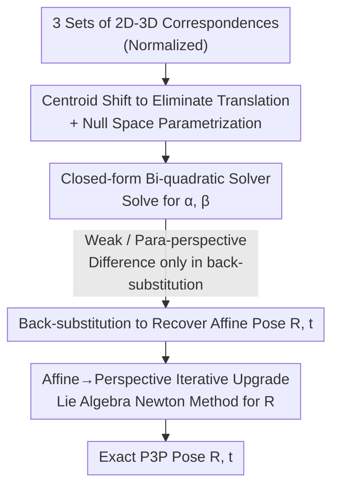

# Affine Perspective-Three-Point Problem

**Conference**: CVPR 2026  
**Paper**: [CVF Open Access](https://openaccess.thecvf.com/content/CVPR2026/html/Nakano_Affine_Perspective-Three-Point_Problem_CVPR_2026_paper.html)  
**Code**: None  
**Area**: 3D Vision / Geometric Minimal Solvers  
**Keywords**: P3P, Camera Pose, Affine Camera, Weak Perspective, Para-perspective  

## TL;DR
This paper frames the classic P3P (Perspective-Three-Point) problem within weak-perspective and para-perspective affine camera models. It derives a closed-form minimal solver requiring only a **bi-quadratic equation**, followed by a lightweight iterative upgrade to "refine" the affine solution into an exact perspective solution. This two-step approach matches the accuracy of SOTA exact P3P solvers while being faster.

## Background & Motivation

**Background**: P3P (Perspective-Three-Point) is the **minimal problem** of estimating camera pose from three 2D–3D correspondences, serving as the core minimal solver for RANSAC in SfM, Visual SLAM, and robot navigation. Classic approaches treat the distances from the camera to the three 3D points as unknowns and use the law of cosines, resulting in a **quartic polynomial**. Later methods reformulated P3P as the intersection of two quadratic curves (cubic + quadratic) to improve stability and speed. As a RANSAC kernel, P3P solvers prioritize numerical stability and computational speed.

**Limitations of Prior Work**: Exact P3P inevitably requires solving cubic or quartic equations. Solving a quartic equation is inherently more complex than a quadratic one, prone to complex roots and degenerate cases, and requires careful handling of discriminants and numerical stability. The question arises: can a **simpler equation** be solved under certain imaging conditions?

**Key Challenge**: Perspective projection is **inherently non-linear** due to the division by point-wise depth $z_i^c$, which is the root cause of the high degree in P3P. However, under "distant view + small relative scene depth change" conditions, affine camera models (weak-perspective, para-perspective) approximate depth with a constant $z_i^c \approx z_0$, turning the projection into a linear mapping. Once non-linearity is removed, the degree of the equations is expected to decrease.

**Goal**: (1) Derive a direct closed-form minimal solver for P3P under affine camera models. (2) Since affine models are only valid for small depth variations, provide an iterative upgrade to refine the affine solution into an exact P3P solution, building a smooth "affine → perspective" bridge.

**Key Insight**: The author discovered that weak-perspective and para-perspective **share the same derivation framework**—centroid translation + null space parametrization—and both collapse into the same type of bi-quadratic (quartic but with only even-degree terms) equation. The only difference between the models is a single back-substitution step. Bi-quadratic equations can be solved directly using the quadratic formula, avoiding complex numbers by checking the sign of the discriminant, making real root recovery simple and stable.

**Core Idea**: Replace "directly solving quartic/cubic exact P3P" with "solving a bi-quadratic equation via affine approximation + iterative upgrade to restore perspective accuracy."

## Method

### Overall Architecture

The input is a set of three 2D–3D correspondences $\{m_i \leftrightarrow X_i\}_{i=1,2,3}$ (image points normalized by intrinsics), and the output is the camera rotation $R$ and translation $t$. The pipeline consists of two stages: **first, solving for an initial pose in a closed-form using an affine model** (either weak-perspective or para-perspective, both reducing to a bi-quadratic equation), **then using iterative upgrade to refine this affine solution into an exact perspective P3P solution**. The affine stage provides a "cheap, good starting point," while the upgrade stage "restores perspective accuracy."

### Key Designs

**1. Centroid Translation + Null Space Parametrization: Reducing Affine P3P to Two Unknowns**

Affine projection is a linear mapping, and the projection of the object centroid $X_g = \frac{1}{3}\sum X_i$ equals the image point centroid $m_g = \frac{1}{3}\sum m_i$. Exploiting this, the author subtracts the respective centroids from image and 3D points ($\hat m_i = m_i - m_g$, $\hat X_i = X_i - X_g$), eliminating the translation $t$ and leaving only rotation-related variables. For weak-perspective, let $p = \frac{1}{z_0} r_1$ and $q = \frac{1}{z_0} r_2$. Using two sets of centered correspondences, four linear constraints are derived: $p^Ta_1=1, p^Ta_2=0, q^Ta_1=0, q^Ta_2=1$, where $[a_1\ a_2]=[\hat X_1\ \hat X_2][\hat m_1\ \hat m_2]^{-1}$.

By formulating these constraints in matrix form, the unknown vectors $[p^T,1]^T$ and $[q^T,1]^T$ reside in the null space of two $2\times4$ coefficient matrices. These matrices share the same first $2\times3$ part, thus **sharing the same null space vector $n_1$**. The author manually derives three null space vectors $n_1, n_2, n_3$, and after Gram–Schmidt orthogonalization and normalization, obtains a clean parametrization:

$$
\begin{bmatrix}p\\1\end{bmatrix}=\alpha\begin{bmatrix}v_1\\0\end{bmatrix}+\begin{bmatrix}v_2\\1\end{bmatrix},\qquad
\begin{bmatrix}q\\1\end{bmatrix}=\beta\begin{bmatrix}v_1\\0\end{bmatrix}+\begin{bmatrix}v_3\\1\end{bmatrix}.
$$

The affine P3P is thus compressed into **two scalar unknowns $\alpha, \beta$**, where $v_1, v_2, v_3$ satisfy $v_1^Tv_2=v_1^Tv_3=0, \|v_1\|=1$, which is key to collapsing the problem into a bi-quadratic equation. The derivation is **identical** for weak and para-perspective up to this point, with only the definitions of $p, q$ differing.

**2. Closed-form Solution for $\alpha, \beta$ via Bi-quadratic Equation: Replacing Quartic/Cubic Equations**

With the $\alpha, \beta$ parametrization, orthogonality constraints $R^TR=I$ are applied. Under weak-perspective, $r_1\perp r_2$ ($p^Tq=0$) yields $\alpha\beta + v_2^Tv_3 = 0$, and $\|r_1\|=\|r_2\|$ ($\|p\|^2=\|q\|^2$) yields $\alpha^2-\beta^2+\|v_2\|^2-\|v_3\|^2=0$. Solving for $\beta$ and substituting gives the **bi-quadratic equation**:

$$
\alpha^4 + \big(\|v_2\|^2-\|v_3\|^2\big)\alpha^2 - \big(v_2^Tv_3\big)^2 = 0.
$$

Since it contains only even powers, it is solved using the **quadratic formula** for $\alpha^2$, yielding up to four real roots. Real roots are recovered efficiently by checking the discriminant. Rotation is recovered via $r_1, r_2, r_3$, and translation via $t=z_0[m_g^T,1]^T-RX_g$.

Para-perspective is slightly more complex as its projection includes an $r_3$ correction term. However, by eliminating $z_0^2$, it **similarly collapses into a bi-quadratic equation**. The primary difference lies in the coefficients and the back-substitution step, where a $3\times3$ linear system is solved to recover $r_3$ before $r_1, r_2$.

**3. Affine→Perspective Iterative Upgrade: Lie Algebra Newton Method on SO(3)**

The affine solution assumes constant depth, which leads to lower accuracy for perspective cameras, especially with large depth variations. The author adopts Ke et al.'s exact P3P formulation: $c_{ij}^T R d_{ij}=0$. Starting from the affine $R$, the solution is refined to satisfy these constraints.

The upgrade uses a **Newton method with small-angle approximation**: incremental rotation is $\Delta R\approx I+[\Delta r]_\times$. Solving a $3\times3$ linear system yields $\Delta r$, and the update is $R\leftarrow\exp([\Delta r]_\times)R$. This approach is computationally cheap and **guarantees the rotation remains on SO(3)** at every step, allowing for safe early stopping.

## Key Experimental Results

Experiments were implemented in MATLAB, compared against the SOTA exact P3P solver **Ding**. Notation: `Weak`/`Para` denote affine solvers, with subscripts indicating upgrade iterations (`Weak0` is pure affine, `Para2` is para-perspective + 2 iterations).

### Main Results

Recall, execution time, and RANSAC iterations on EPOS (small depth variation, 6D pose) and IMC2023 (large depth variation, outdoor SfM):

| Dataset | Method | Recall (Strict) | Recall (Loose) | Total Time (min)↓ | Total Iters (×10⁶)↓ |
|--------|------|------|------|------|------|
| EPOS | Ding+LO | 8.3 (2°/2%) | 36.8 (5°/5%) | 14.1 | 2.32 |
| EPOS | Para2+LO | 8.5 | 37.1 | 14.7 | 2.32 |
| EPOS | Weak2+LO | 8.4 | 37.1 | 14.6 | 2.32 |
| EPOS | Para0+LO | 7.9 | 37.0 | 13.4 | 2.33 |
| EPOS | Weak0+LO | 7.7 | 36.5 | 11.9 | 2.41 |
| IMC2023 | Ding+LO | 25.1 (0.5°/1%) | 51.9 (3°/3%) | 38.0 | 1.51 |
| IMC2023 | Para2+LO | 25.1 | 51.7 | 38.9 | 1.52 |
| IMC2023 | Weak2+LO | 25.0 | 51.9 | 39.2 | 1.52 |
| IMC2023 | Para0+LO | 23.4 | 50.7 | 44.3 | 1.91 |
| IMC2023 | Weak0+LO | 23.5 | 50.7 | 44.6 | 2.00 |

`Weak2`/`Para2` match Ding's recall almost exactly. On the small-depth-variation EPOS dataset, even pure affine `Para0` is effective. On IMC2023, pure affine solvers lag significantly behind Ding.

### Synthetic Data: Single Execution Time (μs)

| Method | Ding | Weak0 | Weak1 | Weak2 | Para0 | Para1 | Para2 |
|------|------|-------|-------|-------|-------|-------|-------|
| Time (μs) | 50.1 | 40.3 | 44.2 | 45.5 | 42.0 | 46.7 | 48.1 |

Affine solvers are faster than Ding: `Weak1` is ~10% faster, and `Weak2` is ~4% faster, **matching accuracy while saving time**.

### Key Findings
- **Iterative upgrade is the key to accuracy**: While `Weak0`/`Para0` are sensitive to depth variation, **two upgrade steps** make their error curves nearly identical to Ding.
- **2 steps are sufficient**: The affine starting point is close enough to the exact solution that 2 iterations achieve full perspective accuracy.
- **Pure affine is only for specific scenes**: In RANSAC experiments with large depth variations, `Weak0`/`Para0` convergence rates drop significantly as outliers increase.

## Highlights & Insights
- **Elegant unified framework**: Weak and para-perspective models share the same derivation skeleton, differing only in the final back-substitution.
- **Order reduction via linearization**: Affine models remove the non-linearity of depth division, reducing the P3P degree from four to a bi-quadratic form solvable by the quadratic formula.
- **SO(3)-preserving upgrade**: Iterating on the Lie algebra ensures a valid rotation at every step, providing significant engineering robustness.

## Limitations & Future Work
- Pure affine solvers (`Weak0`/`Para0`) are only practical for **small depth variation** scenes; large variations necessitate iterative refinement.
- Comparison was limited mainly to the Ding solver.
- Lack of datasets for ultra-zoom or telecentric cameras was noted.
- Future work intends to apply this affine simplification to more complex problems like P4Pfr or multi-view geometry.

## Related Work & Insights
- **vs Ding (SOTA)**: Ding solves P3P exactly via a cubic-quadratic combination. Ours solves a simpler bi-quadratic equation then refines, **matching accuracy while being 4–10% faster**.
- **vs Classic Quartic P3P**: Classic methods solve for distances using quartic polynomials. Ours avoids these, solving only bi-quadratic equations for better numerical stability.
- **vs SLAM Joint Optimization**: SLAM typically optimizes $[\Delta r, t] \in \mathbb{R}^6$ in a $6\times6$ system. Ours optimizes only rotation in a $3\times3$ system, which is more efficient.

## Rating
- Novelty: ⭐⭐⭐⭐ Reintroducing affine models to P3P and reducing them to bi-quadratic forms is a clean, unique perspective.
- Experimental Thoroughness: ⭐⭐⭐⭐ Broad coverage of synthetic and real data, though more baselines beyond Ding would be ideal.
- Writing Quality: ⭐⭐⭐⭐⭐ Clear derivations and logical flow.
- Value: ⭐⭐⭐⭐ Faster than SOTA with lower implementation complexity; provides a path for simplifying other geometric problems.

<!-- RELATED:START -->

## Related Papers

- [\[AAAI 2026\] Automated Reproducibility Has a Problem Statement Problem](../../AAAI2026/others/automated_reproducibility_has_a_problem_statement_problem.md)
- [\[AAAI 2026\] The Publication Choice Problem](../../AAAI2026/others/the_publication_choice_problem.md)
- [\[CVPR 2026\] HypeVPR: Exploring Hyperbolic Space for Perspective to Equirectangular Visual Place Recognition](hypevpr_exploring_hyperbolic_space_for_perspective_to_equirectangular_visual_pla.md)
- [\[CVPR 2026\] DDSF: Robust Few-Shot Learning via Disentangled Subspaces with Determinantal Point Process](ddsf_robust_few-shot_learning_via_disentangled_subspaces_with_determinantal_poin.md)
- [\[CVPR 2026\] Rethinking Knowledge Transfer in Image Quality Assessment: A Perceptual Preference Structure Alignment Perspective](rethinking_knowledge_transfer_in_image_quality_assessment_a_perceptual_preferenc.md)

<!-- RELATED:END -->
