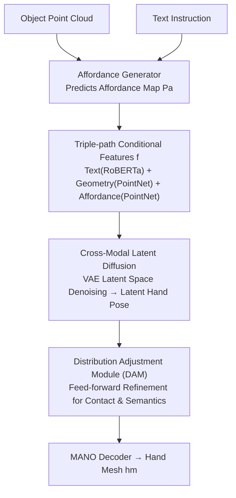

# AffordGrasp: Cross-Modal Diffusion for Affordance-Aware Grasp Synthesis

**Conference**: CVPR 2026  
**arXiv**: [2603.08021](https://arxiv.org/abs/2603.08021)  
**Code**: [Project Page](https://affordgrasp.github.io/)  
**Area**: 3D Vision / Hand-Object Interaction  
**Keywords**: Grasp Synthesis, Affordance, Cross-Modal Diffusion, Hand-Object Interaction, Semantic Instructions

## TL;DR
AffordGrasp presents a diffusion-based cross-modal framework that synthesizes physically feasible and semantically consistent human hand grasp poses from text instructions and object point clouds. By leveraging affordance-guided latent space diffusion and a Distribution Adjustment Module (DAM), it significantly outperforms existing methods across four benchmarks.

## Background & Motivation
**Background**: Semantic grasp generation aims to synthesize hand poses that interact with objects based on user instructions, serving as a critical capability for AR/VR and embodied intelligence.

**Limitations of Prior Work**: 
   - A significant modality gap exists between 3D geometry and natural language, making fine-grained geometry-semantic alignment (e.g., distinguishing "grasp the handle" from "grasp the rim") difficult through direct fusion.
   - Existing diffusion pipelines lack explicit spatial and semantic constraints, often resulting in physically implausible or semantically inconsistent grasps.

**Key Challenge**: How to ensure that synthesized grasp poses precisely correspond to the interaction intent described by linguistic instructions while maintaining physical feasibility?

**Key Insight**: This paper introduces object affordance as a cross-modal bridge to connect linguistic semantics with 3D geometry via affordance regions, supplemented by a Distribution Adjustment Module to enforce physical and semantic consistency post-sampling.

**Core Idea**: Affordance-driven latent space diffusion + Distribution Adjustment Module = Physical feasibility + Semantic precision.

## Method

### Overall Architecture
This paper addresses instruction-driven object grasping: given an object point cloud and a text instruction (e.g., "hold the mug by the handle"), the goal is to generate a human hand pose that avoids interpenetration and occupies the correct semantic area. The challenge lies in the modality gap between 3D geometry and natural language; forcing both into a standard diffusion model often leads to inaccurate positioning or mesh penetration.

The approach of AffordGrasp is to decompose this gap into two stages: an Affordance Generator first extracts "where to grasp" from the language into an affordance probability map $P_a$ on the object surface. Subsequently, a cross-modal latent diffusion model performs conditional generation on hand pose latent codes, conditioned on text, object geometry, and affordance features $f = \{f_I, f_{pg}, f_{pa}\}$. Finally, a Distribution Adjustment Module (DAM) performs lightweight refinement on the sampled latent codes to rectify contact and semantic misalignments before decoding into a hand mesh $h_m$ via a MANO layer.

### Key Designs

**1. Affordance Generator: Extracting "Where to Grasp" before generation**

Performing end-to-end mapping from language to hand poses places a heavy burden on cross-modal alignment, as the model must simultaneously identify geometry and synthesize pose. AffordGrasp first addresses a narrower question: which points on the object surface correspond to the instruction. Based on the LASO architecture, the generator predicts the affordance probability for each point, producing an affordance map $P_a$ as an explicit intermediate representation. To mitigate label scarcity, it is initialized on AffordPose and expanded via self-training to OakInk and GRAB. To handle class imbalance, a combined Focal Loss and Dice Loss is used: $\mathcal{L} = \mathcal{L}_{\text{focal}} + \lambda_1 \mathcal{L}_{\text{dice}}$. This decouples spatial information from the generative process, allowing the diffusion model to focus on hand articulation.

**2. Cross-Modal Latent Diffusion Model: Diffusion in compressed latent space**

Directly applying diffusion to high-dimensional hand meshes (778 vertices, $h_v^{gt} \in \mathbb{R}^{778 \times 3}$) is inefficient and can break structural constraints. AffordGrasp utilizes a pre-trained VAE to compress hand meshes into compact latent codes $h_z$. The forward process adds noise:

$$z^t = \sqrt{\alpha_t}\, z^0 + \sqrt{1 - \alpha_t}\, \epsilon$$

The conditional U-Net learns to predict noise with $L_{LDM} = \mathbb{E}\|\epsilon - \epsilon_\theta(z^t, f, t)\|_2^2$. Conditional features $f = \{f_I, f_{pg}, f_{pa}\}$ are encoded via RoBERTa (text), and independent PointNet architectures (geometry and affordance). Diffusion in latent space ensures computational efficiency and preserves the manifold of valid hand poses.

**3. Distribution Adjustment Module (DAM): Feed-forward physical and semantic correction**

Denoised outputs often lack precision in contact constraints (fingertips touching the surface) and semantic details. Instead of expensive gradient-based optimization, DAM performs a single feed-forward refinement at the end of sampling. It first estimates the latent hand representation:

$$\hat{h}_z = \frac{1}{\sqrt{\alpha_t}}\left(z^t - \sqrt{1-\alpha_t}\,\epsilon_\theta(z^t, f, t)\right)$$

It then integrates spatial features $f_{\text{spatial}} = \text{Norm}(f_{pg} + f_{pa}) + \hat{h}_z$ and aligns them with instruction features using multi-head attention $f_{\text{align}} = \text{Attention}(f_I, f_{\text{spatial}}, f_{\text{spatial}}) + f_I$. A residual MLP finalizes the refinement: $\tilde{h}_z = \text{Norm}(\text{MLP}(f_{\text{align}}) + \hat{h}_z)$. The residual mechanism ensures DAM fine-tunes the structure rather than rebuilding it.

### Loss & Training
The framework employs two-stage training: the diffusion model is trained first while freezing DAM, followed by freezing the diffusion model to train DAM. The DAM stage loss is defined as $\mathcal{L} = \mathcal{L}_{\text{recon}}(h_v, h_p, h_v^{gt}, h_p^{gt}) + \lambda_2 \mathcal{L}_{\text{physical}}(h_m, h_m^{gt}, P_g)$, where reconstruction loss constrains MANO parameters and vertex alignment, and physical loss penalizes interpenetration and contact inconsistencies.

## Key Experimental Results

### Main Results

| Dataset | Method | Pen. Vol. ↓ | Displacement ↓ | Contact ↑ | Semantic Acc. ↑ |
|--------|------|----------|-------|---------|-----------|
| OakInk | FastGrasp | 7.88 | 2.27 | 88% | 78.05% |
| OakInk | **Ours** | **7.31** | **1.43** | **98%** | **80.08%** |
| GRAB | FastGrasp | 4.61 | 1.20 | 94% | 61.50% |
| GRAB | **Ours** | **3.06** | 1.66 | **94%** | **62.50%** |
| HO-3D (OOD) | D-VQVAE | 13.12 | 2.33 | 95% | 64.00% |
| HO-3D (OOD) | **Ours** | **7.38** | **2.33** | **97%** | **72.00%** |

### Ablation Study

| Configuration | Pen. Vol. ↓ | Contact ↑ | Semantic Acc. ↑ | Description |
|------|----------|---------|-----------|------|
| w/o affordance | 8.27 | 97% | 76.56% | Removing affordance increases penetration |
| w/o DAM | 8.12 | 97% | 79.11% | Removing DAM slightly decreases semantics |
| Full Pipeline | **7.31** | **98%** | **80.08%** | Optimal synergy between modules |

### Key Findings
- Strong cross-domain generalization: Models trained on GRAB significantly outperform baselines in zero-shot tests on HO-3D and AffordPose.
- Affordance regions effectively reduce penetration volume (decreasing hand-object collisions), proving the importance of spatial guidance.
- The dual-residual mechanism in DAM preserves the core structure of the diffusion output while effectively correcting local details.

## Highlights & Insights
- The concept of **affordance as a cross-modal bridge** is simple yet effective, avoiding the instability of multi-round reasoning in VLMs.
- The self-training pipeline for annotation effectively addresses the scarcity of affordance-labeled data.
- DAM acts as a lightweight post-processing module that could potentially be generalized to other conditional generation tasks.

## Limitations & Future Work
- Physical priors (gravity, friction) are not explicitly modeled, which may limit performance in real-world scenarios.
- Some datasets (like AffordPose) were excluded from training due to lack of MANO parameters, limiting object diversity.
- Inference still requires multi-step DDIM sampling, which affects real-time performance.

## Related Work & Insights
- Compared to SemGrasp, this method avoids 2D projection occlusion issues by operating directly in 3D space.
- The DAM approach is analogous to the refinement strategy of ControlNet but avoids retraining the base generative model.

## Rating
- Novelty: ⭐⭐⭐⭐ Refined design combining affordance-guidance and DAM.
- Experimental Thoroughness: ⭐⭐⭐⭐⭐ Extensive benchmarks, OOD testing, and physical simulation.
- Writing Quality: ⭐⭐⭐⭐ Clear structure and high-quality visualizations.
- Value: ⭐⭐⭐⭐ Significant advancement for semantic grasping in embodied AI.

<!-- RELATED:START -->

## Related Papers

- [\[CVPR 2026\] Geometry-Aware Cross-Modal Graph Alignment for Referring Segmentation in 3D Gaussian Splatting](geometry-aware_cross-modal_graph_alignment_for_referring_segmentation_in_3d_gaus.md)
- [\[CVPR 2026\] Bidirectional Cross-Modal Prompting for Event-Frame Asymmetric Stereo](bidirectional_cross-modal_prompting_for_event-frame_asymmetric_stereo.md)
- [\[CVPR 2025\] GEAL: Generalizable 3D Affordance Learning with Cross-Modal Consistency](../../CVPR2025/3d_vision/geal_generalizable_3d_affordance_learning_with_cross-modal_consistency.md)
- [\[CVPR 2026\] Cross-View Splatter: Feed-Forward View Synthesis with Georeferenced Images](cross-view_splatter_feed-forward_view_synthesis_with_georeferenced_images.md)
- [\[CVPR 2026\] GeoFree-CoSeg: Unsupervised Point Cloud-Image Cross-Modal Co-Segmentation Without Geometric Alignment](geofree-coseg_unsupervised_point_cloud-image_cross-modal_co-segmentation_without.md)

<!-- RELATED:END -->
