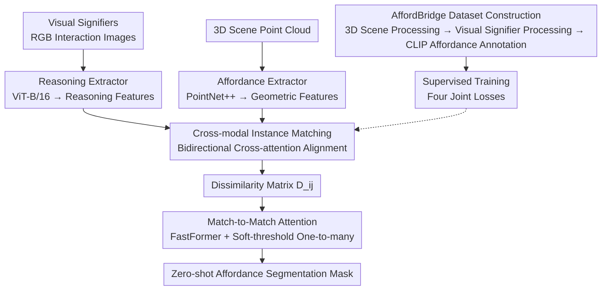

# AffordMatcher: Affordance Learning in 3D Scenes from Visual Signifiers

**Conference**: CVPR 2026  
**arXiv**: [2603.27970](https://arxiv.org/abs/2603.27970)  
**Code**: [Project Page](https://aioz-ai.github.io/AffordMatcher/)  
**Area**: 3D Vision / Scene Understanding  
**Keywords**: Affordance learning, 3D scene understanding, visual signifiers, cross-modal alignment, zero-shot segmentation

## TL;DR
AffordMatcher proposes a method for locating affordance regions in 3D scenes from visual signifiers (human interactions in RGB images). By utilizing the large-scale AffordBridge dataset and a Match-to-Match attention mechanism based on a dissimilarity matrix, it achieves a 53.4 mAP in zero-shot affordance segmentation, surpassing the second-best method by 7.8 points.

## Background & Motivation
**Background**: Affordance learning aims to identify "action possibilities" (Gibson) within an environment, serving as a fundamental capability for robotic manipulation, visual navigation, and AR.

**Limitations of Prior Work**:
   - Existing methods primarily focus on single modalities (pure image or point cloud), lacking a unified scheme for cross-modal affordance learning.
   - Large distribution gaps between image and point cloud features make cross-modal matching difficult.
   - Current datasets are small-scale with limited modalities (mostly <40K samples, <25 action types), hindering the training of end-to-end cross-modal models.

**Key Challenge**: How to precisely locate actionable regions in a 3D scene from 2D visual signifiers (e.g., an image of "a person pushing a door")?

**Key Insight**: Construct a large-scale 2D-3D paired affordance dataset, AffordBridge (291K annotations), and design a cross-modal semantic correspondence matching method.

**Core Idea**: Quantify the degree of 2D-3D feature matching through a dissimilarity matrix and optimize matching using FastFormer attention to achieve zero-shot affordance segmentation.

## Method

### Overall Architecture
AffordMatcher addresses a specific question: given an RGB image of a "human interacting with an object" (visual signifier), how to accurately delineate the corresponding actionable area in a 3D scene point cloud. It decomposes this into two parallel feature pathways: the 3D branch (Affordance Extractor, PointNet++) encodes voxelized high-resolution scene point clouds into geometric features, while the 2D branch (Reasoning Extractor, ViT-B/16) encodes visual signifiers into reasoning features containing action semantics. Both feature sets are fed into a Cross-modal Instance Matching module for bidirectional attention alignment. A dissimilarity matrix is then used to quantify "which 2D reasoning units match which 3D geometric units." Finally, the matching structure is optimized via Match-to-Match attention to output zero-shot affordance segmentation masks. The key to the entire pipeline is the granularity and robustness of the 2D-3D matching rather than the strength of a single-modality network.

### Key Designs

**1. AffordBridge Dataset: Filling the data gap for "trainable cross-modal models"**

Cross-modal affordance learning has lacked a sufficiently large, diverse, and strictly 2D-3D paired training set. Existing datasets mostly contain fewer than 40,000 samples and fewer than 25 action categories, which cannot support end-to-end cross-modal models. The authors constructed AffordBridge: 317,844 paired samples, 685 indoor scenes, and 291,637 volumetric affordance masks covering 157 object classes and 61 action types. The annotations were generated through an automated three-step pipeline: 3D scene processing (voxelization + view filtering), visual signifier processing (extracting human interactions and generating action descriptions), and affordance annotation (using CLIP to align action semantics with 3D regions). 

**2. Cross-modal Instance Matching: Bringing 2D reasoning and 3D geometry into the same space**

Image and point cloud features naturally reside in different spaces. Bidirectional cross-attention is used to allow each modality to "observe" the other. One direction uses visual signifiers to query the 3D point cloud, aggregating spatial geometric information:

$$W^{(M)} = \text{softmax}(Q^{(I)} K^{(P)\top}) V^{(P)}$$

The other direction uses the 3D point cloud to query visual features, feeding back action reasoning information:

$$W^{(R)} = \text{softmax}(Q^{(P)} K^{(I)\top}) V^{(I)}$$

The aligned $W^{(M)}$ and $W^{(R)}$ then reside in a shared space where element-wise comparisons are possible.

**3. Dissimilarity Quantization and Match-to-Match Attention: Learning robust one-to-many matching**

With the aligned attention outputs, a criterion is needed to measure the match between the $i$-th reasoning unit and the $j$-th geometric unit. A dissimilarity matrix is constructed using normalized cosine similarity:

$$D_{ij} = 1 - \max\Big\{0,\ \frac{W_i^{(M)} \cdot W_j^{(R)}}{\|W_i^{(M)}\|_2 \|W_j^{(R)}\|_2}\Big\}$$

The matrix is flattened and processed through FastFormer self-attention to learn global matching patterns. A soft-thresholding mechanism is applied to support one-to-many correspondences: when $D_{ij} < 0.2$, a reasoning unit is allowed to propagate to multiple geometric regions. 

**4. Cross-modal Affordance Learning Objective: Constraining alignment and matching**

The matching pipeline is optimized via four joint losses:

$$\mathcal{L}_{\text{total}} = \mathcal{L}_{\text{embed}} + \lambda \mathcal{L}_{\text{align}} + \gamma \mathcal{L}_{\text{bidir}} + \eta \mathcal{L}_{\text{dissim}}$$

$\mathcal{L}_{\text{embed}}$ handles embedding normalization; $\mathcal{L}_{\text{align}}$ aligns the FastFormer output with pseudo-targets generated by S-CLIP; $\mathcal{L}_{\text{bidir}}$ constrains the consistency of projections in both directions; and $\mathcal{L}_{\text{dissim}}$ minimizes the dissimilarity of cross-modal attention.

### Loss & Training
- The reasoning extractor uses ViT-B/16, and the affordance extractor uses PointNet++.
- Training for 100 epochs, batch size 16, learning rate $10^{-4}$ with a decay of 0.5 every 30 epochs.
- 3D scenes are voxelized into $64^3$ grids.

## Key Experimental Results

### Main Results (Zero-shot Affordance Segmentation)

| Method | mAP | mAP@0.25 | mAP@0.50 | Parameters | Latency |
|------|-----|----------|----------|--------|---------|
| Mask3D-F | 41.2 | 58.6 | 47.1 | 19.0M | 126.2ms |
| OpenMask3D-F | 45.6 | 62.1 | 51.0 | 39.7M | 315.1ms |
| LASO | 37.5 | 54.2 | 42.6 | 21.4M | 130.4ms |
| **Ours** | **53.4** | **69.7** | **59.5** | 20.7M | **112.5ms** |

### Ablation Study

| Configuration | mAP | Description |
|------|-----|------|
| w/o RGB Input | 37.3 | Visual signifiers are crucial |
| w/o Human Interaction (Inpaint) | 40.9 | Action semantics contribute significantly to reasoning |
| Using PIAD Object-level Data | 45.3 | Scene-level training outperforms object-level |
| **Full AffordMatcher** | **53.4** | Optimal synergy of all components |

### Key Findings
- Human interaction cues in visual signifiers are the core performance driver (mAP drops 16.1 points without them).
- The four loss components provide a cumulative gain of 16.1 mAP.
- t-SNE visualization shows that visual reasoning produces more compact and better-separated affordance clusters.

## Highlights & Insights
- **AffordBridge** is the largest 2D-3D paired affordance dataset in the field, offering long-term reuse value.
- The Match-to-Match attention design is efficient (112.5ms/sample), suitable for real-time applications.
- Visualizations clearly show how different actions on the same object (e.g., "sitting" vs. "pulling" a chair) activate different regions.

## Limitations & Future Work
- Memory and computational overhead remain high in scenarios with extreme detail.
- Disambiguation is difficult in scenes with overlapping affordances or ambiguous actions.
- Currently supports only static scenes; not yet extended to temporal or dynamic interactions.

## Related Work & Insights
- Compared to SceneFun3D, it supports visual signifier input rather than just text.
- The combination of a dissimilarity matrix and FastFormer can be transferred to other cross-modal matching tasks.

## Rating
- Novelty: ⭐⭐⭐⭐ Dual contribution in dataset and method; visual signifier-driven 3D affordance localization is a new direction.
- Experimental Thoroughness: ⭐⭐⭐⭐ Comprehensive ablation and visualization; detailed dataset statistics.
- Writing Quality: ⭐⭐⭐⭐ Clear structure and rich illustrations.
- Value: ⭐⭐⭐⭐⭐ Significant value for 3D scene understanding and robotics.

<!-- RELATED:START -->

## Related Papers

- [\[CVPR 2026\] Affostruction: 3D Affordance Grounding with Generative Reconstruction](affostruction_3d_affordance_grounding_with_generative_reconstruction.md)
- [\[CVPR 2026\] Unlocking 3D Affordance Segmentation with 2D Semantic Knowledge](unlocking_3d_affordance_segmentation_with_2d_semantic_knowledge.md)
- [\[CVPR 2025\] GEAL: Generalizable 3D Affordance Learning with Cross-Modal Consistency](../../CVPR2025/3d_vision/geal_generalizable_3d_affordance_learning_with_cross-modal_consistency.md)
- [\[CVPR 2026\] Geometry-Guided 3D Visual Token Pruning for Video-Language Models](geometry-guided_3d_visual_token_pruning_for_video-language_models.md)
- [\[CVPR 2026\] AffordGrasp: Cross-Modal Diffusion for Affordance-Aware Grasp Synthesis](affordgrasp_cross-modal_diffusion_for_affordance-aware_grasp_synthesis.md)

<!-- RELATED:END -->
