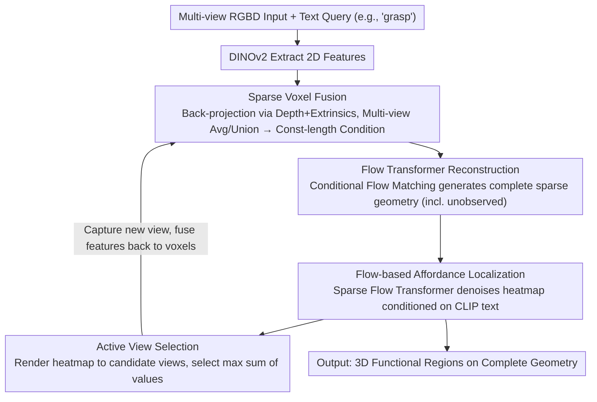

# Affostruction: 3D Affordance Grounding with Generative Reconstruction

**Conference**: CVPR 2026  
**arXiv**: [2601.09211](https://arxiv.org/abs/2601.09211)  
**Code**: [Project Page](https://chrockey.github.io/Affostruction/)  
**Area**: 3D Vision / Robot Perception  
**Keywords**: 3D Affordance, Generative Reconstruction, Sparse Voxel Fusion, Flow Matching, Active View Selection

## TL;DR

Ours proposes Affostruction, which completes object geometry (including unobserved regions) via generative reconstruction with sparse voxel fusion, and models the multimodal distribution of affordance using Flow Matching. It achieves functional region localization on the complete 3D shape, with reconstruction IoU improved by 54.8% and affordance aIoU by 40.4%.

## Background & Motivation

Robot manipulation requires understanding object affordance—"where to grasp." However, in reality, robots only observe objects from limited-perspective RGBD cameras, resulting in significant occlusion. Existing methods only predict affordance on visible surfaces, whereas robots must infer functional attributes even in unobserved regions (e.g., the handle on the back of a cup). This necessitates simultaneous geometric completion and affordance prediction.

**Key Insight**: 3D generative models like TRELLIS possess strong geometric priors but do not support depth input or functional prediction; affordance methods typically work only on complete point clouds or visible surfaces. Affostruction extends TRELLIS to support multi-view RGBD input via sparse voxel fusion and introduces a Flow-based affordance module.

## Method

### Overall Architecture

The paper addresses a practical dilemma: robots obtain occluded RGBD from limited views but need to identify "where to grasp" on the **complete** geometry (including unseen sides). Affostruction decomposes this task into a closed-loop pipeline: first, multi-view RGBD is fed into DINOv2 for 2D features, which are back-projected into 3D using depth and camera parameters and fused into voxels as a conditional signal of "what was seen." This signal drives a Flow Transformer to generate the complete sparse structure of the object (including unobserved regions). Subsequently, a second sparse Flow Transformer denoises an affordance heatmap on this reconstructed geometry, conditioned on CLIP text (e.g., "grasp"). Finally, the system renders the current heatmap to candidate views and selects the angle that best captures functional areas for additional capture, returning to the first step. This forms a "perception → reconstruction → localization → view selection" cycle.

### Key Designs

**1. Sparse Voxel Fusion: Compressing arbitrary multi-view inputs into constant-length 3D conditions.**

To prevent token counts from expanding linearly with views, Affostruction back-projects DINOv2 features into 3D world coordinates via depth and camera extrinsics onto a voxel grid. When multiple views hit the same voxel, features are averaged; unobserved voxels are filled via union, followed by 3D sinusoidal position encoding. Regardless of the number of views, the input to the Flow Transformer is a set of "voxel tokens" with length proportional to occupied voxels rather than view count ($O(1)$ complexity). This allows the model to handle 1 to 8 views seamlessly.

**2. Flow-based Affordance Localization: Using generative denoising instead of regression to match multimodal distributions.**

Affordance is not a one-to-one mapping: a "grasp" query often corresponds to multiple valid regions. Regression with MSE often results in blurred responses. Affostruction trains a sparse Flow Transformer to denoise affordance logits from noise, conditioned on CLIP text embeddings, sampling a valid mode from the distribution. The supervision uses BCE + Dice mask loss, as affordance is essentially a binary "interaction zone or not" problem, which is more robust than point-wise regression against sparse labels.

**3. Affordance-driven Active View Selection: Directing the camera based on functional regions.**

Affostruction selects the next viewpoint using the current estimated affordance heatmap. The heatmap is rendered onto the 2D planes of candidate views. The view with the maximum sum of heatmap values is selected for the next capture, prioritizing areas that are likely functional but currently poorly observed. In experiments, this strategy yielded nearly double the gain of sequential sampling.

### Loss & Training

The reconstruction stage employs the Conditional Flow Matching (CFM) loss of Rectified Flow. The affordance stage uses BCE + Dice mask loss instead of MSE. During training, 1–8 views are randomly sampled for each iteration (random multi-view training) to ensure adaptation to variable input counts; models trained only on single views do not benefit from multi-view inputs during inference.

## Key Experimental Results

### Main Results

**3D Reconstruction (Toky4K)**

| Method | IoU↑ | CD↓ | Depth Used |
|------|------|-----|----------|
| TRELLIS | 19.49 | 0.3694 | ✗ |
| MCC | 21.11 | 0.3299 | ✓ |
| **Ours** | 32.67 | 0.2427 | ✓ |

**Partial Observation Affordance Localization**

| Method | aIoU↑ | aCD↓ |
|------|-------|------|
| MCC + Espresso-3D | 4.74 | 0.1354 |
| **Ours** | 9.26 | 0.1044 |

### Ablation Study (Active View Selection)

| Strategy | 1 Extra View aIoU | 4 Extra Views aIoU |
|------|-----------------|-----------------|
| Sequential | 4.7 | 9.1 |
| Random | 6.2 | 11.0 |
| **Affordance-driven** | 9.2 | 12.4 |

### Key Findings

- Random multi-view training is critical: single-view models show negligible improvement with multi-view inputs.
- BCE + Dice mask loss significantly outperforms MSE for affordance prediction.
- Generative methods exceed discriminative counterparts in aIoU (19.1 vs 13.6), even without encoder fine-tuning.

## Highlights & Insights

- First framework to unify 3D generative reconstruction and affordance prediction.
- Sparse voxel fusion enables $O(1)$ complexity for multi-view feature aggregation.
- Flow Matching is an elegant solution for modeling the multimodal distribution of affordances.
- Active view selection creates a robust "perception→reconstruction→localization→selection" closed loop.

## Limitations & Future Work

- Initial reconstruction errors under extreme occlusion may propagate to affordance prediction.
- Incorrect initial affordance estimates may mislead active view selection.
- Currently restricted to single-object scenes; requires SAM3D for multi-object scenarios.
- Manipulation feasibility has not yet been validated on physical robots.

## Related Work & Insights

- **vs OpenAD/PointRefer/Espresso-3D**: These only predict affordance on visible surfaces; Ours predicts on reconstructed complete geometry.
- **vs TRELLIS**: TRELLIS uses single RGB input without depth or affordance; Ours supports multi-view RGBD and functional grounding.
- **vs MCC**: Discriminative reconstruction in MCC only restores observed surfaces; Affostruction generatively extrapolates unseen regions.

## Rating

- **Novelty**: ⭐⭐⭐⭐⭐ First unified framework for generative reconstruction, affordance localization, and active vision.
- **Experimental Thoroughness**: ⭐⭐⭐⭐ Comprehensive quantitative evaluation across reconstruction, affordance, and active vision.
- **Writing Quality**: ⭐⭐⭐⭐⭐ Clear problem definition, modular methodology, and honest failure analysis.
- **Value**: ⭐⭐⭐⭐⭐ Highly applicable to robot manipulation and affordance understanding.

## Related Papers

- [\[CVPR 2026\] HAMMER: Harnessing MLLMs via Cross-Modal Integration for Intention-Driven 3D Affordance Grounding](hammer_harnessing_mllms_via_cross-modal_integration_for_intention-driven_3d_affo.md)
- [\[CVPR 2026\] AffordMatcher: Affordance Learning in 3D Scenes from Visual Signifiers](affordmatcher_affordance_learning_in_3d_scenes_from_visual_signifiers.md)
- [\[CVPR 2026\] Scene Grounding In the Wild](scene_grounding_in_the_wild.md)
- [\[CVPR 2025\] Grounding 3D Object Affordance with Language Instructions, Visual Observations and Interactions](../../CVPR2025/3d_vision/grounding_3d_object_affordance_with_language_instructions_visual_observations_an.md)
- [\[CVPR 2026\] ORD: Object-Relation Decoupling for Generalized 3D Visual Grounding](ord_object-relation_decoupling_for_generalized_3d_visual_grounding.md)

<!-- RELATED:END -->

<!-- RELATED:START -->

## Related Papers

- [\[CVPR 2026\] HAMMER: Harnessing MLLMs via Cross-Modal Integration for Intention-Driven 3D Affordance Grounding](hammer_harnessing_mllms_via_cross-modal_integration_for_intention-driven_3d_affo.md)
- [\[CVPR 2026\] AffordMatcher: Affordance Learning in 3D Scenes from Visual Signifiers](affordmatcher_affordance_learning_in_3d_scenes_from_visual_signifiers.md)
- [\[CVPR 2026\] Human Geometry Distribution for 3D Animation Generation](human_geometry_distribution_for_3d_animation_generation.md)
- [\[CVPR 2026\] Easy3E: Feed-Forward 3D Asset Editing via Rectified Voxel Flow](easy3e_feed-forward_3d_asset_editing_via_rectified_voxel_flow.md)
- [\[CVPR 2026\] Generative Diffusion Priors for 3D Mapping of the Dark Universe](generative_diffusion_priors_for_3d_mapping_of_the_dark_universe.md)

<!-- RELATED:END -->
