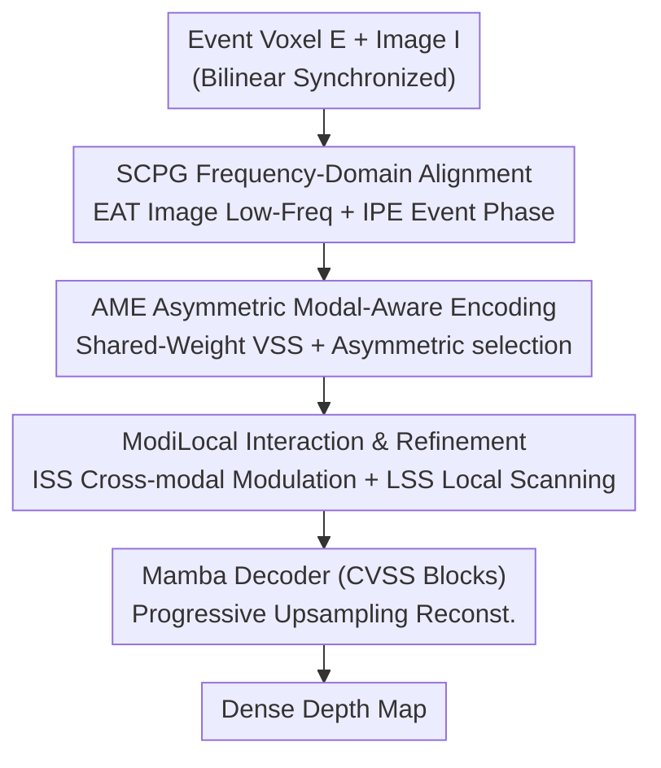

# AIMDepth: Asymmetric Image-Event Mamba for Monocular Depth Estimation

**Conference**: CVPR 2026  
**Paper**: [CVF Open Access](https://openaccess.thecvf.com/content/CVPR2026/html/Jing_AIMDepth_Asymmetric_Image-Event_Mamba_for_Monocular_Depth_Estimation_CVPR_2026_paper.html)  
**Code**: None (Not provided in the paper)  
**Area**: 3D Vision  
**Keywords**: Monocular Depth Estimation, Event Camera, Image-Event Fusion, Mamba/State Space Models, Cross-modal Alignment

## TL;DR
AIMDepth introduces Mamba (State Space Models) to image-event monocular depth estimation for the first time. It employs a two-level modal alignment before fusion: bidirectional prior injection in the frequency domain (SCPG) for input-level alignment, and an asymmetric feature selection encoder (AME) for feature-level alignment. These are combined with a modal interaction local refinement module (ModiLocal), achieving SOTA performance on MVSEC/DENSE with only 8.69 GFLOPs.

## Background & Motivation
**Background**: In monocular depth estimation, images provide dense textures but fail under motion blur or extreme lighting conditions. Event cameras asynchronously record pixel-level intensity changes with high temporal resolution and wide dynamic range, remaining robust during fast motion and low-light scenarios. However, event data is sparse and contains only edge information, making standalone structures incomplete. Their natural complementarity makes "image + event fusion" a mainstream direction for robust depth estimation.

**Limitations of Prior Work**: Existing fusion backbones are either CNNs, which have limited receptive fields and lack global dependency modeling, or Transformers, which suffer from quadratic complexity relative to sequence length—making them computationally prohibitive for long-sequence tasks like depth estimation. Crucially, most fusion methods directly concatenate or add features, **failing to address the domain discrepancy between events (sparse, dynamic) and images (dense, static)**, which leads to semantic bias and suboptimal representations.

**Key Challenge**: The difficulty of simultaneously achieving strong modeling capability, low computational cost, and effective modal alignment. Transformers are global but expensive; CNNs are cheap but local. Regardless of the backbone, the "alignment before fusion" step is often skipped, limiting fusion quality due to unaligned modal gaps.

**Goal**: (1) Identify a backbone with strong global modeling and linear complexity. (2) Explicitly eliminate the event-image domain gap before fusion through alignment at both input and feature levels.

**Key Insight**: Mamba/SSM offers linear complexity and excels at global context modeling, addressing the shortcomings of CNNs/Transformers. Modal alignment can be decomposed into two levels: the frequency domain (input level) to inject complementary low-frequency structures from images and high-frequency/phase dynamics from events, and asymmetric encoders (feature level) to utilize different feature depths for different modalities.

**Core Idea**: Build the first SSM-based image-event fusion framework using a hierarchical alignment pipeline—"Frequency Prior (Input-level) + Asymmetric Selection (Feature-level) + Interaction Refinement (Fusion)"—to suppress the modal gap before final integration.

## Method

### Overall Architecture
AIMDepth is a U-Net-shaped network with an encoder and decoder built entirely using State Space Models. The input consists of a synchronized pair: an event voxel grid $E_{raw}$ (bilinearly interpolated to matches the image shape $E\in\mathbb{R}^{K\times H\times W}$, where $K$ is the number of temporal bins) and an image $I\in\mathbb{R}^{C\times H\times W}$. The pipeline consists of four steps:

1. **SCPG (Input-level Alignment)**: Performs bidirectional prior injection for $E,I$ in the frequency domain, outputting aligned $\tilde E,\tilde I$.
2. **AME (Feature-level Alignment)**: A weight-shared four-stage VSS (Visual State Space) encoder processes $\tilde I,\tilde E$ to get multi-level features $F_I,F_E$, then selects specific levels based on modal characteristics.
3. **ModiLocal (Fusion)**: Executes cross-modal interaction and local spatial refinement on selected features to produce fused features $F_{fused}$.
4. **Mamba Decoder**: Uses CVSS (Channel-Aware VSS) blocks for progressive upsampling of $F_{fused}$ to restore resolution, with a final convolutional layer outputting the dense depth map.

### Key Designs

**1. SCPG: Input-level Alignment via Frequency Domain Prior Injection**

Directly concatenating events and images introduces semantic bias due to their different distributions. SCPG aligns them at the input stage using complementary frequency characteristics through two sub-modules. It applies 2D Discrete Fourier Transform $F(x)$ to each modality, decomposing them into amplitude $F_A(x)$ and phase $F_P(x)$.

*EAT (Event-targeted Amplitude Transfer, Image → Event)*: Image low-frequency amplitudes contain structural information like global contours. EAT uses a central low-frequency square mask $M_\beta$ (size determined by ratio $\beta\in(0,1)$ such that $M_\beta=1$ when $|h|\le\beta H$ and $|w|\le\beta W$) to **partially replace** event low-frequency amplitudes with those of the image:

$$F'_A(E_c) = M_\beta\cdot F_A(I) + (1-M_\beta)\cdot F_A(E_c)$$

The aligned $\tilde E_c$ is reconstructed via inverse transform using the event's original phase: $\tilde E_c = F^{-1}\big(F'_A(E_c)\cdot e^{jF_P(E_c)}\big)$. This provides events with structural priors while retaining high-frequency dynamics.

*IPE (Image-targeted Phase Enhancement, Event → Image)*: Phase spectra preserve precise edges and boundaries. IPE selects the two event channels $\{E_{c1},E_{c2}\}$ with the largest global amplitude response ($\arg\max_c\lVert F_A(E_c)\rVert_1$) and concatenates their phase maps with the original image: $\tilde I = \text{Concat}(I, F_P(E_{c1}), F_P(E_{c2}))$, adding motion-aware cues to the image.

**2. AME: Feature-level Alignment via Asymmetric Selection**

Even with aligned inputs, density and semantic differences persist: images are dense (needing shallow layers for spatial detail), while events are sparse/dynamic (needing deep layers for spatio-temporal abstraction). AME uses a **weight-shared** encoder with four stages of VSS blocks (including SS2D for 4-directional scanning) and performs **asymmetric selection** before fusion:

$$F'_I = \{F^1_I, F^2_I, F^3_I\},\qquad F'_E = \{F^2_E, F^3_E, F^4_E\}$$

Images retain shallow level details (Stages 1–3), while events retain deeper semantic/temporal info (Stages 2–4). Weight sharing keeps the model compact while level-specialization aligns modalities in feature space naturally.

**3. ModiLocal: Hierarchical Fusion via ISS and LSS**

*ISS (Interactive Selective Scan)*: Performs cross-modal modulation by letting each modality evolve its hidden state **under the guidance of the other**. The SSM state updates swap the modulation matrix $B$ and residual path $D$ between modalities:

$$h^t_I = A_I h^{t-1}_I + B_E x^t_I,\quad y^t_I = C_I h^t_I + D_E x^t_I$$
$$h^t_E = A_E h^{t-1}_E + B_I x^t_E,\quad y^t_E = C_E h^t_E + D_I x^t_E$$

State transitions $A$ and readouts $C$ remain modality-specific, while the input-to-state path $B$ and input-to-output path $D$ are guided by the other modality, decoupling internal states while synchronizing semantics.

*LSS (Local Spatial Selective Scan)*: Dense depth requires fine-grained spatial detail. LSS constructs overlapping local windows and performs directed state propagation. In addition to global horizontal/vertical scans, it introduces local scans to refine boundaries and depth discontinuities. Finally, an SE block provides channel-wise weighting to produce $F_{fuse}$.

### Loss & Training
The network predicts normalized log depth. Metric depth is recovered by $\hat D_{m,k}=D_{max}\cdot\exp(-\alpha(1-\hat D_k))$, with residuals $R_k = D^*_k - \hat D_{m,k}$. The total loss combines absolute and squared error over all valid pixels $V$:

$$\text{Loss} = \frac{1}{|V|}\sum_{k\in V}\big(|R_k| + R_k^2\big)$$

Training details: AdamW (weight decay 0.8, lr $2\times10^{-4}$), 30 epochs, batch 16, single RTX 4090. Event voxel channels $B=5$, low-freq ratio $\beta=0.01$.

## Key Experimental Results

### Main Results

On MVSEC (Average of day1 and night1), the method is best in 4 out of 5 metrics:

| Method | A↓ | R↓ | δ1↑ | δ2↑ | δ3↑ |
|------|----|----|-----|-----|-----|
| HMNet-B3 | 0.284 | 0.397 | 0.610 | 0.786 | 0.887 |
| UniCT | **0.266** | 0.392 | 0.603 | 0.788 | 0.886 |
| SRFNet | 0.285 | 0.454 | 0.550 | 0.741 | 0.855 |
| **Ours** | 0.306 | **0.371** | **0.622** | **0.804** | **0.905** |

On DENSE (Town10), the gains are more significant with best performance in A/R/δ1:

| Method | A↓ | R↓ | δ1↑ | δ2↑ | δ3↑ |
|------|----|----|-----|-----|-----|
| EReFormer | 0.172 | 0.335 | 0.747 | 0.839 | 0.908 |
| ER-F2D | 0.229 | 0.333 | 0.725 | **0.891** | **0.949** |
| UniCT | 0.180 | 0.360 | 0.703 | 0.844 | 0.905 |
| **Ours** | **0.178** | **0.269** | **0.821** | 0.895 | 0.947 |

Computational complexity: AIMDepth requires only **8.69 GFLOPs**, the lowest in the comparison, with 45.07M parameters.

### Ablation Study

Component ablation on MVSEC (Average A↓; baseline has all three modules off):

| Configuration | A↓ | R↓ | δ1↑ |
|------|----|----|-----|
| baseline | 0.539 | 0.520 | 0.500 |
| Only AME | 0.300 | 0.421 | 0.559 |
| Only SCPG | 0.323 | 0.405 | 0.524 |
| Only ModiLocal | 0.385 | 0.472 | 0.511 |
| **Full Model** | 0.306 | **0.371** | 0.622 |

### Key Findings
- **"Alignment before fusion" is critical**: ModiLocal provides limited gain (A 0.385) alone but becomes highly effective when stacked on SCPG or AME.
- **Complementarity**: AME is strongest in daytime, while SCPG and ModiLocal provide stability in low-light/night scenarios.
- **Note**: In terms of Abs Rel (A), "Only AME" (0.300) slightly outperforms the full model (0.306). The full model's advantage is primarily in RMSE and Threshold accuracy.

## Highlights & Insights
- **Shifting alignment to input frequency domain**: Using amplitude/phase from DFT to cross-inject structural and dynamic priors is physically interpretable and adds almost zero computational cost.
- **ISS B/D Swapping**: Swapping only the input path $B$ and residual $D$ in SSM while keeping $A$ and $C$ intact allows modalities to guide each other without corrupting internal state representations.
- **Zero-cost Asymmetric Selection**: Using a shared-weight encoder with modality-specific layer selection encodes priors without increasing parameters.
- **Efficiency**: 8.69 GFLOPs is nearly an order of magnitude lower than some Transformer backbones, proving Mamba's potential in image-event tasks.

## Limitations & Future Work
- The code is not provided, hindering reproducibility. The hyperparameter $\beta=0.01$ is extremely small and lacks detailed sensitivity analysis.
- Evaluations are limited to MVSEC and DENSE; generalization to diverse indoor or uncontrolled scenes remains unverified.
- Metrics trade-offs (e.g., AME vs. Full Model on A) suggest fusion strategies could be further optimized.

## Related Work & Insights
- **vs RAMNet/SRFNet (CNN)**: These use ConvGRU or simple attention with limited receptive fields. RAMNet is also expensive (119.89G FLOPs). AIMDepth achieves global modeling with linear complexity.
- **vs UniCT/HMNet (Transformer)**: These have quadratic complexity and lack explicit modal alignment. AIMDepth uniquely introduces SCPG and AME to suppress the domain gap before fusion.
- **vs standard SSM (Vim/VMamba)**: While following dual-directional scanning, this paper is the first to apply SSMs to image-event monocular depth and introduces cross-modal versions (ISS).

## Rating
- Novelty: ⭐⭐⭐⭐ (First SSM for this task; clever B/D swapping and frequency alignment)
- Experimental Thoroughness: ⭐⭐⭐⭐ (Solid ablation and cross-dataset comparison)
- Writing Quality: ⭐⭐⭐⭐ (Logical flow and clear formulas)
- Value: ⭐⭐⭐⭐ (High efficiency for resource-constrained event camera applications)

<!-- RELATED:START -->

## Related Papers

- [\[CVPR 2026\] Depth Hypothesis Guided Iterative Refinement for Event-Image Monocular Depth Estimation](depth_hypothesis_guided_iterative_refinement_for_event-image_monocular_depth_est.md)
- [\[CVPR 2026\] ARES: Unifying Asymmetric RGB-Event Stereo for Probabilistic Scene Flow Estimation](ares_unifying_asymmetric_rgb-event_stereo_for_probabilistic_scene_flow_estimatio.md)
- [\[CVPR 2026\] MD2E: Modeling Depth-to-Edge Cues for Monocular Metric Depth Estimation](md2e_modeling_depth-to-edge_cues_for_monocular_metric_depth_estimation.md)
- [\[CVPR 2026\] Bidirectional Cross-Modal Prompting for Event-Frame Asymmetric Stereo](bidirectional_cross-modal_prompting_for_event-frame_asymmetric_stereo.md)
- [\[CVPR 2026\] Depth Any Panoramas: A Foundation Model for Panoramic Depth Estimation](depth_any_panoramas_a_foundation_model_for_panoramic_depth_estimation.md)

<!-- RELATED:END -->

## Related Papers

- [\[CVPR 2026\] Depth Hypothesis Guided Iterative Refinement for Event-Image Monocular Depth Estimation](depth_hypothesis_guided_iterative_refinement_for_event-image_monocular_depth_est.md)
- [\[CVPR 2026\] Bidirectional Cross-Modal Prompting for Event-Frame Asymmetric Stereo](bidirectional_cross-modal_prompting_for_event-frame_asymmetric_stereo.md)
- [\[CVPR 2026\] Iris: Integrating Language into Diffusion-based Monocular Depth Estimation](iris_integrating_language_into_diffusion-based_monocular_depth_estimation.md)
- [\[CVPR 2026\] ARES: Unifying Asymmetric RGB-Event Stereo for Probabilistic Scene Flow Estimation](ares_unifying_asymmetric_rgb-event_stereo_for_probabilistic_scene_flow_estimatio.md)
- [\[CVPR 2026\] Iris: Bringing Real-World Priors into Diffusion Model for Monocular Depth Estimation](iris_bringing_realworld_priors_into_diffusion_model_for_monocular_depth_estimation.md)

<!-- RELATED:END -->
