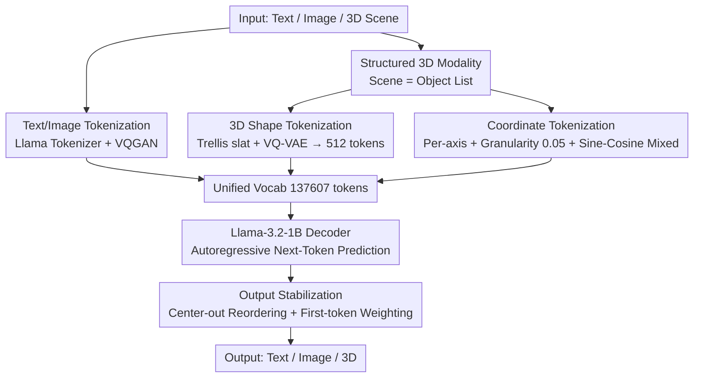

# Aligning Text, Images and 3D Structure Token-by-Token

**Conference**: CVPR 2026  
**Paper**: [CVF Open Access](https://openaccess.thecvf.com/content/CVPR2026/html/Sahoo_Aligning_Text_Images_and_3D_Structure_Token_by_Token_CVPR_2026_paper.html)  
**Code**: https://glab-caltech.github.io/kyvo (Project page, code and data promised to be open-sourced)  
**Area**: 3D Vision  
**Keywords**: Structured 3D Modality, Autoregressive Multimodal LLM, 3D Tokenization, Single-image 3D Reconstruction, Unified Token Space

## TL;DR
This paper proposes Kyvo—a decoder-only autoregressive LLM (based on Llama-3.2-1B) that treats "structured 3D scenes" as a third modality within the same token space as text and images. Through a systematic "cookbook," it provides key recipes for 3D shape tokenization, coordinate encoding, and sequence design, enabling a single model to perform four types of 3D tasks: rendering, single-image 3D reconstruction/recognition, instruction editing, and QA.

## Background & Motivation
**Background**: LLMs/VLMs integrating text and images are already capable of tasks like image captioning and text-to-image generation. The autoregressive "next-token prediction" paradigm has proven powerful for both language and vision. However, these models almost exclusively treat images as inputs, and **their modeling of 3D geometry and spatial relationships remains weak**.

**Limitations of Prior Work**: Most existing "LLM + 3D" works treat scenes as a **holistic** mass of point cloud/NeRF features (e.g., 3D-LLM uses global point clouds for captioning/QA) or focus only on generating **single assets** (e.g., SAR3D, AToken). These representations either fail to precisely predict the shape/pose of individual objects or suffer from token explosion—SAR3D requires 2040 tokens per asset, and AToken exceeds 20,000, making them impossible to fit into an autoregressive sequence of a multi-object scene.

**Key Challenge**: 3D scenes are naturally structured as "multiple objects + each object having geometry/position/pose." Fitting this into a unified LLM token space requires satisfying two conflicting requirements: **compactness** (for autoregressive decoding) and **structure** (for object-wise and attribute-wise alignment with language and vision). Furthermore, LLMs are notoriously **poor at processing numbers**, and spatial precision collapses if coordinate encoding is not handled carefully.

**Goal**: (1) Design a structured 3D modality that seamlessly concatenates with text and images; (2) Clarify all key design choices for training such a 3D-aligned LLM (data representation, tokenization, sequence order, loss) and distill them into a cookbook.

**Key Insight**: Starting from a language-pretrained Transformer, expand it by treating 3D as "adding another language." The expectation is to **leverage the existing reasoning and generalization capabilities of LLMs**. Experiments (FFT significantly outperforms LoRA, and instruction-tuned backbones perform better) later confirm this hypothesis.

**Core Idea**: Represent the scene as an "object list," where each object's shape, category, position, pose, and size are encoded token-by-token using **dedicated tokens**. Combined with a VQ-VAE that compresses complex 3D shapes into 512 tokens, this allows 3D to be aligned and generated token-by-token just like text.

## Method

### Overall Architecture
The backbone of Kyvo is Llama-3.2-1B-Instruct (initialized from pure language pre-trained weights). The core modifications are only twofold: adding a **modality-specific tokenizer** for images and the structured 3D modality, respectively, and adapting the input embeddings and output projections. All three modalities—text, image, and 3D scene—are converted into discrete token sequences and integrated into a **unified vocabulary** of 137,607, followed by training via pure "next-token prediction." Since inputs and outputs share the same token set, **any modality can serve as input or output**: 3D→Image (Rendering), Image→3D (Reconstruction/Recognition), (Image, 3D, Text)→(Image, 3D) (Instruction Editing), and (Image, 3D, Question)→Answer (QA) are all completed within the same model.

The diagram below illustrates the overall data flow for unified tokenization: text and images follow their standard tokenizers, while 3D scenes follow the "structured 3D modality" pipeline (comprising shape tokenization and coordinate tokenization). The three token streams enter the unified vocabulary for autoregressive decoding by Llama, followed by target modality production via "output stabilization."



### Key Designs

**1. Structured 3D Modality: Tokenizing Scenes as "Object Lists" Attribute-by-Attribute**

To address the limitation that holistic point clouds cannot be precisely aligned object-wise, Kyvo explicitly encodes a 3D scene as a **list of objects**. Each object consists of attributes such as shape, type, position, size, color, and material. Each attribute is marked with a **learnable dedicated token** (e.g., `[SHAPE]`, `[LOCATION]`, `[POSE]`), and the values can be text ("car", "yellow"), numbers (size/coordinates), or learned 3D shape embeddings. Objects are wrapped with `[OBJECT-START]`/`[OBJECT-END]`, and the entire scene is wrapped with `[SCENE-START]`/`[SCENE-END]`, for example:

```
[SCENE-START][OBJECT-START][SHAPE]<v1...v512>[LOCATION]-0.15 1.05 0.00
[POSE]0.00 0.00 3.00[OBJECT-END]...[SCENE-END]
```

This object-wise and attribute-wise structure allows 3D sequences to naturally concatenate with image and text tokens. Each attribute becomes a unit that can be directly predicted or conditioned upon by the language model, supporting fine-grained tasks like shape prediction, pose estimation, and object-level editing—which "holistic point clouds" cannot achieve. The authors also found that **modality order matters**: placing the image before 3D `(I,3D,T)` performs better than the reverse (Instruction task 0.8666 vs 0.8350, QA 0.4980 vs 0.4720), as subsequent 3D tokens can attend to the complete preceding image tokens for better conditioning.

**2. 3D Shape Tokenization: Trellis Slat via VQ-VAE to 512 Tokens + Multi-view Pixel Auxiliary Loss**

The geometry and texture of complex objects are the hardest parts of the structured modality to fit into an autoregressive sequence. Kyvo uses Trellis to encode geometry+texture into **sparse voxel feature slats** $z=\{(z_i,p_i)\}_{i=1}^L$, where $z_i\in\mathbb{R}^8$ is a local feature and $p_i$ is the active voxel index in an $N^3$ grid. However, with $N=64$, $L\approx 20k$, making direct autoregression infeasible. Thus, the authors train a **3D VQ-VAE** to compress the slats from $64^3\times 8$ into a dense $8^3\times 128$ latent representation, quantized with a codebook of size 8192. Ultimately, **each object uses only 512 discrete tokens**—a ~40× compression. This is ~4× fewer tokens than SAR3D's 2040, yet yields better reconstruction quality (Human Mean Rank 1.395 vs 1.605).

A key finding is: **reconstruction loss in the slat latent space alone is insufficient**. Even if latent losses are similar, the decoded shape quality is poor. The authors add an auxiliary reconstruction loss in the **decoded pixel space** (using Trellis's L1 + D-SSIM + LPIPS) and supervise the asset using **multi-view** reconstruction (sampling 150 random viewpoints) rather than a single fixed view. This significantly improves reconstruction quality (Mean Rank: no auxiliary loss 2.828 → fixed single view 1.672 → multi-view 1.500). Intuitively, pixel-space + multi-view supervision forces the latent tokens to encode geometry that holds up from all angles, rather than just satisfying latent numerical alignment.

**3. Coordinate Tokenization: Per-axis Discretization + Granularity Binning + Mixed Sine-Cosine Embedding**

LLMs struggle with numbers, yet position/orientation are vital for 3D spatial reasoning. Kyvo **breaks $x,y,z$ into independent tokens** for separate encoding (allowing the model to learn independent embeddings for each coordinate) and uses **equidistant binning** to discretize coordinate values. Granularity is decisive: too coarse, and spatial accuracy fails; too fine, and token count explodes while training samples per bin become too sparse to learn. Scanning on CLEVR shows 0.05 is universally superior to 0.5 (too coarse) and 0.005 (too fine) (Recognition 0.9212 vs 0.2352 vs 0.5707). This per-axis discretization also **significantly compresses sequences**: the standard Llama tokenizer splits "0.000" into fragments like "0" / "." / "000" (avg. sequence length 271.4), whereas this scheme reduces it to 93.2 tokens (2.91× compression).

Furthermore, learning embeddings for coordinate tokens alone fails to express numerical **order** (2 is between 1 and 3). The authors compared three schemes: fixed sine-cosine encoding, purely learned embeddings, and a **mixture of both** (sine-cosine superimposed on learned embeddings). The conclusion is that while the three are comparable with high data volume, **both pure fixed and pure learned schemes collapse with low data**. Only the mixed scheme is stable across all data scales, so it was adopted.

**4. Output Stabilization: Center-out Token Reordering + First-token Weighted Loss**

A subtle bug appeared during autoregressive image generation: training loss was low, but inference often **caused the entire image to drift**. The root cause is "predicting high-information output (image) using low-information conditions (3D specs)," and the problem centers on the **first token**. Because CLEVR backgrounds are uniformly gray, the first token is highly concentrated on a few codes (over 25% of images share the same first token). Once the first token is predicted incorrectly during inference, downstream decoding diverges catastrophically. Any image with a relatively uniform background (graphic design, real-world scenes) suffers from this.

The authors used two methods to fix it: first, **center-out token reordering**, which changes the sequence start from the "top-left background block" to **starting from the center token and spiraling outwards**, ensuring the first token lands on representative content and flattens the initial distribution; second, **first-token weighted loss**, which **multiplies the loss of the first 5 tokens by 10.0** in the output image sequence to strongly constrain the model to get the beginning right. Combined, the rendering Mean Rank dropped from 2.66 to 1.00 (reordering only: 3.56; weighting only: 2.78; using only one is worse than using neither).

### Loss & Training
- The primary objective is the **next-token prediction** cross-entropy over the unified vocabulary; a loss weight of 10.0 is applied to the first 5 tokens of output image sequences.
- The 3D VQ-VAE is trained separately using standard VQ-VAE loss (latent reconstruction) + multi-view auxiliary reconstruction loss in decoded pixel space (L1/D-SSIM/LPIPS).
- The main model undergoes **Full Fine-Tuning (FFT)** starting from language pre-trained weights: experiments show FFT significantly outperforms LoRA and training from scratch, suggesting cross-modal transfer is effective for new modalities while LoRA is ill-suited for entirely new modalities. The complete cookbook was derived from training **307 models**.

## Key Experimental Results

### Main Results
Real-world 3D object recognition (Jaccard Index, higher is better), compared against the SOTA detector Cube R-CNN:

| Dataset | Cube R-CNN (ResNet-34) | Cube R-CNN (DLA-34) | Kyvo (Ours) |
|--------|------|------|------|
| Objectron | 0.3276 | 0.4012 | **0.4784** |
| ARKitScenes | 0.2043 | 0.2208 | 0.2118 |

Ours significantly outperforms the specialized detector on Objectron and remains competitive on the more difficult, noisier ARKitScenes—demonstrating that a general autoregressive framework can match or exceed task-specific vision specialists. Human evaluation comparison for 3D shape tokenization:

| 3D Tokenizer | Mean Rank ↓ | Tokens/Object |
|--------------|------|------|
| SAR3D | 1.605 | 2040 |
| Kyvo 3D VQ-VAE | **1.395** | **512** |

### Ablation Study

| Module | Configuration | Key Metric | Description |
|------|------|---------|------|
| Shape Aux Loss | None / Single-view / Multi-view | Mean Rank 2.828 / 1.672 / **1.500** | Pixel-space + multi-view supervision is most critical |
| Coord Granularity | 0.005 / **0.05** / 0.5 | Recog. 0.5707 / **0.9212** / 0.2352 | Too coarse/fine are both poor; 0.05 is optimal |
| Output Stabilization | None / Reorder only / Weighting only / **Both** | Rendering Mean Rank 2.66 / 3.56 / 2.78 / **1.00** | Must combine reordering + weighting |
| Training Recipe | Scratch / LoRA / **FFT** | Recog. 0.6265 / 0.8684 / **0.9212** | Full fine-tuning is optimal; LoRA unsuited for new modalities |
| Backbone | 1B / **1B-Instruct** / 3B | Recog. 0.8948 / **0.9212** / 0.8626 | Instruction tuning helps; 3B has no gain or is worse |

### Key Findings
- **Cross-modal transfer is real**: Models FFT-ed from pure language weights perform best on image/3D modalities never seen during pre-training, indicating that language priors can transfer to 3D, supporting the "3D as a third language" hypothesis.
- **1B is sufficient**: Increasing from 1B to 3B yielded no significant gains and even caused a drop in QA (0.4980→0.2345), suggesting data complexity is fully captured by 1B and larger models tend to overfit.
- **The first token is the lifeblood of autoregressive image generation**: A seemingly engineering detail (first-token bias) can cause catastrophic divergence. Reordering and weighting are both indispensable.
- **Generalization has boundaries**: Recognition Jaccard drops from 0.9212 on CLEVR to 0.6415 on the complex ObjaWorld, reflecting the cost of scene complexity; however, Llama3.2-V with in-context prompting is near zero, highlighting the value of structured 3D modalities.

## Highlights & Insights
- **Unified token space treating "3D as a third language"**: Allows a single model to perform rendering, reconstruction, recognition, editing, and QA with one set of weights, where any modality can serve as input or output—this is more elegant than treating 3D as an independent branch.
- **40× compressed 3D shape tokens**: Uses Trellis slats + VQ-VAE + multi-view pixel auxiliary loss to compress a single object to 512 tokens while outperforming SAR3D. This is a critical engineering breakthrough for fitting multi-object scenes into autoregressive sequences, transferable to any generative model requiring 3D asset serialization.
- **Diagnosis and fix for first-token bias**: Reveals the fragility of autoregressive image generation when "low-information conditions predict high-information outputs." The center-out reordering strategy is broadly applicable to any image generation with uniform backgrounds.
- **Cookbook paradigm**: Systematically explored the design space of data representation, tokenization, sequence order, and loss by training 307 models, providing an engineering guide for future researchers.

## Limitations & Future Work
- The authors acknowledge that the **core bottleneck is 3D data scarcity**: While the model achieves in-domain generalization with moderate data, **cross-domain generalization requires larger, currently unavailable datasets**. The outlook is to introduce mixed training data to expand into new domains.
- Evaluation relies heavily on **templated instructions/QA** and synthetic datasets (CLEVR/ObjaWorld); real-world validation is limited to recognition. Performance for instruction editing/QA in real scenes is not fully demonstrated. ⚠️
- Rendering evaluation shifted to **human Mean Rank** because standard image metrics (L2/SSIM/FID/PSNR) fail to capture object positions/attributes, limiting comparability and reproducibility.
- Future directions: Extend 3D tokenization to open-vocabulary/arbitrary geometry, introduce real-world 3D supervision data, and re-validate sequence designs like "image-first" in longer contexts or with more interleaved modalities.

## Related Work & Insights
- **vs. 3D-LLM**: 3D-LLM uses **holistic** point clouds for captioning/QA. Ours **decomposes scenes into objects** for object-wise alignment, enabling tasks like single-image shape+pose prediction and 3D-conditioned image generation, which holistic representations cannot do.
- **vs. SceneScript**: SceneScript autoregressively predicts 3D boxes + full-scene point clouds from video. Ours aligns **images** with structured 3D object/scene representations and supports image generation.
- **vs. SAR3D / AToken (3D Tokenization)**: SAR3D uses triplanes, and AToken trains a joint tokenizer based on Trellis, but both target **single-asset generation** with massive token counts (2040 / 20k+). Ours optimizes compactness for **multi-object scenes**, requiring only 512 tokens to coexist with images and text in a unified vocabulary.
- **vs. Mainstream VLMs**: Modern VLMs only treat images as inputs and have weak 3D reasoning. Ours proves that pure autorepression + structured 3D modality can match or exceed specialized 3D detectors (Cube R-CNN).

## Rating
- Novelty: ⭐⭐⭐⭐⭐ First to treat structured 3D scenes as a third modality in a unified token space with systematic design choices.
- Experimental Thoroughness: ⭐⭐⭐⭐⭐ 4 tasks × 4 datasets, a 307-model cookbook, exhaustive ablations.
- Writing Quality: ⭐⭐⭐⭐ Cookbook-style narrative is clear, though some findings are scattered and real-world task coverage is narrow.
- Value: ⭐⭐⭐⭐⭐ Provides reusable tokenization and training recipes for 3D-aligned multimodal LLMs.

<!-- RELATED:START -->

<div class="related-papers" markdown="1">

## Related Papers

- [\[CVPR 2026\] Generalizable Structure-Aware Keypoint Correspondence for Category-Unified 3D Single Object Tracking](generalizable_structure-aware_keypoint_correspondence_for_category-unified_3d_si.md)
- [\[CVPR 2026\] Fast SceneScript: Fast and Accurate Language-Based 3D Scene Understanding via Multi-Token Prediction](fast_scenescript_fast_and_accurate_language-based_3d_scene_understanding_via_mul.md)
- [\[CVPR 2026\] GaussianGrow: Geometry-aware Gaussian Growing from 3D Point Clouds with Text Guidance](gaussiangrow_geometry-aware_gaussian_growing_from_3d_point_clouds_with_text_guid.md)
- [\[CVPR 2026\] EcoSplat: Efficiency-controllable Feed-forward 3D Gaussian Splatting from Multi-view Images](ecosplat_efficiency-controllable_feed-forward_3d_gaussian_splatting_from_multi-v.md)
- [\[CVPR 2026\] Cross-View Splatter: Feed-Forward View Synthesis with Georeferenced Images](cross-view_splatter_feed-forward_view_synthesis_with_georeferenced_images.md)

</div>

<!-- RELATED:END -->
