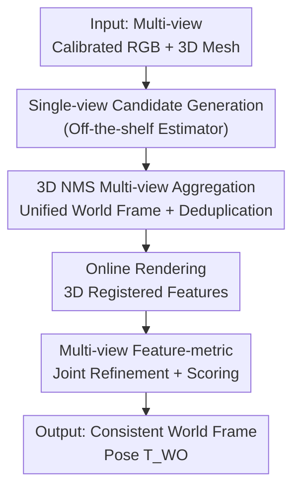

# AlignPose: Generalizable 6D Pose Estimation via Multi-view Feature-metric Alignment

**Conference**: CVPR2026  
**arXiv**: [2512.20538](https://arxiv.org/abs/2512.20538)  
**Code**: https://mikestikova.github.io/alignpose/ (Project Page)  
**Area**: 3D Vision / 6D Object Pose Estimation  
**Keywords**: Multi-view Pose Estimation, Feature-metric Refinement, Training-free Generalization, Industrial Inspection, BOP Benchmark

## TL;DR
AlignPose aggregates single-view object pose candidates from multiple calibrated RGB views into a single candidate using 3D NMS. It then employs a multi-view feature-metric refinement that simultaneously minimizes the discrepancy between online rendered features and observed image features across all views to solve for a globally consistent world-coordinate pose. The entire process requires no object-specific training or symmetry annotations and outperforms existing methods by over 14% on industrial datasets containing textureless, reflective, and transparent objects.

## Background & Motivation

**Background**: Model-based 6D object pose estimation (estimating rotation and translation in the camera/world frame given a 3D mesh) is a core component of AR, robotic grasping, and industrial inspection. Recent RGB-only learning methods (e.g., MegaPose, FoundPose, GigaPose) have achieved generalization to unseen objects by training on large-scale simulation data and leveraging features from Vision Foundation Models (DINOv2).

**Limitations of Prior Work**: These methods are primarily **single-view**, inherently suffering from three types of issues: depth scale ambiguity, cluttered occlusion, and appearance ambiguity (e.g., a cup with its handle obscured). While depth cameras provide higher precision, they fail on reflective or transparent objects and are expensive in industrial settings. Multi-view RGB should be the solution, but existing multi-view methods either impose too strong assumptions—causing them to discard valid candidates (e.g., CosyPose's RANSAC aggregation, which drops the entire object if views fail to match)—or require **object-specific training** (e.g., DPODv2 learns dataset-specific features over hours or days), thus losing generalizability.

**Key Challenge**: Achieving both "robustness from multiple views" and "training-free generalization" is difficult. Existing multi-view fusion strategies either sacrifice recall (strict geometric consistency filtering) or sacrifice generalization (learning object-specific features).

**Goal**: Design a multi-view 6D pose estimation method that resolves single-view depth/occlusion ambiguities without requiring any **object-specific training or symmetry annotations**, ensuring zero-shot availability for new objects.

**Key Insight**: The authors noted that "feature-metric refinement" has been proven effective in camera localization and SfM bundle adjustment—using deep features instead of photometry with non-linear solvers. AlignPose **reformulates this principle for object-centric pose problems** and extends it to joint multi-view optimization.

**Core Idea**: Using frozen foundation model features, multi-view object pose estimation is formulated as a **joint multi-view feature-metric image alignment** problem. It simultaneously minimizes the difference between "object features rendered online according to the current pose" and "observed image features" across all views to optimize a single consistent world-coordinate pose. Since features come from a frozen foundation model, the method generalizes naturally to new objects without training.

## Method

### Overall Architecture

The input consists of multiple calibrated RGB images of the same scene (known camera intrinsics and extrinsics $\bm{T}_{CW}$) and the 3D mesh of the object. The output is a single consistent pose $\bm{T}_{WO}^{r}\in SE(3)$ of the object in the world coordinate system. The pipeline follows three steps: first, any off-the-shelf single-view estimator independently generates several pose candidates with confidence scores for each view; next, candidates are transformed into the world frame and deduplicated using 3D NMS to obtain one coarse candidate per object; finally, multi-view feature-metric refinement is performed for each candidate to align it with image features across all views, with confidence scoring based on the alignment residual. The third step is crucial—it treats the "object pose" as the sole optimization variable, projecting the world pose into each camera via the kinematic chain $\bm{T}_{CO}=\bm{T}_{CW}\bm{T}_{WO}$, naturally coupling multi-view evidence into a single $\bm{T}_{WO}$.

### Key Designs

**1. 3D NMS Multi-view Aggregation: Consolidating Conflicting Candidates**

Single-view estimators produce multiple pose candidates per view. Once transformed to the world coordinate system using camera extrinsics, a single physical object results in numerous overlapping candidates—both redundant and contradictory. CosyPose uses RANSAC at the pose level to find multi-view consistency; however, it discards the entire object if views fail to align, hurting recall. AlignPose employs a simple yet effective **3D Non-Maximum Suppression**: each candidate is converted into a 3D bounding box using its pose and the 3D model. Using the confidence score from the single-view estimator, overlapping boxes are suppressed if their 3D IoU exceeds a threshold. This removes duplicates without requiring strict multi-view geometric consistency—as long as the object is detected in at least one valid view, it proceeds to refinement, making AlignPose significantly more robust than CosyPose.

**2. Online Rendered 3D Registered Features: Training-free Generalization via Frozen Features**

Refinement requires aligning "what the object model should look like" with "what is actually seen in the image." AlignPose prepares two fixed representations for each view: (1) **query 2D feature maps**—cropping the object region in the image to a standard size and passing it through a feature extractor (DINOv2); (2) **3D registered features** $\mathcal{F}_{CO}=\{\mathbf{p}_i,\mathbf{x}_i\}$—rendering color and depth frames online for each view based on the current coarse pose. Features are extracted from the color rendering and "lifted" back into the object coordinate system using the rendered depth, resulting in a set of 3D surface points $\mathbf{x}_i$ with descriptors $\mathbf{p}_i$. Unlike FoundPose, which uses pre-rendered template features, AlignPose **renders one set online for each view** using the actual intrinsics and initial viewpoint, which improves template feature quality. Since all features come from frozen Vision Foundation Models, the method is zero-shot ready for new objects.

**3. Multi-view Feature-metric Joint Refinement and Scoring: Joint Alignment for Consistent Pose**

The refinement goal is to ensure that the query features sampled at the projected locations of the "3D registered features" match the registration descriptors of those 3D points. The single-view loss is defined as:

$$\mathcal{L}^{C}_{\text{FE}}(\bm{T}_{CO})=\sum_{(\mathbf{p}_i,\mathbf{x}_i)\in\mathcal{F}_{CO}}\rho\!\left(\mathbf{p}_i-\mathbf{F}_q\!\left(\pi_C(\bm{T}_{CO}\mathbf{x}_i)\right)\right),$$

where the object point $\mathbf{x}_i$ is transformed to the camera frame via $\bm{T}_{CO}$, projected to the image via $\pi_C$, and features are sampled from the query feature map $\mathbf{F}_q$ using bilinear interpolation. The difference is passed through Barron's robust cost function $\rho(\cdot)$. The core of multi-view alignment is **optimizing only one world-frame pose $\bm{T}_{WO}$**, projected to each camera via $\bm{T}_{CO}=\bm{T}_{CW}\bm{T}_{WO}$, minimizing the sum of losses across all views:

$$\bm{T}_{WO}^{r}=\arg\min_{\bm{T}_{WO}}\sum_{C\in\mathcal{C}}\mathcal{L}^{C}_{\text{FE}}(\bm{T}_{CW}\bm{T}_{WO}),$$

using Levenberg-Marquardt iteration until convergence or 30 steps. Finally, a normalized confidence score is given by $s(\bm{T}_{WO}^{r})=1-\frac{1}{|\mathcal{C}|}\sum_{C}\mathcal{L}^{C}_{\text{FE}}(\bm{T}_{CW}\bm{T}_{WO}^{r})\in[0,1]$. Higher scores indicate better consistency with visual evidence across all views.

### Loss & Training
The method is **completely training-free**. No network learning is performed on objects or datasets; all learnable components come from a frozen DINOv2-L (layer 18). The optimization target is the multi-view feature-metric loss, solved via Levenberg-Marquardt. A robust cost $\rho$ is used to suppress outliers.

## Key Experimental Results

Evaluations were conducted on 6 datasets following the BOP protocol: YCB-V (textured household) and T-LESS (untextured industrial, heavy clutter) from BOP-Classic; IPD, XYZ-IBD, and ITODD-MV (small, metallic, reflective, grayscale) from BOP-Industrial; and HouseCat6D (metallic cutlery, transparent glass). Metrics include Average Recall (AR) for 6D localization and Average Precision (AP) for 6D detection. The primary baseline is CosyPose Multi-view.

### Main Results

On YCB-V / T-LESS, using four different single-view inputs (FoundPose / GigaPose / MegaPose / Co-op), AlignPose consistently outperforms the baseline:

| Dataset | Single-view Input | Single-view AR/AP | +CosyPose MV AR/AP | +Ours AR/AP |
|---------|-------------------|-------------------|--------------------|-------------|
| YCB-V   | FoundPose         | 69.0 / 63.0       | 79.2 / 76.1        | **83.9 / 83.2** |
| YCB-V   | Co-op             | 69.7 / 69.5       | 81.0 / 79.2        | **83.8 / 83.3** |
| T-LESS  | FoundPose         | 57.0 / 57.0       | 66.4 / 63.0        | **84.1 / 88.6** |
| T-LESS  | Co-op             | 68.2 / 68.9       | 78.7 / 78.9        | **89.6 / 92.4** |

Advantages are even more significant on industrial datasets (reported AP, using FoundPose candidates):

| Dataset | FoundPose AP | +CosyPose MV AP | +Ours AP |
|---------|--------------|------------------|----------|
| IPD     | 31.4         | 36.7             | **79.8** |
| XYZ-IBD | 32.5         | 52.4             | **66.5** |
| ITODD-MV| 41.2         | 54.5             | **76.8** |

### Ablation Study

Incremental component additions (YCB-V / T-LESS, Co-op input):

| Configuration | YCB-V AR/AP | T-LESS AR/AP | Description |
|---------------|-------------|--------------|-------------|
| 1 view        | 69.7 / 69.5 | 68.2 / 68.9  | Single-view input |
| 4 views Agg.  | 63.7 / 33.9 | 69.5 / 48.6  | Direct world-frame aggregation (Redundancy kills AP) |
| 4 views Agg.+refine | 84.5 / 38.0 | 77.7 / 39.9 | Refinement improves AR but AP still low |
| 4 views Agg.+NMS | 63.0 / 62.3 | 73.1 / 80.2 | NMS removes redundancy, AP recovers |
| 4 views Agg.+NMS+refine | **83.8 / 83.3** | **89.6 / 92.4** | Full Pipeline |

Descriptors: Using different DINOv2 layers or sizes impacts results by only a few points. However, switching to dense SIFT reduces performance by over 7%.

### Key Findings
- **NMS is vital for precision**: Without deduplication, AP drops severely. NMS and feature alignment are complementary.
- **Refinement improves AR, NMS improves AP**: Refinement recovers recall (AR), but without NMS, redundant candidates prevent high detection precision (AP).
- **Robustness to feature choice**: The method works well across various DINOv2 variants, suggesting it relies on rich semantic features rather than low-level gradients.
- **Online rendering beats offline templates**: Rendering with actual intrinsics and initial viewpoints provides higher quality features than retrieving pre-rendered templates.

## Highlights & Insights
- **"One valid view is enough" robustness**: 3D NMS does not require cross-view geometric consistency, avoiding CosyPose's failure mode where entire objects are dropped if some views are misaligned. This is the primary reason for the 14%+ gain in industrial scenarios.
- **Transferring feature-metric BA from camera localization to object pose**: The core trick is optimizing a single world-frame pose and coupling multi-view constraints into one variable.
- **Generalization from frozen features**: By offloading learning to DINOv2, the method has zero learnable parameters for specific objects, allowing it to onboard new objects in minutes.

## Limitations & Future Work
- **Dependency on calibrated extrinsics**: Assumes camera poses are provided by offline calibration; inaccurate extrinsics bias the refinement.
- **Dependency on single-view candidate quality**: Refinement is a local optimization (LM). If all initial candidates are far from the true pose, it may converge to a local minimum.
- **Online rendering overhead**: Rendering color and depth for every view increases computational cost per inference compared to offline templates.
- **Future Directions**: Jointly optimizing camera extrinsics to relax calibration assumptions and exploring global search to mitigate local minima.

## Related Work & Insights
- **vs CosyPose [26]**: Both use "aggregation + refinement," but CosyPose uses RANSAC for aggregation and needs symmetry annotations. AlignPose uses 3D NMS (higher recall) and feature-metric refinement without symmetry labels.
- **vs FoundPose [42]**: FoundPose is single-view and uses offline templates. AlignPose generalizes this to multi-view joint optimization with online rendering.
- **vs DPODv2 [50] / CenDerNet [12]**: These require object-specific training. AlignPose is training-free yet outperforms them even in "seen object" settings on T-LESS.

## Rating
- Novelty: ⭐⭐⭐⭐ Reformulating feature-metric refinement for multi-view object alignment is a clean and effective combination.
- Experimental Thoroughness: ⭐⭐⭐⭐⭐ Comprehensive evaluation across 6 datasets and 4 single-view inputs.
- Writing Quality: ⭐⭐⭐⭐ Clear motivation and pipeline explanation.
- Value: ⭐⭐⭐⭐⭐ Plug-and-play for industrial multi-camera setups with significant AP gains.

<!-- RELATED:START -->

## Related Papers

- [\[CVPR 2026\] Breaking the 3D Dataset Bottleneck: Fast Scalable Generation of Aligned 3D Assets from Scratch for Category 6D Pose Estimation and Robotic Grasping](breaking_the_3d_dataset_bottleneck_fast_scalable_generation_of_aligned_3d_assets.md)
- [\[CVPR 2026\] Exploring 6D Object Pose Estimation with Deformation](exploring_6d_object_pose_estimation_with_deformation.md)
- [\[CVPR 2026\] MD2E: Modeling Depth-to-Edge Cues for Monocular Metric Depth Estimation](md2e_modeling_depth-to-edge_cues_for_monocular_metric_depth_estimation.md)
- [\[CVPR 2026\] Energy-GS: Image Energy-guided Pose Alignment Gaussian Splatting with redesigned pose gradient flow](energy-gs_image_energy-guided_pose_alignment_gaussian_splatting_with_redesigned_.md)
- [\[CVPR 2026\] LiteSense: Lifting Lightweight ToF with RGB for High-Resolution Metric Depth Estimation](litesense_lifting_lightweight_tof_with_rgb_for_high-resolution_metric_depth_esti.md)

<!-- RELATED:END -->
