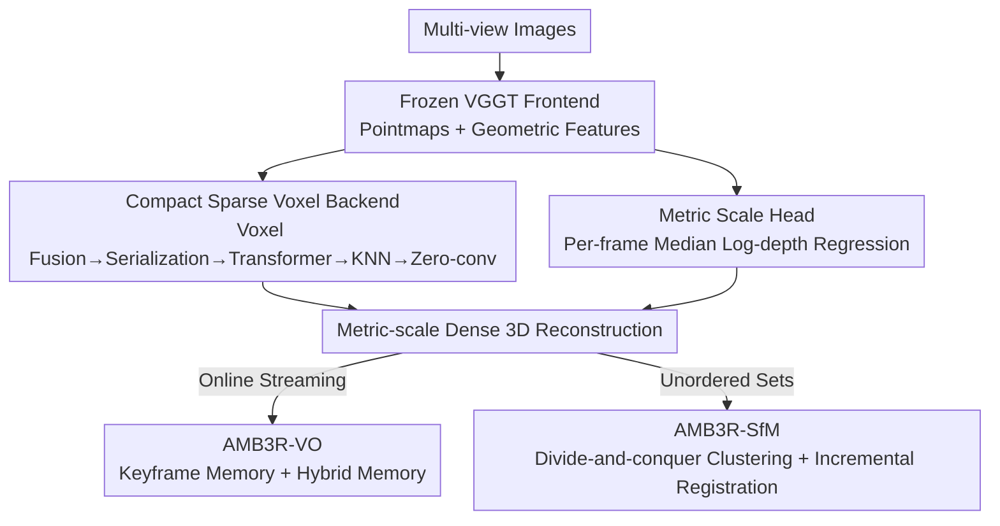

# AMB3R: Accurate Feed-forward Metric-scale 3D Reconstruction with Backend

**Conference**: CVPR 2026  
**Paper**: [CVF Open Access](https://openaccess.thecvf.com/content/CVPR2026/html/Wang_AMB3R_Accurate_Feed-forward_Metric-scale_3D_Reconstruction_with_Backend_CVPR_2026_paper.html)  
**Code**: https://hengyiwang.github.io/projects/amber (Open-source code/weights/eval tools)  
**Area**: 3D Vision  
**Keywords**: Feed-forward 3D Reconstruction, Metric Scale, Sparse Voxel Backend, Visual Odometry, Structure-from-Motion  

## TL;DR
AMB3R attaches a "sparse but compact" voxel backend on top of a frozen VGGT frontend for explicit 3D geometric reasoning, alongside a lightweight scale head for metric scale recovery. Trained with only ~80 H100 GPU hours, it achieves SOTA across 7 tasks and 13 datasets. Its two training-free pipelines, AMB3R-VO and AMB3R-SfM, enable feed-forward models to outperform traditional optimization-based systems in VO/SLAM and SfM for the first time.

## Background & Motivation
**Background**: Following DUSt3R, the pointmap (regressing a 3D coordinate for each pixel with a 1:1 2D-3D mapping) has become the cornerstone of 3D foundation models. Models like Spann3R and VGGT extended this from two-view to multi-view, using a single network to unify camera pose, depth, and dense reconstruction.

**Limitations of Prior Work**: The authors identify an overlooked fundamental question: "Is the relationship between 2D pixels and 3D scene points truly one-to-one?" In reality, it is not. Due to viewpoint overlap, multiple pixels often correspond to the same 3D point. This "many-to-one" correspondence is the core of 3D vision research. Traditional/implicit methods (e.g., TSDF in KinectFusion, NeRF, feature voxels in NeuralRecon) rely on **spatial compactness** (a specific 3D coordinate must have unique properties) to fuse multiple observations into consistent geometry. While current feed-forward models like VGGT/Spann3R implicitly encourage corresponding pixels to fall on the same 3D point, the networks perform attention only on 2D grids, lacking **explicit geometric reasoning or spatial compactness constraints**.

**Key Challenge**: Pure 2D-to-3D regression lacks a mechanism to truly fuse multiple observations of the same scene point in 3D space, limiting geometric consistency. Furthermore, global multi-view Transformers like VGGT have $O(T^2)$ complexity and can only process a finite number of frames offline, making them unsuitable for online VO or large-scale SfM.

**Goal**: (1) Supplement feed-forward pointmap models with an explicit 3D reasoning backend featuring spatial compactness; (2) Recover metric scale; (3) Extend the model to arbitrary-frame online VO and large-scale SfM without fine-tuning or test-time optimization.

**Core Idea**: Utilize a **sparse voxel backend** as an "external brain" for VGGT—projecting frontend-predicted points and features into voxels, serializing them into 1D sequences for Transformer-based reasoning in a compact 3D space, and then interpolating them back into the frozen frontend decoder. This preserves pre-trained weights while gaining spatial compactness. Additionally, the authors leverage the prior that pointmap models "predict within the reference frame coordinate system, differing only by an unknown scale" to build optimization-free VO/SfM.

## Method

### Overall Architecture
The core of AMB3R is a "frontend + backend" feed-forward model: The **frontend** uses a frozen VGGT to encode images and predict pointmaps and geometric features for each frame. The **backend** fuses these into sparse voxels, performs explicit 3D reasoning, and feeds the results back to the frontend for refined geometry. Simultaneously, a **lightweight scale head** recovers the metric scale from frozen frontend features. Training only updates the backend (~50–80 H100 GPU hours), while frontend weights and learned confidence scores are fully preserved. On top of this core model, two **training-free** pipelines are added: AMB3R-VO for online visual odometry and AMB3R-SfM for large-scale reconstruction of unordered image sets, both utilizing a "keyframe-as-memory + hybrid memory" design to scale the multi-view network to arbitrary frame counts.

The flowchart below illustrates the overall processing from images to downstream tasks:

### Key Designs

**1. Compact Sparse Voxel Backend: Adding Spatial Compactness to 2D Models**

This is the core contribution addressing the lack of explicit geometric reasoning in VGGT. Given pointmaps $\{P_t^{(1)}\}$ and geometric features $\{G_t\}$ (concatenated encoder/decoder features passed through MLPs), the backend first voxelizes them into a sparse grid $V$. The feature for each voxel is the mean of all pixel features falling into it:

$$H_i = \frac{1}{|\mathcal{P}_i|}\sum_{(t,u)\in\mathcal{P}_i} G_t[u],\quad \mathcal{P}_i=\{(t,u)\mid P_t^{(1)}[u]\in V_i\}$$

This step explicitly handles the "many-to-one correspondence"—observations from different views in the same 3D voxel are fused, naturally achieving spatial compactness. Voxel size is set to 0.01 in normalized space, allowing resolution to adapt to scene scale. A **space-filling curve** (Hilbert curve) serializes the sparse voxels into a 1D sequence for processing by a Point Transformer v3, before de-serializing back to voxel space:

$$\{\hat H_i\} = (\mathcal{S}^{-1}\circ f_\theta \circ \mathcal{S})(\{H_i\})$$

Voxel features are interpolated back to pixels via KNN $\tilde G_t[u]=\mathrm{KNN}(P_t^{(1)}[u],\{\hat H\})$. Finally, **zero-convolutions** (initialized to zero) inject these features layer-by-layer back into the frozen frontend decoder. Zero-conv is critical: it ensures the backend output is zero at the start of training, preserving the frontend's learned attention and confidence to avoid catastrophic forgetting and keep training costs low.

**2. Metric Scale Head: Per-frame Median Log-depth Regression**

VGGT's pointmaps are normalized by the median distance across all frames, suggesting that metric cues are implicitly encoded. While a common approach is to use an ROE solver to regress a **global** scale difference between predictions and ground truth, the authors found this global scale difficult to train and prone to overfitting because it depends on the specific combination and order of all frames.

Instead, the authors regress a per-frame intrinsic property: for each frame, the model regresses the metric log-depth of the **pixel corresponding to the median predicted depth**. This property can be recovered from single-frame encoder features, decoupling scale prediction from global predictions. At inference, the per-frame scale is calculated from the median predicted depth and metric depth, and the median of these scales robustly aligns the global reconstruction to metric space.

**3. AMB3R-VO: Optimization-free Online VO via "Reference Frame" Prior**

The complexity and offline nature of multi-view Transformers typically prevent online VO. Existing methods (e.g., VGGT-SLAM) use sliding subgraphs and Kabsch–Umeyama for relative pose and scale estimation, which introduces drift requiring optimization. The authors observe that pointmap models have a strong prior: **predictions are already expressed in the reference frame coordinate system, differing only by an unknown scale**. Thus, explicit transformation estimation for coordinate alignment is unnecessary.

AMB3R-VO achieves **$O(1)$ complexity per frame** using "keyframe-as-memory" hybrid memory. Pose distance determines frame proximity:

$$D_{i,j} = \arccos\!\left(\frac{\mathrm{Tr}(R_j R_i^T)-1}{2}\right) + \lambda\|\tau'_i - \tau'_j\|_2$$

The system maintains a few sampled keyframes in **active memory** (for network forward passes) and explicit global geometry in **global memory**. When active memory hits a limit $N_{max}=10$, it resamples to $N_{min}=7$ and uses backward search to include early keyframes to **trigger loop closure**. Scale for local windows is estimated via ROE on shared keyframes. Coordinate alignment projects global maps into the local frame $P_k^{(k_0)}=T_{k_0}^{-1}P_k^{(1)}$ before scale estimation, bypassing explicit Kabsch–Umeyama.

**4. AMB3R-SfM: Divide-and-conquer for Large-scale Reconstruction**

Utilizing the same prior, AMB3R-SfM handles unordered sets via **divide-and-conquer**: images are clustered into small groups ($N_{cmin}$–$N_{cmax}$) using descriptor-based distance matrices and Farthest Point Sampling (FPS). **Coarse registration** starts from the highest-confidence cluster and incrementally builds the map by mapping the k-nearest unmapped clusters. A two-stage **Global Mapping** refinement uses k-nearest neighbor mapping and confidence-priority BFS to clean the global graph. The entire pipeline **does not require BA or test-time optimization**.

## Key Experimental Results

Evaluation covers **7 tasks and 13 datasets**, including monocular depth, camera pose, multi-view metric depth, 3D reconstruction, and VO/SLAM.

### Main Results

Multi-view depth (RMVDB, unposed, lower/higher is better) — outperforming concurrent works with an order of magnitude fewer resources:

| Method | rel↓ (avg) | δ1.03↑ (avg) | Note |
|------|-----------|--------------|------|
| Spann3R | 5.0 | 57.1 | Incremental feed-forward |
| VGGT | 2.4 | 81.3 | Frontend baseline |
| π³ ‡ | 1.8 | 85.6 | Concurrent |
| MapAnything ‡ | 3.6 | 66.0 | Concurrent |
| **AMB3R** | **1.7** | **87.3** | Ours |

Multi-view 3D reconstruction (cm, lower is better) — SOTA across scales:

| Method | ETH3D rel↓ | DTU rel↓ | 7-Scenes rel↓ | Mode |
|------|-----------|----------|---------------|------|
| CUT3R | 18.83 | 9.11 | 6.32 | Online |
| VGGT | 6.02 | 0.83 | 5.51 | Offline |
| π³ ‡ | 5.82 | 1.57 | 5.92 | Offline |
| **AMB3R** | **4.64** | **0.81** | **4.70** | Offline |

Visual Odometry (TUM RGB-D, ATE RMSE cm, AVG column) — first feed-forward VO to beat optimization-based methods:

| Method | Type | TUM AVG↓ |
|------|------|----------|
| DROID-VO | Dense | 11.4 |
| GlORIE-VO | Dense | 9.3 |
| Spann3R | Calibration-free FF | 47.9 |
| MUSt3R⋆ | Calibration-free FF | 5.5 |
| **AMB3R (KF)** | Calibration-free FF | **2.7** |

### Ablation Study

Backend ablation (Tab 14, 3D Reconstruction):

| Config | ETH3D rel↓ | ETH3D Cp↓ | Description |
|------|-----------|-----------|------|
| w/o backend (VGGT) | 6.02 | 11.89 | Frontend only |
| w 2D backend | 5.32 | 12.78 | 2D backend w/ cross-attention |
| w/o $(\mathcal{S}^{-1}\!\circ\! f_\theta\!\circ\!\mathcal{S})$ | 4.47 | 11.37 | No serialized Transformer |
| **Full** | **4.64** | **9.69** | Full 3D Backend |

### Key Findings
- **3D Backend > 2D Backend**: Replacing the 3D backend with a 2D cross-attention backend degrades ETH3D performance; explicit 3D reasoning in a compact space is the key.
- **Pipeline Matters**: Even using only the original VGGT frontend, the AMB3R-VO pipeline outperforms VGGT-SLAM (3.6 vs 5.3), proving that the reference frame prior is more effective than an optimization backend.
- **Zero-conv**: Enables academic-level training costs (~80 H100 hours) by reusing pre-trained features without destructive interference.
- **SfM Accuracy**: AMB3R-SfM achieves an RRA@5 of **98.2** on ETH3D, significantly leading MASt3R-SfM (81.2) without any BA.

## Highlights & Insights
- **The Core Idea**: Framing the motivation around the "many-to-one" correspondence problem provides a strong logical anchor for why a 3D backend is necessary for feed-forward models.
- **Efficiency**: The zero-conv + frozen frontend paradigm allows 3D foundation models to be extended with minimal compute.
- **Reference Frame Prior**: Identifying that coordinate alignment for pointmap models reduces to a scalar scale estimation is a "key" that unlocks efficient VO.

## Limitations & Future Work
- **Frontend Dependency**: As the frontend is frozen, systemic biases (e.g., misinterpreting small models as real structures) may persist.
- **Dynamic Scenes**: The model relies on generalization rather than specific design for dynamic environments.
- **Hyperparameter Sensitivity**: The VO/SfM pipelines involve several manual thresholds ($\eta_d, \eta_b$, etc.) whose robustness across different domains needs further validation.

## Related Work & Insights
- **vs VGGT**: AMB3R adds a 3D backend and scale head to VGGT, significantly improving geometry and enabling online VO.
- **vs Spann3R**: While Spann3R uses causal memory, its accuracy is far lower. AMB3R-VO leverages explicit keyframe management and priors to improve accuracy by an order of magnitude (TUM 47.9 -> 2.7).
- **vs Optimization-based Methods**: AMB3R-VO/SfM achieve superior results without Bundle Adjustment (BA) or test-time optimization.

## Rating
- Novelty: ⭐⭐⭐⭐⭐ 
- Experimental Thoroughness: ⭐⭐⭐⭐⭐ 
- Writing Quality: ⭐⭐⭐⭐⭐ 
- Value: ⭐⭐⭐⭐⭐ 

<!-- RELATED:START -->

## Related Papers

- [\[CVPR 2026\] Any4D: Unified Feed-Forward Metric 4D Reconstruction](any4d_unified_feed-forward_metric_4d_reconstruction.md)
- [\[CVPR 2026\] VGG-T3: Offline Feed-Forward 3D Reconstruction at Scale](vgg-t3_offline_feed-forward_3d_reconstruction_at_scale.md)
- [\[CVPR 2026\] Reliev3R: Relieving Feed-forward 3D Reconstruction from Multi-View Geometric Annotations](reliev3r_relieving_feed-forward_3d_reconstruction_from_multi-view_geometric_annot.md)
- [\[CVPR 2026\] PanoVGGT: Feed-Forward 3D Reconstruction from Panoramic Imagery](panovggt_feed-forward_3d_reconstruction_from_panoramic_imagery.md)
- [\[CVPR 2026\] Gen3R: 3D Scene Generation Meets Feed-Forward Reconstruction](gen3r_3d_scene_generation_meets_feed-forward_reconstruction.md)

<!-- RELATED:END -->
