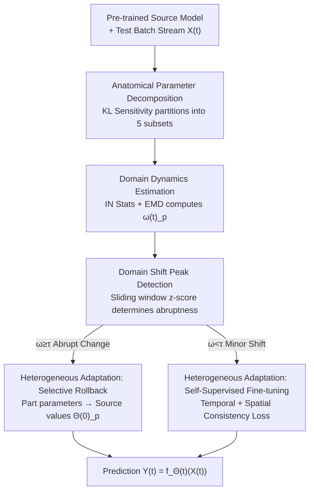

# Anatomical Domain Shifts: Test-time Heterogeneous Adaptation for 3D Human Pose Prediction

**Conference**: CVPR 2026  
**Paper**: [CVF Open Access](https://openaccess.thecvf.com/content/CVPR2026/html/Cui_Anatomical_Domain_Shifts_Test-time_Heterogeneous_Adaptation_for_3D_Human_Pose_CVPR_2026_paper.html)  
**Code**: Not disclosed  
**Area**: 3D Vision / Human Understanding  
**Keywords**: Human Pose Prediction, Continuous Test-time Adaptation, Anatomical Heterogeneity, Instance Normalization, EMD Domain Shift Detection

## TL;DR
Addressing Continuous Test-time Adaptation (CTTA) for 3D Human Pose Prediction (HPP), this paper identifies the overlooked fact that "domain shifts are concentrated in specific body parts rather than occurring uniformly across the whole body." It proposes TT-HA: decomposing model parameters into five anatomical subsets (left/right arms, left/right legs, torso), using Instance Normalization (IN) statistics combined with Earth Mover's Distance (EMD) to measure online domain changes for each part. Based on these measurements, self-supervised fine-tuning is applied to parts with minor shifts, while parameters for parts experiencing abrupt changes are rolled back to the source model. This achieved a 4.7% reduction in overall MPJPE and a 9.2% reduction in limb errors.

## Background & Motivation

**Background**: 3D Human Pose Prediction (HPP) involves predicting joint movements for the next 1 second given a sequence of historical poses. Prevailing approaches (GCN-based LTD/PGBIG, MLP-based siMLPe) follow the "train on source, deploy to target" paradigm. However, significant distribution differences (domain shifts) between source domains (controlled laboratories) and target domains (real-world open scenarios) lead to substantial performance degradation. Recently, Test-Time Adaptation (TTA) has been introduced to align pre-trained models to target samples during inference.

**Limitations of Prior Work**: Standard TTA assumes a static target domain, whereas real-world deployment involves continuously evolving target domains (e.g., switching from walking to running, interacting with different objects). Currently, the only method capable of handling such evolution is HoCoTTA, which splits model parameters into "domain-sensitive" and "domain-invariant" categories, updating the former online while freezing the latter. However, it still treats the human body as a uniform whole, applying a global adaptation to parameters.

**Key Challenge**: Human movement naturally possesses biomechanical heterogeneity—kinematic characteristics vary significantly across different anatomical parts. The paper provides a "proof-of-concept" via t-SNE (Figure 1): when migrating from H3.6M to GRAB, the global feature topology changes, but when decomposed, the distributions of the right leg and torso remain nearly unchanged. The actual shift is concentrated in parts strongly related to interaction, such as arms. For instance, in a smoking action, leg patterns resemble those in a discussion action, but arm patterns differ drastically. Treating all parts identically leads to over-adaptation of stable parts and under-adaptation of shift-prone joints.

**Goal**: To make adaptation "prescriptive"—implicitly estimating domain changes for each anatomical part and deciding which parameters to adjust and by how much.

**Core Idea**: Replace the uniform adaptation of HoCoTTA with a heterogeneous adaptation strategy: "parameter decomposition by body part + part-wise online domain shift measurement + rollback for large shifts vs. fine-tuning for small shifts."

## Method

### Overall Architecture

TT-HA (Test-time Heterogeneous Adaptation) addresses a continuous stream of test batches $X^{(1)} \to X^{(2)} \to \dots \to X^{(t)} \to \dots$, where the target domain satisfies $D_{target}^{(1)} \neq D_{target}^{(2)} \neq \dots$ (continuous evolution). Starting from a source pre-trained model $f_{\Theta^{(0)}}$, parameters are updated from $\Theta^{(t-1)}$ to $\Theta^{(t)}$ for each batch before prediction.

The workflow consists of two stages: **Offline**, model parameters are partitioned into five anatomical subsets plus one shared subset using information-theoretic sensitivity. **Online**, for each batch and each part $p$, Instance Normalization (IN) statistics are used to calculate the EMD domain change $\omega_p^{(t)}$ relative to the previous domain. A sliding window peak detection determines if an "abrupt change" occurred. If so, that part's parameters are rolled back to source values (preserving crucial source knowledge); otherwise, the part undergoes moderate fine-tuning using self-supervised loss. Each part undergoes this process independently, allowing for scenarios where "arms roll back while the torso fine-tunes." The backbone used is the open-source siMLPe.

### Key Designs

**1. Anatomical Parameter Decomposition: Decoupling the Global Model into Five Controllable Parts**

This step addresses the root cause of uniform adaptation issues. Since shifts are local, parameter control should also be local. The parameter set $\Theta \in \mathbb{R}^D$ is split into five anatomical subsets $\{\Theta_{l\_leg}, \Theta_{l\_arm}, \Theta_{r\_leg}, \Theta_{r\_arm}, \Theta_{torso}\}$ and one shared subset $\Theta_{shared}$. Parameter affiliation is determined via an information-theoretic stability measure: a uniform perturbation $\epsilon \sim U(-a, a)$ ($a=10^{-2}$) is applied to parameters to observe the sensitivity of the output distribution for part $p$, measured by expected KL divergence:

$$S_p(\Theta_i) = \mathbb{E}_{X}\big[\mathbb{E}_{\epsilon}[D_{KL}(P(Y_p|X,\Theta) \| P(Y_p|X,\Theta+\epsilon))]\big].$$.

Intuitively, a lower $S_p$ indicates the parameter is more "indifferent" to perturbations for that part and more closely coupled (low sensitivity corresponds to high correlation). Low-sensitivity parameters at the $\tau$-quantile ($\tau=0.2$) are assigned to subset $\Theta_p$. Parameters not exceeding the threshold for any part are categorized as $\Theta_{shared} = \Theta \setminus \bigcup_p \Theta_p$.

**2. Domain Dynamic Estimation: Quantifying Per-frame Shift via IN Statistics + EMD**

To measure the magnitude of shift for each part, the authors replace BN with Instance Normalization (IN). BN is sensitive to batch size and subject to interference from multi-domain data in a single batch. IN normalizes per sample, stripping individual motion styles while preserving domain-related content features, making it ideal for HPP and fine-grained domain representation. To maintain stability under limited data, IN statistics are maintained using an exponential moving average with momentum $\eta=0.95$: $\mu_p^{(t-1)} = (1-\eta)\mu_p^{(t-2)} + \eta\mu_p^{(t-1)}$ (likewise for variance).

Given the previous domain's global IN distribution $N(\mu_p^{(t-1)}, \sigma_p^{(t-1)})$ and the current batch's pre-adaptation distribution $N(\tilde\mu_p^{(t)}, \tilde\sigma_p^{(t)})$, Earth Mover's Distance (EMD) is used to measure the "transport cost." Treating IN statistics as Gaussians, the domain change $\omega_p^{(t)}$ for part $p$ is calculated as:

$$\omega_p^{(t)} = \frac{\sqrt{2\pi}}{C}\sum_{c=1}^{C} \frac{\sigma_{p,c}^{(t-1)} + \tilde\sigma_{p,c}^{(t)}}{2}\cdot \mathrm{erfc}\!\left(\frac{\tilde\mu_{p,c}^{(t)} - \mu_{p,c}^{(t-1)}}{\sigma_{p,c}^{(t-1)} + \tilde\sigma_{p,c}^{(t)}}\right),$$

where $\mathrm{erfc}$ is the complementary error function. Larger values of $\omega_p^{(t)}$ indicate more severe domain changes.

**3. Domain Change Peak Detection: Using Sliding Window z-score to Distinguish Gradients from Abruptions**

Absolute values of $\omega_p^{(t)}$ are insufficient; sudden jumps relative to history must be identified to trigger resets. A sliding window of length $w=36$ is maintained: $\Omega_p = [\omega_p^{(t-w)}, \dots, \omega_p^{(t-1)}]$. Normalized values $\bar\Omega_p$ are used to calculate the mean $\mu_{\bar\Omega}$ and standard deviation $\sigma_{\bar\Omega}$. A z-score $z = (\bar\omega^{(t)} - \mu_{\bar\Omega})/\sigma_{\bar\Omega}$ is computed. If $z \geq \tau_{peak}$ (default 12), it is flagged as a peak, triggering source knowledge rollback for that part.

**4. Heterogeneous Test-time Adaptation: Dual Strategy of Rollback and Fine-tuning**

For parts where a peak is detected ($\omega_p^{(t)} \geq \tau_{peak}$), **selective knowledge rollback** resets only that part's parameters to source values:

$$\Theta_p^{(t)} \leftarrow \Theta_p^{(0)}, \quad \text{if } \omega_p^{(t)} \geq \tau_{peak}.$$

For parts without peaks ($\omega_p^{(t)} < \tau_{peak}$), **anatomical test-time adaptation** applies gradient descent using a self-supervised loss with learning rate $\lambda=10^{-3}$:

$$\Theta_p^{(t)} \leftarrow \Theta_p^{(t)} - \lambda \cdot \nabla_{\Theta_p^{(t)}}(\mathcal{L}_{temp} + \mathcal{L}_{spatial}).$$

Self-supervision is used instead of pseudo-labeling to avoid error accumulation in continuous scenarios.

### Loss & Training

Two self-supervised losses are calculated per part $p$:

- **Temporal Consistency $\mathcal{L}_{temp}$**: Ensures per-frame displacement of predicted poses matches the observed displacement (velocity continuity): $\mathcal{L}_{temp}^p = \frac{1}{T-1}\sum_{i=1}^{T-1}\|\tilde y_{p,i+1} - \tilde y_{p,i} - (x_{p,i+1} - x_{p,i})\|_2$.
- **Spatial Consistency $\mathcal{L}_{spatial}$**: Constrains bone length stability based on the prior that relative positions of adjacent joints remain constant: $\mathcal{L}_{spatial}^p = \frac{1}{T(N-1)}\sum_{i=1}^{T}\sum_{n=1}^{N-1}\|\tilde L_{i,n}^{pred} - L_{i,n}^{obs}\|_1$.

## Key Experimental Results

Benchmarks include H3.6M, CMU MoCap, GRAB, and RICH. Five baselines: LTD/PGBIG (GCN), siMLPe (MLP), and TTA methods H/P-TTP and HoCoTTA (Prev. SOTA). Four experimental setups were used, including the most difficult cross-dataset scenario (H3.6M → GRAB).

### Main Results (setup-1, MPJPE [mm] ↓)

| Dataset @ Time | siMLPe | H/P-TTP | HoCoTTA | TT-HA |
|------------|--------|---------|---------|-------|
| H3.6M @400ms | 57.3 | 55.6 | 52.8 | **49.7** |
| H3.6M @1000ms | 109.4 | 103.7 | 101.4 | **97.4** |
| GRAB @1000ms | 137.5 | 138.0 | 131.8 | **127.5** |
| RICH @1000ms | 125.5 | 129.4 | 127.2 | **119.4** |

TT-HA achieved the best results across all datasets and time steps. Improvements are particularly notable on the RICH dataset. Average MPJPE decreased by 4.7%, with limb errors decreasing by 9.2% relative to previous methods.

### Ablation Study (setup-4, MPJPE)

| Configuration | @200 | @400 | @800 | @1000 |
|---------|------|------|------|-------|
| **η=0.95, λ=1e-3 (Default)** | **23.5** | **31.3** | **64.8** | **117.1** |
| η=0.92, λ=1e-3 | 26.8 | 33.7 | 70.0 | 121.7 |
| τpeak=10, w=36 | 25.1 | 33.3 | 67.1 | 122.0 |
| τpeak=12, w=24 | 24.3 | 32.2 | 65.8 | 119.7 |

### Key Findings
- **Momentum $\eta$ controls IN stability**: $\eta=0.95$ is optimal; smaller values lead to unstable statistics, while larger values react too slowly.
- **Peak threshold $\tau_{peak}$ controls rollback aggression**: A value of 12 standard deviations balances sensitivity and performance.
- **Window $w$ controls peak detection stability**: $w=36$ is optimal for filtering noise while remaining responsive.
- Qualitative results show TT-HA significantly improves limbs in actions like "knife-chop" while maintaining torso stability.

## Highlights & Insights
- **Heterogeneous Domain Shift Observation**: Demonstrating through t-SNE that shifts are localized to specific parts (like arms) is the most valuable insight, fundamentally changing the granularity of adaptation.
- **IN + Closed-form EMD for Online Measurement**: Using IN as a probe for fine-grained domain representation and EMD for a computationally efficient scalar metric allows for robust online detection without full test-set dependency.
- **Independent Part-wise Decisions**: Unifying catastrophic forgetting prevention (rollback) and continuous adaptation (fine-tuning) under a statistical z-score applied at the part level is a versatile mechanism.

## Limitations & Future Work
- **Reliance on Anatomical Priors**: The division into five fixed parts may not generalize well to non-human subjects or finer-grained tasks (e.g., fingers).
- **Hyperparameter Tuning**: Parameters like $\tau_{peak}$ and $w$ require careful tuning, and their cross-task transferability hasn't been fully explored.
- **Baseline Comparison**: The ablation study could benefit from a more explicit "global vs. part-wise" comparison within the same table to isolate the gains from granularity.

## Related Work & Insights
- **vs. HoCoTTA**: Both use CTTA, but HoCoTTA adapta globally. TT-HA wins by focusing on high-shift limbs.
- **vs. H/P-TTP**: TT-HA avoids the error accumulation of pseudo-labels in continuous streams by using self-supervised spatial-temporal consistency.
- **vs. TENT/NOTE**: While these focus on updating BN/IN for classification, TT-HA re-purposes IN statistics as a diagnostic tool for structural heterogeneity.

## Rating
- **Novelty**: ⭐⭐⭐⭐⭐ High. The anatomical heterogeneity perspective is a fresh and verified insight.
- **Experimental Thoroughness**: ⭐⭐⭐⭐ Strong coverage, though more direct "whole-body" ablation baselines would be ideal.
- **Writing Quality**: ⭐⭐⭐⭐ Clear motivation and strong visual evidence.
- **Value**: ⭐⭐⭐⭐ The mechanism is transferable to other non-uniform shift tasks.

<!-- RELATED:START -->

## Related Papers

- [\[ECCV 2024\] Human Motion Forecasting in Dynamic Domain Shifts: A Homeostatic Continual Test-Time Adaptation Framework](../../ECCV2024/human_understanding/human_motion_forecasting_in_dynamic_domain_shifts_a_homeostatic_continual_test-t.md)
- [\[AAAI 2026\] Robust Long-term Test-Time Adaptation for 3D Human Pose Estimation through Motion Discretization](../../AAAI2026/human_understanding/robust_long-term_test-time_adaptation_for_3d_human_pose_estimation_through_motio.md)
- [\[CVPR 2025\] CRISP: Object Pose and Shape Estimation with Test-Time Adaptation](../../CVPR2025/human_understanding/crisp_object_pose_and_shape_estimation_with_test-time_adaptation.md)
- [\[CVPR 2026\] Gaussian-Mixture Latent Flow for Stochastic 3D Human Motion Prediction](gaussian-mixture_latent_flow_for_stochastic_3d_human_motion_prediction.md)
- [\[CVPR 2026\] HamiPose: Hamiltonian Optimization for Unsupervised Domain Adaptive Pose Estimation](hamipose_hamiltonian_optimization_for_unsupervised_domain_adaptive_pose_estimati.md)

<!-- RELATED:END -->
